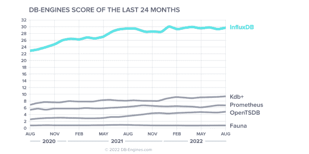

# 为什么要使用专门构建的时间序列数据库？

> 原文：<https://thenewstack.io/why-use-a-purpose-built-time-series-database/>

开发人员和公司比以往有更多的数据库选择。为项目选择正确的数据库可以节省编写和查询数据的时间。随着公司使用更大的数据集来制造越来越智能和自动化的系统，效率是关键。对于许多工作负载，使用时序数据库是节省时间和存储空间的明智选择。

## 时间序列数据有何不同

[时间序列数据](https://www.influxdata.com/what-is-time-series-data/?utm_source=vendor&utm_medium=referral&utm_campaign=2022-09_spnsr-ctn_purpose-tsdb_tns)是任何带有时间戳的指标。它包括多种变量，从天气模式到 CPU 使用率。它通常来自需要做出实时决策的传感器、系统或应用。这些数据对于理解过去的表现和创建模型来[预测未来的结果](https://www.influxdata.com/time-series-forecasting-methods/?utm_source=vendor&utm_medium=referral&utm_campaign=2022-09_spnsr-ctn_purpose-tsdb_tns)至关重要。这些计算中涉及的数据量会很快增加，重要的是不要将资源浪费在低效的数据架构上。

[时间序列数据库](https://www.influxdata.com/time-series-database/?utm_source=vendor&utm_medium=referral&utm_campaign=2022-09_spnsr-ctn_purpose-tsdb_tns)旨在处理典型的时间序列工作负载。它们被优化为[测量随时间的变化](https://thenewstack.io/you-dont-need-a-blockchain-you-need-a-time-series-database/)，而不是数据点之间的关系。两种主要的时间序列数据是定期获取的指标和由于外部事件或用户测量而不定期获取的事件。重要的是，时间序列数据库能够处理指标和事件，并且能够平均事件并将其转换为指标。

## 存储数据

一个好的数据库需要安全有效地存储数据。用户必须能够快速地向其写入数据，并确信它能够处理他们计划存储在其中的大量数据。时间序列数据可能非常庞大，需要构建存储数据的数据库来适应这种情况。时间是线性的，时序数据库可以通过向现有数据追加新数据来利用这一点。它们经过优化，能够以最常用的方式快速写入带时间戳的数据，从而从用户开始写入数据的那一刻起节省时间。

时间序列数据库也可以内置生命周期管理。开发人员或公司通常最初收集和分析非常详细的数据，随着时间的推移，希望存储更小的降采样数据集来描述趋势，而不占用太多的存储空间。时间序列数据库可以考虑到这一点，并根据每个应用程序的需要自动聚合和删除数据。如果开发人员使用更基本的数据库，他们通常需要创建新的系统来以这种方式管理数据。有了时间序列数据库，它已经被处理好了，开发者可以专注于他们的应用程序。

时间序列数据库还需要易于扩展。例如，在物联网用例中，随着更多[传感器](https://www.influxdata.com/sensor-data-is-time-series-data/?utm_source=vendor&utm_medium=referral&utm_campaign=2022-09_spnsr-ctn_purpose-tsdb_tns)的添加和项目的扩展，数据呈指数级增长。这在时序工作负载中很常见，用于这些项目的数据库需要能够适应它。

## 查询数据

使用时序数据库还可以加快时序工作负载的查询速度。处理时间序列数据最常见的一件事是在很长一段时间内对其进行汇总。在使用行和列来描述不同数据点的关系的典型关系数据库中存储数据时，这种查询非常慢。为处理时间序列数据而设计的数据库可以以指数级的速度处理查询。时间序列数据库也可能有内置的[可视化工具](https://www.influxdata.com/how-to-visualize-time-series-data/?utm_source=vendor&utm_medium=referral&utm_campaign=2022-09_spnsr-ctn_purpose-tsdb_tns)或高级功能，以简化常见的时间序列分析。

## 选择时间序列数据库

有一些时间序列数据库可供您探索。对于这篇博文，我们将根据[的 DB-Engines](https://db-engines.com/en/ranking/time+series+dbms) 、InfluxDB 来看看领先的时间序列数据库。InfluxDB 为数据分配一个测量名称和时间戳，并为数据值和元数据使用键/值对。它将测量名称和标记集保存在一个倒排索引中，这样可以加快查询速度。用户可以在一个时间范围内基于测量、标签和/或字段编写查询，并在几毫秒内收到结果。一台 InfluxDB 服务器每秒可以处理超过 200 万次写入。[与 Cassandra 等 NoSQL 数据库](https://www.influxdata.com/products/compare/?utm_source=vendor&utm_medium=referral&utm_campaign=2022-09_spnsr-ctn_purpose-tsdb_tns)相比，InfluxDB 写入数据的速度快 4.5 倍，使用的存储空间少 2.1 倍，返回查询的速度快 45 倍。

数据库是许多应用程序的支柱，在时间序列数据库中处理带时间戳的数据可以节省开发人员的时间和存储空间。为应用程序选择正确的数据库可以让开发人员专注于构建酷项目，而不是在开始之前花时间管理架构。

<svg xmlns:xlink="http://www.w3.org/1999/xlink" viewBox="0 0 68 31" version="1.1"><title>Group</title> <desc>Created with Sketch.</desc></svg>