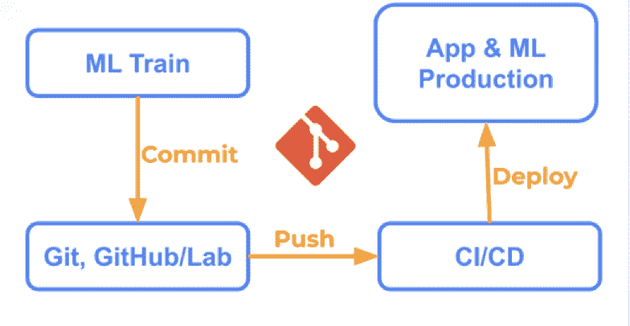

# 为什么我们用 git 构建了一个开源的 ML 模型注册中心

> 原文：<https://thenewstack.io/why-we-built-an-open-source-ml-model-registry-with-git/>

在与许多[机器学习](https://thenewstack.io/category/machine-learning/)团队的交谈中，我们发现实施模型注册中心已经成为人工智能优先组织解决可见性和治理问题的优先事项。模型注册中心是一个集中的模型存储库，用于协作管理 ML 模型的整个生命周期。这包括模型沿袭和版本化，在从开发到生产的阶段之间移动模型，以及模型注释和发现(即，时间戳、描述、标签等。).ML 团队实现了一个模型注册解决方案来获得他们模型的集中可见性和管理。

模型构建和应用程序开发应该连接起来

但是采用模型注册中心存在挑战，这使得很难构建包含组织所需的一切的最新模型注册中心。当我们为机器学习团队构建我们自己版本的模型注册表时，我们考虑了以下挑战。我们发现，为了应对这些挑战，需要一个基于 [GitOps](https://thenewstack.io/what-is-gitops-and-why-it-might-be-the-next-big-thing-for-devops/) 方法的模型注册中心。

## 构建注册中心模型及其挑战

 [德米特里·彼得罗夫

Dmitry Petrov 是微软的前数据科学家，拥有计算机科学博士学位，是活跃的开源贡献者。他编写并开源了机器学习工作流管理工具 DVC.org 的第一个版本。此外，他在 Python 的开源库 ImageHash 中实现了基于小波的图像哈希算法 wHash。Dmitry 作为旧金山 Iterative 的联合创始人兼首席执行官，正在研究机器学习和 ML 工作流管理的工具。](https://www.linkedin.com/in/dmitryleopetrov/) 

在与[迭代](https://iterative.ai/)的客户打交道时，我注意到围绕构建模型注册中心的问题产生于连接。当一个 ML 团队建立一个模型注册时，我看到了三个主要的脱节:

1.  **分离模型和代码谱系。**如果 DevOps 工程师更新了应用程序的代码，但忘记了模型，或者数据科学家进行了实验并更新了模型，则需要分别手动更新组织使用的模型注册解决方案或 DevOps 工具。如果有人忘记更新，那么模型和代码之间的联系就会立即中断。在尝试查找和管理与特定应用程序相关的正确模型时，这涉及到合规性和审计以及一般操作。
2.  **断开应用程序部署和模型部署的连接**。这些通常是 MLOps 和 DevOps 团队之间的两个不同过程。复杂性、手动工作和所涉及的资源最终影响了两个团队——事实上， [87%的数据科学项目甚至没有投入生产](https://venturebeat.com/2019/07/19/why-do-87-of-data-science-projects-never-make-it-into-production/)。在孤立的部署流程中，团队必须管理单独的脚本和具有正确专业知识的单独人员，以成功有效地将模型和应用部署到生产中。进入市场要困难得多！
3.  **用 DevOps 工具断开模型注册工具本身之间的连接**。模型注册产品通常是一种不同的服务。因此，团队需要建立单独的数据库、硬件、供应访问等。对于用户来说…即使有了 SaaS，也有管理开销，并且在设置和维护产品时需要特定的专业知识。由于缺乏联系，围绕部署和培训的工作流的自动化受到限制。

## 解决方案:Git 作为事实的单一来源，使用基础设施作为代码

我们发现，在构建模型注册中心时，应对上述挑战的解决方案是使用 [git](https://thenewstack.io/git-at-15-how-git-changed-the-way-we-code/) 作为基础，因为围绕代码的所有信息都已经在其中了——并且添加 ML 模型和数据将所有东西整合在一起。有了它，组织可以将基础设施作为代码框架(IaC)来使用，并将其作为代码的模型注册中心(MRaC)来应用。就像我们的其他工具一样，我们构建了最近发布的 Studio 模型注册解决方案[并牢记这一点。](https://iterative.ai/model-registry)

为了体验一下 GitOps 方法是什么样子，我在下面详细介绍了模型注册中心的一些构件。

第一个是人类可读格式的 git 标签。作为一个协作工具，模型注册中心需要包含团队中每个人都容易理解的信息。这就是为什么使用 git 标签会有所帮助——各种模型和数据的校验和会转化为实际的版本号(例如，v1.0.0 ),并且状态定义是具体的(例如，暂存、生产等)。)

第二个构造块是用于生产集成的 CI/CD。使用像 GitHub Actions 或 GitLab CI 这样的工具，ML 团队可以通过模型注册中心内的 CI/CD 很容易地将模型推向生产。在整个 ML 模型生命周期中，他们还可以在一个地方的不同阶段之间移动它们。与这些工具的集成对于自动化工作流并使其对 ML 工程师和 DevOps 团队来说更容易是至关重要的。

最后一个构建块包括用于大型/多模型、单声道回购和注释的 artifacts.yaml 文件。为了将机器学习和建模方面与应用程序和软件开发方面完全连接起来，YAML 格式的元文件会有所帮助。对于大型 ML 模型，使用 URL 进行配置，对于多个模型或 mono-repos，使用 sections，最后，标签用于模型周围的注释/注释。

## 模型注册是一个协作工具

使用 git 作为真实的单一来源，在软件开发和机器学习这两个世界之间架起了桥梁。太多时候，工具独立的团队被孤立，没有集中的可见性和管理。在 Iterative，我们在软件开发栈上构建工具，所以 ML 工程师和软件工程师生活在同一个世界。我们发现这种方法有助于各种规模的组织更快、更可靠地建立模型。

<svg xmlns:xlink="http://www.w3.org/1999/xlink" viewBox="0 0 68 31" version="1.1"><title>Group</title> <desc>Created with Sketch.</desc></svg>