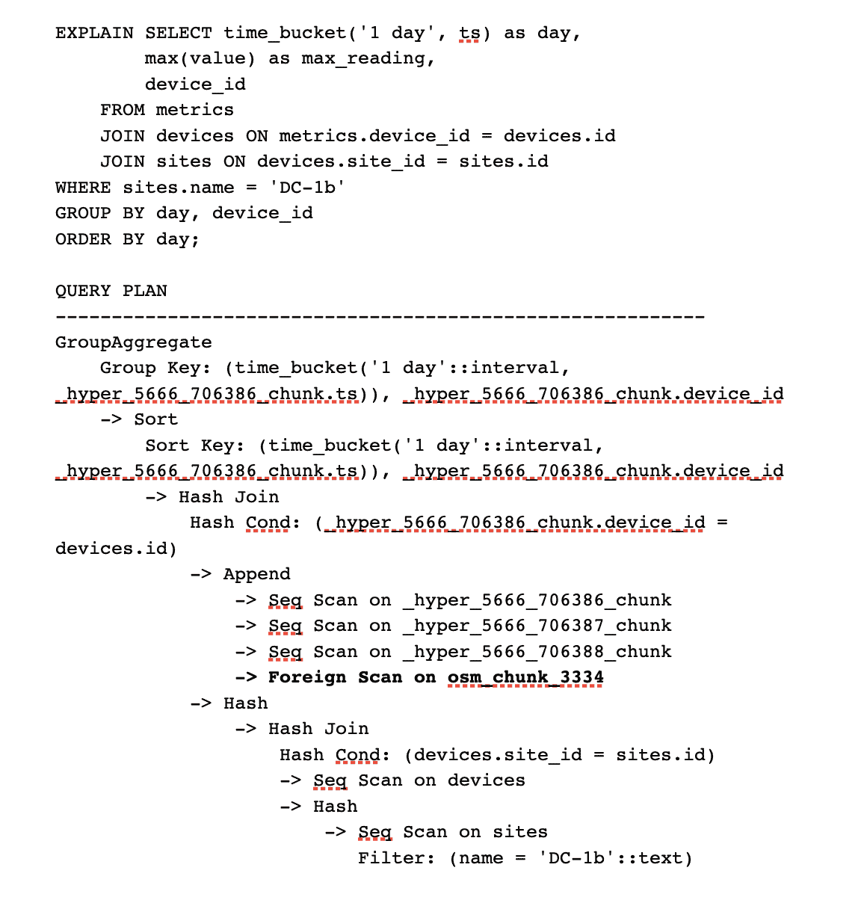

# 为什么我们使用亚马逊 S3 为 PostgreSQL 构建云原生对象存储

> 原文：<https://thenewstack.io/why-we-built-cloud-native-object-storage-for-postgresql-with-amazon-s3/>

众所周知，在 [时标](https://www.timescale.com/?utm_source=new-stack&utm_medium=web&utm_campaign=data-tiering-private&utm_content=timescale-homepage) ，我们是 PostgreSQL 的粉丝——我们在云中提供高性能 [PostgreSQL](https://thenewstack.io/two-sizes-fit-most-postgresql-and-clickhouse/) 。我们决定在 PostgreSQL 的基础上构建我们的时间序列数据库，因为我们相信它是应用程序的最佳数据库基础，并且我们可以 [进一步开发嵌入式功能](https://www.timescale.com/blog/postgresql-timescaledb-1000x-faster-queries-90-data-compression-and-much-more/) 来扩展 PostgreSQL 以适应要求最苛刻的数据密集型工作负载。

但是除了可伸缩性和性能之外，对于管理大规模数据的开发人员来说还有另一个关键问题:成本效率。当前的云数据库解决方案没有给时间序列开发者提供解决这个问题所需的工具。

## **时间序列问题**

[时间序列数据](https://thenewstack.io/the-immutability-of-time-series-data/)通常以高频率或跨长时间范围收集。这种规模通常是应用程序的一个基本组成部分:它可以存储车队中所有物联网设备的指标，识别游戏应用程序中的所有事件，或者整理许多金融工具的数据。随着时间的推移，所有这些数据都会累积起来，这通常会导致团队在尝试平衡性能、成本和分析需求时，难以权衡存储哪些数据以及存储多长时间。

这一挑战仅在数据库中很难解决，迫使开发人员手动设置自己的定制数据仓库系统(与生产数据库一起使用)或操作复杂的数据堆栈，其中数据通过定制管道流经不同的数据存储。所有这些都给开发者增加了额外的成本和管理负担。

当我们开始构建一个解决方案来帮助开发人员解决这个问题时，我们回到了扩展 PostgreSQL 的指导原则，这是一个强大而可信的数据库，具有开发人员管理大规模时间序列所需的功能。我们意识到，这个问题的最佳解决方案是利用[云原生架构](https://thenewstack.io/cloud-native-architecture-one-stack-many-options/)，让 PostgreSQL 更接近云原生世界——将现代云原生存储系统的优势与 PostgreSQL 坚如磐石的可靠性和性能相结合。

因此，为了解决时间序列数据的经济高效存储问题，我们决定构建我们的用户想要自己构建的东西:我们向我们的云原生 PostgreSQL 数据库添加了一个基于亚马逊 S3 的无底、基于消费的对象存储。

## **扩展 PostgreSQL 的边界**

[时标云](https://console.cloud.timescale.com/?utm_source=new-stack&utm_medium=web&utm_campaign=data-tiering-private&utm_content=timescale-cloud-console) 构建为 AWS 上的云原生数据库平台。这种云原生架构允许我们扩展传统 PostgreSQL 的边界，纳入通常归因于数据仓库或数据湖的元素，而不损害 PostgreSQL 体验(并且经常增强它)。

从他们的 PostgreSQL 数据库访问亚马逊 S3 上的对象存储，为开发人员提供了构建应用程序所需的工具，这些应用程序可以在降低成本的同时高效扩展。对象存储是基于消费的，因此他们不必预先分配存储上限，也不必预先付费。此外，其基准价格比传统存储便宜 10 倍。这使得开发人员可以无限地、经济高效地扩展他们的时间序列数据，将一些数据保存在数据库本身中，并将数据分层到对象存储，以节省成本。

但最棒的是，将亚马逊 S3 添加到 PostgreSQL 中，可以让开发人员在不放弃 PostgreSQL 体验的情况下访问这个负担得起的对象存储层。通过在时间刻度云中运行简单的 SQL 命令，他们可以根据数据的年龄自动对数据进行分层，以满足其数据管理需求:

```
# Create a tiering policy for data older than two weeks

SELECT add_tiering_policy  ('metrics',  INTERVAL  '2 weeks');

```

将数据分层到对象存储后，开发人员可以继续通过标准 SQL 从数据库中查询数据。谓词、过滤器、连接、cte、窗口——所有强大的 PostgreSQL 特性都可以工作。开发人员现在可以透明地跨多个存储层扩展他们的关系表，而不是操作多个工具和 ETL 管道，因为对象存储现在是我们云数据库不可或缺的一部分。

下面是一个工作原理的例子，使用一个从磁盘和对象存储中获取数据的 SQL 查询的解释计划(注意`Foreign Scan`):



## **我们是如何做到的**

为了在 PostgreSQL 中启用这一新功能，我们构建了新的数据库内部功能和外部子系统。构成分层超表的数据 [块](https://docs.timescale.com/timescaledb/latest/how-to-guides/hypertables/about-hypertables/%23hypertable-partitioning) (按时间相关的数据段)现在跨越标准存储和对象存储。我们还优化了每一层的数据格式:块存储以未压缩的基于行的格式开始，可以转换为时间刻度的 [原生压缩列格式](https://docs.timescale.com/timescaledb/latest/overview/core-concepts/compression/%23native-compression-to-column-based-storage) 。最重要的是，所有对象存储都是压缩的列格式，非常适合亚马逊 S3(更具体地说，[Apache Parquet](https://parquet.apache.org))。这使得开发人员在数据生命周期的不同阶段有更多的选择来利用最佳的数据存储类型。

启用数据分层策略后，以本机内部数据库格式存储的区块将异步迁移到 Parquet 格式，并根据其年龄存储在 S3 中(尽管在整个分层过程中它们仍保持完全可访问)。单个 SQL 查询将根据需要从磁盘存储、对象存储或两者中提取数据，但是我们实现了各种查询优化，以限制需要从 S3 读取什么来解析查询。

我们执行“块排除”来避免处理超出查询时间窗口的块。此外，数据库不需要从 S3 读取整个对象，即使是选定的块，因为它存储各种元数据来构建对象中行组和列偏移量的“映射”。结果呢？它最大限度地减少了要处理的数据量，即使是在为了正确回答查询而必须提取的单个 S3 对象中也是如此。

## **测试一下**

在时标云内将数据分层到亚马逊 S3 的能力为您节省了构建和集成定制系统或操作单独的数据存储(例如，雪花)来归档历史数据的人工工作。您无需在生产数据库旁边建立、维护和操作单独的系统(和单独的 ETL 流程)，只需使用服务于整个数据生命周期的时间表 hypertable，其中数据分布在不同的存储层。您可以从这个表中无缝地查询常规和分层数据，还可以将它连接到其余的表中，从而避免孤岛，而不会增加数据堆栈的复杂性。

这不仅简化了操作，还简化了计费:与常规数据仓库系统(通常按查询收费，因此很难预测最终成本)不同，您只需为您存储的内容付费，使您的定价始终保持透明。

你今天可以通过 [请求访问](https://tsdb.co/docs-data-tiering) 我们的私人测试版来测试这个新颖的功能。 [报名时标云。](https://console.cloud.timescale.com/signup) (前 30 天完全免费，无需信用卡)，然后导航至 Operations > Data Tiering，请求访问私有测试版。PostgreSQL 数据库中的无限对象存储。

<svg xmlns:xlink="http://www.w3.org/1999/xlink" viewBox="0 0 68 31" version="1.1"><title>Group</title> <desc>Created with Sketch.</desc></svg>