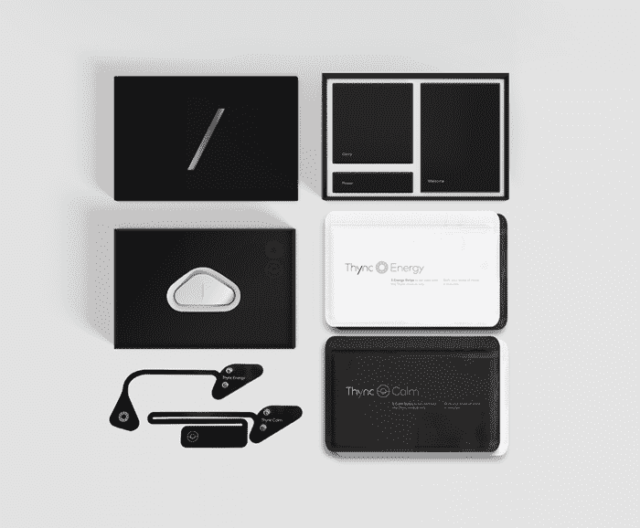

# 为什么可穿戴设备有意义:人们只是想兴奋

> 原文：<https://thenewstack.io/why-wearables-make-sense-people-just-want-to-get-high/>

几千年来，人类一直被改变他们意识的事物所吸引。无论是通过摄入精神活性植物、酒精、药物，甚至是[瑜伽呼吸练习](http://www.naturalnews.com/042583_pranayama_breathing_exercises_scientific_inquiry.html)，人类的大脑都会本能地寻找让他们感觉良好的刺激。因此，像美国 [Thync](http://www.thync.com/) 这样的电子“改变情绪的可穿戴设备”的出现，或许只是时间问题。

Thync 去年年底获得了[1300 万美元的资助](http://blogs.wsj.com/venturecapital/2014/10/08/thync-to-launch-first-mood-altering-wearable-with-13m-led-by-khosla/)，并于上个月推出，由一个具有生物工程和神经科学研究背景的团队创建。这种弯曲的设备通过附着在前额和头部的其他部位来工作，将“低水平的脉冲电能发送到信号特定的神经通路。”在 15 分钟内，这些电脉冲会产生一种放松的感觉或一种警觉、专注的精神状态，这一切都由蓝牙连接的移动应用程序控制，用户可以控制神经信号程序的强度和持续时间。该公司的首席科学官杰米·泰勒说:

> Thync 实际上调节了你的生理机能。我们提供我们所谓的神经信号波形，但它实际上是脉冲电能，提供给某些神经通路来调节你的心理生理唤醒。

像这样的神经技术在过去几年中发展迅速，但该公司表示，其产品是第一个真正利用大脑并调节其活动的产品。

Thync 的发明者称这些改变思维的波为“vibes”，称“平静的 vibes”选项将帮助用户感到“身体放松，更集中，更注意呼吸和心率，远离紧张的想法，不太可能做出情绪反应”，甚至“轻度欣快”。另一方面,“能量感应”计划将会增加“精神警觉性、身体能量的集中爆发、动力”和/或“胸部的温暖感觉”测试人员注意到，这款售价 299 美元的设备确实像广告宣传的那样工作，只是有一些变化——一些人没有任何感觉，另一些人感觉到“[刺痛](http://www.pcmag.com/article2/0,2817,2474823,00.asp)到轻微的皮肤爬行感”，而一些人描述说，在使用这款设备时，一种“[禅般的平静](http://www.gizmag.com/thync-hands-on-2/37820/)”降临到他们身上。其他人，虽然也报告了感觉“[困惑](http://nymag.com/scienceofus/2015/06/brain-zapping-gadget-made-me-feel-high.html)”

这可能是人类漫长的意识改造历史中的下一个进化步骤吗？一些人已经称其为“数字毒品”，这将使毒品战争变得毫无意义，是一种合法的获得快感的方式，没有成瘾的副作用或冥想的安静挑战。人们会在派对上传递改变情绪的可穿戴设备，而不是大麻或鸡尾酒。

然而，一些问题仍然存在:这种设备是否存在任何安全问题？人们可以想象的最糟糕的情况是一个[黑客获得了](http://www.computerworld.com/article/2913356/cybercrime-hacking/2-more-wireless-baby-monitors-hacked-hackers-remotely-spied-on-babies-and-parents.html)的访问权，并利用你的脑电波寻求刺激——也许反乌托邦思想的批评者可能会看到“政府精神控制”或“[群体同步](https://en.wikipedia.org/wiki/Groupthink)”写满了这样一个设备。作为回应，该公司对 Thync 的安全性有这样的说法:“我们的服务级和设备级安全共同保护蓝牙设备免受未经授权的数据传输。我们还使用技术和管理安全控制的组合来维护我们应用程序中数据的安全性，包括下一级加密。”

事实是，Thync 目前是作为一种生活消费产品而不是医疗产品进行营销的，所以它实际上不受 FDA 的监管，这可能会促使潜在的采纳者格外小心。但到目前为止，该公司已经在 4000 多名志愿者身上进行了测试，没有明显的副作用，这意味着它很可能成为大众新的蓝牙鸦片。更多精彩尽在 [Thync](http://www.thync.com/) 。

图片:Thync。

<svg xmlns:xlink="http://www.w3.org/1999/xlink" viewBox="0 0 68 31" version="1.1"><title>Group</title> <desc>Created with Sketch.</desc></svg>