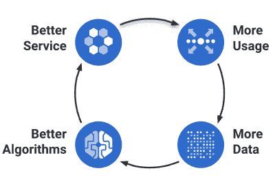
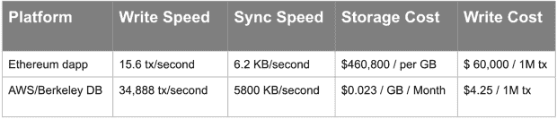
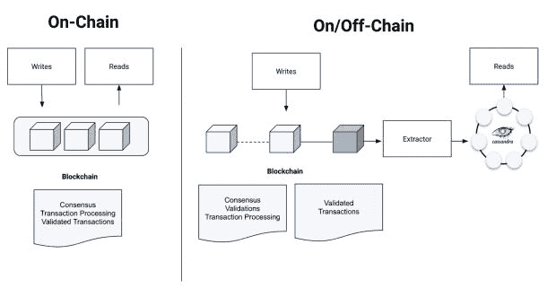
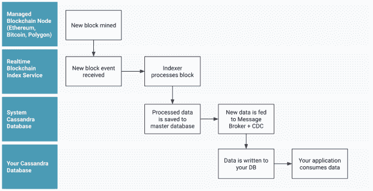
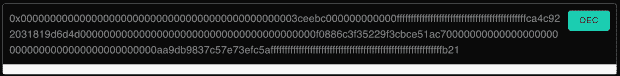
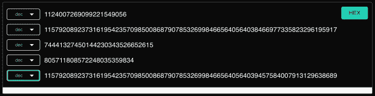

# 为什么 Web3 现在比以往任何时候都更需要实时数据层

> 原文：<https://thenewstack.io/why-web3-needs-a-real-time-data-layer-now-more-than-ever/>

Web3 今天处于一个棘手的位置，不仅仅是因为高调的坏演员给区块链的生态系统投下了过长的阴影。如果不放弃最初吸引区块链的原则，有三个重大问题很难克服:

1.  与 Web 2.0 相比，链上存储和写操作的成本高得惊人。
2.  为了确保基于区块链的系统所承诺的安全性，链上存储和写操作慢得令人难以置信(可以说是设计使然)。由于需要超过 51%的节点同意写入的新数据的有效性，随着节点添加到网络中，以及写入请求流量[增加](https://ieeexplore.ieee.org/document/9360667)，性能会进一步下降。
3.  任何给定的区块链分类帐的长度(大小)随着使用而显著增长，破坏了当今市场上可用的绝大多数数据库基础设施。

操作数据库、分析数据库和分布式分类帐都是有效的不同类型的数据库管理系统。涌现出来的不同的点对点区块链网络令人困惑的是，它们不仅仅是“数据库”，许多也是“服务器”，可用于托管(服务)由任何有能力的开发者编写的互联网应用程序(或“dapp”——去中心化应用程序)。

大多数新技术都会经历一个过度推广的阶段，直到它们找到合适的产品或市场。这三个挑战的根源是同一个“错误工作的正确工具”的动态。例如，大多数 IT 专业人员不会将操作数据库用作分析数据库，反之亦然。例如，在部署到区块链网络的 dApp 下面，使用分布式分类帐作为操作或分析数据库是特别糟糕的配对，原因将在下面进一步解释。

当然，区块链社区正在研究[创新的方法](https://crypto.com/university/consensus-mechanisms-in-blockchain)来解决性能问题而不损害安全性，但是这需要时间。以太坊已经[采纳了](https://www.forbes.com/sites/qai/2022/09/27/proof-of-stake-will-the-ethereum-merge-really-lead-to-a-rally/)这方面的一些最新变化。[按理说](https://www.schneier.com/blog/archives/2019/02/blockchain_and_.html)，信任必须放在某个地方。区块链将这种信任从传统的 Web 2.0 模式中转移出来，但并没有从根本上消除这种需求——至少今天没有。

离线实时数据为 Web3 寻找产品/市场契合度提供了一条直接的途径。然而，这种方法在 Web 2.0 系统中以 dApps 的操作/分析数据的形式定位信任。然而，市场上大多数成功的 dApps 和基于区块链的服务已经做出了这种权衡，使用正确的工具正确的工作方法，利用每种技术的最大优势。

在更深入地探讨 Web3 如何以及为什么可以在今天利用实时数据取得进步之前，让我们先考虑一下 Web3 的未来前景，不考虑我们刚刚确定的这三大挑战。

## 什么将继续推动 Web3 向前发展？

在这种时候，重要的是要记住，区块链≠加密。Crypto 是区块链概念和基础技术构建模块的一个应用程序。NFTs 和更广泛的 Web3 概念也是如此。区块链的核心概念——对交易、头寸和谁拥有什么的不可篡改的公开记录——与当前的金融系统有着持久而有趣的不同，在当前的金融系统中，此类分类账存储在私人数据库中，只有管理机构和监管机构的规则以及法律才能访问。对于特定的用例，确实有真实世界的美元和意义。它们是什么？

据麦肯锡(McKinsey)称，2021 年[最大的网络 3 借贷平台](https://thenewstack.io/bear-market-triggers-developer-interest-in-web3-claims-hiro/)发放了 2000 亿美元的贷款。贷款、存款、汇款、资产互换、贸易融资和保险已经成为有效的用例。其他点对点、游戏、社交和在线媒体虽然起步较早，但表现出了显著的活跃性。

数字身份服务仍然是一种独特的可能性，还有供应链和物流管理。一个假想的元宇宙中的投机用例正在推动真正的投资美元，像脸书这样的公司正在转向，[更名为 Meta](https://about.fb.com/news/2021/10/facebook-company-is-now-meta/) ，并全押。

封闭和受保护网络上的私人区块链系统(如 [Hyperledger Fabric](https://www.hyperledger.org/use/fabric) )可能不是创造者所设想的，但现在可以为特定行业和机构提供更通用的用例(代价是成为对公众开放的 Web3 系统)。NFTs(不可替换的令牌)，或者说，独特的、不可分割的和不可篡改的令牌的概念，在以数字方式表示真实世界和仅在线的短暂资产方面，具有真正的潜在商业价值。

这是安全公法使之成为可能，但尚未解决的两个问题。在法律上，以及在某些情况下，在物理上建立真实世界到数字 NFT 的连接，仍在探索之中。Web3 提供商 Alchemy 的本季度报告称，智能合同部署比 2021 年同期增长了 143%。

尽管与任何新想法一样，还有一些重大问题需要克服，但投资资金、开发商和机构兴趣吸引着推动区块链前进的能量，这种吸引力是实实在在的。随着核心技术的提高，将会创造更多的 [Web3](https://thenewstack.io/crypto-and-nfts-dominate-the-headlines-but-smart-money-bets-on-web3/) 价值。随着价值的增加，新的机会将会出现，这将推动人们对解决法规、法律、数据隐私以及更好的开发人员和最终用户体验的兴趣。



## Web3 开发者的链上数据考虑

基于工作证明的区块链产品面临的挑战延伸到了它们的底层体系结构。操作数据库非常适合快速、高效的数据存储和检索。分析数据库非常适合快速、开放式的查询和探索。非关系数据库提供不同级别的大规模操作或分析功能，而不会牺牲性能和可用性。

基于区块链的系统以性能为代价提供了一个安全、不可变的账本。试图使用安全的、只附加的不可变分类帐作为操作性的、分析性的或非关系数据库将导致以下问题:

### **不可接受的性能**

Web 2.0 技术栈已经设定了世界上对数字体验的大多数期望，无论你是在平板电脑、手机还是台式机/笔记本电脑上，数字体验都是快速响应的，不会花费[两分钟到六个小时](https://originstamp.com/blog/here-is-why-bitcoin-transactions-take-so-long/)。大多数流行的区块链实施都基于慢速工作验证算法来保护对区块链数据存储的写入，并基于慢速对等共识来确保整个节点网络中读取数据的一致性。

### **由于数据量导致生产中断**

区块链不仅仅是一个“大数据”问题；这是巨大的，令人难以置信的数据，只会随着使用而变得更大。很少有操作或分析数据库能够达到这一级别，真正能够线性扩展到这一级别的就更少了，这大大缩小了选择范围。

### **冲突和不准确的数据**

区块链广泛的点对点、最终一致的设计和工作验证性质使其安全，但也产生了[不一致的](https://alchemy.com/blog/data-accuracy)数据，使其无法用作 Web3 应用的运营或分析数据库。用户最终会在生成的 dapps 中看到这样的行为:

*数据不一致的用户体验。来源:Vimeo 上的罗德尼·马纳巴特。*

因为这些问题没有错误消息或失败代码，所以编写错误处理代码来测试、解释或解决这些错误是非常耗时的，甚至是不可能的。当然，在生产中调试或者在剑拔弩张的情况下调试对于每个相关人员来说都是一场噩梦。下游的技术支持对愤怒的用户没有答案，开发人员对技术支持人员也没有答案。提示负面的应用商店评论。

### **不可接受的存储/使用成本**

链上操作是昂贵的:以太坊区块链上 1GB 的数据要花费数千美元。



来源:诺亚·鲁德曼在[媒体上](https://medium.com/coinmonks/how-inefficient-are-dapps-c18062c80a71)

### **其他注意事项**

离线索引或同步区块链数据并不简单，因为这些数据是不可读的。区块链数据需要解码，从第三方数据服务中丰富，重组和数据建模，然后才能被开发者轻松消费。

## 解决方案:实时离线同步数据

流行的区块链网络实施需要时间来解决其设计中的性能问题。[离链处理](https://www.coindesk.com/learn/on-chain-vs-off-chain-transactions-whats-the-difference/)是成功的 IT 专业人员用来将现有数据库技术和区块链的优势结合在一起的主要技术，将每种技术用于其最佳设计用途。简单来说，dApps 应该*从链外数据库中读取数据*，并且*将数据*写回到链中(但是仅仅是记录交易最终结果所需的最低限度的细节)。



通过将区块链的状态实时同步到运营或分析数据库，您可以确保数据的准确性/及时性，以便您的 dApps 快速运行。然后，当你的 dApp 和外链数据库做了尽可能多的预处理后，将最终结果提交回外链。

静态和二进制资产可以使用像 IPFS 这样的系统，但是出于同样的原因，尽可能考虑离链对象存储(例如 S3)是明智的。因此，在实践中，具有链状态的始终同步克隆的离链数据库应该是尽可能多的操作或分析工作负载的读/写目标。

但是如前所述，庞大的数据量，尤其是随着时间的推移，会破坏大多数数据基础设施。Apache Cassandra 是在这种容量、规模和性能水平上作为操作数据库最有能力的系统之一。

使用正确的数据模型，应用程序可以体验到亚秒级的速度，这是您从 Redis 等内存缓存中以及从持久数据库管理系统(DBMS)中所期望的。如果有一个非关系数据服务可以离线提供历史数据和总是最新的(实时)数据，那会怎么样？



在索引过程中，原始数据被自动解码。对于开发人员来说，这改变了使用区块链数据的体验，从原始的十六进制数据看起来像这样:



人类可读的数据，就像这样:



然后，Web3 开发者通常需要重新组织和丰富来自第三方数据服务的链数据，如 [Etherscan](https://github.com/etherscan) 、 [whatsabi](https://github.com/shazow/whatsabi) 、NFT 元数据等，以便对最简单的查询有用。如果将丰富的数据建模成可查询的数据库表，开发人员将拥有标准 DBMS 查询语言的全部功能(而不是必须学习区块链分析 API)。

让我们看一个例子:

**开发者意图:**从块组 134 中搜索五个条目

**实际查询代码:**

```
SELECT *  FROM eth_blocks WHERE blocks_group=134  LIMIT  5;

```

**系统响应:**

```
blocks_group            |  134
number                  |  13399901
hash                    |  0x88370229a285398b48e58fea8947d6ef101f7b4d177b5c224b8fd22b9247ebde
base_fee_per_gas        |  0.000000111470210631
blocks_difficulty |  0
blocks_total_difficulty  |  0
burnt_fees              |  null
difficulty              |  0
extra_data              |  0x65746865726d696e652d6575726f70652d7765737433
gas_limit |  30000000
gas_target_percentage |  null
...click for more

```

那么，这在实践中是什么样子的呢？为了让它变得真实，请看一下这两个(真实的)示例应用程序，它们使用的正是这样一种离线的实时数据服务。Web3 开发人员应该熟悉应用程序源代码；它是使用流行的 Web3.js 库编写的。

在托管云服务上交付所有这些将有助于克服传统的反射，以实现关系型 DBMS 风格的易用性和上市时间。在 Cassandra 上构建这样一个服务还将提供独特的能力，可以在任何地区或多地区将这些数据与您的 Web3 应用程序协同定位，而无需分片。十多年来，Cassandra 的内置复制功能已经在最极端的互联网生产规模中经受了考验。

## Web3 应用和开发者的优势

通过最小化 dApp 大小、链上数据存储和带链外处理的区块链写入，对于大多数使用情形，运营成本将重新调整到 Web 2.0 水平。用户在其选择的设备上的 dApp 性能恢复到可接受/预期的水平。然后，dApp 开发人员可以设计适当的“等待时间”对话框、屏幕和警告，以便在需要向基于区块链的系统提交写操作时设置用户预期。

最大、最棘手的数据一致性问题得到了解决，因为 dApp 的大部分操作数据都存储在一个快速、可靠的离线数据库中。这不仅可以节省令人沮丧(也可能毫无结果)的调试时间，还可以避免可能无法解决的生产错误。

由于非关系数据库等链外系统可以处理大数据量，随着区块链的增长，您的 dApps 将满足正常运行时间和响应时间的预期，而无需在投入生产数月后进行昂贵的系统重新设计或彻底重写。根据[最新的](https://insights.stackoverflow.com/survey/2021#top-paying-technologies-databases) Stack Overflow dev 调查，与 Cassandra——可以说是最可靠、可伸缩和快速的非关系数据库——一起工作也是报酬最高的工作之一。

## 对企业的好处

损坏、缓慢或不准确的应用程序会导致用户、收入和投资者信心的不可挽回的损失。但是，让我们参与到我们都希望进行的对话中来——有哪些令人兴奋的事情可以将区块链状态实时同步到离线、非关系型基础架构支持？

*   **分析型 dApps** :将 dApps 与外链分析数据库相集成，打开了选项和用例的整个“Web 2.0”景观。
*   **欺诈检测/预防功能**:构建能够驱逐不良行为者或标记/阻止滥用的 dApps，保护您的用户社区和您的企业。
*   **数字资产交易所的权威** : NFTs 交易所需要准确/最新的市场数据，以促进最佳的交易/销售/交易。防止用户在几分钟后看到他们刚刚以更低的价格购买的东西时后悔，资源密集型的退款过程和负面的用户评论。
*   **基于位置的特性**:知道某物现在的位置是当今许多移动应用的基础。把这个带到你的 dApps！
*   **物联网应用**:机器生成的数据，无论是软件还是硬件，其写入速度和容量只有非关系数据库才能毫不妥协地处理。
*   **数据主权**:出于合规、监管或法律原因，使用 dApp 定位区块链状态的同步副本——无论它部署在世界的哪个地方。

区块链交易解决时间由协议决定，如果没有汽油/交易费或使用加速器服务，就无法加快速度。通过将尽可能多的预处理转移到链外，您将在大小和频率上最小化事务最终结果。这将降低链写入成本，并提高任何使用情形下的 dApp 速度。

## 作为一项服务亲自尝试一下

这种对实时数据的关注超越了区块链。这是一个行业已经创新了十多年的领域。但像区块链这样的技术有助于显示实时数据成为你的数据架构和商业模式的一部分是多么重要。

当我们等待量子密码作为服务、原子钟无处不在和分布式共识算法的新创新时，实时数据今天在 Web 2.0 成本结构中可用。实时数据仍将是未来任何区块链实施的核心要素。

好奇你现在可以如何开始？[联系我们](mailto:blockchain@datastax.com)了解如何将区块链和实时数据结合起来用于您的项目。

<svg xmlns:xlink="http://www.w3.org/1999/xlink" viewBox="0 0 68 31" version="1.1"><title>Group</title> <desc>Created with Sketch.</desc></svg>