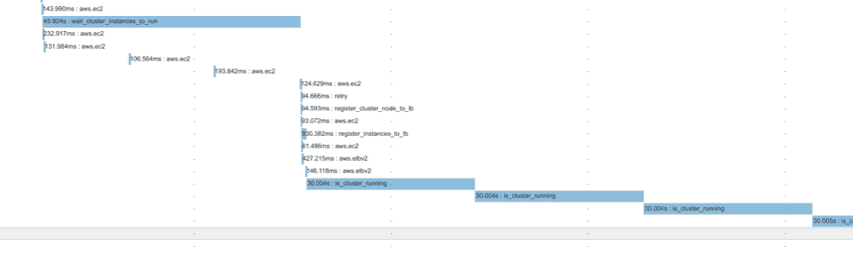
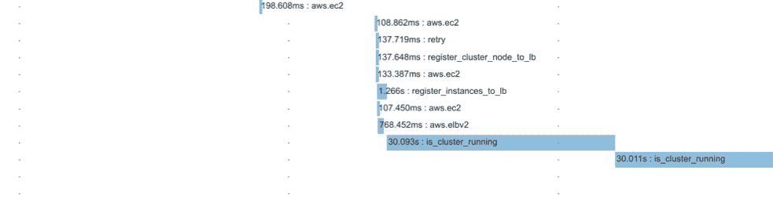
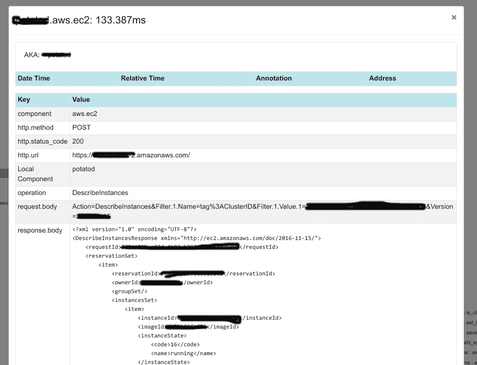

# 为什么您不能忽视分布式跟踪的可观察性

> 原文：<https://thenewstack.io/why-you-cant-afford-to-ignore-distributed-tracing-for-observability/>

[InfluxData](https://www.influxdata.com/) 赞助了这篇文章。

 [吉安卢卡·阿尔贝扎诺

吉安卢卡是 InfluxData 的 SRE。他是几个项目的开源贡献者，包括但不限于 Zend Framework、Docker 和 InfluxDB。他还是 Docker 队长，也是 doctor ORM 开发者团队的成员。他热衷于为全球开发者开发最佳实践，最近一直专注于在 AWS、DigitalOcean 和 OpenStack 之上构建可扩展的基础设施。他熟悉多种编程语言，如 Javascript 和 Golang，并在欧洲各地的会议上积极发言，分享他领导的项目的经验和知识。](https://www.influxdata.com/) 

可观察性是一个热门话题，但没有多少人知道它的真正含义。这些天，每个人都在阅读关于监控与可观察性的文章，我也有机会体验我认为是这场运动背后的主要概念。

首先，监控很复杂。仪表板不可伸缩，因为它们通常只在经历中断后才显示您需要的信息，并且在某些时候，在您的图表中寻找峰值变成了一项费力的工作。这不是监控——这只是一种“不太”聪明的方式来理解某些东西是如何不工作的。换句话说，监控只是冰山一角，而坚实的基础是您对系统的了解。

然而，现在的分布式系统太复杂，难以理解。一个请求可以在许多服务和应用程序之间来回传递，有些甚至不属于您的公司。处理请求的每个参与者都可能失败，当这种情况发生时，您需要一种方法来回答这个基本问题:“刚刚发生了什么？”可观察性通过一套工具、方法和思维方式来实现，允许你和你的团队了解一个系统。

特别是，我认为分布式跟踪是一个可观察性工具，你需要在你的工具箱中有它。在此，我分享一下让我得出这个结论的经历。

我在 [InfluxData](https://www.influxdata.com/) 工作，是我们 SaaS 产品 InfluxCloud 的一名 SRE。几个月前，在经历了一次疯狂的增长后，我们发现我们自己开发的 orchestrator(当时是这样的)是不可持续的，它没有给我们足够的信心来知道事情在正常运转。幸运的是，我们非常了解代码，因为我们是从零开始编写的，因为我们没有使用像 Kubernetes 这样的标准配置管理工具或 orchestrator——我们编写了自己的小 orchestrator 来解决我们的特定用例。它是在 AWS 上一个隔离环境中的守护程序上为每个使用 InfluxDB、Chronograf、Kapacitor 和我们服务提供的其他插件的客户设置的。

我们决定从最重要和最复杂的流程开始重构应用程序:

*   集群创建:为新客户创建子网、安全组和实例的流程；
*   集群终止:当客户停止支付服务费用时使用；
*   创建附加组件:增加 Grafana、Kapacitor 或 Chronograf 等附加组件。

为此，我们使用了一种叫做 [的反应式规划](https://gianarb.it/blog/reactive-planning-is-a-cloud-native-pattern) 的模式。基本上，您创建一个计划(例如创建集群)并将该计划分成不同的步骤:

*   创建安全组；
*   配置入口/出口权限；
*   创建实例；
*   等待实例运行；
*   创建负载平衡器。

有一个调度程序来执行这个计划，并一个接一个地执行每一步，最重要的是它会第二次执行整个计划。计划第二次执行时，应该不会返回任何步骤，因为所有步骤都应该已经执行了，这意味着计划已经解决了。在这种情况下，这很好也很温馨，因为它迫使你再次检查每件事情是否正常。例如，计划检查是否在 AWS 上创建了安全组，如果创建了，就不会再返回到那个步骤。这使得供应坚如磐石。

另一个好的副作用是所有的执行登录都在调度器中的同一个地方。这意味着只有一个地方可以看，以了解正在发生的事情。调度器是这样的:

```
func  (s  *Scheduler)  Execute(ctx context.Context,  p  Plan)  error  {
for  {
                        // Create the plan.
steps  :=  p.Create(ctx)
if len(steps)  ==  0  {
break
}
err  :=  s.react(ctx,  steps)
if err  !=  nil  {
return err
}
}
return nil
}

```

react 函数是递归的，因为步骤可以返回新的步骤。

```
func  (s  *Scheduler)  react(ctx context.Context,  steps  []Procedure)  error  {
for  _,  step  :=  range  steps  {
span,  _  :=  opentracing.StartSpanFromContext(ctx,  step.Identifier())
step.WithSpan(span)

logger  :=  s.logger
f  :=  []zapcore.Field{zap.String("step",  step.Identifier())}
zipkinSpan,  ok  :=  span.Context().(zipkin.SpanContext)
if ok  ==  true  &amp;&amp;  zipkinSpan.TraceID.Empty()  ==  false  {
f  =  append(f,  zap.String("trace_id",  zipkinSpan.TraceID.ToHex()))
}
logger  =  s.logger.With(f...)
step.WithLogger(logger)

innerSteps,  err  :=  step.Do(ctx)
if err  !=  nil  {

                              ….
}
span.Finish()
if len(innerSteps)  &gt;  0  {
if err  :=  s.react(ctx,  innerSteps);  err  !=  nil  {
return err
}
}
}
return nil
}

```

在每一步，除了 *Do()* 功能外，要执行的逻辑有两个功能 *WithLogger* 和 *WithSpan* 。我添加这个函数只是为了便于观察。如您所见，我正在使用 [OpenTracing](https://opentracing.io/) 标准来检测我的计划。

有了这几行代码，我就能够配置日志记录器总是公开 *trace_id* ，这样，我就可以很容易地根据请求查询我的日志。在步骤内部，我有一个跨度，可以轻松地访问，并根据跨度内发生的事情获得更多的上下文。例如，我们使用 [etcd](https://thenewstack.io/about-etcd-the-distributed-key-value-store-used-for-kubernetes-googles-cluster-container-manager/) 键值数据存储。在 etcd 中保存信息的步骤包含密钥和值。当我查看跟踪时，我可以理解在计划执行期间记录是如何变化的。

此外，我们有一个前端，它记录与后端
的每次交互的 *trace_id*

```
Nov  15  19:04:45   PATCH https://what.net/v1/clusters/idg trace_id:d572232a8fed45fa 422

```

我能够从日志中获取这些信息，因为后端返回了作为标题的 *trace_id* 。这是从日志或直接从特定请求中查找跟踪的另一种简单方法，如果您能够教会用户附加跟踪，例如，在支持票据中。

然而几天前，我们遇到了一个问题。一些集群(很少一部分)在创建过程中失败，但是 AWS 没有报告任何错误(顺便说一下，我们还跟踪了所有的 AWS 请求)。所有资源都已创建，但是 EC2 没有在目标组中注册。

集群的创建是一个复杂的流程，因为有 40 多个与 AWS 的交互，完成所有步骤可能需要 10 多分钟。但是查看跟踪，很容易理解错误在哪里。这是跟踪的一部分的快照，该部分获取 EC2 并将它们注册到集群运行的负载平衡器:

[](https://cdn.thenewstack.io/media/2019/01/515b810b-distributed-systems.png)

*(点击放大)*

每一步都有一个名字，我看到的是**register _ cluster _ node _ to _ lb**。如您所见，它调用 AWS。EC2 一次获取所有要附加的实例 id，并调用 AWS。ELBv2 服务两次:一次用于获取正确的目标组，一次用于注册实例。

[](https://cdn.thenewstack.io/media/2019/01/0bcab003-distributedtracing2.png)

将这个跟踪与一个失败的跟踪进行比较，很容易看出在第二个屏幕中只有一个对 AWS.ELBv2 的请求，这就是问题所在！结果是一个没有处理好的错误。

这个特定的应用程序不处理大量的负载，但是具有关键的流程，在这些流程中，故障排除的能力非常重要。计划如何执行的可见性是一个特性，而不是一个选项。这就是我们跟踪所有 AWS 请求的原因；例如，即使请求和响应:

[](https://cdn.thenewstack.io/media/2019/01/08323fda-distributedtracing3.png)

可观察性不仅在生产中很重要，在开发中也很重要，因为它教会你程序是如何工作的。这就是为什么我在开发中也使用这个设置。可观察性是提高开发一个特性的速度和质量的能力。这很好，因为它使得可观察性很容易改进和更新。或者，监控只在生产中重要，并且您通常不关心在开发周期中触发警报。

我们目前在生产中运行这个系统，这给了我信心，当我们的支持团队要求我解决客户问题时，我需要适当地帮助他们。这特别有帮助，因为在几秒钟内，我可以直观地了解失败发生在哪里，因为反应计划突出显示了要重构、测试或优化的相关代码。

我认为分布式跟踪是开发周期中的关键，因为现代应用程序的架构与旧应用程序的架构非常不同——不是因为现代应用程序更小或更微型，而是因为有许多与外部数据库、第三方服务等的集成点。断路器和重试策略使调试变得更加复杂，并且如果不经常发生，一些故障是不可预测的或者处理起来非常昂贵。考虑到这一点，对于一些失败，最好有一个快速的方法来理解新的问题，而不是试图预测和避免每一个可能的失败，因为这已经不可能了。

通过 Pixabay 的特征图像。

<svg xmlns:xlink="http://www.w3.org/1999/xlink" viewBox="0 0 68 31" version="1.1"><title>Group</title> <desc>Created with Sketch.</desc></svg>