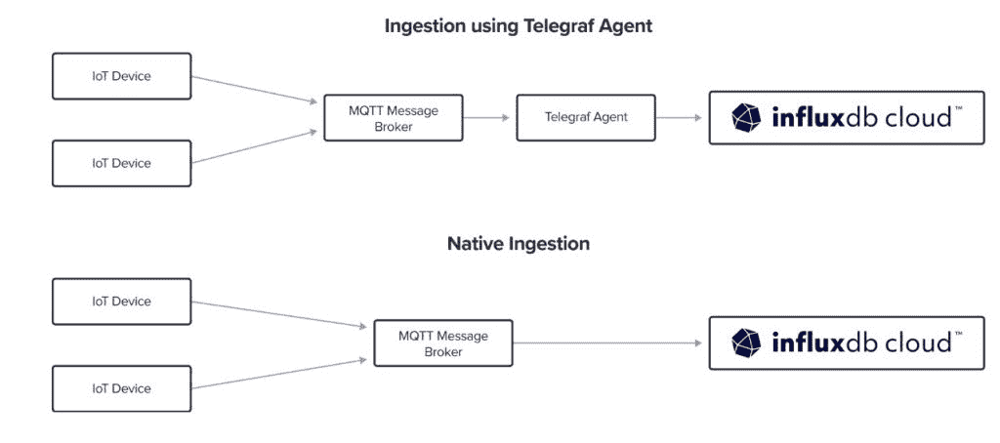
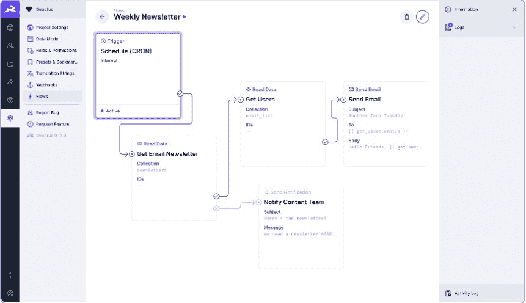

# 为什么您不能错过数据决策

> 原文：<https://thenewstack.io/why-you-cant-afford-to-miss-data-decisions/>

不久前，数据库和数据库管理被移交给负责管理杂乱 SQL 数据库的 It 部门，这些数据库通常位于笨重的 AS400 服务器上。通常，在最好的情况下，这些非常孤立的系统上的信息数据可能只包括客户名单、交易、人事记录和其他更基本的数据。该组织的大多数利益攸关方仍然无法访问这些数据，并且往往需要一份工作单才能从系统中收集信息。

时至今日，数据分析、可观察性和可视化功能不仅是希望保持竞争力的组织所必需的，而且已经变得可以在组织的所有部门中访问并用于制定业务决策，最好是由所有利益相关方实时使用。

客户服务只是一个例子。根据 Gartner 的调查，通过数据访问实现的在线账户门户和统一通信是为客户服务领导者提供最大价值的功能之一。"

根据由 [BMC](https://www.bmc.com/?utm_content=inline-mention) 赞助的 451 Research 的一份报告，一个自主的数字企业是“以客户为中心的，敏捷的，并从数据中获得可操作的见解”。这些“可操作的见解”来自于对组织整体运营数据的分析，涵盖了 [CI/CD](https://thenewstack.io/category/ci-cd/) 生产管道、内部通信，当然还有客户数据。

## 数据操作

对于那些开发或推送代码的组织来说，DataOps 已经成为 DevOps 的必要组成部分。根据 [Gartner 的说法，DataOps 被定义为“一种协作数据管理实践，专注于改善整个组织中数据管理者和数据消费者之间的沟通、集成和数据流自动化”。](https://www.gartner.com/en/information-technology/glossary/dataops)

因此，组织对数据运营的需求显而易见。然而，随着数据量的爆炸式增长，无论是在边缘、内部、跨多云环境，还是在需要进行推断和分析以做出业务决策的任何地方，组织都在继续努力。将数据汇集在一起，供开发人员、数据科学家和其他 DevOps 团队成员随时随地使用，这是它带来的挑战之一。

“数据有一个原点和一个引力。它出生在某个地方——无论是在物理世界还是数字世界，这个出生地几乎总是可以被放到地图上——无论是网络地图还是更真实的世界，”Brian Gilmore， [InfluxData](https://www.influxdata.com/?utm_content=inline-mention) 的物联网和新兴技术总监告诉 New Stack。“网络限制，无论是基于成本还是基于物理，都会导致数据倾向于以最精确和最精细的形式保留在其发源地附近。随着越来越多的数据在这个发源地产生，一种引力开始出现，这种引力吸引了数据消费者，包括人和应用程序。”

## 开发商大展拳脚

依赖 DataOps 的组织几乎不可避免地需要从他们的时间序列数据中实时获得集中的洞察力，以便在某个时候实现数据可视化。这对开发者来说尤其重要。“无论发源地是在边缘、云端还是两者之间的任何地方，这种模式都会导致分散的、点对点的用户数据交互，几乎没有全局可见性。因此，开发人员面临一个选择——在数据附近运行应用程序(边缘),或者将所有数据移至应用程序(云)。对于现代分布式技术来说，这两者都不是一个好的架构或技术解决方案，”吉尔摩说。“你要么让应用适应边缘，要么让数据适应云。无论哪种方式，您都在损害您的应用程序或数据。

吉尔摩说，理想的状态是数据访问更像内容交付。应用程序推动用户体验，包括可视化，并且用户请求通过优化的数据呈现得到服务—无论是原始格式还是聚合和汇总格式。“随着我们扩展时间序列引擎的范围，我们打开了这种新的‘数据即内容’范式的大门，”吉尔摩说。“用户请求、数据可用性和智能计算以及数据移动性结合在一起，使得数据的当前或最终‘位置’与用户和应用程序无关。”

随着 InfluxDB 本机收集器的发布，允许开发人员使用 InfluxDB 云来订阅、处理和存储来自消息代理的实时数据，开发人员可以使用这些工具来加快设备到云的数据传输，以便开发人员可以从他们的时间序列数据中实时获得集中的见解。InfluxData 表示，这些功能为开发人员提供了从第三方经纪人那里获得时间序列数据到 InfluxDB 云的最快方式，而无需额外的软件或新的代码。

InfluxData 最近还发布了 Edge Data Replication，作为时间序列数据平台和监控提供商，补充其面包和更好的产品。该公司将其描述为“InfluxData 之旅的关键第一步”，边缘数据复制旨在帮助解决能源、制造、航空航天和科技领域其他数据密集型行业的分布式工业和物联网(IoT)应用程序的时序数据集成和编排挑战。

“我们继续高度关注时间序列引擎——通过时间限制的查询，实时收集、存储、分析和展示时间背景化数据的机制，”吉尔摩说。“如果你看看我们最近发布的两个功能，边缘数据复制(EDR)和本机收集器，这两个都是上述‘数据无处不在’体验的渐进步骤。”

然而，开发运维团队和数据运维团队有理由担心他们的数据运维工具和平台选择受到供应商的限制。他们需要保证他们的平台选择将继续与诸如 Directus for data visualization 和他们的 Grafana panel 等流行选项一起工作，以及选择可观察性工具。

Gilmore 说，在 InfluxData 的情况下，收集“靠近其来源点”的数据，并将数据高保真地存储在本地 InfluxDB 实例中，该实例透明地与其他 InfluxDB 实例一起工作，这是至关重要的。Gilmore 说:“这对于维护跨客户所有技术层的数据可用性网络是必要的，随着时间的推移，这将实现时间序列服务的网状结构。”“任何工具，无论是 Directus、Grafana、Appsmith 还是定制应用和微服务，都可以使用这种服务网络，通过单一 API 安全地访问数据。”

## 低码易

与 DevOps 集成的 DataOps 并不一定意味着开发或运营团队需要成为数据科学家。在许多情况下，数据可视化的低代码选项可以加速开发过程。 [Directus](https://directus.io/) 的首席执行官和联合创始人[本·海恩斯告诉新的堆栈，无代码数据可视化对所有业务用户都非常有价值，特别是那些非技术人员，无法访问存储这些关键信息的数据库或数据湖的用户。他说，他们不再向工程部门提交申请，然后等待数天或数周才能获得原始数据生成的报告，而是可以自助访问可视化工具，这些工具可以立即识别瓶颈或成功之处。](https://www.linkedin.com/in/contactbenhaynes/)

“通过启用这种‘公民 IT’，以前被锁在 IT 部门门后的数据现在可以在所有团队中实现民主化。业务用户可以更快地收集准确和可行的见解，以更好地告知他们传递给团队软件开发人员的项目规范，”Haynes 说。“此外，从不断为非技术部门生成定制数据报告的苦差事中解脱出来，这些宝贵的开发人员现在有更多的时间来实际构建软件。”

数据可视化还可以用于以安全的方式加快软件发布的上市时间。Haynes 说，在非常基本的层面上，与原始数据表相比，数据可视化平台提供的图表和仪表板只是人类处理大数据集的更有效的方式。但更重要的是，数据可视化工具通常是实时或接近实时的，使用轮询或理想的 WebSockets，他说。“这些技术允许数据从不同的来源传输到您的数据平台，并立即进行处理以用于各种仪表板。这两个好处，加上上面提到的民主化的好处，导致了快速决策的网络效应，加速了软件的发布。”

对于无代码数据可视化，Directus 无代码数据工作室中包含的 Directus Insights 模块允许技术或其他用户使用直观的拖放体验来创建实时数据仪表板。该公司表示，Directus 具有原生数据可视化功能，可以在新的或现有的 SQL 数据库之上分层，而无需迁移数据——支持时间序列、实时指标、动态列表、计量器、交互式组件和自定义面板。

从各种来源收集数据进行分析会给数据可视化带来挑战。不用说，无论是对于开发人员、数据科学家还是普通的非开发人员，API 的选择都是至关重要的。例如，Hasura 的 GraphQL 数据连接器(GDC) 允许 GraphQL 用户连接到“所有类型的数据”源，该公司表示。该公司表示，GraphQL API 是为后端和前端开发人员设计的，也是为那些能够依靠 Hasura 的低代码功能通过 GraphQL 的单一 API 分析和汇集各种不同数据源分析的用户设计的。

<svg xmlns:xlink="http://www.w3.org/1999/xlink" viewBox="0 0 68 31" version="1.1"><title>Group</title> <desc>Created with Sketch.</desc></svg>