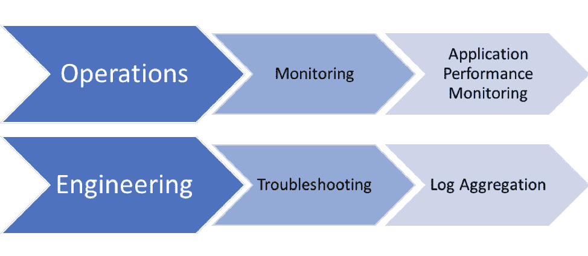
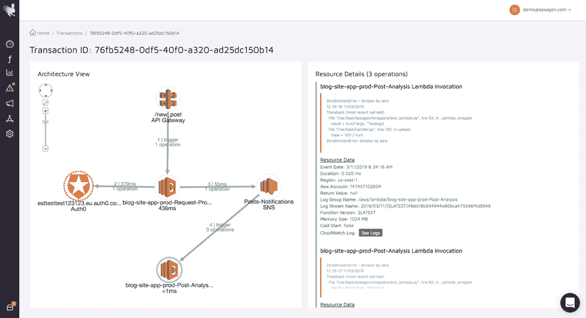
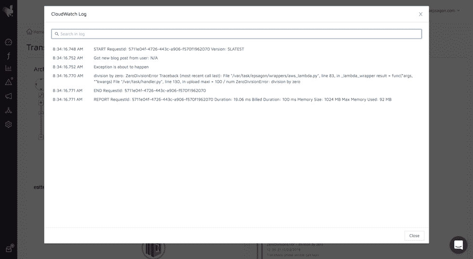
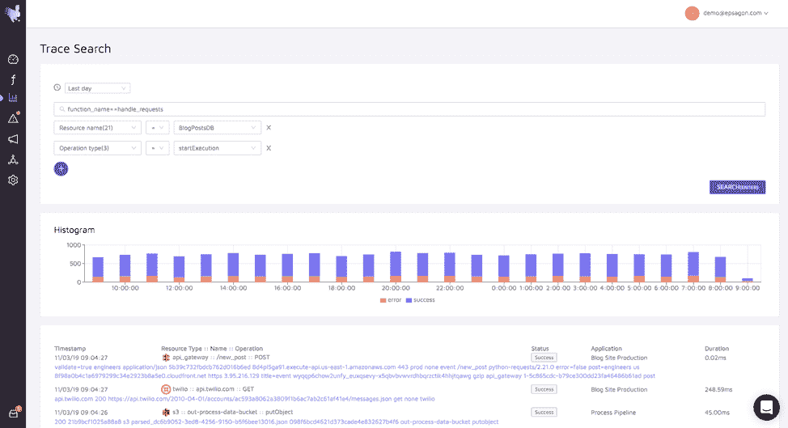

# 为什么您不能忽略无服务器监控和日志记录的变化

> 原文：<https://thenewstack.io/why-you-cant-ignore-changes-to-monitoring-and-logging-for-serverless/>

[Epsagon](https://epsagon.com/) 赞助本帖。

 [尼赞·沙皮拉

Nitzan 是 Epsagon 的首席执行官和联合创始人。他是一名软件工程师，在编程、机器学习、网络安全和逆向工程领域拥有超过 13 年的经验。他还喜欢弹钢琴，是一个旅游爱好者，一个经验丰富的棋手，并沉迷于运动。](https://epsagon.com/) 

业务应用程序必须启动并运行，问题需要快速解决—这一众所周知的事实当然也适用于当今在生产中运行分布式和大规模应用程序的公司。

这些要求导致了以下操作实践:

1.  **监控**:确保业务应用程序正常工作；
2.  **故障排除**:快速修复生产性能问题(在开发/试运行环境中完成时，有时称为调试)。

这两个需求是至关重要的——它们对公司软件产生的收入以及客户的满意度有直接的影响。

## 跟踪/日志/工具——谁在乎？

传统上，组织中的不同人员负责这两个需求中的每一个:监控是运营部门的责任，故障排除最终升级到工程部门。

为了适应这些职责，使用了两种类型的工具:

*   应用性能监控(APM)
*   日志聚合

这两种工具非常不同。例如，APM 工具使用代码工具，以便在应用程序运行时从应用程序中提取事件，监控应用程序级别的指标，并在出现问题时提醒用户。

日志聚合工具可以消化、存储大量数据，并允许快速搜索和标记。当然，日志也可以用于监控，但是监控的质量将取决于在这些日志中发现的数据的质量。

## 向微服务的转变

近年来，公司开始设计、开发和运营微服务应用。它们提供了几个好处，包括*开发速度*和*软件可伸缩性*。虽然这是一个令人兴奋的转变，但监控和故障排除的基本要求并没有实质性的改变。

让我们从运营角度和文化角度来看看转向微服务对此有何影响。

### 建筑上的转变

令人惊讶的是，工具并没有改变。监控仍然由 APM 和故障排除主导，由日志聚合工具主导。

但是情况变了！随着应用程序变得更加分散，会发生两件事:

*   单独监控每项服务已经不够了。一个业务事务涉及不止一个服务——有时会涉及几十个服务。因此，要监控业务应用的健康状况，需要从端到端监控*分布式流*；
*   日志由每个服务单独编写。因此，他们不会讲述微服务架构的故事。当把所有的日志推到一个中心位置时，结果通常是一片混乱。它不允许工程师快速解决问题，损害他们的生产力并影响客户体验。

### 文化转变

除了监视指标和聚集日志的方法不能有效地应用于分布式应用的监视和故障排除之外，还有另一个有趣的转变:采用微服务的组织需要现代技术，这些技术通常在云中。这些技术包括容器和功能即服务(例如 AWS Lambda)。

随着他们变得更加突出，结果是**开发人员在公司中变得更加强大**。 [无服务器](https://martinfowler.com/articles/serverless.html) 就是最好的例子。无服务器应用程序是直接部署到生产环境中的代码和配置的组合。运营部门何时以及如何参与？事实上，有时他们不是。结果呢？开发人员对他们编写和部署的软件负责，这意味着——是的——监控它。

### 这对开发者意味着什么

但是等等——开发人员已经习惯了使用日志。所以他们找到了解决办法。他们使用日志聚合工具来监控分布式业务流。你猜怎么着？它不起作用。当他们意识到这一点时，他们开始花时间在他们的日志中实现分布式跟踪技术——如果你听说过 [在日志](https://hackernoon.com/capture-and-forward-correlation-ids-through-different-lambda-event-sources-220c227c65f5) 中写相关 id，然后搜索它们，你不是唯一一个。去年我一遍又一遍地看到它。花费的时间是巨大的。

## 统一跟踪和日志记录

当我们创建 [Epsagon](https://epsagon.com/) 时，我们决定采用不同的方法来跟踪、监控和记录。**一切都是痕迹**，日志只是另一种类型的痕迹。使用这种方法，我们能够设计和实施统一的监控和故障排除产品。

### 分布式跟踪、分布式日志记录

分布式跟踪是对分布式应用程序进行故障排除的主要方法。

使用自动分布式跟踪，每个进入系统的请求都由 Epsagon 进行端到端的跟踪。每一个有效负载都被跟踪和检查，以获得我们试图解决的问题的洞察力。

然而，不仅仅是有效载荷。在每个跟踪的旁边，有一个名为“See logs”的按钮，它将显示对应于日志条目的**(如果这是一个 AWS Lambda 函数，这就是 CloudWatch 日志)，这将完成这个故事。**

日志与痕迹相结合。

### 搜索数据

深入到一个特定的请求是从根本上解决复杂问题的好方法。然而，有时不知道请求实际在哪里。如果您有关于您正在寻找的问题的任何类型的信息 HTTP body 字段、SNS 有效负载或任何其他信息——您可以搜索它。Epsagon [建立在 Elasticsearch 的基础上，自动索引](https://epsagon.com/product-updates/introducing-trace-search/) 任何有效载荷或日志，以便你可以搜索它。然后，可以直接跳转到相应的事务。

## 显影剂速度

这都是关于开发者速度的。公司寄希望于 AWS Lambda 来优化他们最昂贵的资源——工程师(不，不是他们的云账单)。不要管基础设施，只要写软件，部署就行了。完全说得通。

然而，这些公司没有考虑到这样一个事实，即这些高效的开发人员现在花费越来越多的时间做运营。

## 外卖:统一的未来

我们应该以统一的开发+运营文化为目标。开发人员、运营人员和开发运维人员携手解决共同问题的文化。在这个团队一起工作的世界里，更好的工具集成是非常有意义的。

最终，重要的是上市时间和高质量的客户体验。为了实现这一点，可以利用现代云技术，但是监视与日志记录的思维模式必须改变。在这个分布式云应用程序和混合团队的世界中，是时候将分布式跟踪视为运营和开发人员的推动者了。

通过 Pixabay 的特征图像。

<svg xmlns:xlink="http://www.w3.org/1999/xlink" viewBox="0 0 68 31" version="1.1"><title>Group</title> <desc>Created with Sketch.</desc></svg>