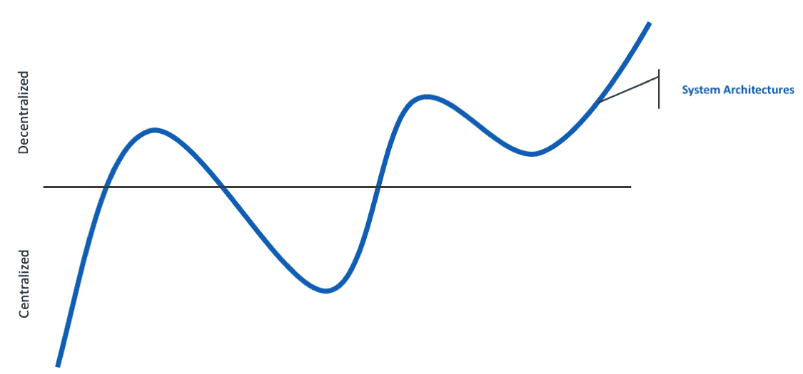
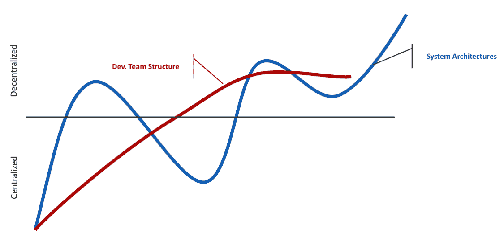
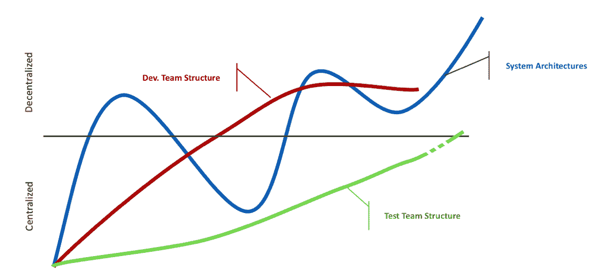
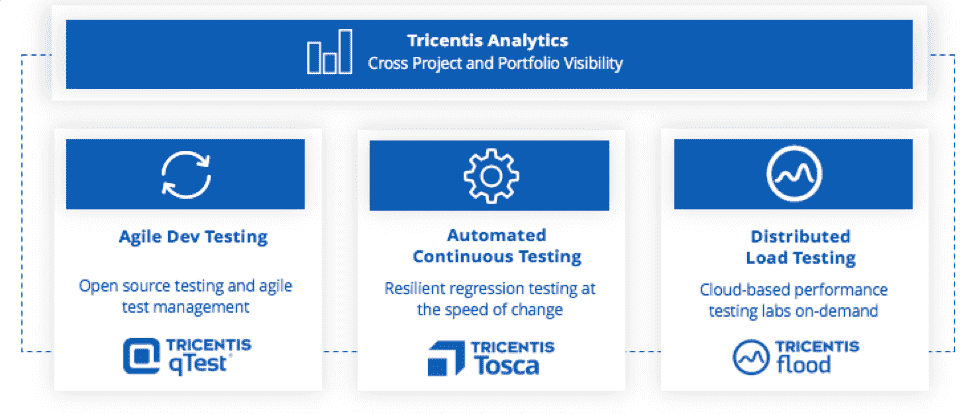

# 为什么您必须为敏捷和开发运维改造测试

> 原文：<https://thenewstack.io/why-you-must-reinvent-testing-for-agile-and-devops/>

 [韦恩·阿里奥拉

韦恩，来自 Tricentis，是持续测试、基于风险的测试、服务虚拟化、API 测试等软件测试领域公认的思想领袖。Wayne 创造并销售了支持动态软件开发、测试和交付环境的产品。他推动了许多创新技术的设计，并获得了多项发明专利。他为软件测试领域贡献了 15 年，在软件行业工作了 20 多年。在 LinkedIn 或 Twitter 上与他联系。](https://www.linkedin.com/in/wayneariola/) 

回想一下仅仅五年前。2014 年:

时代变了——变了很多。如果您的测试方式还没有发生巨大的变化，那么很快就会了。在可预见的未来，中断的速度和范围将继续扩大。

一方面，测试经常是阻挡在高度加速的开发过程和高度自动化的运营驱动的交付过程之间的障碍。但另一方面，测试对于确保该版本不会给业务带来风险至关重要——破坏数字化转型致力于增强的“客户体验”。

您如何在速度和风险之间取得最佳平衡，从而比竞争对手更快地提供引人入胜的客户体验？进入连续测试。

[持续测试](https://www.tricentis.com/products/what-is-continuous-testing/)是执行自动化测试的过程，作为软件交付管道的一部分，以便尽快获得与软件发布相关的业务风险的反馈。

持续测试实际上可以归结为在正确的时间向正确的涉众提供正确的反馈。几十年来，测试通常被推迟到周期结束时进行。在这一点上，测试人员会提供各种重要的反馈……但是没有人真的想听。为时已晚，除了推迟发布之外，团队没有什么可行的办法。对于持续测试，重点是向真正关心它的人提供可操作的反馈，以及他们何时真正准备好采取行动。

与流行的观念相反，持续测试可以发生在应用交付生命周期的任何一点。在某种程度上，持续测试的概念被不恰当地与“左移”的趋势混为一谈为了在正确的时间向正确的涉众交付正确的反馈，需要在软件交付生命周期的整个过程中进行持续的测试——甚至超出生产阶段(例如，监控来自生产的信息，并从质量的角度进行反馈)。顾名思义，持续测试包括持续测试。简单地提前开始和结束测试，根据定义，不是连续测试。

当然，以一种在正确的时间向正确的涉众提供正确的反馈的方式进行连续测试并不是一件容易的事情。为什么它如此具有挑战性的简短答案是，可用于测试的时间在不断地*减少*，而我们需要测试的复杂性在*增加*。但不仅仅如此。为了更好地理解为什么“重新发明测试”现在如此重要，让我们快速看一下影响现代应用交付的一些核心力量。

## 架构和团队的分散化

系统架构已经从一个集中的系统转变为一个更加分散的集成系统。从过去的单片大型机应用程序，我们已经发展成为一套集成系统，变得更加分布式。云原生应用、需要极度协调的微服务的出现——这些都是系统架构去中心化趋势的一部分。

开发团队结构传统上遵循系统架构趋势。开发团队结构从大型集中式瀑布型团队发展到更小更分散的团队。

## 

随着开发团队的分散和变得更加分散，保持对史诗和交付物的控制变得越来越困难。

想象一下:我们不再是统一的团队在单一的应用程序上工作，而是转移到许多小的自治团队，每个团队在一个高度分布式系统的更小的部分上工作。您如何确保整个应用程序的用户体验协调一致、引人注目？

现在，团队有所反弹:他们不一定在寻找集中开发团队结构的方法，而是在分散的开发团队结构中更有效地合作。

然后是测试团队结构——遵循相同的一般模式，但是有点落后。

测试团队结构已经从一个负责所有测试的高度集中的小组，发展到卓越的测试中心，卓越的数字测试中心，以及嵌入到敏捷开发团队结构中的测试人员。现在，测试团队(比如开发团队)正在向一个混合的模型转变，这个模型很大程度上是分散的，但是有集中的组件来测试端到端的交互。

## 工具的扩散

这种团队分散化的一个影响是不同的团队选择不同的工具来驱动他们的质量过程。独立工具的选择可能满足单个团队的需求——但是当您需要对更广泛的应用程序做出快速(通常是自动化的)发布决策时，会发生什么呢，这可能涉及到多个团队和工具集？

这样的决定需要对最新的变化如何影响用户体验进行准确的评估。然而，理解变更影响所需的数据分散在不同的团队和工具中——开源的、定制的和商业的。

## 高度相互依赖的应用程序

接下来，让我们转向极端的相互依赖性，这种依赖性不可避免地源于分散的系统架构。显然，对于负责端到端业务事务的 QA 团队来说，这种相互依赖将是一个更加紧迫的问题，这些事务涉及 SAP、遗留应用、大型机、web UIs、API 等。而不是为云原生应用构建微服务的 DevTest 团队。对于前者，你不能随便抓一个开源工具，摆弄一下，就成功了。您需要对所有不同的技术有足够的了解来实现它们的自动化，您需要一种方法将安全、可靠的合规数据输入到技术中(以及跨技术)，并且您需要对与这些事务中的每一个相关联的所有不同组件进行按需访问(真实的或模拟的)。

然而，实现测试自动化仅仅是开始。假设您有一系列可能涉及应用程序“A 到 E”的事务，并且您已经为这些核心事务构建了自动化回归测试。现在，想象一下许多相关联的应用程序组件中的一个组件一直在变化。对于每一个变更，您需要回顾并可能更新所有相关的回归测试。

除非您的测试自动化是有弹性的(为适应频繁的变更而构建)，否则结果被误报所困扰，测试套件无法检测关键故障或负面变更影响只是时间问题。随着应用程序组件的不断发展，技术债务越积越多，团队感到仅仅为了赶上(更不用说跟上)就需要大量的工作。

在这一点上，肯定有一种诱惑要退回到手工测试。然而，不管你投入多少人来解决这个问题，在现代交付过程中，手工测试根本不可能在正确的时间向正确的涉众交付正确的反馈。

## 性能测试的分散化

最后，让我们看看分散化架构和团队的另一个影响:性能测试的分散化。这种转变自然导致了 API、web 服务和微服务的激增和扩张。这些分布式组件中的任何一个性能问题都可能对整个应用程序产生连锁反应。现在新功能每周、每天或每小时发布一次，每个分散的团队需要即时了解他们的增量变化是否会对性能产生负面影响。

由性能测试专家进行的深入负载测试仍然至关重要——但它不能提供对敏捷和开发运维至关重要的快速按需负载测试水平。开发人员和测试人员需要一种方法，在新功能通过交付管道之前暴露关键的性能问题。为了实现这一点，他们必须能够轻松地创建负载测试，为他们正在开发的功能提供快速反馈。除此之外，他们还必须能够根据需要执行和扩展这些负载测试，而不需要花费传统上建立、配置和维护性能测试实验室所需的高昂成本和精力。

## 前进的道路

每个团队都不一样。有些人可能专注于自动化传统的手动过程，而其他人可能正在与他们已经掌握的各种测试自动化工具的编排和关联进行斗争。挑战在于，您可以报告涉及所有这些不同团队(具有不同的节奏、架构、工具堆栈、结构和挑战)的总体应用程序或项目是否具有可接受的风险水平。

这就是 Tricentis 提供连续测试平台的原因，该平台针对现代 QA 和 DevTest 团队面临的各种挑战进行了优化。从解决最紧迫的难题开始，然后随着期望的转变和新挑战的出现，轻松扩展。

Tricentis 帮助企业测试团队:

*   **利用针对 150 多项技术优化的高级、弹性测试自动化，在几分钟内暴露变更影响**；
*   **借助面向智能企业的最全面的测试解决方案，实现 SAP 和打包应用测试的现代化**；
*   **通过在您的团队、项目、应用程序和工具(包括开源)之间协调和扩展测试工作，加速发布周期**；
*   **通过集中化的可见性/可追溯性**、预测性分析和“发布就绪”仪表盘降低风险。

Tricentis 有几个核心组件，可以单独应用，也可以在您的团队和项目中协同应用:

如果您感兴趣并希望了解更多关于该平台及其特定组件的信息，我们鼓励您阅读 [Gartner 的独立分析、](https://www.tricentis.com/resources/gartner-critical-capabilities-for-software-test-automation/)获得[免费试用版](https://www.tricentis.com/software-testing-tool-trial-demo/)或注册参加[快速演示](https://www.tricentis.com/software-testing-tool-trial-demo/)。

<svg xmlns:xlink="http://www.w3.org/1999/xlink" viewBox="0 0 68 31" version="1.1"><title>Group</title> <desc>Created with Sketch.</desc></svg>