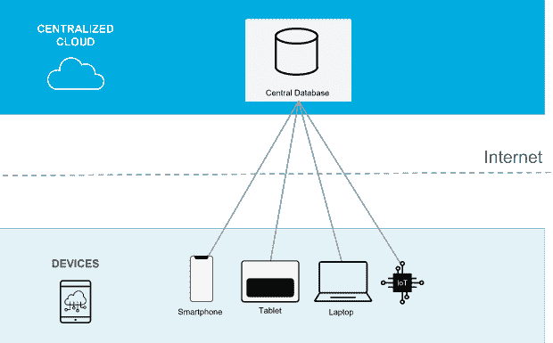
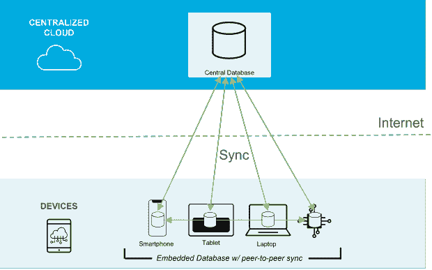

# 为什么您需要移动数据库

> 原文：<https://thenewstack.io/why-you-need-a-mobile-database/>

移动应用程序的使用在全球范围内都在增加，不仅是在用户数量上，而且是在每天花在应用程序上的时间上。TechCrunch 最近报道称，移动用户现在每天在智能手机应用上花费四到五个小时，大约是醒着时间的三分之一。而说到他们使用哪些应用，选择是不缺的。[应用商业](https://www.businessofapps.com/data/app-stores/)报道称，Google Play 目前提供约 280 万个应用和游戏，苹果应用商店提供约 450 万个。

但如此庞大的应用数量——以及用户在这些应用上花费的时间越来越长——意味着用户可以对他们选择参与的应用进行非常严格的选择。事实上，根据移动营销分析供应商 [AppsFlyer](https://www.appsflyer.com/resources/reports/app-uninstall-benchmarks/) 的一项研究，几乎每两个应用中就有一个在 30 天内被卸载，陈楚翔的一项研究发现，除了最受欢迎的应用，失去 80%的移动用户是“正常”的。

应用程序废弃率高的一个重要原因是糟糕的体验，尤其是缓慢和不可靠。Think Storage 的一份报告发现，70%的移动应用程序用户会放弃一个加载时间过长的应用程序。一项更老但仍经常被引用的 Compuware 研究发现，84%的应用程序用户会放弃一个仅失败两次的应用程序。

这些事实有助于强调，当涉及到保持用户快乐和参与时，误差幅度很小。提供快速、可靠的体验是移动应用成功的关键，而使用正确的数据库(专为移动应用构建的数据库)是实现这一点的关键。

## **移动应用的数据库选项**

您可能想知道我们所说的“移动数据库”是什么意思数据库就是数据库，对吧？

不完全是。在开发移动应用程序时，无论是本地的、基于 web 的还是混合的，您都需要选择一个能够提供用户所需的速度和可靠性的数据库。让我们检查一下选项。

## **关系型与 NoSQL 型**

[关系数据库](https://en.wikipedia.org/wiki/Relational_database)将数据存储在高度组织化的表中，这些表由一个为一致性而设计的严格固定的模式维护。但是，关系僵化是有代价的——应用程序开发人员必须使他们的代码符合模式，任何所需的数据更改都会导致耗时的模式更新，从而使应用程序更新变得非常困难。

相比之下， [NoSQL 数据库](https://en.wikipedia.org/wiki/NoSQL)将数据存储为 JSON 文档，消除了对模式的需求，并允许开发人员随着应用需求的发展按需更改数据库。此外，NoSQL 数据库是分布式的，这意味着它们可以跨多个节点部署，从而为应用程序提供卓越的性能和可靠性。

一般来说，由于其分布式特性和数据模型的灵活性，NoSQL 数据库非常适合移动应用程序，因为它们的速度和可靠性。

## **云数据库**

在云数据库模型中，移动和物联网应用程序使用运行在云中的数据库。

云数据库模型为标准化的分布式基础设施提供了一个快速入口，为移动应用程序提供了规模、弹性和灵活性。

问题是模式依赖于互联网，本来就不靠谱。如果互联网变慢，依赖它的应用程序也会变慢。如果互联网出现故障，应用程序会完全停止工作，让用户感到沮丧，并造成业务停机。

由于对互联网的依赖，云数据库模式在满足移动应用用户的期望方面存在挑战。当他们进入网络连接不良的地区，如地铁站、飞机或隧道时，他们的应用程序变得不可靠，甚至毫无用处。

为了保证快速可靠的移动应用体验，您需要消除对互联网的依赖。

## **嵌入式数据库**

[嵌入式数据库技术](https://en.wikipedia.org/wiki/Embedded_database)如 [SQLite](https://en.wikipedia.org/wiki/SQLite) 是移动 app 开发的另一种选择。这是数据库在移动设备上安装的应用程序中运行的地方。通过将数据库嵌入应用程序本身，您完全不需要网络连接，同时获得最高的速度和可用性保证。

对于本质上独立且数据很少变化的应用程序来说，使用嵌入式数据库可能非常好，但它们缺乏连通性给多用户应用程序带来了挑战，因为数据经常变化，必须与其他用户共享。对于嵌入式数据库，开发人员要么必须在其嵌入式应用程序中内置数据共享功能，要么不内置。

## **移动数据库**

移动数据库模型是云和嵌入式数据库模型的合并，将两者的最佳方面结合到一个架构中，该架构支持离线优先的应用程序，不受互联网速度缓慢和中断的影响。

该模型由运行在移动客户端上的中央云数据库和嵌入式数据库组成，它们通过自动同步来共享数据，嵌入式数据库在云数据库和其他嵌入式设备之间同步捕获或修改的数据。当网络连接不可用时，数据会在本地存储和处理，当连接恢复时，同步会自动恢复。

移动数据库还提供点对点功能，允许多个近距离嵌入式设备使用蓝牙等专用区域网络同步数据，从而在断开的环境中实现协作。

移动数据库模型能够提供移动应用程序用户所需的快速可靠的体验，从而满足他们的期望。嵌入式本地数据处理可确保实时响应和高可用性，不受互联网连接的影响，云到边缘同步可确保用户体验始终保持最新和一致。

## **couch base 移动数据库**

[Couchbase](https://www.couchbase.com/?utm_source=dzone&utm_medium=refcard&utm_campaign=mobile_apps) 提供了一个移动数据库，将云 NoSQL 数据库的能力和灵活性带到了边缘。

Couchbase 移动堆栈包括:

*   [Couchbase 五车二](https://www.couchbase.com/products/capella) —完全托管的云 NoSQL 数据库即服务(DBaaS)，支持 SQL、搜索、分析和事件。
*   [五车二应用服务](https://www.couchbase.com/products/capella/app-services) —面向移动和边缘应用的双向同步、认证和访问控制的全面托管服务。
*   [Couchbase Lite](https://www.couchbase.com/products/lite) —具有广泛移动平台支持的嵌入式移动数据库。

作为财富 500 强和世界上最大的油田服务公司之一，Halliburton 使用 Couchbase 的移动数据库技术来自动化各种流程和工作流，旨在实现井场和钻井作业的新商机和效率。凭借我们独特的移动和数据同步能力，Halliburton 可以在有限或没有互联网连接的设备之间同步数据，通过防止数据重复和冗余工作提高现场工作人员的效率。

[免费试驾 Couchbase 五车二和应用服务](https://cloud.couchbase.com/sign-up?utm_source=dzone&utm_medium=refcard&utm_campaign=mobile_apps)。

<svg xmlns:xlink="http://www.w3.org/1999/xlink" viewBox="0 0 68 31" version="1.1"><title>Group</title> <desc>Created with Sketch.</desc></svg>