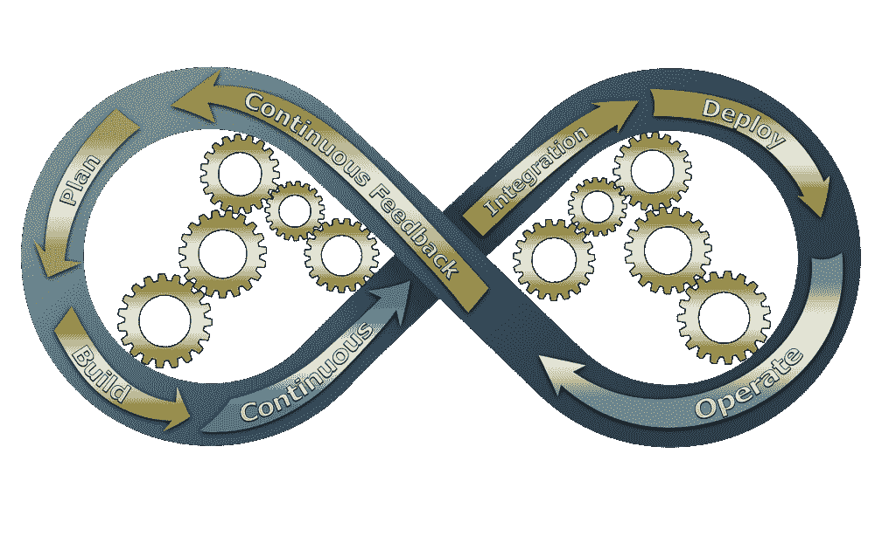
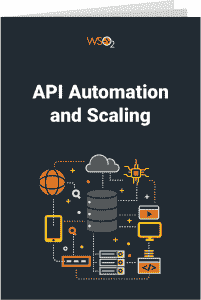

# 为什么您需要考虑 API 自动化和可伸缩性

> 原文：<https://thenewstack.io/why-you-need-to-think-about-api-automation-and-scalability/>

 [查敏·迪亚斯

查敏是 WSO2 的高级技术营销工程师。他作为高级软件工程师在 WSO2 API Manager 团队工作了 4 年多，为许多广泛使用的特性做出了贡献，包括 API 导入/导出工具、SDK 生成和 API 货币化。](https://www.linkedin.com/in/chamindias/) 

疫情加快了向银行、零售和许多其他服务的数字渠道的转变。因此，企业正在加快其数字化转型计划，以满足客户对在线互动的需求，这种互动应该既有吸引力又安全。

API 是大多数成功的数字企业背后的关键驱动力。在当今竞争激烈的商业领域，组织通常采用尖端技术来保持竞争优势。数字服务行业也是如此。因此，API 的使用在过去几年中显著增加，我们预计在未来几年需求将呈指数级增长。

## 对 API 自动化和可伸缩性的需求

大多数企业通过 API 向外界公开他们的服务，因为它们为服务提供者、开发者和消费者提供了关键的好处。这些优势包括提供服务编排、定义细粒度访问控制、扩展以满足需求、安全公开服务、数字化服务产品化、服务货币化以及为各种客户端应用提供服务(使用 SDK)等方面的关键优势。

由于企业不断采用 API 向消费者公开他们的服务，API 的数量将在更短的时间内快速增长。此外，如果对特定服务的需求不断增加，公司需要一种方法，通过一组正确的控制来满足这些需求。

自动化的好处(图片来源:Pixabay)

随着 API 和服务的快速增长，手动研究这些挑战是低效的。此外，在确保信息安全的同时做到这一点也是一个挑战，因为有许多针对 API 的复杂安全攻击。为了满足业务和消费者需求并减轻关键利益相关者的负担，最佳选择是引入自动化和扩展机制。

## 为什么选择 CI/CD？

API 管理领域中的 CI/CD(持续集成/持续交付)是一组实践和标准，使应用程序开发人员能够以自动化的方式快速交付变更。有两个主要部分。持续集成是指开发人员根据需求进行更改，并在服务中实现逻辑。相反，连续交付有助于通过创建 CI 流程中指定的实际基础架构来自动化交付流程。

持续开发和交付(图片来源:Pixabay)

使用这种方法，用最少的努力来维护一个大规模的 API 生态系统是可能的，因为大部分艰苦的工作都是自动化的。同时，在短时间内适应变化的需求变得容易。

快速的错误修复(更快的问题解决)、更少的重复任务、节省时间、高准确性、快速回滚、可管理的小积压、易于维护和更快的改进是没有 CI/CD 过程无法实现的一些优势。

## 我们关于 API 自动化和扩展的电子书

如果你想了解关于这个话题的更多信息，请参考来自[WSO2](https://wso2.com/?utm_content=inline-mention):[API 自动化和扩展](https://wso2.com/ebook/api-automation-and-scaling)的最新电子书

这本电子书涵盖了如何使用业内公认的最佳实践和关键概念来自动化和扩展 API 生态系统的必要细节。此外，您还会发现有关 API 增长的有趣信息，管理大量 API 的实用策略，如何在快速变化的环境中正确管理 API 的整个生命周期，如何在最大程度上减少对客户的干扰的情况下管理/扩展 API 网关，监控和观察整个生态系统以确保稳定性，以及如何使用最新的基于人工智能的技术来保护 API。

通过 Pixabay 的特征图像。

<svg xmlns:xlink="http://www.w3.org/1999/xlink" viewBox="0 0 68 31" version="1.1"><title>Group</title> <desc>Created with Sketch.</desc></svg>