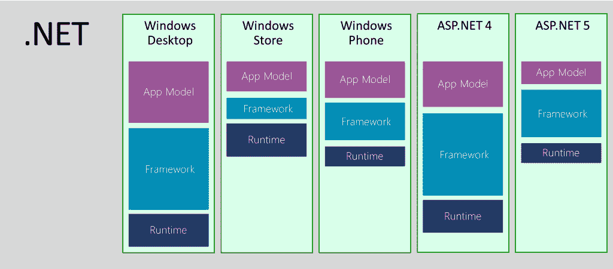
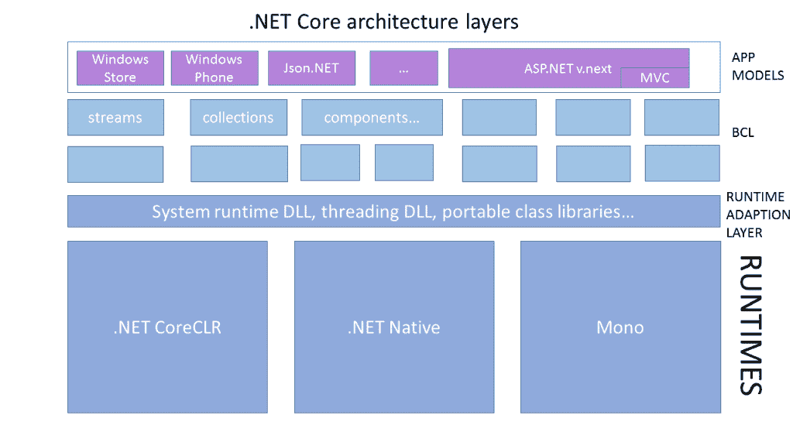

# 为什么您应该关注新的开源软件。网络核心

> 原文：<https://thenewstack.io/why-you-should-care-about-the-new-open-source-net-core/>

开源。NET 跨平台意味着转向微软可以敏捷开发的模块化设计；这意味着一个更好的. NET。但理解这种变化意味着思考新技术及其背后的策略。

## **为什么我们需要。NET Core 和你从中得到的东西**

第一部电影上映已经十二年了。NET 框架，开发人员已经结束了多个，支离破碎的版本。NET 用于不同的平台。从。NET Compact Framework 到 Silverlight、Windows Phone 和 Windows Store 应用程序，每次微软都采取。NET 到一个新的平台，所谓的“公共”语言运行时以不同的子集告终:每次都有不同的运行时、框架和应用程序模型，在每一层都进行了不同的开发，API 回到了一个公共的代码库，但并不总是保持公共的。

【T2

微软可以与开发人员讨论通用技能，并能够重用你所知道的东西，但碎片化是现实，伴随着一定程度的困惑和沮丧。

是的，不同的平台总是会有不同的特性和功能，但是。NET 开源并扩展到微软控制的平台之外，获得一个公共核心而不是一组松散耦合的子集变得更加重要。这是……NET Core 和微软的。NET 开源策略。

微软以前尝试过解决这个问题，使用可移植类库和共享项目(让你至少可以为你的多个。NET 版本放在一起，尽可能地共享)，然后是通用应用程序(它也组织您的共享代码，以便更容易地添加您的每个平台的代码)。

两者都基于契约的概念，涵盖了单一的、明确定义的领域。NET APIs，并且必须在一个平台上完全受支持(或者根本不受支持)。令人困惑的是，这些是在 Windows 8 时间框架内引入的，但它们与 WinRT 应用程序用来访问文件选择器或共享的合同不同。它们是抽象 API 的一种方式，因此您可以像对每个平台一样使用它们。

编写一些只使用通用应用程序可用的 API 的东西，它将(理论上)在 Windows 和 Windows Phone 上运行，并(最终)在 Xbox One 上运行。你可以使用相同的共享项目或通用应用程序，重用 Xamarin Studio 中的通用代码，并将其与一个可以在 iOS、Android 和 Mac OS X 等其他平台上工作的用户界面包装在一起，以获得一个跨平台。NET app。但是在每种情况下，这些 API 的实现都是不同的。还有，通用应用不覆盖 Windows Server。

这并不是说你希望手机或平板电脑应用程序运行在你更关心 ASP.NET 的服务器上，但这是一个很好的例子，说明了如何划分。网络故事在实践中。如果你在工作。NET 用于桌面或移动应用程序，在 ASP.NET 用于服务器后端，能够拥有跨所有这些不同的组件。NET 平台使它成为一个更有吸引力的开发环境。

## 敏捷、模块化、开放

可移植类库和通用应用程序试图解决的问题不仅仅是。NET 跨平台；事实是它从未被设计成模块化的。
的核心。NET Framework 是 mscorlib，它具有特定于 Windows 的功能(如远程处理和 AppDomains)。这意味着每一次。NET 走向一个新的平台，它需要一个新的内核。

加上这样一个事实。NET 是由不同的团队构建和维护的，有自己的版本，在不同的时间发布，你会有很多分歧(你可以批评微软，但这是生活的现实)。

可移植类库开始将平台更紧密地结合在一起，但是使用不同的代码库，同样的事情会被实现多次。

这无助于解决不同版本之间的兼容性问题。NET 在同一个平台上——或者更经常地，顺便说一下。NET 应用程序可以与各种版本的框架一起工作。向现有类型添加接口可能会导致问题，因为应用程序可能无法获得它期望获得的接口。向现有方法添加重载可能会给不是为选择正确方法而设计的代码带来问题——因为在只有一个方法的情况下，不必选择正确方法。

这不仅仅意味着应用程序必须安装正确版本的框架。这些向后兼容性要求冻结了新版本。这意味着微软必须专注于经过全面测试的大爆炸版本。作为伊莫·兰德维尔特。NET 团队在第九频道的视频中解释说，他们不仅要花很长时间来发布，而且很少有机会获得测试版的反馈。这是因为当他们有足够的信心让开发人员测试它时,“它是如此的封闭，如此的接近发布，以至于我们只能真正解决超级有影响力的错误；就设计变更而言，公众第一次了解到细节的时候，提供严肃的反馈已经太晚了。”

在那种情况下，你能得到的唯一真实的反馈是关于你已经发布的代码，因为那是客户正在使用的；你不能得到关于你现在正在写的代码的反馈，因为你的客户都没有反馈——所以你永远也不会在反馈对获得正确的特性最有帮助的时候得到反馈，只有在它被锁定的时候。

几年前，NET 团队开始在 NuGet 上“带外”发布一些库，而不是作为框架的一部分，并取得了巨大的成功。对于不可变集合库，他说“它已经测试了八个月，我们确实根据客户的反馈对 API 进行了修改。我们最终以稳定版本发布的设计比我们以传统方式发布的要好得多。”

此外，开发人员可以调用他们想要的库版本，而不必保留他们自己的代码副本(旧版本永远保留在 NuGet 上)，每个应用程序都可以获得它需要的库版本。

不能分手。NET 框架本身就是这样的。所以当你使用。NET 原生通过编译做一个 Windows Store app。NET 代码和编译器[将框架与你的应用程序](http://channel9.msdn.com/Shows/Going+Deep/Inside-NET-Native)合并，并移除你的应用程序不需要的框架部分，有一些框架部分它不需要但不能移除。。NET Framework 的模块化程度不足以满足这一需求，也不足以满足 ASP.NET 5(它被设计成一个足够小和简单的堆栈，可以由 web 开发人员 XCOPY 到服务器上，而不是由 IT 团队部署)。

## 的。网络核心堆栈

进入。网芯。想要建造的组合。NET 以一种更敏捷、模块化的方式来实现，并且不希望在可以编写一次的情况下多次实现相同的东西，这解释了为什么。NET 核心堆栈看起来就是这样。

基于微软所说的。NET Core，下面是各层如何组合在一起

有新的运行时 CoreCLR 这包括即时编译器、VM、类型系统、垃圾收集和其他运行时组件。这与 Mono 运行时或。NET 本机运行时。

在此之上是基础类库和框架:流、组件、反射、网络——加上来自 NuGet 的库，就像不可变的集合。最重要的是应用程序模型，如 ASP.NET，它启动 CoreCLR 并添加动态编译和 NuGet 解析等功能。

这听起来可能很像。NET Framework 体系结构，但在运行时和库之间有一个薄层，它通过一个公共接口公开了库期望从运行时获得的内容，如对象、字符串和委托。的。NET Core CoreCLR 和。NET 本地运行时的实现非常不同，但是因为这个运行时抽象层提供了一个公共接口，所以您不必关心这个。

为了得到栈，你得到 NuGet 包；一个运行时包，一个库包，等等。有些包会说它们提供了运行时，并为 CoreCLR 和 for 提供了不同的实现。网原生。像 Json.NET 这样的框架可以位于栈顶，与 ASP.NET 处于同一级别，并根据程序集和包来描述它需要什么，而不关心它是否会运行。网芯还是。网原生。

可移植类库位于运行时抽象层；不像当前的 PCL 有一组固定的 API，你可以下载添加了额外 API 的新版本的库。“你不会因为被限制在所有平台的最小公分母上而痛苦，”Landwerth 指出。但是当你想使用新的特性时，比如支持一个长的文件路径，你可以通过调用一个新的包来实现，而不用改变它下面的栈的其余部分。

微软可以停止构建多个运行时和多个版本的基础类库。“BLC 变成了一个单独的 BCL，这是我们在 GitHub 上的东西，这些库会自然地浮在运行时之上，”他解释道。“我们摆脱了不得不进行特例运行时的业务。不仅没有重复的版本，而且您将拥有一个代表某些东西的包。所以当我引用 SystemCollections.DLL 这个包时，我得到了一个可以在我所有的栈上工作的版本；不仅仅是微软，还有 iOS 和 Android，还有 Mono。”

开发者可以选择他们想要的更新程度，或者稳定程度。Landwerth 描述了这些选择，从你自己从 GitHub 上下载代码。“第一层是开源；你可以不跟我们商量就在本地建造。下一层是你提交一个拉取请求，它就会被应用。”的。NET 团队已经接受了 100 多个拉请求，其中 40 多个来自社区。

"下一层是我们将这些代码变更作为 NuGet 包发布，并做一些测试."但是这些库是单独测试的。“如果你有 15 个，它们可能无法很好地一起播放，所以下一层是我们测试该集，这是我们与 Visual Studio 一起提供的集，与今天发生的情况相同。”他预测，这些更新将继续每年发布四次。

这个想法是给开发者选择。“你不能为了移动最慢的目标的利益而牺牲自己敏捷和快速的能力。然而，您仍然保留了最慢的目标的质量；这只是意味着它有些落后。这里有一个创新的滑动窗口，这里正在发生稳定的事情。”对于已经使用开源项目的开发人员来说，这是一个非常熟悉的模型。NuGet 上的. NET 库已经开始引入。NET 开发人员。如果您不想这样工作，您可以继续使用。NET 框架。

但是如果一些开发者继续使用。NET 框架，为什么要介绍。网芯呢？这一切都与[跨平台机遇](https://thenewstack.io/?p=191927)有关。

<svg xmlns:xlink="http://www.w3.org/1999/xlink" viewBox="0 0 68 31" version="1.1"><title>Group</title> <desc>Created with Sketch.</desc></svg>