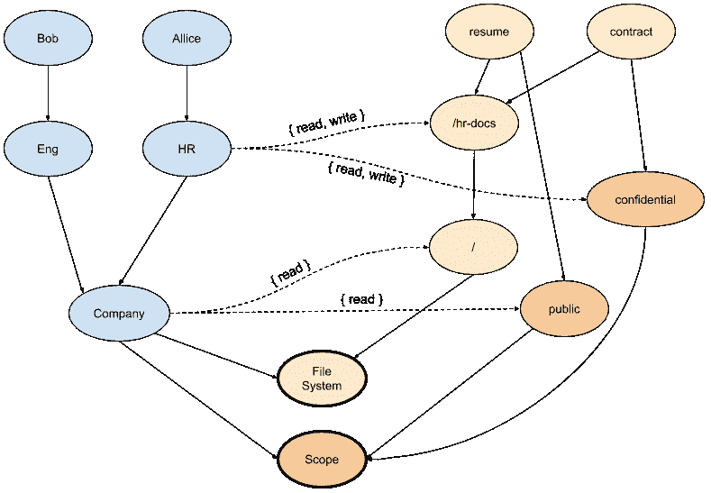
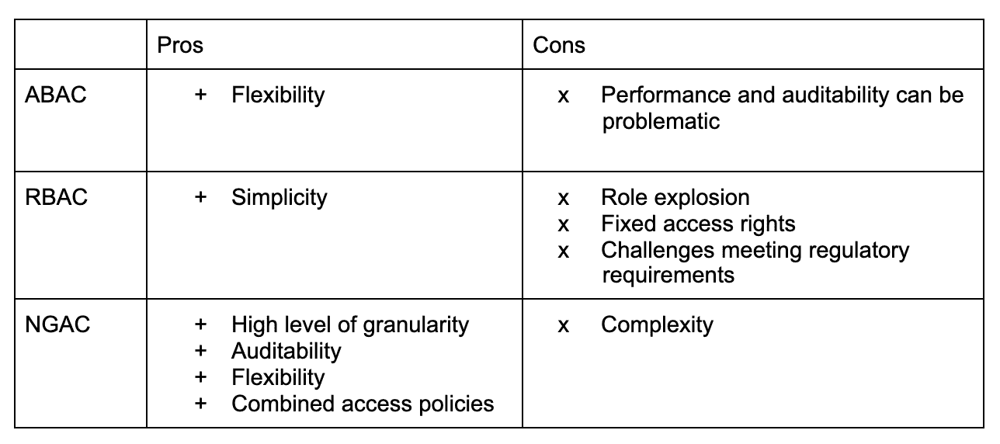

# 为什么您应该选择 NGAC 作为您的访问控制模型

> 原文：<https://thenewstack.io/why-you-should-choose-ngac-as-your-access-control-model/>

[](https://www.linkedin.com/in/jimmysongio/)

 [吉米·宋

Jimmy 是 Tetrate 的开发者倡导者，CNCF 大使，ServiceMesher 和 Cloud Native Community(中国)的联合创始人。他主要关注 Kubernetes、Istio 和云原生架构。](https://www.linkedin.com/in/jimmysongio/) [](https://www.linkedin.com/in/jimmysongio/)

不同的公司或软件提供商设计了无数种方法来控制用户对功能或资源的访问，如自主访问控制(DAC)、强制访问控制(MAC)、基于角色的访问控制(RBAC)和基于属性的访问控制(ABAC)。本质上，无论访问控制模型的类型如何，都可以抽象出三个基本元素:用户、系统/应用程序和策略。

在本文中，我们将介绍 ABAC、RBAC 和一种新的访问控制模型—下一代访问控制(NGAC) —并比较三者之间的异同，以及为什么您应该考虑 NGAC。

## 什么是 RBAC？

 [伊格纳西·巴雷拉

Ignasi 是 Tetrate 的创始工程师，也是 Apache 软件基金会的成员。](https://www.linkedin.com/in/ignasibarrera/) 

RBAC，即基于角色的访问控制，采用一种基于用户在组织中的角色授予(或拒绝)用户访问资源的方法。每个角色都被分配了一组权限和限制，这很好，因为您不需要跟踪每个系统用户及其属性。您只需要更新适当的角色、将角色分配给用户或删除分配。但是这可能很难管理和扩展。使用 RBAC 静态基于角色模型的企业经历了角色爆炸:大公司可能有数万个相似但不同的角色或用户，他们的角色会随着时间的推移而改变，这使得跟踪角色或审计不必要的权限变得很困难。RBAC 拥有固定的访问权限，不提供短暂的权限，也不考虑位置、时间或设备等属性。使用 RBAC 的企业难以满足复杂的访问控制要求，也难以满足其他组织需求的法规要求。

### RBAC 的例子

下面是 Kubernetes 中“默认”名称空间中的一个角色示例，可用于授予对 pod 的读取权限:

```
apiVersion:  rbac.authorization.k8s.io/v1
kind:  Role
metadata:
  namespace:  default
  name:  pod-reader
rules:
-  apiGroups:  ["v1"]
  resources:  ["pods"]
  verbs:  ["get",  "watch",  "list"]

```

## 什么是 ABAC？

ABAC 代表基于属性的访问控制。在高层次上， [NIST 将](https://www.nist.gov/publications/guide-attribute-based-access-control-abac-definition-and-considerations-1) ABAC 定义为一种访问控制方法，“根据主体的指定属性、环境条件以及根据这些属性和条件指定的一组策略，允许或拒绝主体对对象执行操作的请求。”ABAC 是一个细粒度的模型，因为您可以为用户分配任何属性，但同时它也成为一个负担，难以管理:

1.  定义权限时，用户和对象之间的关系无法可视化。
2.  如果规则有点复杂或设计混乱，管理员维护和跟踪会很麻烦。

当有大量权限需要处理时，这可能会导致性能问题。

### ABAC 的例子

Kubernetes 最初使用 ABAC 作为访问控制，并通过 JSON 线路进行配置，例如:

Alice 只能读取命名空间“foo”中的 pod:

```
  {"apiVersion":  "abac.authorization.kubernetes.io/v1beta1",  "kind":  "Policy",  "spec":  {"user":  "alice",  "namespace":  "foo",  "resource":  "pods",  "readonly":  true}}

```

## 什么是 NGAC？

NGAC，即下一代访问控制，采用将访问决策数据建模为图形的方法。NGAC 支持系统的、策略一致的访问控制方法，以高粒度级别授予或拒绝用户管理能力。NGAC 由 [NIST](https://www.nist.gov/) (美国国家标准技术研究院)研制，目前用于 [Tetrate Q](https://www.tetrate.io/blog/introducing-tetrate-q/) 和 [Tetrate Service Bridge](https://www.tetrate.io/tetrate-service-bridge/) 。

实体有几种类型；它们代表您想要保护的资源、它们之间的关系以及与系统交互的参与者。这些实体是:

1.  用户
2.  目标
3.  用户属性，如组织单位
4.  对象属性，如文件夹
5.  策略类，如文件系统访问、位置和时间

NIST 的 David Ferraiolo 和 [Tetrate](https://www.tetrate.io/?utm_content=inline-mention) 的 Ignasi Barrera 在 2019 年旧金山服务网格日的[演示上分享了 NGAC 如何工作。](https://www.tetrate.io/blog/unpacking-next-generation-access-control-ngac-and-tetrate-q/)

NGAC 基于这样一个假设，即你可以用一个图形来表示你想要保护的系统，这个图形以一种对你有意义并且符合你的组织语义的方式来表示你想要保护的资源和你的组织结构。在这个对您的组织非常特殊的模型之上，您可以覆盖策略。在资源模型和用户模型之间，定义了权限。这样，NGAC 提供了一种优雅的方式来表示您想要保护的资源、系统中的不同参与者，以及这两个世界如何通过权限联系在一起。

### NGAC 的例子

以下示例显示了一个简单的 NGAC 图，其中一个用户 DAG 表示组织结构，一个对象 DAG 表示文件系统中的文件和文件夹，一个文件分类，以及两个不同的策略(文件系统和范围),这两个策略可以结合起来做出访问决策。两个 Dag 之间的关联边定义了参与者对目标资源拥有的权限。



在此图中，我们可以看到“/hr-docs”文件夹中的两个文件“简历”和“合同”，每个文件都链接到一个类别(“公开/机密”)。还有两个策略类，“文件系统”和“范围”，图中的对象附加在这两个策略类上，需要满足这两个策略类才能访问每个文件。

在示例中，用户 Allice 对这两个文件都具有读写权限，因为路径将 Allice 链接到每个文件，并且这些路径授予对这两个策略类的权限。但是，用户 Bob 只能访问“resume”文件，因为尽管存在从 Bob 到满足具有“读取”权限的“文件系统”策略类的“合同”文件的路径，但是没有授予“范围”策略类权限的路径。因此，Bob 无法访问“合同”文件。

## 为什么选择 NGAC？

在 ABAC 的情况下，跟踪所有对象的属性的需要造成了管理负担。RBAC 减轻了负担，因为我们提取了角色的所有访问信息，但这种范式存在角色爆炸问题，而且可能变得难以管理。有了 NGAC，我们在图表中有了我们需要的一切——以一种紧凑、集中的方式。

当访问决策非常复杂时，ABAC 的处理时间会呈指数级增长。RBAC 变得特别难以大规模管理，而 NGAC 则是线性扩展。

NGAC 真正的闪光点在于灵活性。不仅可以根据对象属性，还可以根据其他条件(时间、位置、月相等)来配置允许或禁止访问。

NGAC 的其他主要优势包括能够一致地设置策略(以满足合规性要求)和设置短期策略。例如，NGAC 可以授权开发人员在停机期间一次性访问资源，而不会留下不必要的权限，以免日后导致安全漏洞。NGAC 可以在单个访问决策中评估和组合多个策略，同时保持其线性时间复杂度。

## 摘要

下表从几个方面对 ABAC、RBAC 和 NGAC 进行了比较。

[](https://cdn.thenewstack.io/media/2021/02/47409303-screen-shot-2021-02-18-at-7.00.55-am.png)

总之:

*   RBAC 更简单，性能也很好，但是规模太大了。
*   ABAC 很灵活，但是性能和可审计性是个问题。
*   NGAC 通过使用一种新颖、优雅的革命性方法来弥补这些差距:在用户提供的现有世界表示之上覆盖访问策略。你也可以模仿 RBAC 和 ABAC 的政策。

## 参考

通过 Pixabay 的特征图像。

<svg xmlns:xlink="http://www.w3.org/1999/xlink" viewBox="0 0 68 31" version="1.1"><title>Group</title> <desc>Created with Sketch.</desc></svg>