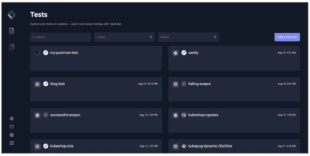

# 为什么您应该开始以云原生方式进行测试

> 原文：<https://thenewstack.io/cloud-native/why-you-should-start-testing-in-the-cloud-native-way/>

几年前，云原生测试工具的想法似乎很疯狂。

 [布鲁诺·洛佩斯

Bruno 是一名产品经理，他一直从事云生态系统方面的工作，是一名授权研究员、全栈开发人员，在过去几年中，他还担任 Kubeshop 的产品经理。](https://pt.linkedin.com/in/bruno-lopes-a73b48103) 

当已经有那么多优秀的产品可以用于每一个可以想象的测试场景时，为什么还需要特定的工具呢？然后出现了 Kubernetes，它永远地改变了这项运动——难道我们不高兴吗？

如今，当我们努力应对复杂的微服务架构和在分布式云基础设施中运行的孤立服务(通常由位于全球偏远地区的团队管理)时，测试我们的系统变得更加困难。这就是为什么我和我在 [TestKube](https://testkube.kubeshop.io/) 的工程师同事们正在倾注我们的精力来改善云原生测试空间。

## 是什么让测试工具成为云本地的？

云原生测试工具是专门为云原生环境开发的。最重要的是，它们允许您在集群中部署测试，执行是超级可伸缩的，并且它们不耦合到任何 CI/CD 框架，如 Jenkins、GitHub Actions 等。

您将能够执行您的测试，查看结果，并管理整个端到端的测试流程，而无需进入您的 CI/CD。

我喜欢把云原生测试工具想象成把你的集群变成一辆现代汽车。现代汽车会对自身进行诊断测试，以向驾驶员显示问题所在。为什么不让您的集群也这样做呢？

### 为什么我应该以云原生方式开始测试？

有了所有可用的优秀测试工具，从 Postman 到 Cypress，以及介于两者之间的任何工具，您可能会想，“我只是将它们改进到我的用例中。”这绝对没问题！事实上，很多人只是在非常简单的场景中这样做。然而，当您迁移到云原生测试时，有许多繁重的工作要做。

## **从你的 CI/CD 中分离测试工具**

大多数实现都将测试活动与其 CI/CD 管道紧密地结合在一起，这增加了很多复杂性，也降低了灵活性。这里有一些迹象告诉您，您可能想要重新思考您设计 CI/CD 管道的方式，通过分离测试活动来更加敏捷:

*   如果您需要重新运行您的整个测试套件，甚至您的整个 CI/CD 工作流，而只有一个测试运行就足够了。这意味着你有太多的耦合。
*   您不能跨多个 CI/CD 工具和工作流重用测试管道
*   当插入 CI/CD 工作流时，不同测试工具的执行和报告不一致

让您的测试成为本地云意味着他们不再依赖 CI/CD 系统来进行编排。如果您希望或者需要，您的 CI/CD 能够并且将能够触发您的测试，但是它应该不再是绝对必要的。

### **扩展您的测试**

云原生测试在扩展方面非常出色——通常使用 Kubernetes 来扩展执行，不像 CI/CD 工具，当您有许多并发测试想要执行时，CI/CD 工具不具有可扩展性。

### **不再需要编写脚本或添加样板代码**

在您当前的设置中，对于您想要添加到您的测试工作流中的每一个测试工具，很有可能有大量的脚本、样板代码或一些复杂的配置，您必须做这些来自动化您的测试，并使它们成为您的 CI/CD 工作流的一部分。有了云原生测试，复杂性降低了几个数量级。它们应该无缝地运行在云中，而不需要额外的工作。

## 使用 Testkube 进行云本地测试

考虑到测试的所有挑战，我们决定构建 [Testkube](https://testkube.kubeshop.io/) ，目标是让所有类型的测试都在云上进行。它的一个基本原则是，通过去除与测试自动化和集成相关的复杂性，我们直接领导团队做更好的测试。

除了将 CI/CD 从您的测试中分离、扩展和消除对定制配置的需求之外，在您的集群中运行 Testkube 之类的测试框架还有一些额外的优势，即消除了对您的测试进行容器化的需求，并避免了对您想要测试的环境进行受限访问的问题。

### **标准化报告**

当您在拥有无数不同类型的组件和服务的全球团队中工作时，始终如一地跟踪 QA 和测试通过率/失败率是非常重要的。毕竟，没有标杆，你怎么能衡量成功呢？TestKube 就是这么做的。因为它知道所有测试和结果的定义，所以您可以使用它作为一个集中的地方来监控您的测试的通过率/失败率。此外，它定义了一个通用的结果格式，因此您可以在所有类型的测试中获得一致的结果报告和分析。

### **集装箱测试**

如果您在云中以一种非无服务器的方式运行您的应用程序，并且不使用虚拟机，我敢打赌您可能在这一点上使用容器，并且您可能已经面临了将所有测试活动容器化的挑战。对于 Testkube 中的云原生测试，这是不必要的。您可以将您的测试文件导入 Testkube，并开箱运行它们。

### **管理对受限环境的访问**

限制进入我们需要测试或修补的环境，是我们大多数人在职业生涯的某个阶段都会面临的问题。这并不一定意味着这些环境的管理员不信任您，但是对于有可能发生数据泄漏或影响业务的灾难的环境，最好不要冒险，防止这种情况发生。因此，最好的方法就是在这些环境中公开 Testkube API，并使用它来管理您的测试活动，而不需要您拥有相同的访问权限。

## 去试驾

有许多优秀的测试库/工具可以无缝集成到 Testkube 中，比如 [Postman](https://kubeshop.github.io/testkube/executor-postman/) 、 [Cypress](https://kubeshop.io/blog/end-to-end-tests-of-your-kubernetes-applications-with-cypress) 、 [k6](https://kubeshop.io/blog/load-testing-in-kubernetes-with-k6-and-testkube) 、 [soapUI](https://kubeshop.io/blog/run-kubernetes-tests-with-soapui-and-testkube) 等等。正如您所收集的，这些都是非常棒的工具，但是当您使用 Testkube 以一种简单的云本地方式运行它们时，它们会变得更好。

运行 Testkube 的集群能够在不需要复杂 CI/CD 的情况下进行自我测试。它允许您拥有所有测试和集群状态的整体视图。

如果您发现云原生测试也能让您受益，那么您应该尝试一下 TestKube，让我们知道您的想法以及我们如何才能让它变得更好？我们有一个[很棒的现场演示](https://demo.testkube.io)你可以摆弄一下。你可以[轻松安装](https://testkube.kubeshop.io/download)或者在 [GitHub](https://github.com/kubeshop/testkube) 上查看我们的回购，给我们一颗星，毕竟我们是开源的！

如果你想要任何信息，或者只是来打声招呼——加入我们的 [Discord 服务器](https://discord.gg/hfq44wtR6Q)并在 Twitter @Testkube_io 上关注我们，或者直接给我发电子邮件 [bruno@kubeshop.io](mailto:bruno@kubeshop.io) 。我们期待着您的回复！

<svg xmlns:xlink="http://www.w3.org/1999/xlink" viewBox="0 0 68 31" version="1.1"><title>Group</title> <desc>Created with Sketch.</desc></svg>