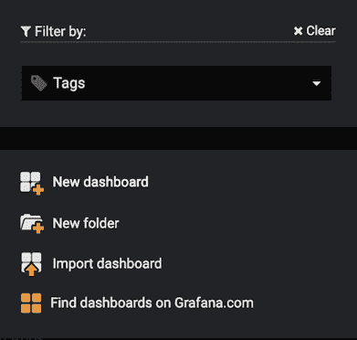
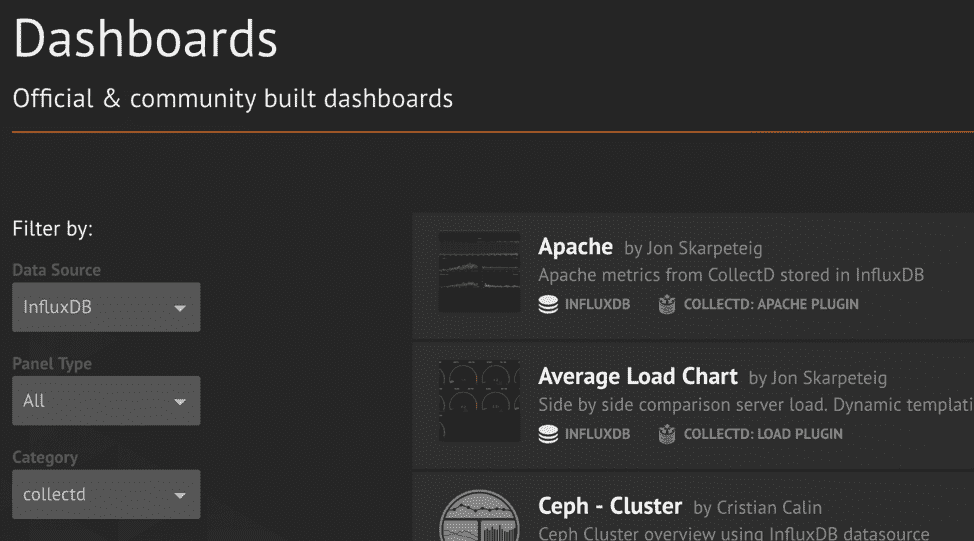

# 为什么您想要易于安装的 Grafana 仪表盘

> 原文：<https://thenewstack.io/why-you-want-easy-to-setup-grafana-dashboards/>

 [克里斯·丘里洛

克里斯·丘里洛在 InfluxData 负责技术产品营销。在 iPass 担任产品管理副总裁后，她曾在 Centroid 定义和设计了一个 SaaS 监控解决方案。她还担任过多个云服务的业务线角色，这些云服务要求她跟踪运营指标和分析，以帮助识别和解决系统问题。](https://www.influxdata.com/) 

采用 Grafana 仪表盘的理由有很多。

此外，Grafana 仪表板是洞察时间序列数据的优秀工具。此外，Grafana 易于与 InfluxDB 和 Telegraf 集成，使传感器、系统和网络指标的监控变得更加容易和更加深入。

设置 Grafana 仪表板并将其与各种数据源集成的过程非常简单。Grafana 模板变量使您能够创建动态仪表板，您可以对其进行实时更改。

在本帖中，我们将更详细地介绍设置 Grafana 仪表盘的好处以及相关的简单步骤。

## 什么是 Grafana 仪表板？

Grafana dashboard 是一个强大的开源分析和可视化工具，由排列在网格中的多个独立面板组成。这些面板与已配置的数据源进行交互，包括(但不限于)AWS CloudWatch、Microsoft SQL server、Prometheus、MySQL、InfluxDB 和许多其他数据源。 [Grafana](https://www.influxdata.com/integration/grafana/) 的设计使得每个面板都绑定到一个数据源。因为 Grafana 仪表板支持单个网格中的多个面板，所以您可以同时可视化来自多个数据源的结果。

## Grafana 仪表板的用途

Grafana 仪表板的目的是以一种既高效又有组织的方式将数据集中在一起。它允许用户通过查询、信息可视化和警报更好地了解其数据的指标。Grafana 仪表板不仅为从众多来源收集的数据赋予了深刻的含义，而且您还可以与其他团队成员共享您创建的仪表板，从而允许您一起探索数据。

Grafana 仪表板的另一个关键方面是它们是开源的，这允许更多的定制和功能，这取决于您对编码的熟悉程度。然而，您不需要丰富的编码知识来创建自己的全功能 Grafana 仪表板。

## 如何设置 Grafana 仪表板

设置 Grafana 仪表板非常容易。首先，通过单击位于仪表板选取器右侧的仪表板链接，创建一个新的空白 Grafana 仪表板。

创建新的仪表板。

仪表板包含面板，所以现在您有了一个空白的仪表板，下一步是添加您的第一个面板。请注意，Grafana 附带了各种面板来帮助您快速入门。您可以将 Grafana 面板视为可视化构建模块。

通过位于菜单顶部的添加面板图标添加面板。除非某种类型的图形与面板相关联，否则面板不是很有用。图表依赖于数据，因此您添加到仪表板的每个面板都将与一个数据源相关联。为了从面板数据源中检索信息，您需要创建一个查询。

通过编辑出现在新面板上的图表来设置查询。点击图表标题，然后点击编辑。这将打开 Metrics 选项卡，您将看到一个查询编辑器。这个易于使用的查询编辑器允许您基于面板的数据源构建查询。Grafana 将获取查询结果，并提供结果指标的可视化。请注意，查询编辑器将允许您为数据构建多个查询，从而支持多个系列的图形。

在 Metrics 选项卡中，您还可以更改图形样式、对指标组应用函数、设置可视化的自动刷新率以及调整时间范围控件和缩放等属性。图形可以包括条、线、点和多个 Y 轴。Grafana 提供智能 Y 轴格式、轴标签、网格阈值和注释。

一旦创建了所需的面板，构建仪表板就变成了一个简单的拖放过程。将面板拖到仪表板网格上，并放在您希望它们出现的位置。然后，根据需要调整它们的大小。

如果您不愿意从头开始使用自己的 [Grafana 仪表盘](https://www.influxdata.com/integration/grafana/)或者不知道如何设置 Grafana 仪表盘，Grafana 实验室网站上有 Grafana 官方仪表盘示例。事实上，这是你能找到最好的 Grafana 仪表盘的地方。

查找与 InfluxDB 一起使用的 Grafana 仪表板。

这些 Grafana 仪表板示例可以根据所使用的收集器进行过滤。这些收藏者包括 Beats、Icinga、Snap 和 Telegraf。

您还可以根据面板类型过滤这些示例。文本、表格、趋势框、信号器、boom 表、面包屑和警报框只是 Grafana 仪表板示例中众多面板类型中的几个。如果连接到数据源是您的主要关注点，您还可以通过数据源过滤可用的仪表板示例。这使您可以看到 Grafana dashboard 示例，例如 AWS CloudWatch、Amazon Timestream、Prometheus、Elasticsearch、InfluxDB 和许多其他来源。

## Grafana 仪表板模板

Grafana 仪表板模板用于使您的仪表板更具交互性。简而言之，您创建的仪表板模板变量几乎可以在 Grafana 仪表板的任何地方使用。变量的使用允许您对仪表板进行动态、即时的更改。这大大增加了 Grafana 的实用性和功能。

## 结论

Grafana dashboard 是一个强大的数据分析和可视化工具，它集成了存储时间序列数据的各种源，包括数据源 InfluxData。Grafana dashboard 是开源的，提供了大量用户友好的文档。对于 Grafana 的新手，请记住，有些资源可以帮助你找到最好的 Grafana 仪表盘。对于那些对更动态的仪表板感兴趣的人来说，Grafana 仪表板模板将是您的起点。

当 Grafana dashboard 与 InfluxDB 数据源集成时，您可以快速呈现关键指标和事件的定制可视化演示，即使时间跨度很大。当与 InfluxDB 集成时，Grafana 仪表板提供了非常有用的、揭示系统和网络指标的可视化。

如果您需要访问基于时间序列数据的实时分析，InfluxData 是您的平台。如果您想深入研究这些关键数据的含义，那么将 InfluxData 与 Grafana dashboard 相结合是您可以做出的最明智的选择。选择 InfluxData 并创建最好的 [Grafana 仪表盘](https://www.influxdata.com/influxcloud-trial/)。

<svg xmlns:xlink="http://www.w3.org/1999/xlink" viewBox="0 0 68 31" version="1.1"><title>Group</title> <desc>Created with Sketch.</desc></svg>