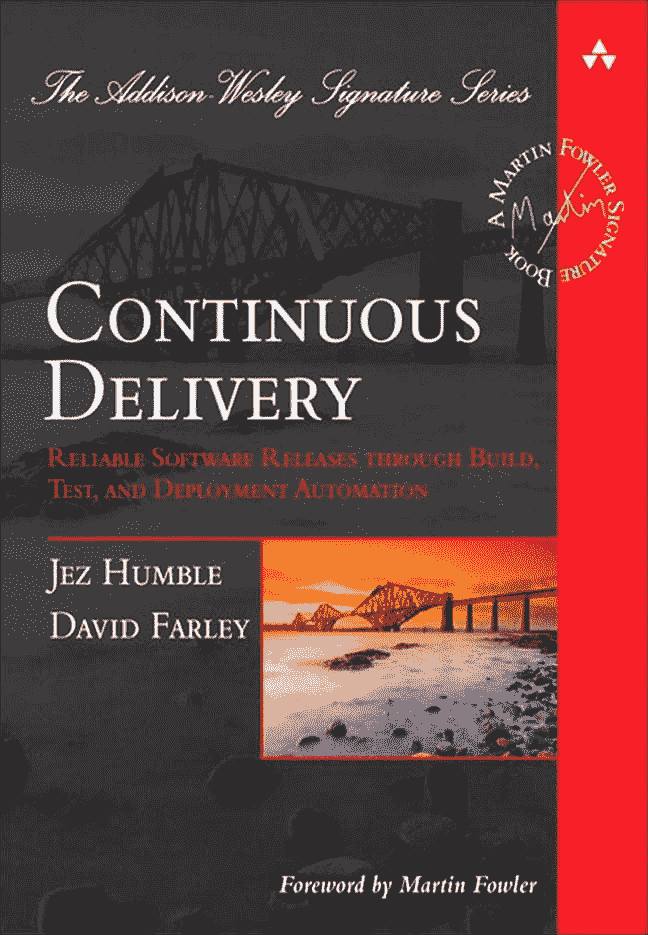

# 为什么你的代码糟糕:糟糕编程的常见借口

> 原文：<https://thenewstack.io/why-your-code-sucks-common-excuses-for-bad-programming/>

戴夫·法利(Dave Farley)是一名软件工程师/作家/顾问，同时也是 2010 年出版的《持续交付 》一书的合著者。在科技行业工作了几十年后，法利最近在 YouTube 上分享了他的“对软件开发人员工作表现不佳的七个常见借口的探索”

这是一个令人信服的陈述，法利平静地表达了他强烈的观点。他首先指出，平面地球的支持者被排除在严肃的科学讨论之外，并补充说“我认为瀑布开发是软件开发的平面地球思维。

“这是行不通的，它试图以相当幼稚的方式解决一些问题，而忽略了其他问题。”

法利承认这是他的观点——尽管有一些瀑布项目成功的数据支持,“在效率、质量和成功的基本衡量标准方面，比如‘它是否交付了人们真正想要的东西？’"

不久之后，很明显有一个明确无误的主题贯穿了 Farley 的视频:他对[持续集成、持续交付](https://thenewstack.io/three-ways-ci-cd-adoption-can-benefit-your-devops-team/)和[测试驱动开发](https://thenewstack.io/a-next-step-beyond-test-driven-development/)的力量的信念。法利一开始就认为，这些瀑布替代方案“具有破坏性和挑战性——但它们效果更好。”

那么，如果这些方法学工作得更好，那么开发人员用什么借口来解释他们为什么不实现它们呢？

## 合并和经理

首先，有一个开发人员的借口#1: **“没有特性分支，你就不能做严肃的工作。”**

是的，特性分支包括临时分叉代码，以便开发人员可以在他们自己的独立竖井中优化新特性。但是法利嘲笑这样一种观点，即“彼此独立变化的两份数据，分开的时间越长，就越容易合并在一起……”

相反，持续集成方法带来了对更大代码库的冲突的定期和持续检查，Farley 认为有证据表明这比替代方案更好。具体来说，Farley 引用了 Google 的 DevOps 报告中的数据，该报告称“当你使用分支功能时，你会更慢地创建更差的软件——或者至少当你的分支功能持续时间超过一天时。”

法利接着转向另一个为跳过测试、重构甚至优先考虑好的设计而制造的常见借口:“我的经理说我没时间做这些。”

法利承认，“我们中的任何一个人最终都有可能为一个愚蠢的经理工作。但尽管我承认这有时可能是一个令人讨厌的系统性问题，但我认为这总是错误的回应——试图将责任推卸给其他人。”

因为，简而言之:“我们软件开发者是这个决定的同谋。”法利有一套理论来解释为什么会这样。他压低声音尖锐地说，“我们中的一些人真的不太喜欢测试。而不是真的想去做做好设计和重构的苦差事。所以我们把责任推给其他人——经理……”

另一个原因是缺乏对测试和良好设计将加速开发的信心。但是法利认为“你现在通过关注工作质量来换取少得多的工作。通过这样做，您可以显著减少以后处理错误或低质量代码的工作量。”

那个经理呢？“允许我们做好工作不是别人的责任。”

## 如何提高

该视频是 [GOTO conferences](https://www.youtube.com/@GOTO-) 的 YouTube 频道计划每月系列的第一个，将展示“关于持续交付、开发运维、测试驱动开发、行为驱动开发、软件工程和一般软件开发的想法”

Farley 显然很喜欢就如何提高你的编程技能发表意见。根据[12 月的博客帖子](https://www.davefarley.net/?p=370)，他最近还在 Patreon 上为他的支持者推出了现代软件工程师指南。Farley 称之为“一种我认为在软件开发中起作用的精选指南”,以一种允许搜索和探索的格式。

因此，随着视频的继续，开发人员的借口开始成为传递 Farley 自己对最佳实践的想法的方便的陪衬。例如，借口 3: **“编写测试是浪费时间。”Farley 承认写测试“显然更像是打字。但如果你真的用你输入的字符数来衡量你的工作，那你就错了。”**

但是 Farley 接着指出，除了简单地快速捕获 bug 之外，还有其他优势，因为[测试驱动开发](https://thenewstack.io/how-ai-is-driving-a-new-era-of-test-automation/)也改变了代码的结构。“可测试代码更加模块化，更具内聚性，并具有更好的关注点分离”——最终使管理代码库的复杂性变得更加容易。

在这个过程中，一些借口被证明比其他的更容易被揭穿。对于那些坚持“我们一直都是这样做的，而且对我们很有效”的人，法利有现成的回应。

“嗯，那很好——但是你难道不想做得更好吗？如果我们从不质疑我们的方法和实践，那么我们就永远不会进步。”

Farley 也准备好解决“你不能用持续集成进行代码审查”的神话法利的回应？“是的，你可以。当然可以。“拉请求并不是进行代码审查的唯一方式。”

但是 Farley 在他对作为一种代码审查形式的拉请求的评论中走得更远。在一个组织内部，“把关人的提交是缓慢而低效的，更重要的是，它并没有真正教会人们如何做得更好。”

Farley 认为，结对编程是一个更好的解决方案，有很多优点——不仅仅是提供了一种更好的审查代码的方式。他称赞结对编程让即使是初级团队成员也能仔细思考变化的方式——以及当他们做出这些变化的时候。“这是一种更好的方式来学习如何为他们的变化负责，以及做高质量工作的重要性。”

当然，法利接着引用了更多的数据来证实结对编程的有效性。

[https://www.youtube.com/embed/ZobVQ_J7HtI?feature=oembed](https://www.youtube.com/embed/ZobVQ_J7HtI?feature=oembed)

视频

* * *

# WebReduce

<svg xmlns:xlink="http://www.w3.org/1999/xlink" viewBox="0 0 68 31" version="1.1"><title>Group</title> <desc>Created with Sketch.</desc></svg>