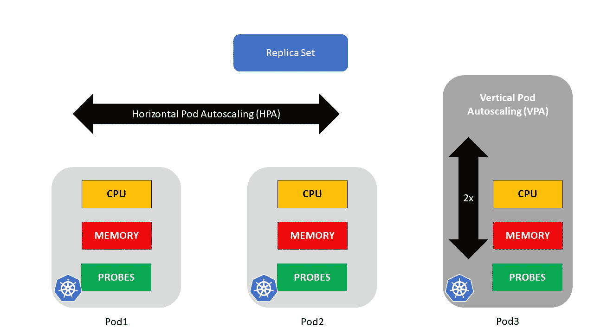
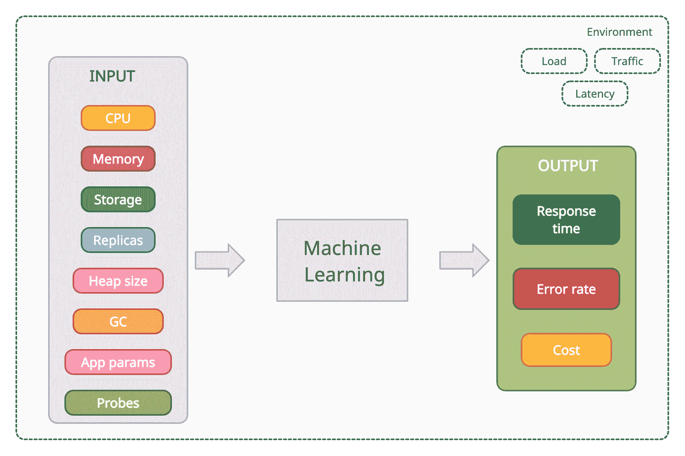

# 为什么你的 Kubernetes 船没有机器学习就沉了

> 原文：<https://thenewstack.io/why-your-kubernetes-ship-is-sunk-without-machine-learning/>

随着基于面向服务的架构(SOA)的容器化服务的兴起，对像 Kubernetes 这样的编排软件的需求正在迅速增加。Kubernetes 非常适合大规模系统，但是它的复杂性和缺乏透明性会导致云成本增加、部署延迟和利益相关方的不满。大型企业使用它来纵向和横向扩展其应用程序和底层基础架构，以满足各种负载，这种细粒度控制使 Kubernetes 具有如此强的适应性，但也使其难以有效地进行调优和优化。

Kubernetes 架构在集群内自主做出工作负载分配决策。然而，Kubernetes 本身并不能确保高可用性。它将很容易在只有一个主节点的生产环境中运行。类似地，Kubernetes 也不会有助于成本优化。例如，如果集群中的服务器只有 20%的利用率，它不会发出警报或警告，这可能表明我们在过度配置的基础架构上浪费了资金。

优化我们的 Kubernetes 集群以平衡性能和可靠性与运行这些集群的成本至关重要。在本文中，我们将学习在机器学习(ML)技术的帮助下优化 Kubernetes 的方法。

## Kubernetes 的复杂性使得手动优化毫无用处

默认情况下，Kubernetes 会分配大量的计算和内存资源，以防止运行时性能下降和内存不足的错误。但是，使用默认值构建节点集群会导致浪费云成本和集群利用率低下，而且无法确保足够的性能。此外，随着容器数量的增长，要考虑的变量(CPU、RAM、请求、限制和副本)的数量也在增长。

在 K8s 集群中，我们必须配置几个参数，包括下面列出的参数。但是，正如下面几节所示，由于 Kubernetes 的复杂性，手动优化这些参数既耗时又低效。

## CPU 和内存

CPU 定义计算处理资源，而内存定义 pod 可用的内存单元。我们可以为 pod 可以消耗的 CPU 和内存配置一个请求值。如果运行 pod 的节点有可用的资源，那么 pod 可以消耗这些资源，直到达到它们设置的 CPU 和内存限制。

设置 CPU 和内存限制是必不可少的，但是要找到正确的设置来确保效率并不容易。为了优化这些限制，我们需要预测未来的 CPU 和内存需求——这是一个很难计算的问题。然后，要优化这些资源，就要对值进行微调，既繁琐又费时。

## 特定于应用的参数

除了 Kubernetes 的技术组件，比如 CPU 或内存，我们还应该查看特定于应用程序的参数。这些因素包括堆大小、工作线程、数据库连接池和垃圾收集等，因为这些因素也会对有效的资源利用产生重大影响。

### 堆大小

以一个 Java 应用程序为例。配置您的 JVM (Java 虚拟机),包括确定可用内存和堆大小，在规模调整中起着至关重要的作用。性能基准测试，比如针对 [Java 应用](https://learn.microsoft.com/en-us/azure/developer/java/containers/overview)的性能基准测试，显示内存分配为 256 兆字节或 512 兆字节时，仍然有大约 127 兆字节的堆大小。在这个设置中，没有立即分配 512Mb 的理由，因为堆大小保持不变，只有 50%。然而，一旦超过 512Mi，堆的大小也会呈指数级增长。

### 碎片帐集

除了堆大小之外，垃圾收集也是一个必须配置的性能指标。所以知道如何优化也是关键。通常，如果内存大小设置为 off，垃圾收集器的运行效率也会很低。换句话说，JVM 堆的大小调得越好，垃圾收集器的运行就越理想。

### 对系统资源的访问

容器化的应用程序通常可以访问所有系统级的资源，但这并不意味着您的单个 pod 运行时可以最佳地使用它们。运行同一个应用程序的多个线程，而不是将更大的 CPU 或内存值分配给单个容器，这可能是有益的。

### 数据库连接

除了应用程序容器本身，资源性能影响还可能来自其他因素，比如数据库。从单个应用程序容器到数据库的性能可能很好，但当多个 pod 同时连接到数据库时，可能会变得很有挑战性。数据库池在这里可能会有所帮助。

## 探针

使用 [Kubernetes 探测器](https://kubernetes.io/docs/tasks/configure-pod-container/configure-liveness-readiness-startup-probes/)来监控 Kubernetes 环境中容器化应用程序的健康状态。我们可以在 K8s 配置中设置活动、就绪和启动探测器。

### 活性

活性探测器检查应用程序的健康状况。这对于验证应用程序是否仍在运行(死锁)特别有帮助。活性探测器不仅检查容器的运行状态，还试图保证容器内的应用程序启动并运行。pod 可能已经准备好了，但这并不意味着应用程序已经准备好了。最简单的活性探测类型是一个`GET HTTP`请求，它产生一个`HTTP 200-399 RESPONSE`消息。

### 准备就绪

就绪探测器检查应用程序是否准备好接受流量。如果准备就绪探测器处于失败状态，则没有 IP 地址被分发到 pod，并且 pod 被从相应的服务中移除。就绪探测器保证在容器中运行的应用程序 100%准备好可以使用。就绪探测器总是期待一个`HTTP 200 OK RESPONSE`作为反馈，确认应用程序是健康的。

### 启动

启动探测器检查容器应用程序是否已经启动。该探测器是第一个启动的探测器，其他两个探测器将被禁用，直到启动探测器处于成功状态。

### 配置 Kubernetes 探测器

Kubernetes 探头提供了几个可以配置的不同参数。这里的关键是微调探针配置，对活性和就绪状态探针都有效:

*   `timeoutSeconds`表示探头超时的秒数。默认值为一秒钟。如果该参数设置得太低或太高，可能会导致容器或应用程序失败。这可能会导致用户在尝试连接到工作负载时收到错误消息。

*   `periodSeconds`反映了执行探测检查的频率(以秒为单位)。与`timeoutSeconds`参数类似，找到一个准确的设置非常重要。如果您过于频繁地检查，可能会使应用程序的工作负载饱和。如果检查不够频繁，可能会导致应用程序工作负载失败。

*   `failureThreshold`反映失败请求/响应的数量。这里的默认值是三。这意味着，默认情况下，假设`timeoutSeconds`和`periodSeconds`配置了默认值，容器可以在三秒钟后被标记为失败。

*   `initialDelaySeconds`反映了容器成功启动后，探测器开始发出信号的等待状态。缺省值为零，意味着正在运行的容器在成功启动后立即发送探测。

## 水平 Pod 自动缩放(HPA)

水平机架自动缩放通过部署更多机架来扩展工作负载，以满足不断增长的需求。当负载减少时，它会终止一些 pod 以满足减少的需求。

默认情况下，HPA 会根据目标 CPU 利用率进行横向扩展(添加单元)或纵向扩展(删除单元)。或者，我们可以根据内存利用率或自定义的使用指标来配置它。

尽管添加更多的 pod(向外扩展)可能会带来更好的应用程序性能，但情况并非总是如此。正如我们在前面讨论 JVM 堆大小和垃圾收集器调优时看到的，有时添加更多的 pods 并不会提高服务的性能。与已经讨论过的其他规模调整复杂性一样，手动微调容器工作负载的水平扩展可能具有挑战性。

## 垂直窗格自动缩放(VPA)

与水平扩展相反的是垂直扩展，这涉及调整具有较大 CPU 和内存限制的性能不佳的单元的大小，或者降低未充分利用的单元的 CPU 和内存限制。

与合理调整 HPA 的复杂性类似，合理调整 VPA 也面临同样的挑战。工作负载通常是动态的。活动用户的变化、季节性高峰负载、某些集群组件的意外停机等等，都是执行规模调整和调优时需要考虑的因素。因此，我们可以定义 VPA 配置来调整 pod 的 CPU 和内存限制，但是很难确定新的值。

应该注意的是，默认情况下，VPA 不能与 HPA 结合使用，因为两者都根据相同的指标(CPU 目标利用率)进行扩展。

## 复制品

副本表示工作负载所需的相同运行单元的数量。我们可以在 K8s 配置中定义副本的价值。HPA 还可以控制 pod 的副本数量。

很难确定应该为一个单元配置的副本的确切数量，因为如果单元的工作负载发生变化，一些副本可能会变得利用不足。此外，手动更新 pod 配置非常繁琐。

随着集群复杂性的增加，手动配置和微调这些参数变得越来越困难。下图说明了我们可以调整以优化资源使用的不同 Kubernetes 参数。

## 借助机器学习优化 Kubernetes

由于对容器的实际操作行为知之甚少，DevOps 团队很难确定资源的最佳值。我们可以在不同层次的容器资源优化中使用 ML。

我们可以借助最先进的 ML 算法来理解使用模式。通过从像[普罗米修斯](https://prometheus.io/)这样的云监控框架中收集粒度容器数据，学习活动模式并应用复杂的算法来生成最佳结果，ML 可以产生精确的自动化建议。这种方法用来自 ML 支持的使用模式分析的动态规范代替了静态资源规范。

## 基于最大似然的优化方法

优化 Kubernetes 应用程序是一个[多目标优化](https://en.wikipedia.org/wiki/Multi-objective_optimization)问题。这里，资源配置设置充当输入变量，而运行应用程序的性能、可靠性和成本充当输出变量。基于 ML 的优化有两种方法:实验和观察。

## 基于实验的优化

我们在非生产环境中执行基于实验的优化，使用各种测试案例来模拟潜在的生产场景。我们可以运行任何测试用例，评估结果，改变我们的变量并重新运行测试。基于实验的优化的好处包括检查任何场景的灵活性和对结果进行深入分析的能力。然而，这些实验仅限于模拟环境，可能不包含真实世界的情况。

基于实验的优化通常包括以下五个步骤。

### 定义输入变量

输入变量包括但不限于:计算、存储、内存、请求、限制、副本数量和特定于应用程序的参数，如堆大小、垃圾收集和错误处理，实际上是任何可能影响输出或目标的配置设置。

### 定义优化目标

在这一步中，我们指定要最小化或最大化的指标。我们还可以对我们试图优化的变量进行优先排序，强调一些目标。例如，我们可能会考虑提高计算密集型任务的性能，而不太关注成本。

尽管基于 ML 的优化是有帮助的，但是仍然要由运营和业务团队来确定可能的或必需的(预期的)优化目标。例如，优化目标可以是使用历史可观测性信息来帮助优化性能。类似地，您可以使用服务级别目标和其他关键性能指标来优化规模和可靠性。

从业务角度来看，您可能希望优化成本，这可能涉及使用每月固定成本，或者了解在季节性时间段内预测异常或峰值负载的预算。

### 设置优化方案

一旦优化目标被定义并达成一致，我们需要在运行实验之前确定不同的可能的优化场景。我们不应该优化系统可能遇到的所有场景，而应该关注那些对性能和业务影响最大的场景。

假设我们的目标是优化性能，并允许作为预期峰值负载的一部分进行精确的自动规模调整。在这种情况下，我们将使用过去的不同数据集来进行预测。例如，在电子商务平台的情况下，这些峰值负载可能发生在超级碗之后，并导致感恩节销售、节礼日或假日购物高峰。如果我们的目标是更好地了解成本优化，那么这些参数和运行的预期场景将会不同。

一旦优化目标被定义并达成一致，我们就可以设置实际的场景并为这些场景构建负载测试。负载测试将帮助我们在实验阶段模拟生产负载。对于我们的负载测试，我们可以使用为 Kubernetes 环境设计的几个开源或商业工具。

### 进行实验

我们使用自动化来自动使用基线参数在集群中部署应用程序。然后，这种自动化运行基准测试，向系统施加负载。一旦基准测试完成，度量标准就被收集并发送到 ML 服务进行分析。ML 然后创建一组新的参数值来在负载下测试，实验过程继续。

在每次迭代中，该算法都会对应用程序的参数空间有一个完整的了解，并更接近 Kubernetes 集群的最佳配置目标。

### 分析结果

一旦实验结束，我们可以做更多的分析。通过制作说明输入和期望结果之间关系的图表，我们可以发现哪些参数对结果有重大影响，哪些影响较小。

## 基于观察的优化

通过观察实际的系统行为，基于观察的优化可以在生产中或生产外执行。它可能是动态条件下的最佳选择，例如用户流量波动很大。它通常包括以下三个阶段:

### 配置阶段

根据我们的优化方法，可以考虑各种参数，例如:

*   提供名称空间来限制我们算法的范围。
*   确定要调整的 K8s 参数值，例如 CPU、内存和 HPA 目标利用率。
*   最后，指定配置参数，如推荐频率和部署策略(手动还是自动)。

### 学习阶段

ML 引擎分析来自实时观察工具(如 Prometheus 和 Datadog)的数据，以确定资源利用率和应用程序性能模式。之后，系统会建议以指定的时间间隔进行配置更新。

### 推荐阶段

最后一个阶段是实施 ML 分析产生的建议。我们可以确定在配置过程中是应该自动还是手动部署这些建议。

然后，根据特定工作负载的变化，以合理的频率重复这三个步骤。

总之，基于实验的优化允许更详细的分析，而基于观察的优化在真实场景中以更少的努力更快地提供价值。这两种方法都可以在生产和开发环境之间架起一座桥梁。

## 使用 StormForge 优化 Kubernetes

Kubernetes 大规模优化无法手动完成，需要智能自动化。即使对于小型环境来说，优化也是一项挑战。借助 ML 工具和技术，我们可以解决自动化和优化之间的鸿沟。一个 ML 驱动的 Kubernetes 优化解决方案是 StormForge。

StormForge 提供 ML 工具来优化性能、确保可靠性和提高效率，同时降低运营成本。它使用基于实验和基于观察的方法自动进行大规模优化。它易于使用，并且可以轻松地与 CI/CD 管道集成以实现自动部署。

## 结论

使用 Kubernetes 和其他相关工具进行连续部署、监控和维护的应用程序容器化是软件开发和部署的新范例。ML 算法支持以自动化方式控制多个可配置参数，使预测模型与现实相关联，并优化给定场景以满足特定业务需求。

借助 ML 的强大功能，自动化可以减轻配置多个 Kubernetes 参数的复杂性，优化性能和成本之间的权衡。

<svg xmlns:xlink="http://www.w3.org/1999/xlink" viewBox="0 0 68 31" version="1.1"><title>Group</title> <desc>Created with Sketch.</desc></svg>