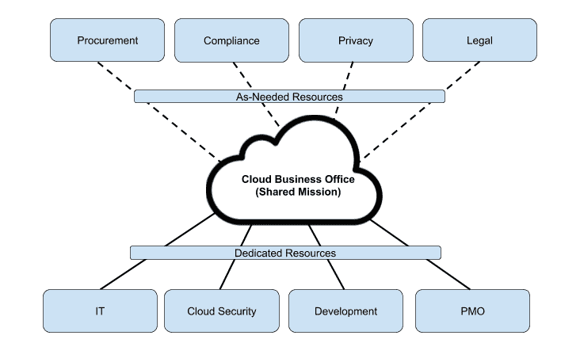
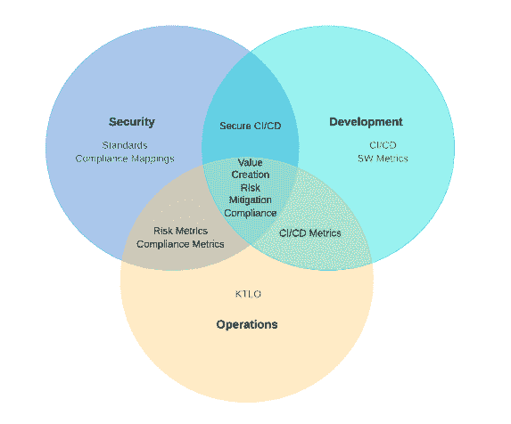

# 为什么您的成功云计算之旅始于组建合适的安全团队

> 原文：<https://thenewstack.io/why-your-successful-cloud-journey-starts-with-building-the-right-security-team/>

[帕洛阿尔托网络公司的 Prisma](https://www.paloaltonetworks.com/prisma/cloud) 在 Prisma 的[云本地安全直播，2020 年虚拟峰会](https://register.paloaltonetworks.com/prisma-cloud-native-security-virtual-summit)2020 年 2 月 11 日之前赞助了这篇文章。

 [马特·乔迪

Matt 拥有近二十年的安全领导经验，目前是 Palo Alto Networks 公共云的首席安全官。他经常在 RSA 等行业活动上发表博客和演讲。他目前领导着云威胁团队，这是一个专注于公共云问题的安全研究人员精英团队。他还是罗格斯大学网络安全证书项目的顾问委员会成员，也是 IANS Research 的成员。](https://www.linkedin.com/in/mattchiodi/) 

当我在世界各地与安全专业人士和首席执行官交谈时，我被问了很多问题。如何让我的云更加安全？你对 XYZ 科技有什么看法？哪种云比较好？我可以采取哪些措施避免像 X 公司一样被攻破？

但不管出于什么原因，我很少被问到的一个关键问题是如何组建一个安全团队以在云中取得成功。

但是为什么安全专业人士不经常问我这个问题呢？

作为技术人员，我们喜欢闪亮的新安全玩具。然而，专注于玩具而不是管理我们闪亮工具的人是有代价的。如果您采取正确的方法，当您以保护云安全为目标时，人类将是您努力的第一个目标。

> 生活中最重要的问题是用问题而不是答案来解决的。—安德鲁·索贝尔

## 跟着领导走

成功迁移到云并控制网络风险的组织通常遵循类似的模式。云不仅仅是另一个项目。从最高管理层开始，It 被理解为所有数字业务炒作背后的驱动力(理由很充分)。领导层通过将资源投入到广为人知的[云业务办公室(CBO)](https://www.cloudtp.com/cloud-business-office/) 来强化这一信息。

按照类似的方法，前瞻性的安全团队通常会成立一个专门的云安全小组。安全团队的重头戏是确保云安全团队不仅在 CBO 拥有代表权，还拥有领导权。如果你的组织还没有一个 CBO，带头倡导创建一个。这不仅将提供您的云计划所需的治理和监督，还将积极提升安全团队的形象。然而，这是有财务成本的，但是请记住，团队也不是永远存在的。

分配给 CBO 的资源不仅应该专用，还应该免除任何遗留的操作责任。这种方法虽然最初很昂贵，但在未来许多年内将会以降低风险和业务敏捷性的形式带来回报。

## 明确设定期望

组织的规模通常会决定云安全团队的规模。与其关注数字，不如先关注任务。你希望实现什么？狂野成功是什么样子的？你怎么知道你什么时候完成了？开发云安全任务和策略不一定需要几周时间。然而，它应该包括来自安全团队之外的反馈和输入。这个过程的最终结果应该是一个清晰的单页文档，它回答了上面提出的问题，同时也清楚地表明云安全团队并不是永远存在的。

就像之前的其他革命性技术一样，公共云最终将变得商品化，不再需要专门的安全(或 it)功能。已经达到这个成熟点的组织用另一个名字来称呼它: [DevSecOps](https://www.paloaltonetworks.com/cyberpedia/what-is-devsecops) 。云安全战略文档随后成为组织的北极星。提前花时间弄清楚愿景和战略有助于以后做出更容易的决定。

## 成功的人员配置

许多首席信息安全官在组建云安全团队时，通常认为他们需要雇佣在云领域拥有多年经验的人。相反，从内部招聘。你的团队中谁表现出最强的学习和接受新挑战的倾向？

请记住，API 和[共享责任](https://www.paloaltonetworks.com/cyberpedia/cloud-security-is-a-shared-responsibility)是公共云中的主要优势。如果有人在您现有的团队中表现出色，并且喜欢学习，您可能会看到您未来的云领导。当涉及到云安全架构、设计、标准和实施时，顾问和承包商会发挥作用。最成功的安全组织让他们的内部资源制定策略并领导执行。随着内部团队的学习和成熟，外部资源会在短时间内被用来补充和填补缺口。如果您选择走这条路，请确保将指标驱动的知识转移作为一项关键交付内容包含在工作说明书中。

## 要记住的事情

做…

*   在您的安全组织内创建一个以云为中心的团队。
*   从一开始就要明确，当组织成熟度达到您预先定义的标准时，团队最终会合并到更广泛的安全团队中。
*   创建一个任务声明，清晰地描述成功的样子以及关键的里程碑。

不要…

*   让现有团队成员解决云安全问题，同时仍然希望他们继续日常工作。
*   让云安全团队独立于开发、IT、财务、法律或合规部门开展工作。
*   假设你必须雇佣一个新人来领导云团队。

*为了与安全思想领袖直接交流， [Cloud Native Security Live，2020 虚拟峰会](https://register.paloaltonetworks.com/prisma-cloud-native-security-virtual-summit)是您与其他开发人员、DevOps 专业人员和 it 领袖进行交流和互动的机会，他们在容器技术和 DevSecOps 方面都有很大的利益。由 Palo Alto Networks 与 New Stack 合作主办，请于 2020 年 2 月 11 日加入我们，参加关于云原生安全性的全天讨论，无论您身在何处，我们都将为您提供在线直播。*

通过 Pixabay 的特征图像。

<svg xmlns:xlink="http://www.w3.org/1999/xlink" viewBox="0 0 68 31" version="1.1"><title>Group</title> <desc>Created with Sketch.</desc></svg>