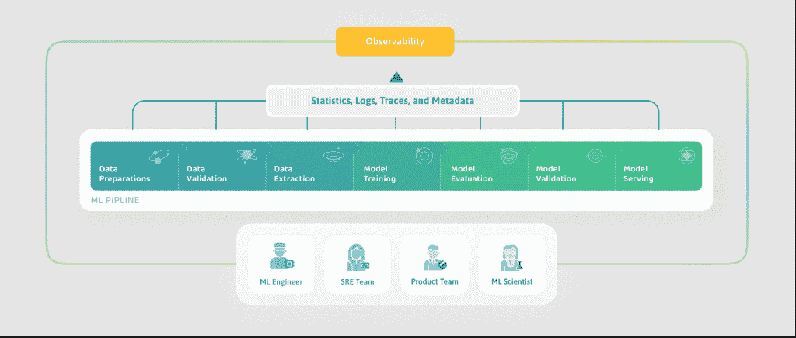

# WhyLabs 将数据添加到可观测性等式中

> 原文：<https://thenewstack.io/whylabs-adds-data-to-the-observability-equation/>

作为亚马逊机器学习系统的一名随身携带寻呼机的消防员，[阿莱西娅·维森吉奇](https://twitter.com/zalessya?lang=en)发现围绕调试应用程序构建的 DevOps 工具远远不能满足[机器学习](https://thenewstack.io/category/machine-learning/)操作员在生产中的需求。

“我发现，我用来支持传统软件应用和零售网站的工具，并不能很好地满足我在支持(人工智能)应用时的需求，”她说。“具体来说，如果不了解流经应用程序的具体数据，人工智能应用程序的故障模式类型很难理解和调试。”

当该公司开始构建其机器学习(ML)平台 [Sagemaker](https://aws.amazon.com/sagemaker/) 时，她在前线，看到了机器学习操作员、工程师和数据科学家在生产模型时面临的挑战。

这让她离开了 AWS，并与亚马逊网络服务的校友萨姆·格雷西和安迪·当一起创建了人工智能观察平台。

“我打了一个赌，如果 AWS 和所有的云公司成功地实现了我们如何将模型投入生产的民主化，使开发模型和部署模型变得非常容易，那么每个将模型部署到生产的从业者都将努力应对我在亚马逊部署应用程序时面临的挑战，”维森吉奇说。

## 传统的可观察性加数据

关于分布式系统的[可观测性](https://thenewstack.io/observability-the-5-year-retrospective/)已经写了很多；一月份， [O'Reilly 注意到前一年增长了](https://www.oreilly.com/radar/where-programming-ops-ai-and-the-cloud-are-headed-in-2021/) 128%,相比之下，监测数据增长了 9%。

然而，大多数可观察性工具缺乏机器学习实践者的基本元素。

“传统软件系统的可观察性意味着你看到代码是如何运行的，你看到基础设施是如何运行的，”维森吉奇说。“对于机器学习系统，还有一个额外的维度，那就是数据。

“如果数据集有问题，你的代码可能根本不会改变。但如果数据发生变化，那么机器学习系统的行为也会发生变化。因此，机器学习的可观察性捕捉到了许多传统可观察性捕捉到的方面，但它增加了数据的维度，然后增加了数据、代码和基础设施如何互操作的维度。

“[它]有助于机器学习模型的调试考虑到不断变化的现实世界数据如何影响这些机器学习驱动的应用程序的行为。”

WhyLabs 提醒用户数据中的变化，以帮助指出数据漂移、模型漂移和其他与数据相关的 ML 问题。

当前的供应链问题就是一个例子，说明环境会影响模型的准确性。最好在你带着满满一仓库没人想买的袜子离开之前，或者在突然出现纸巾短缺时无法完成订单之前，尽早知道发生了什么。

## 双管齐下的方法

WhyLabs 的产品分为两个部分:

开源库 [whylogs](https://github.com/whylabs/whylogs) 使用一个轻量级代理，类似于 Splunk 和 Datadog 等 DevOps 工具使用的代理。它集成了现有的数据管道和所有主要的 ML 框架。

该库可以将万亿字节的数据总结成微小的统计指纹(10 到 100MB，未压缩)，并随数据中的要素数量而扩展。它不依赖于采样，而是使用[超对数对数](https://en.wikipedia.org/wiki/HyperLogLog)算法汇总所有数据，该算法只需要对数据进行一次传递就可以创建这些近似值。

它创建类似于其他日志软件的日志，但增加了这些数据本身的统计特征，以帮助指出漂移模式和其他与数据相关的 ML 问题。

Whylogs 与 AI 应用程序并行运行，除了应用程序使用的计算能力之外，几乎不需要额外的计算能力。

它可以从本地开发扩展到多节点集群，并且可以很好地与批处理和流架构一起工作。因为 whylogs 推断数据的模式，所以不需要手动配置。用户只需要一个 API 键就可以开始，一行代码就可以用来捕获所有的数据统计。

Whylogs 支持结构化和非结构化数据、图像、视频和音频。

[https://www.youtube.com/embed/adD6EkNDa5Y?feature=oembed](https://www.youtube.com/embed/adD6EkNDa5Y?feature=oembed)

视频

安装在任何 Python、Java 或 Spark 环境中，whylogs 可以作为容器部署，作为 sidecar 运行或通过各种 ML 工具调用它。whylogs 是在 Apache 2.0 开源许可下发布的，可以独立于更大的 WhyLabs 平台免费使用。

该平台构建在 whylogs 之上，通过一个专门构建的用户界面提供对 ML 应用程序的监控和观察，该用户界面在一个地方收集关于所有模型的信息。它使人工智能从业者能够跟踪原始数据、特征数据、模型预测等，全面了解人工智能应用程序的整个管道，并可视化每个特征的统计属性如何随时间演变。

主动监控突出了数据质量的偏差和漂移，以生成及时的警报，这些警报可以通过 Slack、电子邮件或其他消息传递平台在整个组织内共享。对于为监控而捕获的数据点或模型预测的数量没有限制。

## 自动化手动流程

WhyLabs 于 2020 年 9 月从隐身状态中走出来，宣布已从 Madrona Venture Group、Bezos Expeditions、Defy Partners 和 Ascend VC 筹集了 400 万美元的种子资金。[前 Cloudflare 高管 Maria karivanova](https://www.linkedin.com/in/mariakaraivanova/)是第四位联合创始人，她在 Madrona 担任了三年半的校长。周四，该公司宣布完成由 Defy Partners 和吴恩达人工智能基金共同牵头的 1000 万美元 A 轮融资。

Madrona 的 Tim Porter 和 Karaivanova 在一篇关于其投资 WhyLabs 的[博客文章](https://www.madrona.com/whylabs/)中写道:“虽然智能应用程序正在兴起，但人工智能建设者所依赖的工具充其量也不成熟，导致数据科学家和工程团队将宝贵的时间和精力花费在非增值工作上，如数据采样、错误检测和调试。”。

离开 AWS 后，维森吉奇加入了由微软联合创始人保罗·艾伦创办的西雅图研究实验室[艾伦人工智能研究所](https://allenai.org/)，并花了一年时间研究如何[概括机器学习模型在生产中面临的典型问题的工具](https://whylabs.ai/blog/posts/introducing-whylabs-a-leap-forward-in-ai-reliability)——如何测试模型并监控它们。

维森吉奇与数百名从业者进行了交谈，并创建了一个致力于让人工智能技术变得强大和负责任的人工智能建设者社区。最近， [WhyLabs 是 25 家人工智能初创公司](https://thenewstack.io/the-ai-infrastructure-alliance-wants-to-build-a-canonical-stack-for-ai/)之一，它们组建了[人工智能基础设施联盟](https://ai-infrastructure.org/) (AIIA)，以在人工智能基础设施生态系统内建立强大的工程标准和一致的集成点。

维森吉奇说，她谈过的大多数运行人工智能应用程序的公司都在内部建立了一些解决方案。这些手动调试过程非常昂贵，因为数据科学家必须构建、监控和维护它们。

主要的云提供商正在为他们的机器学习平台添加可观察性功能，许多初创公司已经进入数据监控领域，包括 [Datatron](https://www.datatron.com/) 、 [Bigeye](https://www.bigeye.com/) 和 [Monte Carlo](https://www.montecarlodata.com/) 。

维森吉奇说，云提供商的功能带来了可移植性的问题。

“本质上，如果我们有一个同时使用 Sagemaker 和 Azure ML 的团队，那么他们将有一个功能来监控 Sagemaker 模型，另一个功能来监控 Azure 模型，这意味着他们将不得不使用两个工具并试图协调数据以了解两个模型的表现，特别是如果他们试图比较和对比模型的话。”

WhyLabs 还关注可扩展性和易用性，不仅针对数据科学家，也针对现场可靠性工程师、产品经理和 ML 团队的其他成员。

## 前方的路

“我们对该平台的可扩展性、直观性和优雅性印象深刻——它与现有工具和工作流相集成，以支持任何规模的任何数据类型，”波特和卡拉伊万诺夫娃在他们的博客帖子中写道。

“虽然我们预计云平台和许多用于模型构建和部署的 ML 平台将提供自己的模型监控，但我们认为客户还需要一个真正平台无关的人工智能监控解决方案，无论它在哪里运行，都可以提供对模型性能的一致、最佳的见解和可观察性。”

维森吉奇补充道:“在人工智能基础设施联盟内，我们正在建立与实时流媒体系统、联邦学习系统、更多机器学习平台等的集成。我们的目标可能是类似于 [Datadog](https://www.datadoghq.com/) 的东西，其中我们有数百个集成，使它像一行代码一样容易与 WhyLabs 集成，并实现可观察性。这是其中的一部分。

“另一部分是扩展到越来越多的数据类型。…我们正在利用[自然语言处理]增加我们的产品。在 NLP 的支持下，我们想要支持各种各样的多模态信号数据等等。

“我们相信任何给定的团队都有运行在许多许多不同数据类型上的模型，”维森吉奇继续说道。“即使是典型的零售组织，也有基于图像、时序数据、NLP 和结构化数据运行的模型。应该有一个地方，一个平台，他们可以去了解这些模型的健康状况。

“除此之外，我们还致力于让用户在发现问题后尽快解决问题，并在问题影响客户体验之前主动发现问题。”

<svg xmlns:xlink="http://www.w3.org/1999/xlink" viewBox="0 0 68 31" version="1.1"><title>Group</title> <desc>Created with Sketch.</desc></svg>