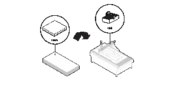

# 维基屋:任何人都可以建造的开源可持续房屋设计

> 原文：<https://thenewstack.io/wikihouse-open-source-sustainable-house-designs-that-anyone-can-build/>

开源运动不仅革新了技术和我们分享事物的方式；它还承诺改变我们设计、建造和与建筑互动的方式。几年前，随着[开放建筑网络](http://openarchitecturenetwork.org/)的推出，建筑的专有性质得到了重大反思，这是一个开源社区，全球的设计师可以在这里合作和分享可持续设计的计划，并适应需要负担得起的解决方案的地方。现在，住房面临着来自[维基屋](http://www.wikihouse.cc/)的类似改组，这是一个“开源建筑集”，允许任何想要建造自己房子的人从一个共享的全球图书馆下载免费设计，然后在几天内“打印”和组装，不需要任何技能。

维基屋于 2011 年由总部位于伦敦的设计公司 [Zero Zero](http://www.project00.cc/) 的阿拉斯泰尔·帕尔文和尼克·耶罗迪亚康努发起，旨在将环保住宅的设计和建造民主化。这个想法是允许用户下载知识共享许可的蓝图，可以通过谷歌 [SketchUp](http://www.sketchup.com/) 定制。该设计的结构胶合板件由 CNC 机器预制和切割，现场组装，拼图式，并借助受传统韩国建筑影响的楔和钉连接紧固在一起。然后，可以根据需要定制和整合各种支持系统和附件。

 

 

## 负担得起的、可持续的开源智能家居

一个有趣但不可避免的转折加入了这个已经令人兴奋的组合。WikiHouse 的最新版本是 4.0 版——一个两层楼的智能家居原型，最近建造并在上个月的伦敦设计节上展出。WikiHouse 4.0 是与工程公司 Arup 和建筑中心合作开发的，它采用了许多智能家居技术，从智能设备控制的照明和通风，到更安全、更高效的低压 DC 电气系统。所有系统都通过 OpenHAB 智能家居软件集成在一起，这是 Nest T21 等产品的开源替代品。

即使是平凡的细节也可以被分享和改编；据 ArchDaily 报道，例如，奥雅纳公司开发了一个名为“开放 MVHR”的开源热回收装置，它可以用 3D 打印组件和来自啤酒罐的铝来建造(毫无疑问，这是一个拥有更多冷源的巨大激励)。正如 WikiHouse 设计师 Sarah Gold 在[主板](http://motherboard.vice.com/read/a-tour-through-the-downloadable-diy-smart-home)上解释的那样，该项目现在正朝着“模块化、适应性强的系统，具有开放的数据控制，在各种意义上把房子的控制权归还给它的主人。”

[https://www.youtube.com/embed/8a9-DijrLyo?feature=oembed](https://www.youtube.com/embed/8a9-DijrLyo?feature=oembed)

视频

除了生产的民主化，可持续性是 WikiHouse 项目的另一个目标。强调使用适合当地的材料将减少与长途运输相关的碳足迹。WikiHouse 框架的性质意味着它可以拆卸并随时重复使用，根据《卫报》的报道，甚至可以修改以满足严格的 Passivhaus 标准——这是一个令人兴奋的提议，因为潜在的房主希望建造一个负担得起的、节能和环保的房子。

## 隐私、安全和公民主导的设计革命

尽管它被描述为一个类似宜家的房子，但是 WikiHouse 4.0 实现了不同程度的复杂性，提出了许多关于住房未来的有趣问题。首先，尽管建造这个特殊的维基屋的成本固定在 50，000 英镑(80，000 美元)，但是已经有人提出了与雇佣 CNC 制造服务和购买土地相关的可能过高的成本的担忧。其次，在广泛实施之前，当地的建筑法规可能需要提高速度。第三，在一个互联的物联网中，隐私和安全问题是有根据的，智能家居系统可能被黑客攻击，房主的能源使用数据和家庭习惯可能在不知情的情况下被企业和政府收集。

尽管有这些潜在的障碍，WikiHouse 项目背后的基本概念有着深远的影响。这种创造性的分享不仅能让普通人建造他们自己的低成本、可持续的住宅，还能从根本上改变城市的发展方式，挑战经济适用房必须“一刀切”的观念。Watch 联合创始人阿拉斯泰尔·帕尔文在 TED 上进一步解释了这些观点:

[https://www.youtube.com/embed/Mlt6kaNjoeI?feature=oembed](https://www.youtube.com/embed/Mlt6kaNjoeI?feature=oembed)

视频

随着面向大众的低成本、可持续住房运动的发展，肯定有一些事情需要解决。但是随着土地和建筑成本的上升，WikiHouse 的开源、自己动手精神——在新兴的[共享经济](https://en.wikipedia.org/wiki/Sharing_economy)中将技术与建筑相结合——承诺至少会发起一场“破坏性的辩论”，如果不能改变我们建造和居住房屋的方式。

<svg xmlns:xlink="http://www.w3.org/1999/xlink" viewBox="0 0 68 31" version="1.1"><title>Group</title> <desc>Created with Sketch.</desc></svg>