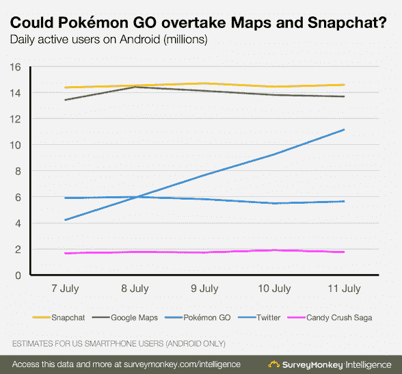

# 增强现实的第一个黑仔应用 Pokemon Go 疯狂的一周

> 原文：<https://thenewstack.io/wild-week-augment-realitys-first-killer-app-pokemon-go/>

我们很少能见证一场真正的革命，但《口袋妖怪 Go》具备“杀手级应用”的所有要素，这是一个似乎凭空出现的颠覆性新现象，但不知何故也从第一天起就受到了广泛欢迎。10 天后，关于这款游戏和它的玩家的怪异故事已经够多了。

最重要的是，这一周实际上可能会作为增强现实首次展示其真正潜力的时期而被载入史册——或者至少证明了它可以让你的邻居看起来像是口袋妖怪泛滥成灾。

从那一天起，新闻媒体和技术专家就一直面临这样一个问题，到底发生了什么…

甚至统计数据也有一种近乎神奇的特质。当《口袋妖怪 Go》发布当天太阳落山时，它已经成为 iPhone 上[收入最高的游戏。“这根本不会发生，”福布斯撰稿人 Tero Kuittinen 在推特上写道，后来称其为“AR 产品](https://twitter.com/teroterotero/status/751507927308111872)[成为全国痴迷](https://twitter.com/teroterotero/status/751541101954232320)的第一个例子。”

但是有发生的事情，然后有*为什么*。《口袋妖怪 Go》似乎将增强现实的神奇新奇与流畅的游戏设计(部分由任天堂支持)结合在一起，也许是对口袋妖怪品牌的挥之不去的怀旧之情，这种怀旧至少可以追溯到一代人。

> 在第五天，Pokemon Go 的用户数量超过了网飞、潘多拉和 Twitter，美国近 6%的安卓用户在使用它。

在某种程度上，这款游戏也可能仅仅因为*出名而变得出名，随着*对其受欢迎程度的认知*而变得受欢迎，这创造了一个自我强化的循环。但是，热爱这项运动的人确实非常喜欢它。“在过去的六天里，我走了 30 英里，”一个 20 多岁的玩家在弗吉尼亚州的里士满告诉我。“我探索了这座城市中我从未见过的部分。*

“现在我也能更多地看到我哥哥了…”

该游戏使用手机的 GPS 系统跟踪每个玩家在现实世界中的移动，然后在游戏的虚拟世界中将他们的化身移动相应的距离。但使用智能手机的摄像头，游戏还可以呈现“增强”版本的世界，这样在你附近的不同位置，玩家可能会看到一个口袋妖怪角色。这给游戏增加了一个奇怪的准社交成分，不知何故使它变得更加引人注目。使用各种游戏战术，玩家可以“捕捉”这些虚拟生物，它们有 151 种。像最初的基于卡片的游戏一样，目标是抓住所有人。

## 神奇的成功

两天之内,《口袋妖怪 Go》在更多安卓设备上的安装数量超过了 Tinder。Gizmodo 开玩笑说:“显然，比爱情更强大的驱动力是需要抓住所有人。”他指出，Tinder 在超过 2.5%的安卓设备上安装花了五年时间，而 Pokemon Go 在第三天就超过了 5%。在第五天，Pokemon Go 的用户数量超过了网飞、潘多拉和 Twitter，被 T2 使用的用户占美国所有 Android 用户的近 6%。

最奇怪的是，该应用程序甚至在尚未发布的国家获得了日使用量，渴望应用程序的粉丝从海外下载。

“口袋妖怪 Go 现在是美国历史上最大的手机游戏，”[报道美国消费者新闻与商业频道](https://www.cnbc.com/2016/07/13/pokemon-go-now-the-biggest-mobile-game-in-us-history.html)，估计在它的第一周结束前，美国的日活跃用户数已经达到 2100 万——有史以来的最高数字。他们预测未来会有更多的里程碑。“这款游戏预计将在几天后在 Android 上通过 Snapchat，它可能会超过谷歌地图本身，成为 Alphabet 地图数据的最大用户。”当然，任天堂的股价[暴涨](https://www.google.com/search?q=nintendo+stock&ie=utf-8&oe=utf-8)，在一周内飙升了 50%，并使公司的估值[增加了 90 亿美元](http://www.washingtontimes.com/news/2016/jul/11/pokemon-go-fever-nintendo-stock-soars-9b-in-days-o/)。

每天都有更多新的头条新闻——有好的，也有坏的。到上周五，这款游戏如此受欢迎，以至于[的服务器超载](http://qz.com/726647/pent-up-demand-for-pokemons-new-mobile-game-has-made-it-impossible-to-play/)，在游戏仅在美国、新西兰、澳大利亚推出后，游戏的国际推广不得不暂停。

本周二，参议员艾尔·弗兰肯发布了一封公开信，要求该应用的开发者 Niantic 澄清它是如何收集和分享游戏用户信息的。《华尔街日报》周三报道称，这款游戏的开发者已经更新了应用程序，因此它收集的数据更少了。一个非故意的漏洞显然造成了应用程序可以看到玩家的 Gmail、Google Docs、Google Drive 和 Google Calendar 账户内容的情况。《华尔街日报》称这一事件提醒人们，应用程序用户会多么容易地放弃大量数据。

但是追逐口袋妖怪也有好处。

Inc .杂志已经指出，该应用程序有巨大的潜力[推动当地商店的客流量](http://www.inc.com/walter-chen/pok-mon-go-is-driving-insane-amounts-of-sales-at-small-local-businesses-here-s-h.html)。据网上报道，在为虚拟口袋妖怪进行了一次微小的应用内购买“诱惑”后，30 名玩家出现在一个地点，另一名企业主报告说，“我拥有一家披萨店，这是一个口袋妖怪，我几乎整天都在这样做。我有一大堆孩子和成年人(大部分是成年人)来买披萨和饮料，直到诱惑用完。”公司计算了成本，并得出结论，这是一个不合格的富矿。“每小时 1.19 美元，你可以拥有你一生中从未见过的更多顾客……”

> 另一个用户甚至报告说他们被带到了一个脱衣舞俱乐部旁边的墓地。

很快，似乎每个人都想参与进来。印第安纳州的一家动物收容所建议人们[在玩游戏的时候带着他们的狗去散步](http://www.thestarpress.com/story/news/local/2016/07/13/muncie-animal-shelters-pokemon-go-dog-walks-breaking-internet/87016448/)。博伊西的一个植物园开始了一项促销活动，Pokemon Go 玩家[可以获得 2 美元的门票折扣](https://twitter.com/IdahoBotanicalG/status/753357737539448832)。Gizmodo 开玩笑说:“当强盗决定使用你的应用程序引诱受害者时，你就知道你成功了。”。一名男子甚至在推特上发布了一张截图，显示一只口袋妖怪出现在他妻子分娩的病房[。](http://www.telegraph.co.uk/technology/2016/07/08/man-catches-a-pidgey-on-pokmon-go-as-his-wife-gives-birth/)

Gizmodo 还在马萨诸塞州发现了一名 Tumblr 用户，他通过将手机绑在无人机上加快了对虚拟 Pokemon Go 角色的追逐。据 the Verge 报道，甚至希拉里·克林顿也在俄亥俄州的一个公园举行了一场竞选活动，该公园的[也是游戏的虚拟健身房之一](http://www.theverge.com/2016/7/14/12193236/pokemon-go-hillary-clinton-campaign-event-pokestop)，而唐纳德·川普则把游戏变成了一个竞选攻击广告。

到周四，这款应用已经正式登陆德国和英国。

每个小时都有关于游戏对玩家影响的新故事。“在北圣地亚哥县，两个男人在玩智能手机游戏时从悬崖上掉了下来，”[洛杉矶时报](http://www.latimes.com/local/lanow/la-me-ln-pokemon-go-players-stabbed-fall-off-cliff-20160714-snap-story.html)报道，“而在更北的阿纳海姆，一名玩家最近在一个公园被一群人刺伤……”各种报纸文章开始报道报道的[受伤事件](http://www.chicagotribune.com/bluesky/technology/ct-pokemon-go-injuries-wp-bsi-20160708-story.html)，包括芝加哥论坛报。“口袋妖怪 Go 昨晚把我送进了急诊室……发布后不到 30 分钟……我滑倒了，掉进了一条沟里。”事实上，有些人甚至在驾驶的同时还在玩游戏 [*。*](https://theringer.com/pokemon-go-injuries-already-piling-up-250ec4c150bd)

## 最奇怪的地方

但是这种现象还有更奇怪的一面。另一个 Gizmodo 的故事确定了“口袋妖怪 Go 把它的玩家送到了最奇怪的地方”，指出有报道称虚拟口袋妖怪藏在“工作的脱衣舞俱乐部…”或萨克拉门托附近的成人新奇商店。或者是一片杂草丛生的灌木丛[变成了墓地](https://twitter.com/MinovskyArticle/status/751041588357435392/photo/1)。

另一个用户甚至报告说，他们被带到了一个墓地[，这个墓地就在一个脱衣舞俱乐部](https://gizmodo.com/the-strangest-places-pokemon-go-is-sending-its-players-1783407238)旁边*。*

当然，总有这种可能性，即 the grady-by-the-strip club 的视频是伪造的，因为游戏玩家也发现了向手机发送“替代”GPS 坐标的方法，要么是为了创建病毒，要么是为了捕捉更多的虚拟口袋妖怪。

但 Reddit 上的一条评论猜测，Niantic 的真正问题是[回收了 Niantic 早期 AR 游戏](https://www.reddit.com/r/TheSilphRoad/comments/4s1a38/what_the_actual_hell/d56j2uw)、*入口*之前使用的真实世界地点。他们自称是 Ingress 的前玩家，指出像 Ingress 一样，Pokemon Go 在实地测试期间允许用户建议的位置——为实际的玩笑者提交令人惊讶的令人毛骨悚然的位置打开了大门。

一些奇怪的地点几乎肯定是偶然的。Pokemon Go 将一名玩家带到了一具漂浮在河中的尸体前。但是其他“扑克之家”的位置就很奇怪了。其他奇怪的地点包括有争议的邦联士兵纪念碑、山达基教堂、新西兰的地狱天使摩托车俱乐部、纽约 911 纪念馆外的倒影池和阿灵顿公墓。“是的，”纽约杂志报道，“你可以在奥斯威辛集中营抓到口袋妖怪。”

## 善良的力量

但是也有一些关于 Pokemon Go 的故事，这些故事真的很鼓舞人心。Gizmodo 的一篇文章留下了许多积极的评论，其中一条评论写道:“我喜欢这个游戏是因为它意外地让人们相遇并互动。”。“就在昨晚，我交了三个新朋友，他们不是火绒用户，也不是匿名 Twitter 账户。这实际上是一个非常好的待遇，否则就是一个基于巴甫洛夫反应的游戏。”

另一个玩家描述了 20 个陌生人如何聚集在一个捕捉口袋妖怪的地方——他们当地的天主教堂。“我们谈论着我们在游戏中所做的事情，笑着谈论我们已经玩过的朋友，笑着说有那么多人在教堂外面闲逛，以至于拉里神父……随时都会出现来布道。一个小时后，我终于离开了，在与几个我很合得来的人交换信息并告诉他们我发现的其他一些好地方后，我回家了。”

另一名玩家发帖称，“根据我在公园的散步，这是一款老少皆宜的游戏。甚至负责花园的老人也在玩《口袋妖怪 Go》……这有点奇妙。”

第四个人发帖说:“我看到公园和人行道上挤满了玩游戏的人，这不仅仅是一种时尚，这是一种现象，至少在城市里是这样。不仅仅是孩子。每个年龄段都有。”也许历史真的会将这一周记为人类最终拥抱增强现实的一周——也是数字游戏最终将所有人带到户外的一天。

在那一天，虚拟世界终于给数百万平淡无奇的日常生活带来了光芒，还有一些真实的阳光，这一事件的标志是陌生人聚集在不同寻常的地点，自由交谈，重新发现被遗忘的友情。显然，这个游戏找到了完美的公式——或者它只是在正确的时间出现了。一条 Gizmodo 评论似乎暗示，这款游戏甚至让厌倦了的 21 世纪美国人再次表现出睦邻友好。“我和妻子在附近徘徊，跟踪一个阴森可怖的人。

“盖伊停在他的车里，摇下车窗，喊道‘要把他们都抓起来！"

<svg xmlns:xlink="http://www.w3.org/1999/xlink" viewBox="0 0 68 31" version="1.1"><title>Group</title> <desc>Created with Sketch.</desc></svg>