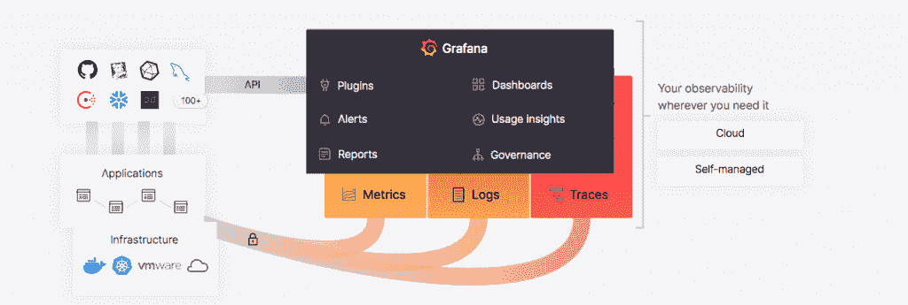
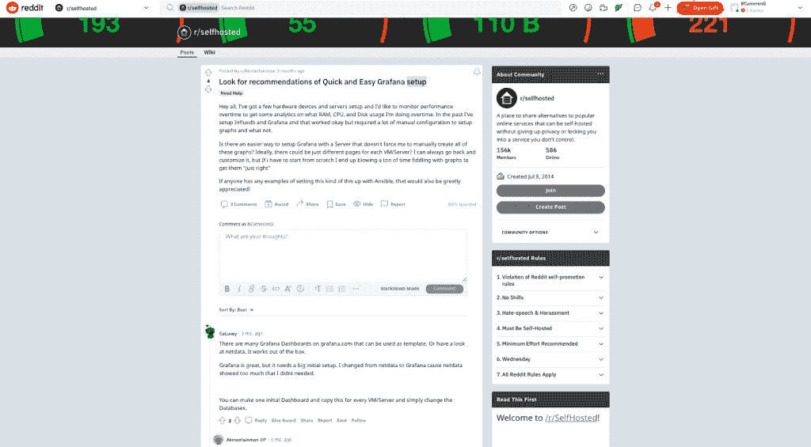

# 2022 年 Grafana 会变得更好用吗？

> 原文：<https://thenewstack.io/will-grafana-become-easier-to-use-in-2022/>

Grafana 作为一个广受欢迎的观测和监测平台的地位继续获得动力。

根据开源项目的统计数据，在[云本地计算基金会](https://cncf.io/?utm_content=inline-mention)的 [CNCF 科技雷达](https://github.com/grafana/grafana/blob/main/README.md)中，Grafana 被列为仅次于 Prometheus 的第二大最受欢迎的可观察性工具——许多用户将它与 [Grafana](https://github.com/grafana/grafana) 一起使用。Grafana 的 GitHub stars 和 forks 的总数分别超过 46，000 和 9，000。

Grafana Labs 的产品和插件也是其受欢迎的原因。它们包括但绝不限于基于开源项目 Tempo 的用于自我管理跟踪的 Grafana Enterprise Traces (GET)、用于与 Prometheus 进行日志聚合的 Grafana Loki、Grafana Cloud 以及在 Grafana 中使用 Graphite 来监控和分析时序数据。

尽管如此，Grafana 核心开发团队仍有工作要做。

尽管 Grafana 实验室和社区成员提供了大量的文档和演示，但 Grafana 的设置可能是一个挑战(尽管那些让其仪表板工作的人通常会对其大加赞赏)。安装不同的仪表板选项时，需要许多手动配置和步骤。安装后，许多用户可能会被大量的日志和其他数据淹没，无法进行监控和观察。

因此，固步自封不符合格拉夫纳的利益。

随着 Grafana 继续被更广泛地使用，并与重要的可观测性工具和协议集成，如 [OpenTelemetry](https://opentelemetry.io/) (工具、API 和 SDK 的集合)，它仍然是一项正在进行的工作，[T4 企业管理协会(EMA)](https://www.linkedin.com/in/torstenvolk/) 的分析师 Torsten Volk 告诉新的堆栈。例如，Volk 指出，Grafana 的用户界面仍然会导致不必要的高初始学习曲线，插件和查询需要大量的练习才能有效使用。

“Grafana 的目标是将其平台定位为一个统一的仪表板，可显示来自任何地方的任何类型的基础架构、应用程序或业务服务的任何指标。因此，该公司需要不断提供最高程度的灵活性，”沃尔克说。“这使得 Grafana 很难根据个人关键人物角色提供交钥匙实施和简化的用户体验。”

Grafana 在实现和使用中的复杂性挑战也反映了实现可观察性工具的难度。Grafana Labs 当然意识到了这一挑战，今年正寻求为简化其工具的使用和设置提供更多支持。最重要的是 Grafana Labs 如何帮助用户更好地管理数据爆炸，许多 [DevOps](https://thenewstack.io/category/devops/) 团队必须处理这些数据来解释指标和日志数据。

“随着可观察性和指标的增加，我们看到越来越多的用户为他们的基础设施和应用程序生成的大量指标而苦恼。此外，随着用户发现指标的价值，他们也倾向于添加更多的标签，这可能导致“基数”的组合爆炸，”Grafana Labs 的技术副总裁 Tom Wilkie 告诉新堆栈。“我们正在开发的技术不仅允许我们的指标系统扩展到数十亿个系列，实时查询大量的系列，还可以通过各种方式减少系列的数量。”

为此，Grafana Labs 计划“在规模和性能方面将我们的遥测存储提升到一个新的水平——想想每天数百亿个系列、数 Pb 的日志和数万亿个跨度，所有这些都可以在数百毫秒内进行查询，”Wilkie 说。“到 2022 年底，担心您的指标基数将成为过去，”威尔基说。

随着与开源社区合作对店内进行的持续改进，2022 年将会出现许多其他新功能。

一个是更容易在整个用户范围内采用，“我们专注于使 Grafana 云和 Grafana Enterprise Stack 成为 sire 可靠性工程师和 DevOps 开始使用 Grafana、Prometheus、Loki 和 Tempo 的最简单方式，”Wilkie 说。“在 2022 年，我们将看到该集向左右扩展，包括负载测试、随叫随到(如使用 [amixr](https://amixr.io/) 的事件管理等等)。”

更多的注意力也会放在开发者身上。Wilkie 说:“我们将使开发者更容易利用 Grafana 堆栈构建和交付丰富、功能全面的应用程序。”“到 2022 年底，您将能够将这些部署到任何地区的任何云提供商，或者使用 Grafana 开源或 Grafana 企业堆栈进行内部部署。”

根据 Volk 的说法，这些改进应该是有帮助的，因为它们符合 Grafana 的雄心，即成为跨 DevOps、MLOps、IT 运营和业务的数据驱动型决策的中心枢纽。

“Grafana 越容易让 sre、it 运营商、数据工程师、DevOps 工程师和业务分析师基于现有的数据管道和政策模板推出自己的仪表板，他们实现这一目标的机会就越大，”Volk 说。

<svg xmlns:xlink="http://www.w3.org/1999/xlink" viewBox="0 0 68 31" version="1.1"><title>Group</title> <desc>Created with Sketch.</desc></svg>