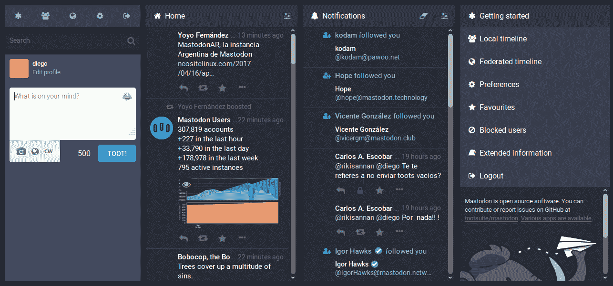

# 它会扩展吗？投资者试图资助脸书的替代者

> 原文：<https://thenewstack.io/will-it-scale-investors-try-funding-a-replacement-for-facebook/>

当硅谷投资者对抗一个已经根深蒂固的巨头，投入大量新资源、经验和云的力量——更不用说最好的意图——去寻求改变网络世界的形状，会发生什么？

我们马上就会知道了。

创办了 LAUNCH 孵化器基金的硅谷资深天使投资人杰森·卡拉卡尼斯(Jason Calacanis)最近宣布了一项竞赛，为脸书寻找一个“对社会有益”的新替代者卡拉卡尼斯在他的网站上解释说，具体来说，这意味着一个拥有准确信息、尊重隐私和民主的社交网络，以及一个不会试图让人们沉迷于该服务的社交网络。它还必须保护言论自由，同时有效地阻止*滥用*言论。

“我们已经有 24 个高质量的团队在做项目，”卡拉卡尼斯上周在他的网站上写道，“我们希望达到 100 个。”但在周四，Calacanis 与*分享了一个重大更新，即新堆栈*。“我们已经有数百人注册，数十人与我们分享实际产品。我希望我们能够找到至少七家可以投资的初创公司。”

竞争分阶段进行。经过 90 天的坦诚反馈(以及对视频参观或演示链接的审查)，发布团队将在 7 月 1 日进行首次削减。那一天，它将挑选 20 名勇敢的竞争者进入下一轮，这个决定完全基于他们的“执行能力”。

然后，启动投资者将与这些团队进行为期 90 天的沟通，然后将他们削减至 7 名决赛选手，每人将获得 10 万美元——尽管在 Medium Calacanis 上，投资可能高达 100 万美元"[，如果他们击败它](https://medium.com/@jason/answering-questions-about-the-openbook-challenge-79f3c5b23383)。

对于其 10 万美元的投资，LAUNCH 将获得“行业标准”的 6%的所有权，此时卡拉卡尼斯的团队还将提供 100 小时的顾问时间，在 LAUNCH 孵化器项目中的一个名额，以及“在硅谷推介 150 家顶级风投的能力”——外加杰森私人财团的 2400 名天使投资人。“这让一家初创企业有能力让自己为人所知、建立网络、提高技能并获得资金。”

“金钱、技能、网络和关注造就了初创公司，”[卡拉卡尼斯](https://medium.com/@jason/answering-questions-about-the-openbook-challenge-79f3c5b23383)写道，“在 150 笔投资和 6 只独角兽之后，我能说的最好的了。”

具有讽刺意味的是，作为竞争的一部分，他在脸书创建了[讨论组。](https://www.facebook.com/groups/openbookchallenge/)

## 回到未来主义者

卡拉卡尼斯的担忧可以追溯到近九年前。早在 2009 年，他发布了“致马克·扎克伯格的公开信息”，这在今天看来有着奇怪的先见之明。

“马克，你是个聪明的家伙。他当时说:“那天我们一起在 TED 吃晚餐……当涉及到隐私时，你不知道你在做什么……你是一个杰出的工程师，他正在制造他的用户的不信任，这是前所未有的，令人讨厌的。”。

[https://www.youtube.com/embed/Vb6wcSDjW-s?feature=oembed](https://www.youtube.com/embed/Vb6wcSDjW-s?feature=oembed)

视频

“你不能做这种事情。我知道你已经 20 岁或 15 岁了，不管怎样，你不穿袜子，不管怎样。我不在乎。你得长大。有 3.5 亿人在使用你的服务。别再做幼稚的事了。”

扎克那时 25 岁——从那以后，脸书已经发展到每月 21.3 亿活跃用户。在这中间的几年里，许多其他人出现并试图结束脸书的统治地位——但收效甚微。《快公司》最近嘲讽地报道了“隐私第一的社交网络:[一个永远行不通的好主意](https://www.fastcompany.com/40559106/the-privacy-first-social-network-a-great-idea-that-never-works)”记者 Jared Newman 列举了几个例子——Vero、乳齿象、Ello、App.net、Path、Diaspora——但最终表明，逐步取代脸书的功能可能更容易——或者只使用 EFF 的浏览器扩展——隐私卫士——阻止广告商跟踪你的网络浏览。

但并不是所有人都这么怀疑。一位科技基金经理[告诉 MarketWatch](https://www.marketwatch.com/story/facebook-will-become-myspace-says-fang-focused-fund-manager-2018-03-21) “任何社交媒体平台，假以时日，都将成为 MySpace。”这大概意味着它被抛弃，取而代之的是更时尚的替代品。

“没有年轻人使用脸书，”他不祥地补充道…

## **今天的比赛**

随着脸书负面新闻的增长，华盛顿邮报上个月报道了加入乳齿象的新人“激增”，乳齿象是一个类似 Twitter 的网络[托管在用户自己的独立服务器上](https://www.washingtonpost.com/news/the-switch/wp/2018/03/23/the-new-technology-that-aspires-to-deletefacebook-for-good/)。乳齿象创始人尤金·罗奇科(Eugene Rochko)将该网站描述为与朋友保持联系的替代方式之一，“不需要向大数据推销自己，以换取一个旨在以正确的方式释放多巴胺的系统，让你无限期地上瘾。”

他也承认，还有其他不错的选择，比如 Diaspora、Scuttlebutt 和 Hubzilla。

有趣的是，当 Diaspora 在 2010 年推出时，成功地从众筹活动中筹集了 19 万美元，其捐助者之一是扎克伯格。“我认为人们尝试这样做很酷，”他在 2010 年告诉 Wired 。“我在他们身上看到了自己的影子。这只是他们的方法，世界可以变得更好，并说，“我们应该努力做到这一点。”"

这是时光倒流的迷人一瞥，其中扎克伯格分享了一些他自己的坦率想法。“我真正关心的是使命，让世界变得开放。”但他似乎也渴望看到云的非凡能力，这在他 2004 年推出脸书时并不存在。“所有这些令人敬畏的新技术在当时都是不存在的，比如 EC2 和 S3。如果我重新开始，那会很棒。”

具有讽刺意味的是，他还说“我不认为世界会朝着只有一个大网站的方向发展。”

快进到 2018 年，卡拉卡尼斯认为脸书“正在积极尝试关闭开放网络”但他也称之为“聪明的创始人在脸书和谷歌无法控制的解决方案上加倍努力的机会”

“我们必须与试图关闭开放网络的公司坏人斗争，一个矛盾地创造了谷歌和脸书的开放网络。”

不幸的是，如果你走上这条路，你会面临一些巨大的挑战，根据[埃文·普罗德罗穆](https://github.com/evanp)的说法，他是一位连续创业者，他形容自己“在社交网络上忙得不可开交”他是 [W3C 社交网络](https://www.w3.org/2013/socialweb/social-wg-charter.html)工作组的联合主席，也是 [identi.ca](https://identi.ca/) 的创始人，这是一个基于联合社交网络协议 pump.io 的免费开源微博服务(也是他创建的)。

在这个过程中，他还创建了 StatusNet(现在是 GNU Social，在微博社区之间提供开放的跨服务通信，并共同撰写了 Activity Streams、OStatus 和 ActivityPub 的开放标准。在接受 New Stack 采访时，他解释了他在打造一个根深蒂固的社交媒体巨头的竞争对手方面学到的东西。

“首先，人们很难在负面激励下保持动力去做某事……最初，当你坚持做某件事，并在新系统上建立自己的账户时，会有一些满足感，但这无法与你在 Instagram 上的猫照片获得 400 个赞时那种甜蜜的血清素冲击相比。所以社交软件需要是社交的，令人满意的，吸引人的，有趣的。如果不是，人们就不会留下来。”

另外，你不能把你的软件仅仅局限于极客群体，Prodromou 建议。“很多开源社交网络都有开源人在上面谈论开源的东西。让参与者和主题多样化至关重要。”

用户的混合可以帮助你保持诚实，带来他们对软件应该如何运行的主流期望。“所以许多开源开发者专注于源代码，而牺牲了用户界面。软件也因此变得不那么好了，”Prodromou 说。

与此同时，为了在现实世界中生存，项目需要具有被称为可持续性的无形品质。“开发团队能在这个项目上坚持工作 3 年、5 年、10 年吗？或者他们会在 6 个月后耗尽精力吗？或者他们能吸引新的开发者来取代那些粗制滥造的人吗？”

即便如此，Prodromou 指出，创业公司可能很难复制已经在使用脸书的广大受众——这是一种优势，经济学家称之为[网络效应](https://en.m.wikipedia.org/wiki/Network_effect)。

卡拉卡尼斯认为还有一条路可以过去。“不管一家大公司有多强大，总有一个不知疲倦、有着聪明想法和一流团队的创始人能够打败他们。”

或者，正如他周四告诉我们的，“我同意脸书很难被取代，但我确实认为其他社交网络将会出现，并成为高利润的公司，有机会挑战脸书。

"即使希望渺茫，也值得一试。"

尽管具有讽刺意味的是，即使这样，成功融资的初创公司仍有可能最终被脸书收购，卡拉卡尼斯在他的网站上承认。

“作为天使，我的工作是向创始人提供建议、资金和选择，但如果他们走向黑暗面，最终是创始人的决定。”

* * *

# WebReduce

专题图片:杰森·卡拉卡尼斯在 2008 年(照片由埃里克·索尔海姆拍摄)。

<svg xmlns:xlink="http://www.w3.org/1999/xlink" viewBox="0 0 68 31" version="1.1"><title>Group</title> <desc>Created with Sketch.</desc></svg>