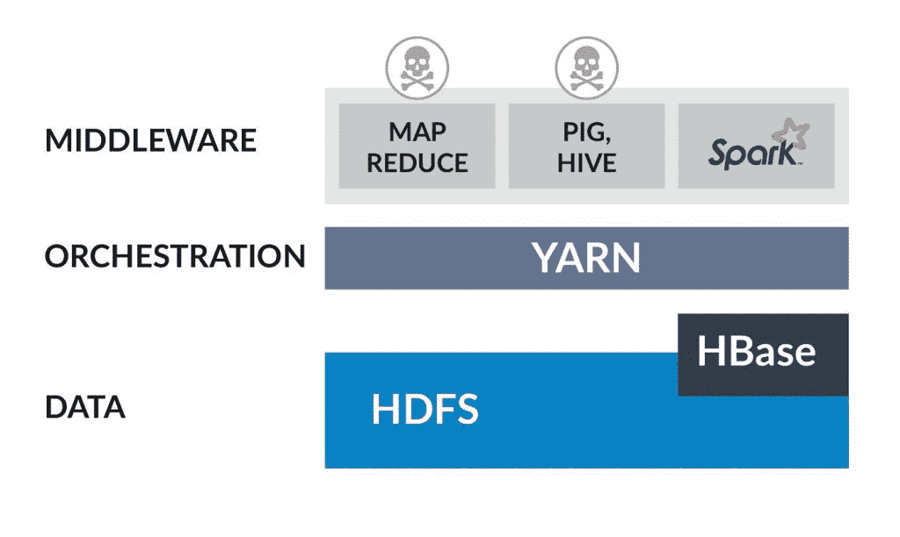
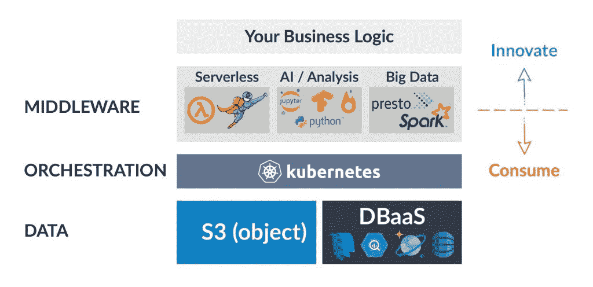

# Kubernetes 会击沉 Hadoop 之船吗？

> 原文：<https://thenewstack.io/will-kubernetes-sink-the-hadoop-ship/>

Kubernetes 的受欢迎程度正在激增。IBM 正在[收购](https://thenewstack.io/turning-blue-ibm-to-acquire-red-hat/) RedHat 的商业版 Kubernetes(open shift ), VMware 刚刚宣布[将收购由 Kubernetes 创始人创立的](https://thenewstack.io/vmware-to-acquire-heptio-to-boost-enterprise-kubernetes-expertise/) Heptio 公司。这清楚地表明，公司越来越多地将 Kubernetes 作为他们的云计算集群和编排技术。

 [亚龙·哈维夫

Iguazio 的首席技术官兼联合创始人 Yaron Haviv 是一位涉足大数据、云、存储和网络的连续创业者。在加入 iguazio 之前，Yaron 是 Mellanox 的数据中心解决方案副总裁，负责技术创新、软件开发和解决方案集成。亚龙发推文为@亚龙特拉维夫。](http://iguaz.io/blog/) 

与此同时，在遥远的 IT 部门，开发人员正在努力使用一种已有 10 多年历史的专门为大数据构建的集群技术 Hadoop。令人惊讶的是，他们中的一些人仍然认为将大数据作为技术筒仓来管理是有意义的，而早期采用者正在意识到他们可以运行他们的大数据堆栈( [Spark](https://spark.apache.org/) 、 [Presto](https://prestodb.io/) 、 [Kafka](https://kafka.apache.org/) 等)。)以一种简单得多的方式。此外，他们可以在同一个集群上运行所有很酷的后 Hadoop 人工智能和数据科学工具，如 [Jupyter](http://jupyter.org/) 、 [TensorFlow](https://www.tensorflow.org/) 、 [PyTorch](https://pytorch.org/) 或自定义 [Docker](https://www.docker.com/) 容器。

随着 Hadoop 的两个主要竞争对手 Cloudera 和 Hortonworks 最近决定合并 T21，这一趋势正在付出代价。缓慢的市场增长不再证明两家公司的存在是合理的。

## Hadoop 的历史和 Kubernetes 转型

Hadoop 是十年前形成的，在一个昂贵且不可扩展的数据库、数据仓库和存储系统的时代，出于对大量非结构化网络日志的理解的需要。

Hadoop 的价值主张是让开发人员将他们的所有数据写入数百甚至数千台服务器，这些服务器配备了许多使用极简分布式文件系统(HDFS)编排的廉价磁盘，集群有长期运行的 MapReduce 作业来聚合和提取数据的意义和模式。

从那以后，Hadoop 不断发展，并试图接受新的挑战，增加了编排(YARN)和无尽的 Apache 项目。有些消失得像“风暴”一样快，MapReduce 工具堆栈(Pig 和 Hive)和他们的主要替代品是 Spark，可以在 Hadoop YARN 或其他集群(如 Kubernetes)上运行。

Hadoop 堆栈

在云中部署 Hadoop 的用户通常会发现，在云存储层(如[亚马逊 S3](https://aws.amazon.com/s3/) )或托管数据库(如[亚马逊红移](https://aws.amazon.com/redshift/)和[谷歌大查询](https://cloud.google.com/bigquery/))上运行 Hadoop 更加简单和便宜。在这样做的时候，当他们可以转而使用更新更简单的 Kubernetes 时，为什么要选择像 YARN 这样的旧的劳动密集型集群技术呢？

YARN 将用户限制在以 Hadoop 和 Java 为中心的工具上，而近年来，包括微服务和基于 Python 的工具在内的后 Hadoop 数据科学框架出现了增长。那么如果一个用户不想放弃 Hadoop 但仍然享受现代 AI 微服务呢？

答案就是使用 Kubernetes 作为您的编排层。它将托管不同的服务，包括大数据工具(Apache Spark 或 Presto)、数据科学和人工智能工具(Jupyter、TensorFlow、PyTorch 等)。)和任何其他应用或数据微服务。对于数据，最好继续使用托管云存储系统和数据库，这比 Hadoop 文件系统更便宜，维护起来也更简单。

基于 Kubernetes 的数据平台

## 无服务器，Hadoop 棺材上的又一颗钉子

代码开发、测试、扩展和操作化是在数字世界中有效竞争的最大障碍。公司必须采用云和人工智能技术，不能在管理基础设施和服务器上花费时间。这一前提导致了无服务器技术的发展，在这种技术中，开发人员提交代码和需求，无服务器平台自动化应用程序的部署、扩展和管理。

到目前为止，无服务器仅限于专有的云技术，如 AWS Lambda 或 Azure Functions。然而，新的开源和多云无服务器技术，如设计用于运行 Kubernetes 的 [OpenWhisk](https://openwhisk.apache.org/) 、 [Nuclio](http://www.nuclio.io) 和 [Fn](https://github.com/fnproject/fn) ，正在超越云提供商的无服务器选项。像 [Nuclio](http://www.nuclio.io) 这样的框架已经为大数据、流处理和人工智能工作负载添加了特定的功能。

## 如果我需要在内部或边缘运行，该怎么办？

Kubernetes 最大的优势之一是它的可移植性，允许用户构建跨越多个云或者分布在不同位置的集群。可移植性还促进了云中微服务的开发或测试，以及在一个或多个边缘位置的自动部署。

像 [Iguazio](http://www.iguazio.com) 这样的公司正在提供自助服务平台，这些平台可以部署在云中或内部，包括类似云的数据服务、无服务器功能以及流行的大数据和人工智能微服务。使用基于 Kubernetes 的托管平台使开发人员能够专注于构建应用程序，而不是繁琐的集成、基础设施故障排除和填补安全漏洞。

<svg xmlns:xlink="http://www.w3.org/1999/xlink" viewBox="0 0 68 31" version="1.1"><title>Group</title> <desc>Created with Sketch.</desc></svg>