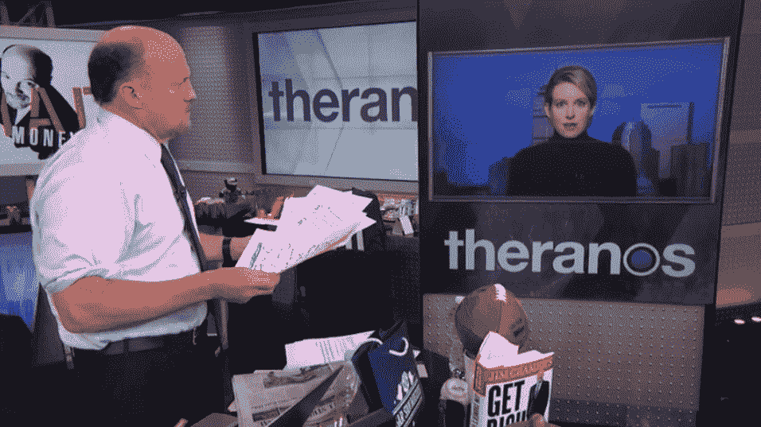

# Theranos:《纸牌屋》讲述了很多关于硅谷的事情

> 原文：<https://thenewstack.io/will-theranos-send-shockwaves-valley/>

今年见证了前硅谷宠儿、总部位于帕洛阿尔托的验血初创公司 Theranos 及其精力充沛的千禧一代联合创始人[伊丽莎白·霍姆斯](http://www.nytimes.com/2016/07/09/business/theranos-elizabeth-holmes-ban.html?_r=0)的惊人失宠。Theranos 的估值一度超过 90 亿美元，现在已经成为网上大量嘲讽的目标。或许 Theranos 的故事也包含了一个关于我们整个科技文化的更大的教训。

虽然该公司最初承诺可以通过一次血液穿刺进行数百种廉价的医疗测试，但该公司并不坦诚的是它的测试——这在沃尔格林是可用的！—据报道，依靠使用其他公司的技术来维持运营。

Thrillist.com[开玩笑说:“这就是为什么你不应该让一个 19 岁的辍学生经营一家医药公司。”。](https://www.thrillist.com/health/nation/elizabeth-holmes-theranos-news-scandal)

> 《纽约客》引用伊丽莎白·霍姆斯的话说:“进行化学实验是为了发生化学反应，并通过与样品的化学反应产生信号，然后转化为结果，再由经过认证的实验室人员进行审查。”。

这个月有两个对该公司重大失误的新的潜水，如*名利场*发表了[尼克·比尔顿](https://twitter.com/nickbilton)的观点，“[伊丽莎白·霍姆斯的纸牌屋是如何倒塌的](http://www.vanityfair.com/news/2016/09/elizabeth-holmes-theranos-exclusive)”，以及他的在线后续文章，“[我如何找到 Theranos 混乱的根源](http://www.vanityfair.com/news/2016/09/nick-bilton-on-theranos)”

仍然有很多令人挠头和痛苦的尝试来确定到底哪里出了问题。是公司的董事会吗？“就连董事会本身也让我挠头，”Theranos 的一名员工告诉 Bilton。"为什么是一个 92 岁的国务卿在管理这个委员会？"

或者这个问题因代际差异而加剧了？然而——另一篇《名利场》的文章，乔恩·凯利的这篇文章认为四面楚歌的福尔摩斯“以千年的方式”进行了反击:

*“占美国人口四分之一的千禧一代，不仅仅是知道如何使用 Snapchat 的人……对于那些寻找硅谷正在发生的事情的略带愤世嫉俗的解释的人来说，看看一个繁荣的生态系统就知道了，这个生态系统由 20 多岁的年轻人向 50 多岁的富裕阶层推销关于未来的想法。”*

也许罪魁祸首是商业世界本身？《名利场》指出，Theranos 雇佣了数百名营销、销售和沟通专家。凭借强大的火力，他们最终说服亚利桑那州通过了一项法律，允许未经医生许可的医学检查。“这项法案从头到尾都是‘有线’的，”亚利桑那州医学协会当时抱怨道，“多亏了实验室巨头 Theranos 的强力游说……”

“亚利桑那州深受 Theranos 虚张声势之害，”[写道](http://tucson.com/news/local/columnists/steller/tim-steller-arizona-fell-hard-for-theranos-bluff/article_48408431-d8f5-5c2d-907f-6e1bfe547bd8.html)专栏作家蒂姆·斯特勒为*亚利桑那州每日星报*，现在[带着怀疑的眼光回顾](http://tucson.com/news/local/columnists/steller/tim-steller-arizona-fell-hard-for-theranos-bluff/article_48408431-d8f5-5c2d-907f-6e1bfe547bd8.html)。斯特勒指责州立法者未能“保护亚利桑那州的消费者”——尽管一名代表在辩护中指出，亚利桑那州的大多数立法者确实有白天的工作，并且还在该州的公民立法机构中服务，“他们每年的工资是 24，000 美元”。"

## 傲慢和喧闹

对比尔顿来说，Theranos 象征着“硅谷如何能够复制一场大型的信心游戏，在这场游戏中，企业家、风险资本家和科技媒体假装互相审查，而实际上，它们在一台设计成不质疑任何事情的机器中充当齿轮——并在整个过程中互相支持……最终，说废话不符合任何人的利益。”

“我认为硅谷是以这样一种方式建立的，许多人真的在那里赚钱，”比尔顿后来在最近美国消费者新闻与商业频道商业节目 Squawk Alley 的一次露面中说。“这并没有错，但这么长时间以来，他们一直在到处说他们要改变世界，让世界变得更好，但他们大多数人都没有，他们只是想变得更富有。”

“然后伊丽莎白·霍姆斯出现了……她实际上正在为一家被认为正在改变世界的公司工作，人们就像这样，‘好吧，这太完美了。比尔顿说:“这符合我们长期以来的小故事。"本质上，这是他们告诉所有人闭嘴的方式。"

其他人质疑科技媒体的角色。在 2015 年将她列为最富有的白手起家的女性之后，福布斯不得不在今年 6 月重新调整他们对霍尔姆斯净资产的评估——将[降到零](http://www.forbes.com/sites/matthewherper/2016/06/01/from-4-5-billion-to-nothing-forbes-revises-estimated-net-worth-of-theranos-founder-elizabeth-holmes)。“投资者拥有优先股，这意味着他们在拥有普通股的霍姆斯之前获得回报，”福布斯冷淡地指出。

Theranos 给世界带来了一样东西:戏剧。好莱坞已经感觉到了它的潜力，在《饥饿游戏》明星詹妮弗·劳伦斯和编剧亚当·麦凯签署了该项目后，好莱坞在派拉蒙、华纳兄弟、20 世纪福克斯和温斯坦公司等公司之间发起了一场大规模的竞购战，是《大空头》的导演，也是该片的编剧之一。

 *但也许，套用亚伯拉罕·林肯的话，你不可能一直愚弄所有的科技记者。实际上，美国消费者新闻与商业频道声称已经准确地指出了“[那句导致 90 亿美元初创公司 Theranos](http://www.cnbc.com/2016/09/06/this-may-be-the-quote-that-doomed-9-billion-startup-theranos.html) 破产的话。”她告诉《纽约客》,“进行化学反应是为了发生化学反应，并从与样本的化学反应中产生信号，该信号被转化为结果，然后由经过认证的实验室人员进行审查。”这引起了《华尔街日报》记者约翰·卡瑞鲁的第一次怀疑——随之而来的是一场审查风暴。

“她应该只说‘这是魔法！’一位美国消费者新闻与商业频道的评论者开玩笑说。尽管另一位读者采取了更直接的方式来指责。

“导致 Theranos 灭亡的不是这句引言，而是技术本身。这是一个骗局，句号。”

<svg xmlns:xlink="http://www.w3.org/1999/xlink" viewBox="0 0 68 31" version="1.1"><title>Group</title> <desc>Created with Sketch.</desc></svg>*