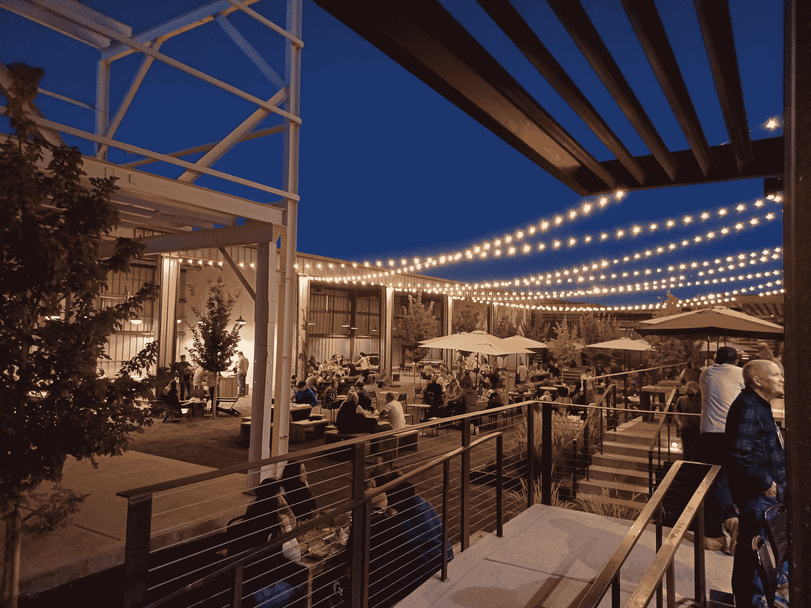

# 在家工作会毁掉这座城市吗？

> 原文：<https://thenewstack.io/will-working-from-home-kill-the-city/>

英特尔最近宣布将出售其位于圣何塞的庞大的四栋建筑园区，该园区拥有 8700 名员工。这是 9 月份在[发表的一篇论文](https://www.nber.org/system/files/working_papers/w30526/w30526.pdf)“在家工作和办公室房地产启示录”中记载的一个更大的现象的一部分，该论文由著名的非营利研究机构国家经济研究局(或称 NBER)出版。

该论文由哥伦比亚大学商学院(Columbia University ' s business school)房地产/金融教授斯蒂安·范·纽伯格(Stijn Van Nieuwerburgh)撰写，论文得出结论称，疫情“对写字楼的当前和预期未来现金流都产生了巨大影响”，并预测仅纽约市就面临写字楼价值下降 39%——“价值损失 4530 亿美元”

这一损失有着广泛的影响，首先是在家工作的革命如何伤害了市中心经济的其他部分，最终降低了城市的税收收入。就在去年 8 月，根据在线预订服务 OpenTable 的数据(引用自 NBER 的论文)，旧金山和纽约的餐厅访问量已经从疫情之前的水平大幅下降，分别下降了 41%和 37%。

一月份,《华盛顿邮报》的编辑委员会甚至为这个更大的问题设计了一个吸引人的名字:“[死亡的市中心](https://www.washingtonpost.com/opinions/2023/01/19/downtowns-cities-how-to-revive/) …办公室职员仍然在行动中失踪。”

他们指出，纽约、洛杉矶和华盛顿特区的办公室占用率比 2019 年下降了 40%以上。旧金山标准报 12 月的一份报告还指出，旧金山未来六年的预算预测包括超过 10 亿美元的商业财产税收入损失。“这些损失主要归咎于私营公司的远程工作政策。"

“但是痛苦并没有就此结束。正如该市经济学家特德伊根(Ted Egan)在委员会会议上指出的那样，办公空间行业对旧金山 GDP 的贡献约为 72%，这意味着“如果办公行业发生任何事情，它几乎会波及该市经济的各个方面。”"

NBER 的论文推断出了最大的危险。填补税基的漏洞需要增加税收或者削减公共服务——两者都不是一个有吸引力的选择。该报告警告说，由于现在在家工作更容易了，如果人们对一个城市的税率或犯罪率不满意，他们也更容易搬出城市。因此，对于城市来说，被迫提高一个或另一个“风险激活财政厄运循环。”

事实上，本周纽约时报[指出](https://www.nytimes.com/2023/03/15/opinion/post-pandemic-cities-suburbs-future.html)美国大部分主要城市已经“面临着一个令人生畏的未来，因为中产阶级纳税人加入了涌向郊区的人群，他们选择远程工作，因为他们离开了被空荡荡的办公室、空置的零售空间和不断恶化的税基所破坏的市中心。”

《华盛顿邮报》编辑委员会[最近警告说，“市中心正处于十字路口”。](https://dailyprogress.com/cities-must-stop-making-this-mistake-to-revitalize-downtowns/article_aaa44426-bba0-11ed-a9c4-dbeca253706c.html)

## 震撼郊区

人口学家、布鲁金斯高级研究员威廉·弗雷(William Frey)告诉《纽约时报》,从 2015 年到 2019 年，向郊区的移民数量一直保持稳定——但随后在疫情的第一年，这一移民数量激增(主要是因为人们离开了城市)。那些前往郊区的人往往是收入最高的人——从科技、金融和房地产行业——带走了他们的所得税和财产税。

斯坦福大学经济学家 Nicholas Bloom 告诉《T4 时报》,每个大城市都有专业人士和管理人员搬到郊区。一旦在他们郊区的家中安顿下来，他们就可以在家工作，享受额外的空间和舒适，同时仍然在“混合”工作时间表的通勤距离之内。

但布鲁姆实际上认为“这对城市来说大多是好事——更年轻、更时尚、收入更低的人、基本服务人员、零售人员都更有能力负担得起市中心的住宿。

“银行家、技术人员和其他毕业生纷纷涌向郊区。这使得城市更加年轻，更加多样化，减少了中产阶级化。”

这是一种趋势，你可以从多项统计数据中看到。在最近的一次管理层简报中，布鲁姆引用了 Zillow 的数据，称郊区的租金和房价从 2021 年初开始大幅上涨，直到 2022 年底才会稳定下来。公共交通出行仍然没有从 2020 年下降 80%的趋势中恢复过来。Bloom 引用了国家运输数据库的数据，显示他们仍然比疫情前的水平低了三分之一。城市甚至失去了购买商品的零售税(他们现在在郊区购买商品)。布鲁姆估计，这笔收入正从旧金山转移到附近的县

那么它通向哪里呢？休斯顿城市改革研究所的执行主任乔尔·科特金最近发表了一篇文章，警告美国的大城市“正在走向衰败”根据美国人口普查局的数据，在美国最大的城市，17.4%的人口生活在贫困线以下(引自[《福布斯》最近的一篇文章](https://www.forbes.com/sites/andrewdepietro/2021/11/26/us-poverty-rate-by-city-in-2021/?sh=3bbca1385a54))。虽然城市曾经是“向上流动的引擎”，科特金写道，他们正在努力分配这些收益，并补充道，“也许毫不奇怪，[移民](https://heartlandforward.org/case-study/the-emergence-of-the-global-heartland/)和[少数民族](https://urbanreforminstitute.org/wp-content/uploads/2020/10/URI-Upward-Mobility-Report_2020.pdf)正在前往美国的郊区、蔓延的阳光地带城市和较小的城镇。”

科特金认为，城市无法与郊区、远郊和位于城市核心外围的所谓“花园城市”竞争。除了提供更短、更节能的通勤，它们也“越来越多地成为拥有自己繁荣的城镇中心和文化场所的地方。”(尽管在文章的结尾，科特金暗示，虽然城市失去了他们的霸主地位，但他们仍然可以看到“建立在旅游业基础上的复苏”，并指出“纽约和芝加哥都计划建造大型赌场——这种孤注一掷的方式很少带来稳固的经济成果。”)

“尽管城市地区可能会复兴，但它们将不再是无与伦比的人口、经济实力和创新中心。游戏已经改变，为了生存，城市必须学会适应。因为如果他们不这样做，古罗马的命运就等着他们。”

## 办公室能变成公寓吗？

可能有解决的办法。虽然《华盛顿邮报》的编辑委员会在 1 月份提出了“[幽灵市中心](https://www.washingtonpost.com/opinions/2023/01/19/downtowns-cities-how-to-revive/)可能导致犯罪和无家可归者增加”的前景，但他们也指出，“开发商和投资者越来越有兴趣参与办公室到公寓的革命。”两个月后，该报董事会在另一篇社论中重提这一想法。它指出，像亚特兰大和华盛顿特区这样的城市已经在考虑这个想法，甚至宣布了新居民数量的具体目标，或者为办公室到公寓的转换提供税收优惠。

据*经济学家*报道，纽约市已经[考虑对将办公室改造成住宅空间的房东进行税收减免](https://www.economist.com/united-states/2023/01/05/eric-adams-and-kathy-hochul-have-grand-plans-for-new-york-city)，以及限制较少的分区法。[商业观察家](https://commercialobserver.com/2022/12/gfp-closes-25-water-street-251m/)*报道，纽约市现在已经有一个新的 2.5 亿美元的重建项目，将一栋 22 层的办公楼改造成一栋 1300 个单元的公寓楼，这是美国同类交易中最大的一笔。*

 *三月初 Axios 报道说华盛顿特区也有 383 套新公寓单元正在建设中，还有 2105 套计划在即将到来的项目中，还有几个项目仍在保密中

该市承诺，如果 15%的住房是经济适用房，就可以减税…

2019 年，在新墨西哥州，阿尔伯克基市将一个木材场改造成了 hip Sawmill Market food hall，这是一个拥有公共餐桌的社交中心。

虽然希望是存在的，但城市仍然面临着大量未改造的办公楼。除了不断上升的抵押贷款利率,*邮报*的编辑委员会指出，开发商面临着一个更大的不利因素:“容易改造的建筑——那些空置的、位于光线充足的地段和小巷的建筑——大部分已经被铲平了……剩下的是需要大量改造或拆除的困难房产。”

一月份，经济学家与商业房地产分析公司 Green Street 的股票研究分析师 Dylan Burzinski 进行了交谈，他计算出在曼哈顿的 4 . 2 亿写字楼市场中，[只有 2000 万平方英尺可以转化为住宅空间](https://www.economist.com/united-states/2023/01/05/eric-adams-and-kathy-hochul-have-grand-plans-for-new-york-city)。(“没有窗户的公寓还是没有厨房的公寓？我不认为这是个好主意。”)

据开发公司 Willco 的负责人加里·科恩(Gary Cohen)说，虽然没有窗户，但一些开发商可能会尝试提供阳光充足的内部庭院。在最近与 Axios 的[采访中，科恩承认让老建筑符合标准的成本变得很高。](https://www.axios.com/local/washington-dc/2023/03/06/dc-office-to-residential-conversion-downtown)

但是尽管需要升级管道系统，改造仍然比从零开始要便宜——而且通常也更便宜。《华盛顿邮报》的编辑委员会敦促发挥领导力和创造力，称之为“为未来重塑市中心的千载难逢的机会。”

或者，正如他们在一月份所写的，“美国的城市已经成熟，可以建造新的天际线和新的街景。最好的领导者将很快开始工作…

“看到起重机和脚手架很快搭建起来是成功的关键。城市领导人必须开始这样思考。”

<svg xmlns:xlink="http://www.w3.org/1999/xlink" viewBox="0 0 68 31" version="1.1"><title>Group</title> <desc>Created with Sketch.</desc></svg>*