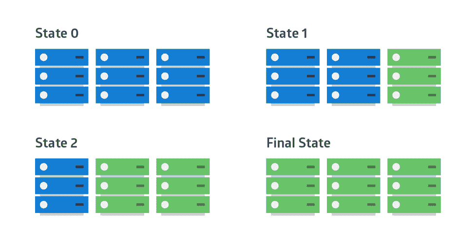
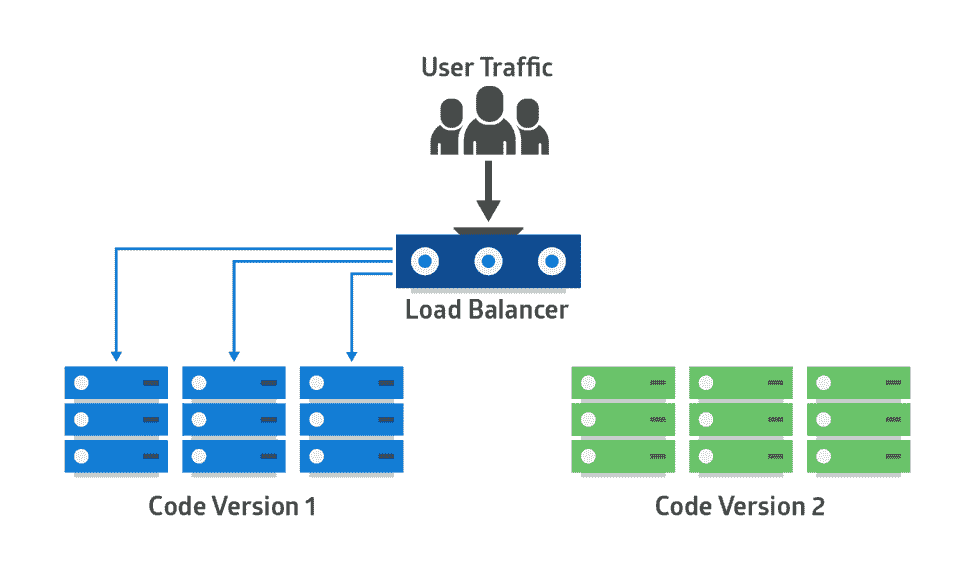
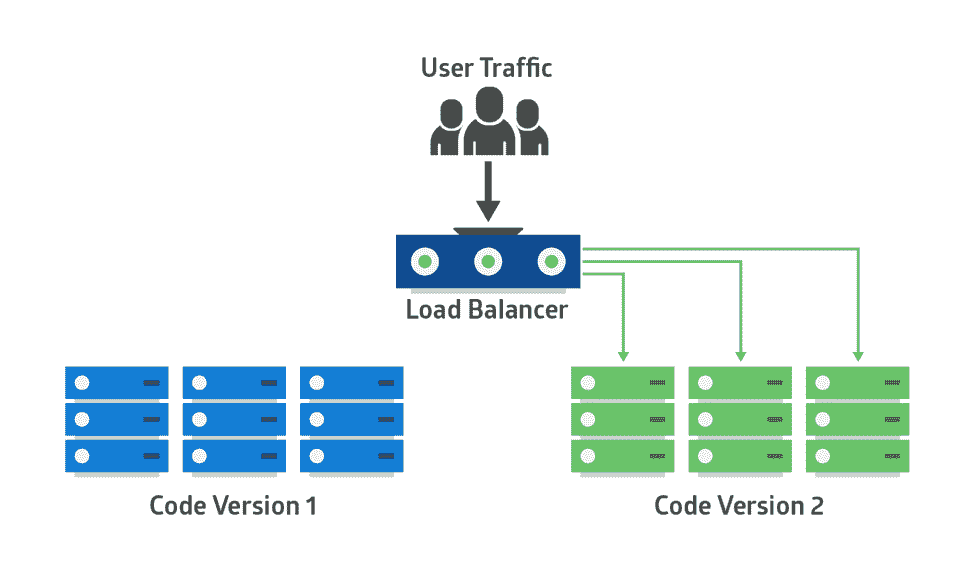
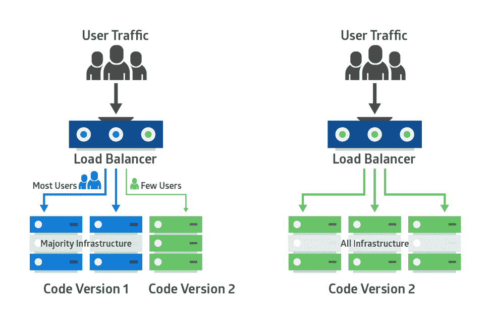

# 现代应用的双赢部署策略

> 原文：<https://thenewstack.io/win-win-deployment-strategies-for-modern-apps/>

 [杰森·斯科沃龙斯基

杰森代表 Rollbar 写作，在那里他担任技术内容的首席编辑。他最初是亚马逊的一名软件开发人员，现在喜欢成为最新技术的开发者倡导者。](https://rollbar.com/) 

[Rollbar](https://rollbar.com/) 赞助本帖。

今天，现代应用程序需要频繁更新，以快速的周转时间交付业务目标。长达数月或数年的发布周期已经一去不复返了。现代应用程序可能在短时间内每天部署多次。这使得企业能够更加灵活地做出改变，从而更快地实现业务价值。现在，产品团队可以快速迭代产品的新版本，测试对关键指标的影响，并立即修复问题。

更快的增量部署还可以分离开发团队，使他们可以并行工作。这可以提高开发团队的效率。随着面向服务的架构和微服务的出现，我们可以并行部署对多个服务的更改，而不会出现停机或服务中断。

然而，这也给运营团队带来了新的挑战。随着部署越来越频繁，部署的代码更有可能对站点可靠性或客户体验产生负面影响。

制定部署代码的策略以最小化产品和客户的风险是很重要的。在本文中，我们将讨论一些部署策略、最佳实践和工具，它们将使您的团队更快、更可靠地工作。

## 现代应用的挑战

现代应用程序通常是分布式的和基于云的。它们可以弹性扩展以满足所需的需求，并且由于具有高可用性的体系结构，它们对故障的恢复能力更强。他们甚至可以使用完全托管的服务，如平台承担部分运营责任的 [AWS Lambda](https://aws.amazon.com/lambda/) 或[弹性容器服务(](https://aws.amazon.com/ecs/) [ECS](https://aws.amazon.com/ecs/) [)](https://aws.amazon.com/ecs/) 。这些应用程序几乎总是频繁发布。例如，一个移动应用程序或面向公众的网站可能会在一个月内经历多次更改。

 [萨德库尔·侯赛因

Sadequl 在云中使用数据库、大数据和分析技术。他住在澳大利亚悉尼，是一名专业的博客写手和现代科技话题培训师。](https://rollbar.com/) 

这些应用经常使用微服务架构，其中多个组件协同工作以提供完整的功能。不同的组件可以有不同的发布周期，但是它们必须无缝地协同工作。随着多个开发团队在整个代码库中并行地进行更改，很难确定问题的根本原因。

另一个复杂性来自基础设施层的抽象，现在被认为是代码。因此，部署新的应用程序可能意味着部署新的基础结构代码。

## 为什么要使用部署策略

如上所述，由于现代应用程序中有如此多的移动部件和如此多的变化，因此出错的机会更多。为了应对这一挑战，应用程序和基础架构团队需要设计并采用适合其用例的部署策略。

然而，一个特定的部署策略可能不适合所有的用例。新微服务的部署方法可能不是基于云的办公生产力套件部署的理想解决方案。

这就是为什么最好熟悉不同的部署技术。我们将回顾几种方法，并讨论每种方法的优缺点，您可以从中选择最适合您组织的方法。

## “大爆炸”部署

顾名思义，“大爆炸”部署可以在一次操作中更新整个或大部分应用程序。这是默认的方法，可以追溯到软件在物理介质上发布并由客户安装的时代。大爆炸部署要求企业在发布前进行广泛的开发和测试，通常与大型连续发布的[“瀑布模型”](https://en.wikipedia.org/wiki/Waterfall_model)相关。现代应用程序具有在客户端或服务器端定期自动更新的优势。因此，对于现代团队来说，这种大爆炸式的方法更慢，也更不敏捷。

大爆炸部署的特点是:

*   所有主要部分都打包在一个部署中；
*   它在很大程度上或完全用新的软件版本替换现有的软件版本；
*   部署通常是长时间开发和测试周期的结果；
*   它假设失败的可能性极小，因为回滚可能是不可能的或不切实际的；
*   完成时间通常很长，需要多个团队的努力；
*   可能需要客户端采取措施来更新客户端安装。

Big bang 部署不适合现代应用程序，因为这种风险对于面向公众或业务关键型应用程序来说是不可接受的，在这些应用程序中，停机意味着巨大的财务损失。回滚通常成本高昂、耗时，甚至是不可能的。

大爆炸方法可能适用于非生产系统(例如，重新创建开发环境)或供应商打包的解决方案，如桌面应用程序。

## 滚动部署

滚动、分阶段或分步部署优于大爆炸式部署，因为它们最大限度地减少了许多相关风险，如用户面临的停机时间，且不容易回滚。在滚动部署中，旧版本的应用程序会逐渐被新版本取代。新老版本将共存，不会影响功能或用户体验。实际部署需要一段时间。此外，很容易回滚任何与旧组件不兼容的新组件。

下图显示了集群中每台服务器的旧版本显示为蓝色，新版本显示为绿色的模式。

滚动部署的一个例子是应用程序套件的升级。如果最初的应用程序部署在容器中，升级可以一次处理一个容器:修改每个容器以从应用程序供应商的网站下载最新的映像，然后重新创建容器。如果其中一个应用程序存在兼容性问题，可以使用较旧的映像来重新创建容器。在这种情况下，套件应用程序的新旧版本共存，直到所有应用程序都升级。

## 蓝绿色、红黑色或 A/B 部署

这是另一个万无一失的过程。在这种方法中，并行使用两个相同的生产环境。一个是接收所有用户流量的当前运行的生产环境(显示为蓝色、红色或 A)，另一个是它的克隆，但处于空闲状态(绿色、黑色或 B)。两者都使用相同的数据库后端和 app 配置。设置如下所示:

新版本的应用程序部署在绿色环境中，并经过功能和性能测试。一旦测试结果都是好的，应用流量从蓝色路由到绿色。绿色成为新的产品。

如果在绿色变为活动状态后出现问题，流量可以被路由回蓝色。

在蓝绿色部署中，两个系统使用相同的持久层或数据库后端，因此有必要保持应用程序数据同步。您可以使用镜像数据库来实现这一点。您可以使用蓝色的主数据库进行写操作，使用绿色的辅助数据库进行读操作。在从蓝色切换到绿色的过程中，数据库从主数据库故障转移到辅助数据库。如果 green 在测试期间也需要写入数据，那么数据库可以处于双向复制状态。

一旦绿色变为活动，您可以关闭或回收旧的蓝色实例。您可以在这些实例上部署一个较新的版本，并使它们成为下一个版本的新绿色。

蓝绿色部署依赖于流量路由。这可以通过更新主机的 DNS CNAMES 来实现。但是，更改可能会被长 TTL 值延迟。或者，您可以更改负载平衡器设置，更改会立即生效。像 ELB 的连接排水这样的特征可以用于服务飞行中的连接。

## 金丝雀部署

金丝雀部署就像蓝绿色，除了它更规避风险。你可以使用分阶段的方法，而不是一步到位地从蓝色切换到绿色。

使用 canary 部署，您可以在生产基础设施的一小部分中部署新的应用程序代码。一旦应用程序被签署发布，只有少数用户被路由到它。这将最小化任何影响。如果没有报告错误，新版本将逐步推广到基础设施的其余部分。下图显示了这一点:

canary 部署的主要挑战是设计一种方法将一些用户路由到新的应用程序。此外，一些应用程序可能总是需要同一组用户进行测试，而其他应用程序可能每次都需要不同的组。

设计路由新用户的方法可以通过几种技术来实现:

*   在允许外部用户访问之前，将内部用户暴露给 canary 部署；路由可以基于源 IP 范围；
*   仅在某些地理区域发布应用程序；
*   使用应用程序逻辑为特定用户和组解锁新功能。当应用程序对其他用户开放时，这个逻辑就被删除了。

## 部署最佳实践

现代应用程序团队可以遵循许多最佳实践来将部署风险降至最低。

*   使用**部署清单**。例如，清单中的一项可以是“仅在应用服务停止后备份所有数据库”像这样的项目可以防止数据损坏；
*   使用**持续集成(CI)** 。CI 确保签入代码存储库的特性分支的代码只有在通过了一系列的依赖性检查、单元和集成测试以及成功的构建之后，才与其主分支合并。如果在这个过程中出现错误，构建就会失败，应用团队会得到通知。因此，使用 CI 意味着对应用程序的每一个更改都要在可供部署之前进行测试；
*   使用**连续传送(CD)** 。使用 CD，CI 构建的代码工件被打包并部署在一个或多个环境中。因此，增量部署将风险降至最低；
*   使用**标准操作环境**确保环境一致性。开发工作站和服务器可以使用类似于 vagger 和 Packer 这样的工具；
*   使用**构建自动化**工具，如 CloudFormation，来自动化环境构建。只需点击一个按钮，就可以拆除整个基础架构堆栈并从头开始重建；
*   在目标服务器中使用**配置管理**工具，如 Puppet、Chef 或 Ansible，自动应用操作系统设置、应用补丁或安装软件；
*   使用类似 Slack 的**通信渠道**自动通知不成功的构建和应用程序失败；
*   有一个流程用于**提醒**负责团队部署失败。理想情况下，您将在 CI 环境中发现这些问题，但是如果更改被部署到 prod，您将需要一种方法来通知负责的团队，以便他们可以修复问题；
*   考虑**自动回滚**未通过可用性和错误率健康检查的部署。

## 部署后监控

尽管尽了最大努力并仔细规划，部署仍可能经常出错。因此，最好在部署后使用工具来监控应用程序性能和错误。

应用性能监控(APM)解决方案将为您提供一种监控关键性能指标的方法，例如部署后的服务器响应时间。应用程序逻辑或系统架构的变化会极大地影响应用程序的性能。当这些更改超出您的服务级别目标(SLO)时，您需要您的运营团队进行调查，并可能回滚。

在实践 CI/CD 时，像 [Rollbar](http://rollbar.com/) 这样的错误监控解决方案同样重要。它将迅速通知您的团队，并让他们了解可能会对客户体验产生负面影响的新错误。新的或重新激活的错误可能表明代码中存在需要开发人员注意的错误。错误监控允许您在问题被报告给支持或销售团队之前主动修复这些问题。它还将通过将错误指向导致错误消息的代码更改，帮助您的团队更快地解决错误。

有了正确的部署策略和工具，您的团队应该能够满怀信心地更频繁地发布产品，并交付出色的客户体验。

通过 Pixabay 的特征图像。

<svg xmlns:xlink="http://www.w3.org/1999/xlink" viewBox="0 0 68 31" version="1.1"><title>Group</title> <desc>Created with Sketch.</desc></svg>