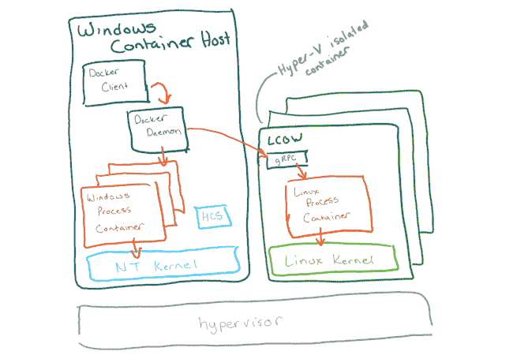

# 用于 Linux 的 Windows 子系统为 Windows 带来了完整的 4.19 内核

> 原文：<https://thenewstack.io/windows-subsystem-for-linux-brings-the-full-4-19-kernel-to-windows/>

一段时间以来，微软一直试图吸引全栈开发人员使用 Windows。在 Windows 上本地运行 Linux 二进制文件的 Windows Linux 子系统(WSL)是一个受欢迎的开端。有 350 万活跃的开发人员在使用 WSL，它在 Windows 10 的每六个月更新中得到了改进，比如能够同时安装和使用多个 Linux 发行版，以及在 Windows 中编辑 Linux 文件而不会损坏它们。但这还不足以提供完全的兼容性。

因此，对于将于 6 月份向 Windows 内部人士提供的下一个版本，微软正在转向在 Windows 中运行完整的 Linux 4.19 内核，以支持 Linux 二进制文件。

WSL 2 承诺对文件 IO 性能进行急需的改进，以及对 Docker 的本机支持，从而简化 Linux 容器的使用。但它也使 Linux 在 Windows 上完全兼容，这是 Windows 所能提供的一个重大转变。

“WSL 是许多 web 开发人员(在 Windows 中)花费时间的地方。现在我们有了纯 Linux 内核，所以你得到了更高的兼容性，”Windows 开发者平台的公司副总裁凯文·加洛告诉新的堆栈。

“文件性能一直是个大问题；我们正在解决。我们正在对 Windows 上的 Linux 容器进行大规模改进，性能和兼容性显著提高，”Gallo 说。“您不需要虚拟机来运行 Docker 的 Linux 版本，这样可以减少内存占用，提高执行速度和启动时间。LCOW 有点笨拙，但是一旦我们得到原生 Docker 支持，它就会变得无缝。作为一名开发人员，你可以尽可能地接近生产，在 WSL 上运行 Docker，并直接在其上进行调试。”

## WSL 2 如何工作

“从体验和用户的角度来看，WSL 2，顾名思义，只是一个更好的 WSL，”[泰勒布朗](https://www.linkedin.com/in/taylorbro/)，Windows 上的容器和虚拟化的主要项目经理，向新的堆栈解释；但是它的工作方式是非常不同的。

“在 WSL 将 Linux 系统调用翻译成相应的 Windows APIs 的情况下，WSL 2 运行一个非常轻量级的 Hyper-V VM(与我们用于 Hyper-V 隔离容器的类型相同),它具有完整的 Linux 内核，因此不会发生系统调用翻译。它解决了许多顶级功能需求(文件系统性能和 ABI 兼容性)，并让我们走上了解决更多需求的架构之路。”

WSL 2 建立在微软为使 Windows 上的 Linux 容器(通常称为 LCOW)在 Azure 上良好工作所做的工作之上。“轻量级 Hyper-V VM、9P 文件系统桥甚至内核都大量借鉴了我们在 Azure 中与 [LCOW 一起使用的内核，”这是一种为 Plan 9 分布式操作系统开发的协议，用于为 WSL 桥接 Windows 和 Linux 文件系统。](http://man.cat-v.org/plan_9/5/intro)

如果你在 WSL 中使用多个 Linux 发行版，每个发行版都将在自己的 VM 中运行。“然而，这些虚拟机使用虚拟分配的内存，启动不到一秒钟，停止甚至更快，因此体验和开销与 WSL 相当(甚至更好)，”Brown 说。

性能会比 WSL 好，尤其是文件。“Linux 的 IO 模式与 Windows 有很大不同，这正是 NTFS 的优化之处；NTFS 在大文件 IO 方面非常出色，因此它非常适合 ETX4 非常适合小文件 IO 的数据库。在 WSL 2 中，Linux 文件系统现在直接在虚拟 pmem 设备上使用 EXT4，因此我们在 Linux 端获得了 Linux 原生文件系统性能，在 Windows 端获得了 Windows 原生文件系统性能(两全其美)。借助 9P 桥，我们可以将它们连接在一起，获得出色的集成体验。”

## 使用 WSL 2

尽管有这些变化，开发人员使用 bash 和其他 Linux 工具的体验将与今天的 WSL 相同。Brown 证实道:“开发人员喜欢的 WSL 功能(如共享文件/文件夹)通过使用 9P 协议的文件系统桥得到了充分的维护，所以 WSL 2 可以看到所有的 Windows 文件和文件夹，你也可以从 Windows 看到你的 Linux 挂载。”

Cron 作业和持久守护进程的工作方式与当前的 WSL 相同，但网络套接字会有一些变化，这些变化仍在开发中。“由于我们使用的是虚拟机，WSL 2 中现在有一个网卡。我们使用我们的 NAT 网络模式，以便 NIC 完全由主机管理和协调，但它有自己的 IP。我们现在正在做的是自动映射套接字，以便体验与 WSL 相同，但我们认为对于预览版来说，当前的体验是可以理解的，并为我们提供了真正有价值的反馈。”

图片由微软提供。

WSL 2 使 Windows 与 Linux 完全兼容，至少在内核 ABI 层是如此，但是微软将向开发者社区寻求 WSL 中应该包含哪些内核模块。“在 WSL 中不工作的 iSCSI 目标可以在 WSL 2 中工作，但是需要包含适当的模块，”Brown 解释道。

WSL 2 最初将通过 Insider 计划用于 Windows 10，因此开发人员可以试用它，并提供关于内核模块等功能的反馈。Brown 指出，在 9P 性能投入普遍使用之前，还有很多工作要做，还有网络套接字的自动映射。

我们的计划是将 WSL 2 及时引入 Windows Server，两者上的 Linux 内核将像其他 Windows 组件一样自动更新和服务。由于 Hyper-V 的嵌套虚拟化，你将能够在 Azure 上的 VM 中使用 WSL 2；尽管 WSL 2 是基于为 Azure 所做的 LCOW 工作，但它本身并没有被 Azure 平台所使用。

## Visual Studio 代码和 WSL 2

像 Docker 这样的工具将能够构建在 WSL 2 之上。“今天，Docker Desktop 创建并管理他们自己的 Linux 虚拟机；有了这些经验，他们将能够直接使用 WSL 2 来提高性能和可靠性，”Brown 说。

原生 Docker 支持也将通过针对 WSL 和 Docker 容器的 [Visual Studio 代码](https://code.visualstudio.com/blogs/2019/05/02/remote-development)简化远程调试。新的[远程开发扩展包](https://aka.ms/VSCodeRemoteExtensionPack)在 Visual Studio 代码可以连接的目标环境中运行一组开发服务；这些服务安装在远程环境而不是本地 Windows 环境中运行的工作区扩展，因此它们可以检测可用的语言和运行时，并在 ide 中提供适当的代码完成和林挺。

“Visual Studio 代码远程调试允许你直接连接到一个现有的容器，今天[Windows 上的 Visual Studio 代码可以运行在 Windows 的 node.js](https://code.visualstudio.com/docs/nodejs/nodejs-debugging#_remote-debugging) 上，但不能运行在 WSL 上，”Gallo 解释道。如果在 Linux 环境中启动 Visual Studio 代码，它将调试该 Linux 环境；以前，您必须启动虚拟机，但现在它可以直接连接到启动它的环境。”Visual Studio 代码命令和扩展直接在您启动它的 Linux 发行版中运行，因此开发人员不必担心路径问题，并且您可以在 WSL 和 mounted 中编辑文件

这是 Visual Studio 代码用户一直要求的功能；Visual Studio 代码库中第三个被评论最多的问题是支持在 WSL 中从 bash 启动 IDE，它可以与当前版本的 WSL 和 WSL 2 一起工作。

## Windows 桌面上的 Linux

当微软第一次想给 Windows 带来 Linux 二进制支持时，WSL 2 所依赖的容器支持并不可用，所以团队必须从给 WSL 的 Windows 内核添加 Linux syscall 支持开始。布朗指出，这总会有一些缺点。

“我们对系统调用翻译方法的一个担忧是一直在跑步机上——总是跟着 Linux 内核创建新的翻译——更具体地说，一些系统调用很难正确完成，在未来的某个时候，新的系统调用可能会出现，这是不可能的。这种架构摆脱了这一点，因为我们现在只是运行 Linux 内核，但在我们完全实现这一概念之前，我们为 Hyper-V 隔离容器进行了大量创新。”

如果 WSL 2 的新方法提供了承诺的完全兼容性和显著的性能改进，那么它将使 Windows 成为一个对任何开发人员都非常有吸引力的平台，无论他们正在从事什么工作。

事实上，Gallo 相信 WSL 2 会给开发者比在 Mac 上更好的 Docker 支持，因为他们不需要考虑自己运行 Linux VM。他建议，WSL 2 可以使 Windows 成为操作系统开发人员积极选择的工作平台，用于他们需要构建的任何云工作负载，而不仅仅是当他们为 Windows 平台编码时。

“随着新终端的所有改进，以及在新的 Edge 浏览器中开发基于 Chromium 的网站以进行前端企业开发的能力，我们认为与任何其他环境相比，端到端体验将是开发人员最具生产力的环境。”

<svg xmlns:xlink="http://www.w3.org/1999/xlink" viewBox="0 0 68 31" version="1.1"><title>Group</title> <desc>Created with Sketch.</desc></svg>