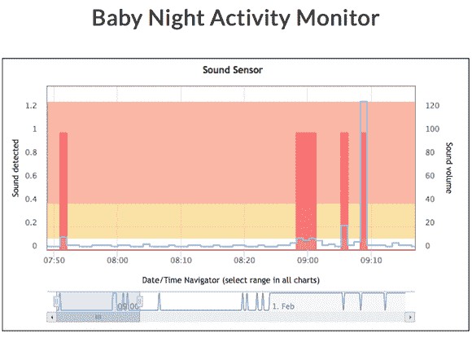

# 来自亚马逊物联网黑客大赛的声控无人机和其他创作

> 原文：<https://thenewstack.io/winners-announced-awss-iot-mega-contest/>

周四，亚马逊[宣布了其首次“](https://twitter.com/hacksterio/status/697845433968652288) [AWS 物联网大赛](https://aws.amazon.com/blogs/aws/hackster-aws-iot-mega-contest/)的获胜者，这是上个月与 [Hackster](https://www.hackster.io/) 联合举办的竞争性硬件黑客活动。

“有很多有创造力的人，”AWS 的首席布道者杰夫·巴尔在事后总结他所学到的东西时写道。就在四个月前，亚马逊[宣布了 AWS IoT](http://www.businesswire.com/news/home/20151008006261/en/Amazon-Web-Services-Announces-AWS-IoT) 平台。但是巴尔写的这个竞赛证明了“物联网现在就在这里。人们正在构建复杂而有用的设备、网站和应用程序。”

近千人参加。主持这些项目的 Hackster 目前正在展示获胜者。

第一名是两个结合了尖端技术和声音传感器的项目——当然，还有亚马逊的物联网平台。

一位名叫 Marian Mihailescu 的澳大利亚人创造了一个使用 RFID、红外线、光和声音传感器的系统来收集关于一个熟睡婴儿的数据。另一个一等奖由德克萨斯州奥斯汀的克里斯·希南获得，他通过将亚马逊 Echo 连接到他的树莓派上，创造了一架声控无人机。

Marian Mihailescu 的婴儿午睡(夜间活动计划)的灵感来自他自己作为新父母的经历。“让一个婴儿哭，却不知道如何更快地让她平静下来，可能会非常费力，”他在项目介绍中写道，“尤其是对那些轮流照顾婴儿的双职工父母来说。”他的系统使用一个声音传感器来测量婴儿的抽泣——持续时间和强度——并跟踪婴儿被抱了多长时间(以及父母是否在唱歌)。光传感器测量房间的环境光，而红外运动探测器测量房间的环境运动*。*

 * 
所有的传感器都连接到一个板上，这个板将它们的数据上传到 AWS，所以所有的数据最终都到达一个中央仪表盘。婴儿是否更喜欢某种色调的环境光？他会随着一首歌更快入睡吗？他的睡眠是否受到房间光线的影响？这些问题都有了答案。

“父母能够对婴儿的睡眠偏好进行明智的观察，”米哈伊尔斯库在[发表了一篇 2500 字的文章，解释他的项目](https://www.hackster.io/memeka/baby-nap-night-activity-program-aa5ab0?ref=challenge&ref_id=21&offset=0)，并补充说这些指标也可以回答这个非常重要的问题:“该轮到谁让婴儿睡觉了。”

另一个第一名的参赛作品将语音输入转换为 3D Robotics 的开源无人机 IRIS+ quadcopter 的遥控无线电信号。Chris Synan 使用亚马逊的“ [Alexa 技能工具包](https://developer.amazon.com/appsandservices/solutions/alexa/alexa-skills-kit)”为亚马逊的语音激活“Echo”个人助理设备构建了一个新的应用程序，将他的语音命令翻译成 Raspberry Pi 板的指令。无人机的无线电天线通过简单的 USB 连接安装到板上，最终结果是一种简单而有效的免提无人机飞行技术。Synan 用一段视频展示了他的项目，这段视频捕捉到了他与 Alexa 的对话，Alexa 是亚马逊自己版本的 Siri。

“Alexa，跟无人机说话。”

“欢迎使用无人机控制，”Alexa 回应道。

“命令:发射。”

"正在执行命令启动。"

无人机呼呼地飞起来，离开地面…

https://youtu.be/qpKgIJ5k7MQ

AWS 物联网大赛最终吸引了 985 名参与者，参与了 98 个不同的项目，分享了 293 个想法。每个进入的人都获得了一些 AWS 积分和支持，加上技术培训和自定进度实验室的积分，被描述为“价值 880 美元的好东西”。

此外，超过一半的项目获得了 100 美元——这是对前 50 个项目的承诺。十大项目还获得了亚马逊提供的特别奖——五个 Fire 电视棒，三个亚马逊 Echo 个人助理，两个高清 Kindle Fire 平板电脑。

除了指出这些项目需要许多不同的技能之外，Barr 还指出了是什么使这一挑战变得独特。

“连接到真实世界并在其中工作比在干净、抽象的虚拟机范围内运行要困难得多！”

* * *

# WebReduce

专题图片:AWS 物联网大赛季军 Aaron Parecki 的[神奇签到时钟](https://www.hackster.io/aaronpk/magic-checkin-clock-1eea2c?ref=challenge&ref_id=21&offset=6)项目。

<svg xmlns:xlink="http://www.w3.org/1999/xlink" viewBox="0 0 68 31" version="1.1"><title>Group</title> <desc>Created with Sketch.</desc></svg>*