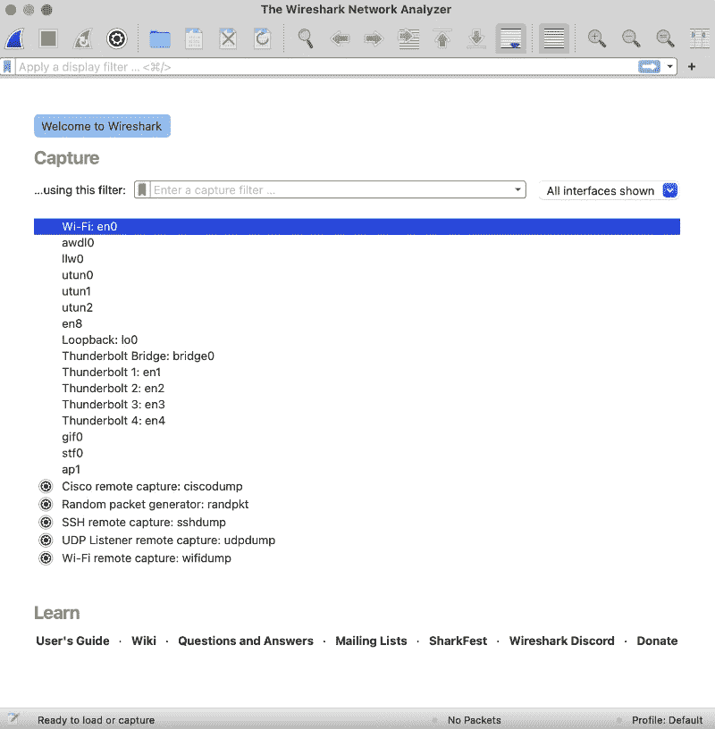

# Wireshark 以全新的基础庆祝 25 周年

> 原文：<https://thenewstack.io/wireshark-celebrates-25th-anniversary-with-a-new-foundation/>

毫无疑问，无数工程师和黑客都记得他们第一次使用 Wireshark 的时候，或者——如果他们稍微老一点——Wireshark 的前身 Ethereal。使用 Wireshark 的体验有点像罗伯特·胡克在 1665 年第一次使用[新开发的显微镜](https://education.nationalgeographic.org/resource/cell-theory/)观察细胞时的感受:曾经只是一个难以理解的包打开了，揭示了有用信息的宝库。

今年，受人尊敬的 Wireshark 已经 25 岁了，它的创造者们从这个大获成功的开源项目后退了一步，让更多的人来帮助管理。本月， [Sysdig](https://sysdig.com/) ，Wireshark 的当前赞助商，成立了一个新的基金会，将作为该项目的长期监管人。Wireshark 基金会[将存放 Wireshark 源代码和资产，并管理 Wireshark 开发者和用户大会](https://wiresharkfoundation.org/donate/) [SharkFest](https://sharkfest.wireshark.org/sfus/) (新加坡 4 月 17 日至 19 日和圣地亚哥 6 月 10 日至 15 日)。

创造者称该软件为“世界上最重要的流量协议分析器”,理由相当充分。仅仅在过去的五年里，它就被下载了 6000 多万次，并吸引了 2000 多名贡献者。今天，Wireshark 是免费的，可以在 GNU 通用公共许可证第二版下获得。

Wireshark 提供了数据包级别的网络流量，使用户能够更好地了解系统和[诊断问题](https://thedailywtf.com/articles/sharked)。内置强大的数据解析引擎只是吸引力的一半；可扩展的设计允许其他人轻松地为无穷无尽的新协议和数据格式提供插件。

当然，在 Ethereal 之前就有包分析器了，但是它们很贵。

当网络工程师 [Gerald Combs](https://www.linkedin.com/in/geraldcombs/) 于 1998 年在[发布第一个开源代码时，他为每个人民主化了 IP 数据包检测。几年后，当 WiFi 被引入时，Ethereal 被每个试图修复有问题的 WiFi 连接的系统管理员付诸行动。它也激发了整整一代黑客——友好的或不友好的——去嗅出不安全的无线连接。](https://www.wireshark.org/docs/wsug_html_chunked/ChIntroHistory.html)

“Wireshark 是我最喜欢的‘我告诉过你’工具。你无法想象它对网络故障排除有多有用，”一名黑客新闻评论员[兴奋地说。](https://news.ycombinator.com/item?id=17344342)

## 所有人的网络可观察性

库姆斯在堪萨斯城一家互联网服务提供商担任工程师时，出于故障排除的目的，创建了 Ethereal。当时，仅有的数据包嗅探器价格昂贵，ISP 也没有预算(可能高达数万美元)。

这是互联网商业使用的几年，所以当库姆斯发布 Ethereal 时，他立即开始从其他人那里获得贡献。

早期的贡献者之一是[Lois](https://www.linkedin.com/in/degio/)[Degioanni](https://www.linkedin.com/in/degio/)，他现在是云安全公司 [Sysdig](https://sysdig.com/) 的首席技术官和创始人。当时他在学校。他的计算机网络教授曾说过，了解网络的最好方法是观察网络。但是由于没有廉价的 Windows 包嗅探器，Degioanni 写了一个在 Windows 机器上捕获包的驱动程序，很多人立即开始使用 Ethereal。

Ethereal 成功的一个因素是它的可扩展性。它允许许多开发者并行工作，创建插件来运行在 Ethereal 的网络分析能力之上。Degioanni 说，通过这种方式,“项目很容易积累特性和功能，并以非常快的速度变得越来越有用。

不仅学生和业余爱好者做出了贡献，实际公司的工程师也做出了贡献，他们发现让一名工程师专门创建和管理一些晦涩难懂的协议更具成本效益，否则将需要更昂贵的工具进行分析。

然而，致命的用途来自新兴的无线(WiFi)网络。当它在 1999 年被引入家庭使用时，WiFi 仍然存在令人难以置信的问题。Degioanni 与 Combs 一起开发了一个插件，用于检查 Windows XP 上的 802.11 无线流量，名为[air cap](https://www.aircrack-ng.org/doku.php?id=airpcap)，这被证明对许多想知道为什么他们的数据包似乎在空中消失了的人很有帮助。

凭借无线技术，Ethereal 还吸引了黑客的注意，当他们带着笔记本电脑和 Ethereal 的副本坐在车外时，他们可以使用网络分析来拦截来自个人和公司的无线数据包。

“这不是一个社区，我们专门迎合，但它是一个委员会，发现这个工具是有用的，”库姆斯说。“我不知道安全行业抓住这一点有多意外。但看到这种情况如何发展是很有趣的。”

两人认为这个市场会有生意可做，所以他们开始创办 Cacetech(后来被 Riverbed 收购)来管理 Wireshark 和相关技术。库姆斯的前雇主持有 Ethereal 的商标，所以两人将这项技术分开，重新命名为 Wireshark。

今天，该软件正被广泛应用于各行各业，每个行业都有自己的一套古怪的协议和网络流量模式需要解决。Degioanni 说，当 Degioanni 在 2013 年推出 Sysdig 时，它立即将 Wireshark 用于帮助实时解析来自云提供商的日志数据。

在其核心，飘渺有一个动力解剖引擎。库姆斯说，你可以给它“这些数据块，它会把它们分解开来，并尽最大能力向你展示所有需要的各种位和字节”。“这还允许您应用过滤器和所有其他强大的功能。但问题是，引擎并不真正关心它是否是分组数据，它可以是你想要的任何类型的数据。”

例如，目前，Combs 正在寻求将其扩展到非 IP 数据源，如蓝牙和 USB 设备。

## 新基金会

除了其巨大的实用性，Wireshark 还在教育一代又一代的程序员和管理员网络如何工作方面发挥了作用。只要看看 GUI 在解码离线数据包时的样子，你就能感受到互联网实际上是如何工作的。

库姆斯说:“我认为教育人们进行低级分析是很重要的，无论是在数据包、系统事件还是系统调用中。”我认为这是非常重要的知识来传递和教育人们。"

库姆斯说，教育将是新的 Wireshark 基金会的主要任务之一，该基金会将为 Wireshark 提供正式的支持结构。今天，Wireshark 的主要收入来自它的会议；有了基金会，项目就能直接接受捐款。

这也将为库姆斯提供一些急需的缓解。迄今为止，库姆斯一直是主要的维护者，或者可以说是“温和的独裁者”。该基金会将把这种结构转变为更类似于良性民主的东西。

“你可以看出，我们所有人都开始有一点点白发了。在这一点上，很明显 Wireshark 足够大，足够与整个地球相关，它将在我们之后生存下来，”Degioanni 说。

<svg xmlns:xlink="http://www.w3.org/1999/xlink" viewBox="0 0 68 31" version="1.1"><title>Group</title> <desc>Created with Sketch.</desc></svg>