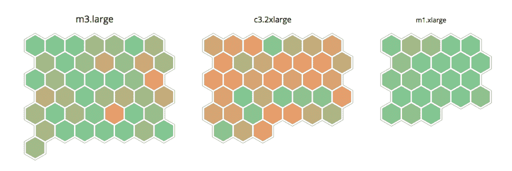

# 通过主机映射，Datadog 提供了一个横向扩展架构的视图

> 原文：<https://thenewstack.io/with-host-maps-datadog-offers-a-view-of-scaled-out-architectures/>

云监控服务 Datadog 引入了一个名为 Host Maps 的可视化工具，可以快速、轻松地查看您的主机和其中的任何问题。Datadog 的首席技术官亚历克西斯·lê-库科(Alexis lê-quc)说，它是为动态、高度分布、可扩展的架构设计的，在这种架构中，你用来提供服务的机器数量可以在一瞬间发生变化。

主机图显示的不是用圆圈连接的圆圈中的主机，而是描绘单个节点的六边形配置。

“我们希望 Host Map 能够独立扩展，无论是 50 个节点、100 个节点还是 10，000 个节点，”他说。

紧凑的六边形允许您识别问题区域，并确定问题服务器是否属于某个组。您可以按可用性区域、地区、实例类型、图像或您在公司使用的任何标记进行分组。

该工具允许您一次查看两个属性，由六边形的颜色及其大小表示。例如，增加机器上的负载可以设置为将六边形从绿色变为红色，那么使用的 IO 数量可以导致六边形增长或收缩。

“我们增加这一级别的过滤和分组的原因是，我们希望您能够以非静态的方式深入您的基础架构，”lê-quc 说。“假设您在 AWS 上运行，分布在五个地区和 20 个其他[属性]。这是对您的基础架构进行分割的好方法。

“比如说，我想一次查看一个地区，看看他们彼此之间的表现如何。或者，假设您推出了一个新版本的应用程序，并且您在世界各地都有数据中心，但您只想查看基础架构的一个子集。在这种情况下，您不会太关心主机的地理分布，而是一个集群接一个集群地进行。”

3d 打印服务和市场公司 Shapeways 一直在与测试版的主机地图合作。

Shapeways 工程副总裁 Matt Boyle 说:“使用我们使用的其他工具，我们很难准确地了解我们的基础架构中发生了什么，我们的服务器如何响应，我们的应用程序如何执行。这带来了可视化和清晰性—当出现问题时，当服务器运行高负载时，当我们需要扩展或收缩某些内容时……”

Shapeways 在全球五个地方运营数据中心，包括工厂，以及两个为其网站、商店模型和其他数据服务的数据中心。

Mortar Data 前首席执行官 K Young 在一篇博客文章中写道，通过按实例类型分组，然后按角色或名称分组，你可以查看 AWS 上的单个主机，以确定任何迁移到更便宜的实例类型的潜在候选对象。

Datadog 在 1 月下旬宣布，它已经为自己的金库增加了 3100 万美元，收入和员工人数是去年的三倍。Datadog 联合创始人兼首席执行官奥利维尔·波梅尔(Olivier Pomel)当时表示，该公司预计 2015 年的规模将再翻一番或三倍。

它与一系列新玩家竞争，如 [Boundary](https://gigaom.com/2011/11/15/boundary-launches-with-a-new-network-monitoring-angle/) 、 [Cloudyn](https://gigaom.com/2014/01/28/which-is-cheaper-for-your-work-amazon-or-google-cloud-ask-cloudyn/) 、 [Finally.io](https://gigaom.com/2013/07/15/finally-io-does-a-cannonball-into-the-cloud-server-monitoring-pool/) 、 [Server Density、](https://gigaom.com/2014/01/27/server-density-adds-multi-cloud-dashboard-to-its-monitoring-mix/)和 [Stackdriver](https://gigaom.com/2014/01/30/stackdriver-names-cisco-vet-to-board-amazon-alum-as-advisor/) 。

在宣布融资两周之后，Datadog 宣布[收购纽约大数据初创公司 Mortar Data](https://thenewstack.io/datadog-adds-big-data-analytics-mortar-data-buyout/) ，以进一步将机器学习整合到其产品中。

至于下一步，lê-quc 解释说，主机映射是一种逻辑图形表示，而其他数据可能不是。

“我们工作的主线是，‘我们如何大规模开展监测工作？’那时你会有成千上万台机器…

“当你想到每台机器生成的各种类型的信息时，并不是所有的东西都适合用图形表示——数据太多了，没有意思，或者只有在特定的情况下才会变得有趣。这就是迫击炮数据采集的机器学习发挥作用的地方。发现异常值，即偏离正常的模式。你需要机器学习。”

通过 Flickr Creative Commons[获取专题图片。](https://www.flickr.com/photos/darwinbell/293643274/in/photolist-pneT7q-oYdqgE-5L7Nek-r3Pg37-rWZV5-2bvRaZ-aFbHXm-dXuyki-9EjsY3-oVR4pt-91tcw8-5XtQho-iEim7E-4VAE7s-ejiPG9-ejiPAE-a5uR5C-5FzEvt-pP1wa9-6JngZT-bY2wMs-bVZniX-6B9z5K-28jbi7-6H8NLB-huyZri-4KDTmf-fSBnug-9PnUBE-bY2wGu-58LZo9-pfHgmr-9DK5Bt-92dDJA-4mfLiw-91wkn3-4mbJkF-5AJSdZ-cbei6-5nebc9-dg8XGP-9yQCh-m9WmJT-a1sQ3j-gJvzQ-ftSJgX-bHtmGB-bHtmFe-e9sTjU-fSAi4v)

Datadog 是新堆栈的赞助商。

<svg xmlns:xlink="http://www.w3.org/1999/xlink" viewBox="0 0 68 31" version="1.1"><title>Group</title> <desc>Created with Sketch.</desc></svg>