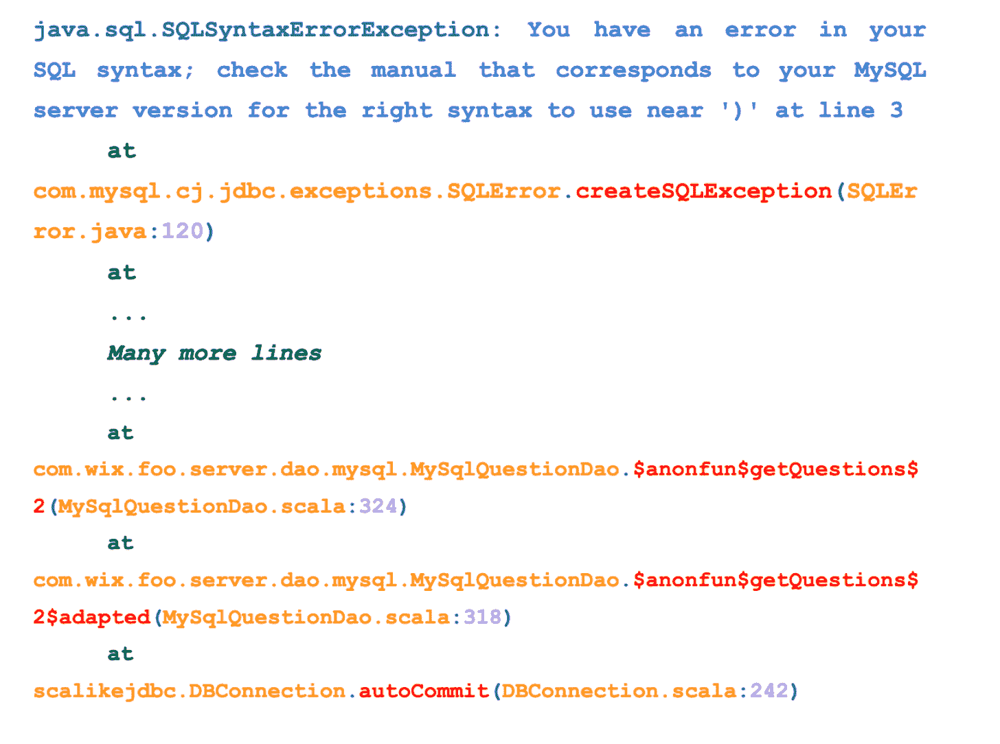
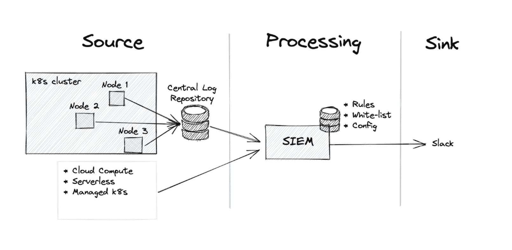
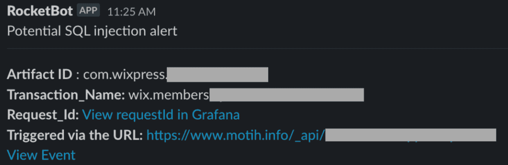

# Wix 通过自定义检测器解决应用级安全问题

> 原文：<https://thenewstack.io/wix-attacks-application-level-security-with-custom-monitor/>

网站构建平台 [Wix](https://www.wix.com/about/us) 最近创建了一个简单而有效的基于逻辑的监控流程，可以实时检测生产级环境中的应用级漏洞。

安全漏洞时有发生，即使在开发阶段完成了[左移](https://thenewstack.io/shift-left-why-prevention-beats-remediation/)和[安全测试](https://thenewstack.io/spotify-taps-snyk-for-security-testing-automation/)，应用程序的生产级别仍然存在漏洞。当所有这些不同的监控、可观察性和安全工具出现以应对不断增长的安全威胁时，阅读这些工具是相当疯狂的。

## 什么是不期望的

根据 Wix 安全工程师[默蒂·哈马茨撰写的一篇](https://www.linkedin.com/in/moti-harmats-b232aa98/)[博客文章](https://www.wix.engineering/post/threat-and-vulnerability-hunting-with-application-server-error-logs)，Wix 的定制安全系统通过使用逻辑来检测安全漏洞，寻找与安全应用程序预期相反的东西，并在应用程序日志中搜索这些异常。

一旦在应用程序日志中发现安全异常，就会通知安全小组的成员并解决威胁。这些日志被汇总到一个中央数据库，该数据库允许定制解决方案成功扩展，同时保持较低的站点加载时间和延迟。

Wix 计划在未来几个月内开放新安全软件的源代码。

Wix 已经有了安全流程，包括 shift-left 和生产级流程，这些流程侧重于运行时环境(服务器/操作系统)和边界(WAF/ HTTP 访问日志)。但是 Wix 安全团队发现，商业解决方案忽略了“应用程序运行时”,他们考虑的是应用程序堆栈的行为、日志和指标。他们着手为他们的左倾行为建立一个安全网。

## **基于日志的监控**

新的监测程序背后的逻辑是基本的，但却是可靠的。某些异常不应该出现在安全编写的应用程序中。例如，当查询被“正确地”(即使用有效的参数化库)编写时，SQL“语法错误”不会发生。异常可能表明 SQL 查询的语法由于意外的或处理不当的运行时方面(如用户输入)而发生了变化。这些错误仅在使用动态 SQL 查询(这被认为是不好的做法)或输入“破坏”了语法时才会发生，因为查询容易受到 SQL 注入的攻击。

为了实施他们的安全解决方案，他们只是颠倒了逻辑——而不是使用渗透测试来搜索注入和使用日志来支持证据，找到日志中的错误，然后对其进行反向工程以构建注入负载并找到安全漏洞。

下图显示了一个包含堆栈跟踪的错误:

第一行包含异常类和异常细节。

每一行都包含以下细节:完整的类、调用的方法、类文件、源代码中的行。

找到 SQL 注入的关键是找到导致异常的第一个非泛型类。非泛型是指代码库特有的自定义类。本例中的非泛型是“. com.wix*”，意味着泛型库是“. com.mysql*”。

这个可疑的查询是在 MySqlQuestionDao.scala 的第 324 行的 getQuestions 函数中触发的。

随着 SQL 注入的理解，他们将该方法扩展到其他漏洞类别，这些漏洞类别共享能够触发意外错误的症状，这些错误是应用程序运行时/核心问题的一部分，称为应用程序级危害指示器(IOCs)。其中一些类是反序列化 bug、XXE、服务器端模板注入等。

同样的逻辑也适用于其他运行时(Node.js，.Net、Python 等)。

## **扩大规模**

监控日志并不简单，因为有很多日志。Wix 有超过 3000 个服务在大约 20000 个 Kubernetes pods 上运行。中央日志数据库每天增加大约 35tb 的存储容量。Wix 还处理几个“外部”一级公民生产环境的监控和可观察性。

在降低站点加载时间和延迟的同时进行监控是一个多步骤的过程。Wix 构建了一个内部日志处理管道，将检测规则大规模应用于服务器日志。由于仍然有数量惊人的日志，为了进一步降低延迟，监控过程提取包含可疑应用程序级 IOC 的应用程序服务器日志的子集，提取相关元数据，并在日志与已经定义的规则集匹配时通过 Slack 发出警报。然后，应用程序安全专家手动分析这些警报，于是一个错误就产生了。

经过一年对安全逻辑和流程的改进和迭代，Wix 达成了一套稳定可靠的检测规则。误报率很低，但最终取决于漏洞类别和检测规则的准确性。

SSTI 和 XXE 的检测率为 100%，无假阳性。

SQL 注入的数字看起来有点不同，检测率为 26%，假阳性率为 76%。查询中的边缘情况，如打字错误或简单的错误，如空的 an *in()* 子句，会导致误报。

一个警报示例如下所示:

## **总结和未来计划**

应用程序安全性是一个多层次的过程。Wix 发现了逆向工程应用程序漏洞，大规模监控服务器日志对于他们的应用程序来说是一个非常有价值的过程，因为他们发现了一个大规模运行的安全解决方案。

Wix 计划在未来几个月内将该解决方案作为开源产品发布，以帮助组织监控其应用程序堆栈的漏洞，以及针对许多漏洞类和运行时堆栈的强大规则集。

<svg xmlns:xlink="http://www.w3.org/1999/xlink" viewBox="0 0 68 31" version="1.1"><title>Group</title> <desc>Created with Sketch.</desc></svg>