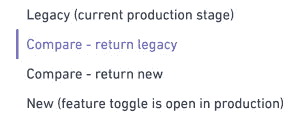

# Wix:线性迁移使得 API 更新不那么“可怕”

> 原文：<https://thenewstack.io/wix-linear-migration-could-make-api-updates-less-hellish/>

基于云的网站建设商 Wix 最近重写了结账 API，实现了零事故的转变。该公司的工程师如何执行这项任务——使用一种称为线性迁移的技术——可能会指出一种更好的应用程序迁移方法。

关于迁移的文章不计其数——这是一个令人生厌的话题。但是 Wix 前端开发者 [Ariel Livshits](https://www.linkedin.com/in/ariel-livshits-b11b95142/) 的[博客帖子](https://www.wix.engineering/post/braking-an-endless-cycle-huge-migrations-done-right)脱颖而出，因为*没有讨论*的内容。这篇文章不是关于代码是如何更新的；它涵盖了迁移的执行方式。Wix 重写了它的 checkout API，并且必须以一种不停机和尽可能少事故的方式进行迁移。

公司工程师没有进行循环迁移，而是进行了线性迁移，这提供了无缝的用户体验，没有任何事故。

## 无缝购物

对于开发者来说，为用户提供无缝购物体验是一项极其复杂的任务。

这项工作是为 Wix Stores 完成的，它负责 Wix 网站上所有与电子商务相关的服务。这包含了购物的所有内容，包括库存、小部件(产品展示区、小部件)、结账流程以及这两者之间的任何事情。

Livshits 提供了一个可能使用这项服务的瑜伽课程网站的例子。当学生预订课程时，Wix 会处理付款事宜。付款发出后，会有一封确认电子邮件。瞧，简单的预订服务。

但是说瑜伽课扩展到瑜伽垫销售。曾经简单的预订服务现在需要处理两种不同类型的交易——预订和产品销售。现在引入了对支持不同需求的单一结帐服务的需求。利夫希茨解释说，这是他进来的地方。

他的任务是:用一个新的 API 替换当前的 API——一个支持所有不同实体的结账服务。在客户的项目中迁移整个 API 的使用。Wix 商店将是新 API 的第一个大用户。

## **迎接结账服务**

在继续迁移之前，下面是关于遗留检出 API 使用的详细信息:

*   一切都在客户端服务中得到控制。
*   Wix 没有来自服务器的 API 数据的映射器层。映射器层是处理从持久性数据存储在内存中的表示传输数据并将它们彼此隔离的层。在 Wix 的情况下，它是从服务器传输到客户机的数据。
*   结帐对象庞大而复杂。

新 API 的目标是没有副作用，不会改变和影响结账客户机中使用的数据。

## **OG 迁移周期**

Livshits 解释说，他通常看到迁移在一个循环中发生，起点是新功能切换，随后是以下步骤:

1.  在新旧 API 之间拆分代码。
2.  测试所有新场景。
3.  通过质量保证检查。
4.  向用户开放。

如果出了问题，整个循环又会重新开始。

对此，他并不感兴趣。

## **引入线性迁移**

这就是 Livshits 如何避免上面列出的“地狱般的循环”，并使迁移“更快、更安全、更简单”。

线性迁移有四个阶段。

1.  遗留阶段(当前生产阶段)。
2.  比较并返回遗产。
3.  比较并返回新的。
4.  新增(功能切换现已在生产中打开)。

前端服务器(FES)将作为从旧 API 到新 API 的桥梁。客户结帐将调用负责调用新 API 的 FES。这将有助于避免巨大的客户端代码变更(这可能会导致整个项目重写)。

为了避免任何客户端的改变，FES 将保存一层映射器，新对象将作为遗留对象返回。每个阶段将负责决定是调用遗留的还是新的 API。

数据是实现线性迁移的另一个关键因素。FES 使得以相同的结构返回新的和遗留的对象成为可能，这意味着真实数据的比较也是可能的。

Livshits 说，“线性迁移的秘密成分是真实数据的比较。”

## **真实数据对比—对比阶段**

在将一个对象返回给客户端之前，发送两个对象进行比较。在两个比较阶段，我们调用两个 API，但是只返回一个结果作为响应。两个结果都被发送到可比较的引擎。

可比较的引擎将评估新 API 中缺少什么或者需要修复什么。目标是在新 API 发布给用户之前，两个对象之间 100%平等。

在某些情况下，API 的有效负载之间会有差异，这可以通过一些简单的方法来解决。例如，如果新 API 是旧 API 没有的字段，可以忽略或者添加默认值。

因为这是一种更安全的迁移，所以生产数据的使用不会对生产用户造成伤害。

比较阶段将“通过 QA”和“向用户开放”阶段移回到开发周期中，并消除任何事故的可能性。

当开发人员达到 100%的对等性时，远高于以前看到的确定性水平，特性开关被打开，用户被介绍到新的 API。

## **结论**

线性迁移是基于数据的。Wix 在这次迁移中的目标是尽可能少地重构，尽可能快地迁移，并保持生产安全。线性迁移使这成为可能。

在这一迁移过程中，数百万用户得到了支持。

<svg xmlns:xlink="http://www.w3.org/1999/xlink" viewBox="0 0 68 31" version="1.1"><title>Group</title> <desc>Created with Sketch.</desc></svg>