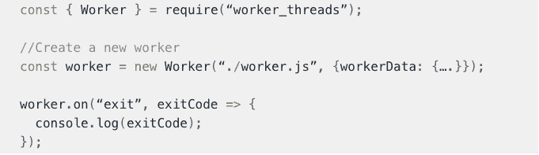
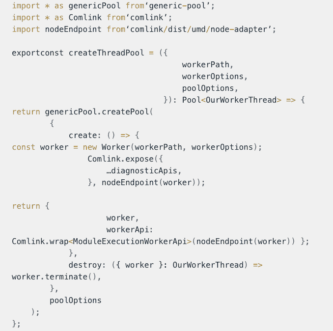
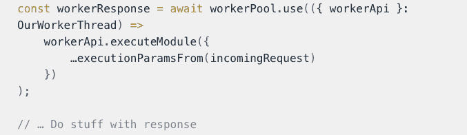

# Wix 多线程 Node.js 降低 Kubernetes Pod 成本

> 原文：<https://thenewstack.io/wix-multithreaded-node-js-to-cut-kubernetes-pod-costs/>

通过向 Node.js 服务器添加工作线程， [Wix](https://www.wix.com/) 将其 Kubernetes pod 使用率降低了约 70%,为网站构建服务提供了统计数据，以证明 Node.js 确实适合 CPU 密集型的高吞吐量工作。

Wix 在 Node.js 的单线程上运行 CPU 密集型 JavaScript 操作，作为其服务器端渲染执行平台(SSRE)的一部分。SSRE 是一个多用途的代码执行平台，在服务器端呈现 React.js。

但是软件开发人员[盖伊·特雷格](https://www.linkedin.com/in/guy-treger-5bba724/)在他最近的[博客](https://www.wix.engineering/post/how-wix-applied-multi-threading-to-node-js-and-cut-thousands-of-ssr-pods-and-money)中解释说，单线程只能做这么多。一旦流量达到 100 万 RPM，就需要“超过可接受的”数量的生产 Kubernetes 豆荚来适当地为其服务。

突然出现了难以控制的问题。太多的 pods 和大量 CPU 密集型任务在一个线程上运行，这是 Wix 运行架构的一部分。最符合逻辑的解决方案？添加更多线程来分隔工作负载。

由于目标始终是增加流量，而不是减少流量，该公司的工程师需要一个可扩展的新解决方案。一家公司能够重建整个架构的情况很少，而这不是一个例子。所以最好的办法是添加更多的线程，因为这是造成最大痛苦的单个线程。添加更多线程的目标是将工作卸载到其他计算单元，以便多线程可以在包含多个 CPU 内核的硬件上部分运行。

Node.js 的内置多处理能力对于 Wix 的工程团队来说是“多余的”。他们在寻找一种需要更少资源、维护和协调的解决方案。

### **工作线程** 

根据 Node.js 文档:

*[worker _ threads](https://nodejs.org/api/worker_threads.html)模块支持使用并行执行 JavaScript 的线程。Workers(线程)对于执行 CPU 密集型 JavaScript 操作很有用。它们对 I/O 密集型工作帮助不大。Node.js 内置的异步 I/O 操作比 Workers 更有效。*

*与 child_processes 或 cluster 不同，worker_threads 可以共享内存。*

一项新功能，在 2020 年 10 月发布的 v14 (LTS)中变得稳定， [Node.js](https://nodejs.org/en/download/) 确实提供了原生支持，但它相当新，还不够成熟。为了让 Wix 完全实现到生产级代码中，该公司的工程师必须添加额外的开源包。他们最初寻找一个包来将所有东西捆绑在一起，但是发现添加单独的包最适合他们的需要。

## **障碍和开源解决方案**

Wix 团队在采用 Node.js 多线程时面临两个主要障碍:任务池功能和支持线程间通信。

### **任务池功能**

开箱即用:手动生成工作线程并手动维护生命周期。

障碍:这是一项艰巨的任务，需要不断确保有足够的线程，在线程死亡时重新创建线程，实现不同的超时，并承担所有其他手动维护的责任

开源解决方案:***【npmjs】***—线程池的结果是通过添加这个流行的池 API 实现的。

### **类似 RPC 的线程间通信**

开箱即用:线程可以使用异步消息传递技术在它们自己(例如主线程和它们产生的工作线程)之间进行通信。

障碍:处理消息会使代码更难管理和维护。工程师们正在寻找一个允许线程在另一个线程上“调用方法”并异步接收结果的包。

开源解决方案:***【comlink(npmjs)***—*代码中的线程间通信由于添加了这个包而变得更加周到和优雅。这个包以其在浏览器中与长期存在的 JS web workers 的 RPC 通信而闻名。最近增加了它与 Node.js workers 的兼容性。*

 *所有包的代码看起来与下图相似。

web 服务器级别的用法如下图所示。

## **结果和收获**

Node.js 确实适合 CPU 绑定的高吞吐量服务。降低了基础设施管理的开销。他们适度的目标被巨大的收益所掩盖。SSRE pod 数量下降了约 70%,每 pod 的 RPM 提高了 153%。SLA 更好，应用程序更稳定，响应时间 p50 缩短了约 11%,响应时间 p95 缩短了约 20%。错误率降低了 10 倍。直接 SSRE 计算成本下降了约 21%。

这是值得的，但并不容易。将 worker_threads 添加到现有环境中并不是一件简单的事情。有时需要大量的重构，因为逻辑对象(JavaScript 函数)不能在线程之间来回传递。在代码中为工人之间的交流定义清晰具体的基于纯数据的 API，并进行相应的调整。

现在已经有了一个可用的系统，Wix 团队正在进行优化。正在探索的优化领域包括重构应用程序以使工作人员进行纯 CPU 工作，研究内存共享以避免线程之间的大型对象克隆，以及找到每台机器的最佳 CPU 内核数量以允许非恒定大小的线程池。还探索了将该解决方案应用于 Wix 中其他主要的基于 Node.js 的应用程序的可能性。

<svg xmlns:xlink="http://www.w3.org/1999/xlink" viewBox="0 0 68 31" version="1.1"><title>Group</title> <desc>Created with Sketch.</desc></svg>*