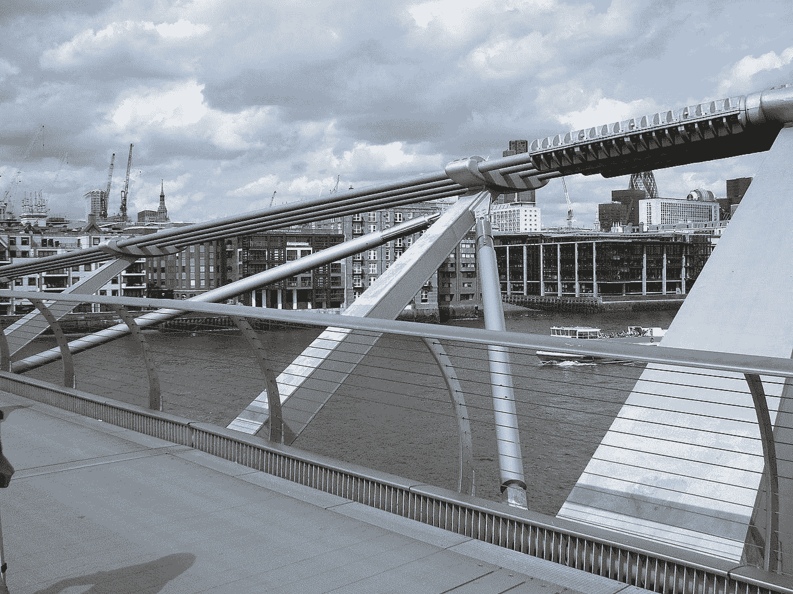

# 摇晃的桥梁和坚固的软件

> 原文：<https://thenewstack.io/wobbly-bridges-and-sturdy-software/>

 [米科扎伊帕夫利科夫斯基

米科扎伊是彭博社软件工程主管。](https://www.linkedin.com/in/mikolajpawlikowski/) 

下次你去伦敦，一定要走过千年桥。这座桥本身就是一个地标，它将北端的圣保罗大教堂与南端的泰特现代美术馆和莎士比亚环球剧院连接起来。这是一座吊桥，专为行人设计，可以一览无余地欣赏伦敦一些最著名的景点。

然而，作为一名工程师，我喜欢它是因为一个完全不同的原因:它背后的故事。事情是这样的:20 世纪 90 年代末，伦敦在寻找庆祝新千年的方式。一些世界上最好的建筑师提出了他们的想法，横向吊桥的设想最终赢得了设计比赛。建设于 1998 年底破土动工，备受期待的开放日期定于 2000 年春季。

2000 年 6 月 10 日，世界各地的媒体报道了大桥的开通，这比原定的最后期限晚了两个月，比预算多了 200 万英镑(约 265 万美元)，总造价 1800 万英镑(约 2400 万美元)。两天后，也就是 6 月 12 日，出于健康和安全原因，它被关闭了。

## 运行时问题

在开幕当天，估计有 100，000 人走过这座桥，任何时候都有大约 2，000 人在场。几分钟之内，事情就变得很明显不太对劲了。这座桥轻轻地左右摇摆，显示出比预期更大的横向移动。当地人很快给它起了个绰号“摇摆桥”，因为它向每个方向摇摆了 7 厘米(2.75 英寸)。许多伦敦人以他们特有的方式享受着这一旅程，把它看得更像一个游乐场而不是一座桥。公共卫生官员不同意，暂时关闭了大桥。

在接下来的两天里，人们试图限制桥上的人数，但很明显，即使是相对较少的人也会导致桥危险地摇摆，尽管它最初的设计可以承受大约 5000 人的重量。这座桥直到 2002 年 2 月 22 日才重新对公众开放。

这是一个运行时问题。一些顶尖设计师没有预料到的是建筑和使用者之间的互动。人们脚步的自然摆动在桥上引起了轻微的侧向振动。反过来，这导致人们试图使他们的脚步与振荡同步——你曾经尝试过在左右摇摆的火车上行走吗？—进一步增加振动幅度，进一步增强效果。这是“正反馈”现象的典型例子。解决方案包括改装 37 个阻尼器来消耗能量，额外花费 500 万英镑(663 万美元)和将近两年的额外工作。

千年桥的减震器。图片来源:戴夫·法兰斯在[维基百科](https://en.wikipedia.org/wiki/Millennium_Bridge,_London#/media/File:Bridge_horiz_mode_shock.jpg)

每次失败都是一次学习的机会。一个聪明的人从别人的错误中学习。从一个软件工程师的角度来看，我有三点要说。

## 第一课:测试的重要性

为了确保他们实施的修复如预期的那样有效，他们安排了 2000 个——他们似乎真的进入了千年象征！—志愿者走过大桥，同时仔细测量摇晃程度。它非常有效。

唉，这告诉我们，他们没有首先在现实生活中测试就向公众开放了一座桥梁。事后看来，我们知道即使相对少量的测试对象在桥上走来走去也能发现问题。

我不知道你怎么想，但是下次我建一座桥的时候，我一定会在邀请媒体之前安排一次更彻底的测试！

## 第二课:记忆是漫长的

20 年后，当地人仍然亲切地称这个结构为“摇摆桥”(有时是“摇摆不定”)。互联网上充斥着这种摇摆不定的视频。所有这些都发生在第一代 iPhone 发布整整 7 年前。想象一下，如果这发生在今天，会有多少 YouTube 视频、抖音挑战赛和社交媒体帖子。

底线是:人们会在你的失败被修复后很久还记得它们。

## 第三课:很难预测系统的涌现特性

虽然我不确定当今结构工程的最佳实践是什么，但我知道在软件工程领域我们会更容易做到。大多数时候，测试很容易和/或足够便宜，因此没有理由发布任何未经测试的代码。这是我们在学生获得计算机科学学位之前教给他们的。

虽然，如果这个故事告诉我们什么的话，那就是即使所有的测试在构建时都通过了(桥设计)，在运行时仍然有灾难性失败的可能。很难预测组件之间的相互作用。这通常归入系统涌现属性的范畴，也是混沌工程擅长的一个领域。

## 混沌工程

混沌工程是在一个系统上进行实验的实践，以获得它将承受动荡条件的信心。它是关于拿一个真实的系统，看看当不好的事情发生时它是如何表现的。

这是一个额外的测试层，可以帮助检测在单元、集成甚至端到端测试中没有注意到的行为。归结起来就是进行实验来证实或否定你对系统的假设，尤其是当你知道可能出错的事情确实出错的时候。

就像桥一样，软件系统有内置的冗余来适应组件故障。不同之处在于，虽然切断一根 20 吨重的电缆来确认剩余的电缆是否能够承受负载是有风险且昂贵的，但这是软件工程师每天都要做的事情。我们有相当于备用桥、舞台桥、迷你桥和其他一切可以在虚拟世界中实验的东西。

如果你不在 2022 年做混沌工程，这是开始的最佳时机。如果你想了解更多，请在 2022 年 1 月的[混沌嘉年华 2022](https://chaoscarnival.io) 上收听我关于摇晃的桥梁和构建坚固软件的必要性的主题演讲。

*如果你准备好直接深入混沌工程，看看我的书“[混沌工程:通过受控破坏的网站可靠性](https://www.manning.com/books/chaos-engineering)”(曼宁)。*

<svg xmlns:xlink="http://www.w3.org/1999/xlink" viewBox="0 0 68 31" version="1.1"><title>Group</title> <desc>Created with Sketch.</desc></svg>