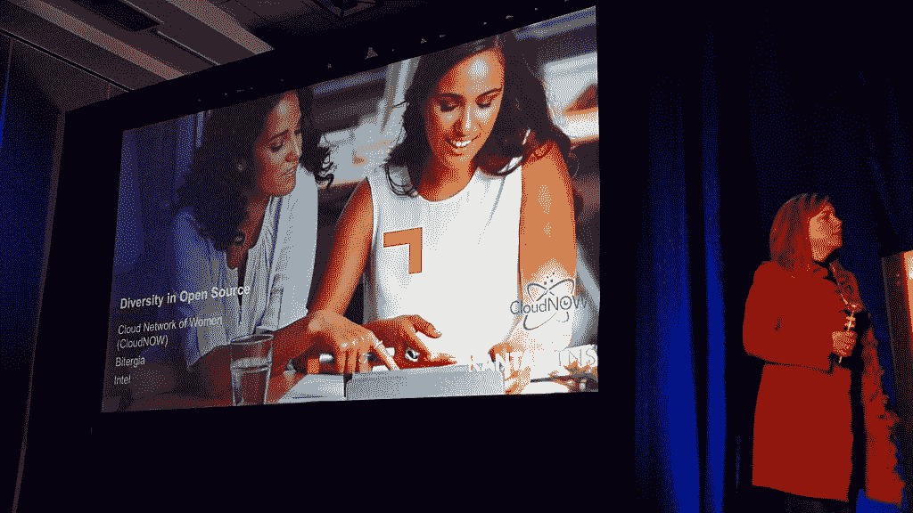
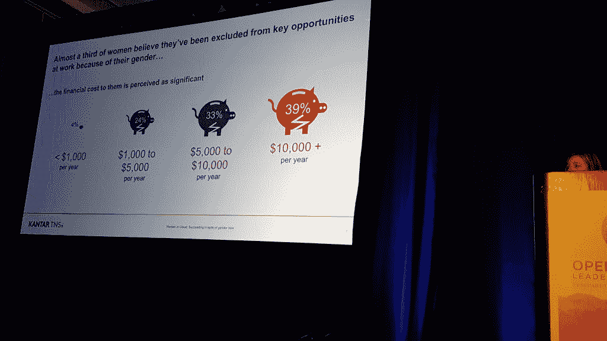

# 在偏见中，女性努力在开源社区中找到一席之地

> 原文：<https://thenewstack.io/women-open-source-still-fighting-good-fight/>

尽管努力提高多样性，但女性在科学、技术、工程和数学(STEM)领域的代表性仍然不足，开源软件也不例外。

上周在太浩湖举行的 [Linux 基金会开源领袖峰会(OSLS)](http://events.linuxfoundation.org/events/open-source-leadership-summit) 上的一次演讲强调了开源社区女性面临的一些问题，从参与率低到性别偏见和不平等的薪酬到整体工作满意度。

演讲“[开源中的多样性](https://osleadershipsummit2017.sched.com/event/9Khn?iframe=no)，”主讲人 [Susan Wu](https://www.linkedin.com/in/susanwu88/) ，Midokura 的技术营销总监，软件网络虚拟化的创新者； [Nicole Rutherford](https://twitter.com/nkruther) ，英特尔的社区和开发者倡导者， [Daniel Izquierdo](https://twitter.com/dizquierdo) 是 [Bitergia](https://bitergia.com/) 的联合创始人，这是一家专注于提供开源项目指标和咨询的初创公司。

Bitergia 收集了演讲中使用的大部分数据，包括女性对云计算、 [OpenStack](https://thenewstack.io/the-new-stack-and-linux-foundation-survey-openstack-and-docker-are-the-most-popular-open-source-projects/) 和 Linux 内核的贡献。最新的可用数据显示，OpenStack 的提交者中有 11%是女性，相当于 640 名开发人员。女性占整个 OpenStack 活动的 9 %,总计约 6000 次提交。

同时，关于 [Linux 内核](https://thenewstack.io/contributes-linux-kernel/)，9.9%的内核提交者是女性——大约 330 名活跃的提交者。女性也占了整个 Linux 内核活动的 6.8%，有大约 4000 次提交。

对于 Hadoop 来说，8.5%的 Hadoop 贡献者是女性，相当于 71 名女性。女性仅占所有 Hadoop 活动的 6.5%，即约 2000 次提交。

吴指出，这项研究的主要发现表明，尽管相当多的女性对自己的工作感到满意，但许多人仍然面临着工作中的性别歧视。此外，研究发现，因性别而错失机会的经济影响可能是巨大的。即使在理想的工作环境中，性别偏见也是存在的，但是女性导师和榜样会产生积极的影响。

吴还指出，许多女性没有得到应有的认可的一个原因是，科技领域的一部分女性并非来自传统的工程背景——她们从生物学、医疗保健、医学或其他科学或人文学科等其他领域进入科技领域，通常进入编码营或自学成才。

“他们没有典型的高科技简历，”她说。

## 偏见进入

但是，一旦女性在这个行业找到工作，对许多人来说，偏见很快就会变得明显。主持人引用了 Kantar TNS 的调查研究，发现 40%的在云端工作的女性表示她们对自己的工作满意，而 30%的女性表示她们感到刻板印象，只有不到一半的女性表示她们认为自己的公司是真正的精英管理。与此同时，48%的云中女性表示，她们觉得高级管理层中有一个男孩俱乐部，33%的女性表示性别偏见是她们公司文化的一部分。

此外，研究中近三分之一的女性表示，她们认为自己因为性别而被排除在关键工作机会之外。这些女性中有 39%的人表示，被排除在外已经让她们每年损失 10，000 美元或更多。

其他热点问题包括，许多从事科技行业的女性(70%)只是希望她们的男性同事不要一直抱怨“T4”。68%的人表示，他们希望看到男性不要总是只向男性同事提出技术问题，另外 64%的人表示，他们的男性同事对女性的想法不屑一顾，62%的人谴责男性在工作中表现得像个兄弟会。

相比之下，该研究发现，女性榜样对女性在科技领域的工作满意度有积极影响。有女性榜样的女性有 67%的工作满意度，而没有女性榜样的女性只有 26%的满意度。然而，根据这项研究，42%的女性在她们的公司中没有女性榜样，48%的女性根本没有导师。

## 女性正在成功

尽管进入 STEM 领域的女性仍然很少，但研究显示，83%的受访女性表示，她们肯定或可能会建议女儿从事科技职业。研究表明，女性认为技术能力和人际关系对职业发展最为重要。

事实上，79%的女性认为更新她们的技能是最重要的，74%的女性认为人际关系，57%的女性认为获得证书有助于职业发展。只有 36%的女性认为加班至关重要，只有 23%的女性认为她们需要牺牲家庭来获得成功。

因此，尽管存在性别偏见，但女性正在取得成功，但有办法促进这一点，并增加女性在科技领域的人数。

> 一项研究显示，女性对 GitHub 项目的贡献往往被接受的比率高于平均水平——除非贡献者以某种方式被确定为女性，否则她们的贡献被接受的可能性会降低 10%。

在会议上， [Linux 基金会](https://www.linuxfoundation.org/)和[国家妇女中心&信息技术](https://www.ncwit.org/) (NCWIT)推出了一个免费的“[包容性演讲者定位](https://training.linuxfoundation.org/linux-courses/open-source-compliance-courses/inclusive-speaker-orientation)”课程，帮助活动主持人和公共演讲者准备背景知识和实用技能，以促进其演讲、信息传递和其他交流中的包容性。NCWIT 是增加女孩和妇女有意义地参与计算的工具和资源的开发者和交流中心。

“我们需要将跨社区的想法融合在一起，”Rutherford 说，她将在稍后的开源妇女会议上提出这一点。“在英特尔，我们正在研究机器学习，以降低在线骚扰的普遍性和严重性。”

## 科技界的女性团结起来！

在开源女性大会上，Linux 基金会的网络普通用户成员兼康卡斯特开源实践高级主管 Nithya Ruff 告诫这群女性和一些男性“去学校演讲；这是一种很棒的角色塑造方式。”

开源资深人士 Danese Cooper 是 PayPal 技术人员中的杰出成员， [Node.js 基金会](https://thenewstack.io/node-js-foundation-manage-node-security-issues-new-effort/)的主席，也是许多开源实体的董事会成员或成员，她说她在所到之处寻找机会在学校演讲，并发现这令人振奋。

“有一种趋势是给开发人员施加相当大的压力——使这成为可能的程序员是我们在这里的原因，但我们不应该忽视其他人，如营销人员，”库珀说。“有很多贡献没有被体现出来。”

[华为技术公司的云技术专家 Rochelle“Rocky”Grober](https://thenewstack.io/huawei-addressing-diversity-best-practices-open-source/)对软件质量非常感兴趣，她补充说，女性在技术人员中没有包括的一个主要角色是软件质量保证。

就她而言，Cooper 继续称赞 Node.js Foundation 是她曾经工作过的“最多元化的社区”,并引用了 Drupal 社区和 Drupal 协会对多元化的坚定立场，这在很大程度上是由于 Drupal 和女性在开源冠军 Angela Byron 中的影响。

Mozilla 的首席创新官 Katherina Borchert 提到了 Mozilla 发起的 Rust 语言项目，称其在实现多样性和围绕该项目建立多样性文化方面做了“伟大的工作”。

一名女性半开玩笑地问道:“你如何与唐纳德·特朗普(Donald Trump)这种态度的人打交道？”虽然这引起了笑声，但一位发言者说，妇女必须要求她们的基本人权，这一想法被扼杀在萌芽状态。

## 多元化增加了利润

与此同时，在会议的另一次讲话中，Borchert 指出，多元化往往会增加公司的底线。她引用的研究表明，领导职位中的性别多样性导致收入增加 15%，种族多样性导致收入增加 35%。

她引用的另一项研究称，女性对 GitHub 的贡献往往被接受的比率高于平均水平——除非贡献者被以某种方式确定为女性，否则她们的贡献被接受的可能性会降低 10%。

Borchert 还指出，截至 2013 年，19%的开发人员是女性，11%的开发人员是开源人员，这与 2002 年相比是一个重大进步，当时只有 2%的开发人员是女性。

因此，尽管情况有所好转，但同样的问题依然存在:代表性不足的少数群体获得技术工作的机会仍然较少，即使是在开源领域。

事实上，在开源的早期，直到今天，“如果你想加入对抗大型软件的战斗，你需要访问，”Borchert 说。“只有特定的一部分人才能接触到。行为模式对女性怀有敌意，即使这是无意的。

## 然而…还有一段路要走

这就涉及到了个人层面。作为一名非裔美国人，科技多元化的问题对我来说一直非常重要。不仅仅是因为我以报道这个行业为生——并且已经做了超过 25 年——并且喜欢知道像我这样的人在这个领域有发展的机会。不仅仅是因为我有一个儿子在美国最优秀的工程学院学习电子和计算机工程，我希望他也能有机会。

但科技领域的多元化问题，尤其是女性在科技领域的多元化，对我来说很特别，因为我的姐姐是一个榜样，她在联邦政府的 IT 部门有着成功的领导生涯，并鼓励我们所有人追求以科技为导向的倡议。她有自己的故事，如果她所在的机构里有一个“科技女性”团体，她会很乐意加入，或者更有可能领导这个团体。

具有讽刺意味的是，作为一名非裔美国科技记者，我碰巧参加了在 OSLS 召开的“开源女性”会议，我体会到了一些女性所谈论的内容。我刚好在会议开始前到达，由于桌子上只有几个空位，我选择将这些留给任何可能在我之后进入的女性。所以，我坐在角落里。

最终，随着越来越多的人在会议正式开始后涌入，这变成了一件只有站着的事情。在很大程度上，新来的人给了我权限。然而，三名年轻男子和一名年轻女士走进来，决定直接站在我面前，挡住我的视线。这位年轻的女士很快意识到她挡住了我，转过身，出于良心用手捂住嘴，礼貌地跪了下来。当有人离开会场时，她找到了一个座位。

然而，代替她的是一个年轻人，没有注意到我的存在。在我生活和职业生涯的早期，我可能会为此大吵大闹，但考虑到我可以稍微改变一下，仍然可以捕捉到大部分正在发生的事情，我就让它过去了。不值得。然而，几分钟后，当会议组织者向与会者传递一个记事本，让他们写下自己的电子邮件地址，作为邮件列表时，这个年轻人转向我，把纸递给了我。

我有些惊讶地说:“这么说，你真的*知道我坐在这里。”他只是简单地回答:“对不起，我站在你面前。”*

讽刺意味十足。他在那里表现出对支持女性科技事业的敏感和支持。然而，与此同时，他显然愿意对黑人麻木不仁。正如 Borchert 所说，这些事情发生“即使是无意的。”

特征图片[由 Linux 基金会](https://www.flickr.com/photos/linuxfoundation/32109259963/in/album-72157680275170446/)提供。达里尔·塔夫脱的其他图片。

<svg xmlns:xlink="http://www.w3.org/1999/xlink" viewBox="0 0 68 31" version="1.1"><title>Group</title> <desc>Created with Sketch.</desc></svg>