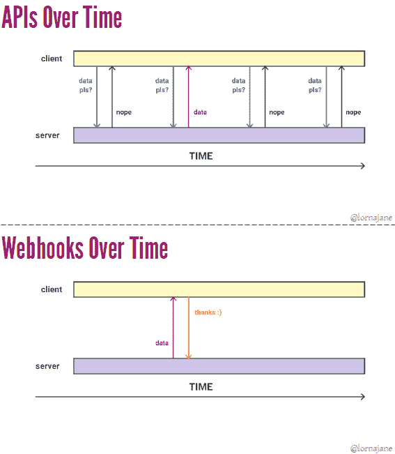

# Webhooks 为 API 轮询提供了一种有效的替代方法

> 原文：<https://thenewstack.io/wonderful-world-webhooks/>

像 GitHub 和 Slack 这样的流行网站不仅仅提供 webhooks，因为它们是通知用户新事件的便捷方式，webhooks 也是这些网站保持稳定的一种方式。

在上周的 [OSCON 欧洲](http://conferences.oreilly.com/oscon/open-source-eu)大会上，[IBM Cloud Data Services](https://twitter.com/lornajane)的开发者倡导者 Lorna Mitchell 提供了一些关于 webhooks 的精彩世界的见解，web hooks 提供了一种通过用户定义的 HTTP 回调在网站或 web 应用程序中触发动作的方式。

在 webhooks 出现之前，开发人员可能会编写代码，每隔几分钟就访问一次网站的 API，以检查是否有变化。将这个数字乘以数百万个存储库上的 100 万左右的用户，检查变更的轮询方法会给 GitHub 这样的流行站点带来一场性能噩梦。Mitchell 解释说，webhooks 是一个优雅的解决方案，可以处理人们可能希望收到的所有通知。

她解释说，网络钩子让事情发生；它们允许我们在系统、系统内的组件或微服务之间交换数据——任何通过 HTTP 连接的东西。Webhooks 用于 slack 通知、持续集成服务和其他集成。

Mitchell 将 webhooks 描述为“现代应用程序的关键构件，允许系统交换数据以响应事件。”

## API 与 Webhooks

Mitchell 谈到了 webhooks 和 API 的区别。当使用 API 从服务器获取数据时，客户端请求数据，服务器将数据发送回来。在发出请求之前，客户机不知道服务器上是否有新数据或信息的状态。

Webhooks 则相反。服务器知道客户机需要什么信息，一旦有了新数据，它就将信息发送给客户机。然后，客户端发回一个“thanks:)”也称为 HTTP“200 OK”确认，让服务器知道请求已收到，不需要再次尝试发送。

随着时间的推移，当你考虑这个问题时，Mitchell 证明了与使用 API 完成类似任务相比，webhooks 是非常有效的。使用轮询方法检查 API 的更改，您可能会发出许多请求，但对于特定事件不返回任何更改。有了 webhooks，你只在有新信息的时候交换数据。

## 为应用程序设计 Webhooks

Mitchell 说“webhooks 需要预先安排”服务，你需要提供所需的信息，以便它知道向哪里以及如何发送数据。

例如，在 GitHub 的情况下，这将包括有效负载 URL、内容类型、秘密(安全令牌)以及您想要触发 webhook 的事件。她还警告说，“大多数 webhooks 就像物联网”，这意味着当涉及到安全性时，它们“不太好”。所以在使用 webhooks 时，你需要考虑如何处理安全性，以避免 DDoS 和其他潜在的安全问题。

她还提到了设计 webhooks 时需要考虑的两个用例:

*   "尽量包含所有常见结果的信息."
*   "考虑有效载荷大小对潜在的许多后续 API 调用的影响."

当收到你的 webhook 数据时，Mitchell 强调“这只是一个 POST 请求！”并给出了这样的建议:

*   "做:快速接受、存储和确认."
*   "不要:在确认之前验证或处理."

Mitchell 说，“互联网可能是突发性的——接受并确认请求。请稍后再进行处理，以避免网络连接处于打开状态并造成瓶颈。

最简单的方法是接受数据，将其与状态字段(新/已处理/失败)一起放入数据库，并在对数据进行任何处理之前进行确认。这允许您在方便的时候创建一个 **cron** 作业来处理数据，做您需要做的任何工作，并更新状态字段。

“如果数据库方法不够用，就使用队列，”Mitchell 接着建议道。在这个场景中，您接受数据，将它放入队列中，并确认它。

对于这项任务，米切尔承认她“喝了 [RabbitMQ](https://www.rabbitmq.com/) Kool-Aid”，但其他选择包括 [Beanstalkd](http://kr.github.io/beanstalkd/) 和 [Gearman](http://gearman.org/) 。她说，无论你选择哪种后端队列，将数据放入一个队列都会给你一个“将许多工人与工作联系起来的简单方法”来处理你的数据。

## 发布网页挂钩

如果你有一个流行的在线服务，你可能还需要为你的用户提供 webhooks 来消费服务。Mitchell 说，提供 webhook 集成是理想的，如果:

*   你的客户经常轮询你的 API。
*   另一个系统对你系统的变化做出反应是很常见的。
*   您希望为特定事件提供通知。
*   以上任何一条都适用于内部或外部。"

米切尔在演讲的最后用一句简单的话总结道:“web hooks……太棒了:)”

<svg xmlns:xlink="http://www.w3.org/1999/xlink" viewBox="0 0 68 31" version="1.1"><title>Group</title> <desc>Created with Sketch.</desc></svg>