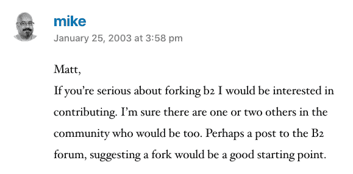

# WordPress 联合创始人 Mike Little 谈开源的重要性

> 原文：<https://thenewstack.io/wordpress-co-founder-mike-little-on-the-importance-of-open-source/>

[就开源的重要性与 WordPress 的联合创始人对话](https://thenewstack.simplecast.com/episodes/a-conversation-with-the-co-founder-of-wordpress-on-the-importance-of-open-source)

2002 年底，b2/cafelog，或简称 b2，一个开源的网络新闻和博客工具，它从 MySQL 数据库的内容中动态生成页面，被它的创造者抛弃了。2003 年初，马特·莫楞威格在他的博客上发布了几个段落，显示出对派生代码和构建更好的东西的兴趣。迈克·利特尔是唯一一个对此表示出兴趣的人。

因此，穆伦韦格和利特尔成为了后来众所周知的 WordPress 的联合创始人。

WordPress 的第一个官方版本于 2003 年 5 月推出。现在，世界上三分之一的网站建立在 WordPress 上——超过一半的 cmes——由一百多种不同的语言支持——全部由志愿者翻译！—以及超过 50，000 个插件。十六年后，它仍然是有史以来最成功、最具包容性的开源社区开发的软件项目之一。

在伦敦 Afrotech Fest 录制的这一集 New Stack Makers 播客中，我们很少谈论这个社区是如何产生的以及它是如何继续繁荣的。这么大的社区不仅仅是建立在代码上。翻译开源代码提交、评论和文档是克服语言障碍的方法，可以让更多的人使用这个庞大的博客工具。任何人都可以参与 WordPress 的设计或支持，以及组织聚会、会议和培训。

“如果你知道一些如何使用 WordPress 的知识，你可能会比一个刚入门的人多知道一件事，”Little 说。“如果你帮助了那个人，你就让他们变得更好，他们现在有了可以帮助别人的东西。你只需要比别人领先一步，就能帮助别人。你不需要成为专家。”

如果你发现 [WordPress 文档](https://codex.wordpress.org/)有不准确的地方，你所要做的就是登录来修正它。

根据 [Github 的年度开源调查](https://opensourcesurvey.org/2017/)，总的来说，开源社区实际上没有众所周知的整个软件行业多样化。这可能是因为来自边缘化背景的人，包括妇女，不太可能有空闲时间做无偿工作。Little 认为 WordPress 在这个统计数据中脱颖而出，因为他说它从一开始就以多样性为核心。

他继续说，首先，作为一个个人发布工具，WordPress 是任何人在互联网上拥有发言权的一种方式，与社交媒体平台不同，他们对自己的内容拥有完全的所有权。他还表示，WordPress 让许多小企业和副业变得强大，这些插件让社区和非政府组织扩大了在线基础。

对于 WordPress 来说，它不是关于一个人贡献的数量，而是许多人在此过程中所有微小贡献的融合。

“[为 WordPress 做贡献]最重要的方式是在你的技能和能力范围内——而这种能力不仅仅是你能做什么。关键是你是否有时间做这件事。不要觉得你必须投入大量的时间。你所能做的任何事情，无论是在支持论坛上发言或回答别人的问题，无论是参加聚会或学习，你都有机会帮助别人，”利特尔说。

或者，他说你可以提醒人们，竞争对手 Wix 和 Squarespace 仍然拥有自己的平台，所以如果人们希望完全控制他们的网站和数据，他们应该使用 WordPress。

通过像素的特征图像。

<svg xmlns:xlink="http://www.w3.org/1999/xlink" viewBox="0 0 68 31" version="1.1"><title>Group</title> <desc>Created with Sketch.</desc></svg>