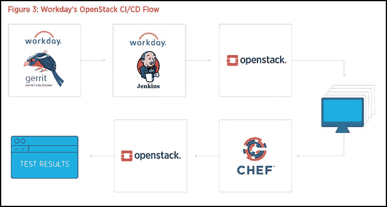

# Workday 如何弥合亚马逊和 OpenStack 之间的差距

> 原文：<https://thenewstack.io/workday-bridges-gap-amazon-openstack/>

那是 2016 年 11 月 30 日星期三。在拉斯维加斯举行的 AWS re:Invent 大会上，企业资源规划服务提供商 [Workday](https://www.workday.com/en-us/homepage.html) 的首席执行官兼联合创始人 Aneel Bhusri 走上了讲台。Bhusri 称赞亚马逊的各种基于云的解决方案，并介绍了他所说的自 2005 年创办公司以来指导他技术愿景的主题。

“我们信奉‘一个人的力量’这个概念，”这位首席执行官说，“每个客户都使用完全相同的版本，一行代码，一个安全模型，一个用户模型，一个用户界面。”他明确指出了他的竞争对手 SAP 和 Oracle，称他们为“Frankensource”组织，这些组织将他们各种各样的开放和专有技术聚合成一个混合物，他们花费了太多的时间来维持其连续性和连续性。

Bhusri 在宣布 Workday 的所有应用程序都将在亚马逊 AWS 上运行之前发布了这一消息，作为多年合作伙伴关系的一部分，此前 Workday 的工程师已经完成了对所有替代配置的广泛技术评估。

“亚马逊网络服务是一头可怕的野兽，”[在 re:Invent 关闭几天后，Aporeto 创始人 Amir Sharif](https://thenewstack.io/aws-good-not/) 为新的堆栈写道。“这是一只快速移动的饥饿的河马，它会吞噬它所看到的一切。这就是加州旅馆:你可以随时退房，但你永远不会离开。”

## 走廊那头的声音

“我们确实有一点秘密，”Workday 的高级首席软件开发工程师 Edgar Magana 承认道。Magana 在这方面的主要成就是基于 OpenStack 的平台，该平台托管了他公司的虚拟基础架构。

你没看错。运行在 Workday 的 650 多台服务器上的应用程序，这些服务器位于俄勒冈州波特兰市的托管设施中；佐治亚州利西亚泉；弗吉尼亚州阿什伯恩；荷兰阿姆斯特丹；和爱尔兰都柏林，已经并将继续在基于开源 [OpenStack 基础设施管理软件](https://www.openstack.org/)的非常复杂的基础设施层上提供服务。

Magana 告诉我们，自从他在 2012 年年中开始参与 OpenStack 以来，他一直亲自参与开源工作[以赋予 OpenStack 对 AWS 的弹性计算云(EC2) API 的全面支持](https://github.com/openstack/ec2-api)。曾经，100%的兼容性是一个目标。但他说，社区集体意识到，“我们总是追着亚马逊的尾巴，我们无法创造自己的东西。”

“关于公共云——在这种情况下，对亚马逊来说，这是一种扩展，”Magana 告诉新堆栈。“我总是喜欢澄清，我们与亚马逊有一个非常好的协议，将我们的服务扩展到公共云。我们希望获得更大的灵活性。我们希望在建设数据中心将面临巨大挑战的地方占据一席之地。为什么不直接用公有云呢？这是这类事情的完美场景。”

在与英特尔和电子健康记录提供商 AthenaHealth 合作撰写的 OpenStack Foundation 白皮书中，Magana 介绍了他的企业在虚拟基础设施上托管现有应用的架构，同时迁移新的应用。这是一个利用 [Gerrit 进行代码审查](https://gerrit.googlesource.com/gerrit)，Jenkins 管理部署过程，Chef 配置虚拟机上的工作负载实例，OpenContrail 部署和管理托管虚拟网络的系统。

将托管 Workday 应用的虚拟机迁移到 OpenStack 已经耗费了一段时间。根据白皮书，迁移是“一个分阶段的过程，涉及相当多的操作复杂性、工具、培训和确保端点连接。OpenStack 通过自动化入职和验证流程来帮助简化他们的进度。Workday 的目标是，到 2017 年底，他们 40%的应用都采用 OpenStack。”

Magana 的白皮书中没有出现“Amazon”和“AWS”这两个词。对于一家去年被吹捧为[实际上被亚马逊](http://www.businessinsider.com/why-amazon-aws-is-unstoppable-2016-11)赢得(去年 2 月[实际上赢得了亚马逊成为其客户](https://www.zdnet.com/article/workday-touts-amazon-as-latest-customer-win/))的公司来说，这一事实本身就非同寻常。

## 任务钟

如今，Magana 是 OpenStack 用户委员会的联合主席，之前曾在 OpenStack 董事会任职。因此，他可能是 Workday 公司内部最狂热的 OpenStack 倡导者。他给予 AWS 应有的信任，但他远没有达到 Workday 高管去年表现出的那种兄弟般的拥抱。

“归根结底，亚马逊是什么，对吗？”马加纳说。“这是一个具有非常强大的 API 的公共云，让您能够在此基础上构建任何您想要构建的内容。因此，我们在 OpenStack 方面所做的[*是*]，我们在 OpenStack 之上构建了一些东西，使应用程序能够从开发环境平稳过渡到生产系统。”

Magana 向我们描述了一个环境，在这个环境中，数百名 Workday 开发人员使用我们通常会联想到“云原生”的方法来构建他们的应用程序，只是没有公共云部分。他们从 Workday 自己的数据中心的 OpenStack 云开始。一个与 Workday 的 CI/CD 管道相连的中间支持层，使得在与 Amazon 一点也不相似的系统上开发的内部代码可以顺利迁移到可能涉及(也可能不涉及)AWS 领域的生产环境中。

“那是我们的小秘密。他说:“我们构建了某种中间件，让我们的服务真正调用 API，并在 OpenStack 的虚拟机中部署他们的服务和代码。他们甚至不知道这一点——他们从不与 OpenStack API 对话。他们只知道他们有这个 API 来说，'这是我的 TAR 文件，有我的源代码，或者我的 RPM，或者任何种类的工件。'我们有一个 CI/CD 系统，它实际上可以抓取该工件，将其包装在一个虚拟机中，将我们需要的所有东西都放在它周围—日志记录、监控、测试、安全，可能还有最重要的东西，将该映像发布到我们的数据中心的签名证书。

这位 Workday 工程师继续说道:“[*It*在所有数据中心复制，因此我们在任何地方都有完全相同的版本。”。“每当我们准备好实际部署它时，我们只需说，‘嘿，系统，给我创建一千个这种服务的实例。’你已经得到它了。人们不知道它是 OpenStack。"

## 我们自己设计的囚犯

Workday 的中间件层在公司之外还有用吗？对于任何涉及 CI/CD 管道以及与 EC2 兼容的 OpenStack 部署，它会成为一个必要且有价值的开源组件吗？

“这样做没有什么意义，”Workday 的 Edgar Magana 回应道。“我们没有做任何有魔力的事情。我们正在做的是，有一个基础映像，把我们的代码放在那里，然后把它运送到任何地方。就是这样。

“我们所做的让它变得如此简单和自动化，”他继续说道，“需要很多在工作环境中非常特殊的东西。所以对其他人来说没有意义。但是分享这个想法，我们已经在做了，对吗？白皮书提到了，我们做的其他沟通也已经提到了。每当我们可以共享工具时，我们都会尝试这样做。但总的来说，在我看来，仅仅公开这些内部中间件代码对任何人都没有用。”

他解释说，每个企业都有自己的技术挑战和使用案例，所以无论工程师创造什么中间件，都必须考虑这些独特的元素。应对这一挑战所涉及的复杂性将在前进的道路上呈现出它自己的，也许是异常独特的形态。

“我强烈建议建造一些东西，”马加纳建议道。“我一直称之为‘中间件’，但它是一种抽象后端平台，即你的管道系统，从将你的应用程序构件交付到生产的方式。我强烈建议这样做。”

这完全不像 Aporeto 的首席执行官所描述的那样:屈服于一只着眼于统治世界的垄断野兽的无情意志。如果有什么不同的话，Workday 的战略是一个自己动手的计划，让全球公共云部署对一个没有、也可能永远不会扎根于此的组织变得可行。

Workday 将在 11 月 6 日至 8 日于悉尼举行的 [OpenStack 峰会上进一步介绍这一部署。](https://www.openstack.org/summit)

[Aporeto](https://www.paloaltonetworks.com) 和 [OpenStack 基金会](https://www.openstack.org/)是新堆栈的赞助商。

Simon Matzinger [通过](https://unsplash.com/photos/twukN12EN7c) Unsplash 拍摄的特写图片。

<svg xmlns:xlink="http://www.w3.org/1999/xlink" viewBox="0 0 68 31" version="1.1"><title>Group</title> <desc>Created with Sketch.</desc></svg>