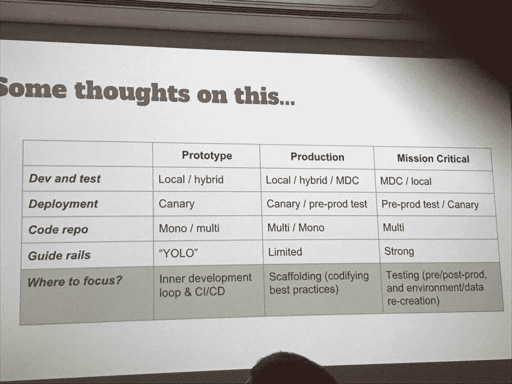
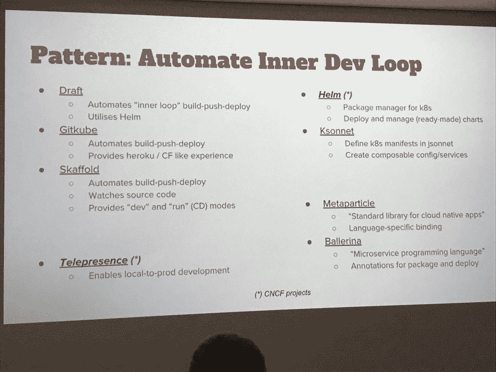

# 面向全新开发人员体验的工作流

> 原文：<https://thenewstack.io/workflows-for-the-new-developer-experience/>

[Datawire](https://www.datawire.io/) 技术顾问 [Daniel Bryant](https://twitter.com/danielbryantuk) 开始了他的 [Cloud Native London](https://skillsmatter.com/conferences/10160-cloudnative-london-2018#program) 演讲，他说，作为开发人员，“我们的很多工作都围绕着提出一个好主意，并将其转化为对客户的价值。”

对于我们大多数人来说，开发人员是我们的客户。好的开发者体验(DX)实际上包括什么？他说，这是为了填补从我们把想法装进集装箱到全部投入生产之间的空白。他的演讲集中在要问的问题上，以便确定模式和工作流程来改善体验。

> "开发者体验主要是关于最小化从想法到代码到交付可观察的商业价值的摩擦."—丹尼尔·布莱恩特

这就是为什么他说你如何构建你的平台对你的开发者的体验有着至关重要的影响——真的，如果你应该构建一个平台的话。对他来说，这一切都归结于设计开发人员的工作流程。

## 脱节的现代开发人员体验

为了发现好的 DX，我们需要了解现代开发人员。如今，开发人员参与了从设计到开发、测试、部署、运营到支持的整个生命周期。自主团队带来了速度，但并不是每个人都如此。电子商务？当然，你想最快上市。但是布莱恩特说，如果你进入核反应堆，放慢速度。

他说，毫无疑问，通过微服务打破系统是有好处的，但他警告说，这将导致平台的碎片化。

“团队变得自治，在循环中走得更快，并交付价值，但通常每个团队都是单独开发的。你可以为手头的问题选择工具，但之后你必须重新格式化库，”他解释道。

> “高生产力和乐趣来自有意设计的本地部署、打包应用、持续集成和交付体验。先决定你想要的工作流程，再选择你的工具。”—丹尼尔·布莱恩特

Bryant 说，这使得同一组织内的不同团队以不同的速度前进，这使得一个组织共享一个公共平台变得更加重要——从原型到生产阶段的关键任务行动——而不是一直重新发明轮子。

在新的以开发人员为中心的基于云的工作世界中，我们需要了解我们如何自助服务我们正在构建的东西，以及我们如何观察我们的软件。

布莱恩特描述了这种“新常态”:

1.  团队负责致力于端到端交付。
2.  许多组件和交互意味着未部署的代码更改很快就会过时，因为微服务和 API 消费将在三个月后发生巨大变化。
3.  开发人员需要更多地理解业务目标。他表示:“我们需要为关键绩效指标(KPI)和终端用户同理心打开更多空间。”。
4.  包括数据在内的环境平等至关重要。开发必须尽可能接近生产，甚至在生产中开发和测试。“像 Kubernetes 这样的东西已经允许我们获得更松散耦合甚至更复杂的系统——所以我几乎可以保证我测试的东西在生产中有效，”Bryant 解释道。
5.  理想情况下，内部开发循环需要在真实环境中运行，如果不是直接在生产环境中运行集群的话，那么需要多开发人员集群和类似 staging 的集群。“你必须小心，不要被共享数据绊倒，”他警告说。
6.  每个开发人员都需要能够运行完整的软件开发生命周期，包括自助服务，没有移交、部署、暂停，甚至 YAML。
7.  “分期付款”现在的投资回报率很低。相反，支持合同测试和生产中的可观察性。

Bryant 说，以上所有这些都是该平台是内部和外部开发人员体验的主要驱动因素的原因，因为它指导所有这些自主性，就像你如何使用 Kubernetes 和你如何使用 serverless 一样。

最后，你很有可能不得不建立一个平台。布莱恩特说要小心:

“如果你打算投资 Kubernetes 和围绕 Kubernetes 的工具链，请确保你意识到这是你正在做的事情，因为你的业务可能不是围绕建立一个平台，而你建立一个平台的影响是在你的整个组织上。试试看无服务器。搭建平台不是为了虚晃一枪。”

## 围绕开发人员工作流构建边界

很明显，如今的开发人员体验是独立的，但是即使是最独立的团队也不得不竖起一些导轨。

“网飞在他们的堆栈中谈论了这么多不同的平台组件，即使他们有自由和[强调开发者]的责任，他们也不得不将平台与铺平的道路结合起来，”布莱恩特说。

这条[网飞铺就的道路](https://www.slideshare.net/diannemarsh/the-paved-road-at-netflix)是公司对一系列期望和框架的正式化。队友仍然可以偏离那条路，但是他们必须随时待命。这样做的主要原因是，如果您想要一个集成良好的堆栈，您不能让每个人都向不同的方向发展。

网飞铺就了这条一贯自主的道路:

*   识别跨团队的常见问题
*   授权集中式团队进行创新
*   教育开发人员避免信息过载

根据 Bryant 的经验，你需要问一些问题来了解你的开发者的需求。

## 在本地、集群或两者之间开发和测试服务？

“许多工程师只想在本地编写代码，比如带有合理模仿和存根的测试驱动开发，这鼓励你不要构建高度耦合的系统，”Bryant 说，并分享了他的一个团队开始使用服务虚拟化和存根来更多地在本地运行。他们还尝试让每个工程师访问一个独特的 Kubernetes 集群。

> “作为软件工程师，我们的很多旅程都与心理学有关。说说你的历史吧。说说你的过去吧。告诉我你想去哪里。”—丹尼尔·布莱恩特

Bryant 推荐了在 DevOps 和精益软件开发环境中快速获得反馈的更便宜的方法:

*   金丝雀测试——向一小部分流量推出新服务，包括操作测试、AB 测试和功能测试。
*   影子流量——将真实的实时流量单向影子化到服务的测试服务中。您不是在返回数据，而是在比较新服务的结果并寻找错误。

再说一次，拥抱新的开发方式最终取决于你想要构建什么。

“一些团队可能会对生产中的测试感到紧张——这对初创公司来说是好事，但对银行应用来说不是。布莱恩特说:“初创公司和中小企业希望你想走多快就走多快，但你要为此负责。

开发者体验不是遵循某些规则，而是决定什么适合你的特定开发者受众。布莱恩特说这些因素包括:

*   你想为你的开发团队实现导轨吗？
*   你想约束人们将要做什么，概述一个开发和部署的建议方法吗？
*   您希望如何实现知识共享？
*   您的开发人员从哪里开始他们的工具之旅？

Bryant 为你的开发人员可能期望的体验类型创建了下面的逻辑路径图。例如，在关键任务更新中，您希望优先考虑生产前测试，但是在 CI/CD(持续集成和交付)中，您希望快速原型化以更快地交付。

他的团队已经同意编纂这些最佳实践。他们发现了一种模式，在这种模式下，他们可以自动化他们“高度可扩展”的内部开发人员循环工作流，利用工具来自动化代码本地化、打包甚至在容器内部署，总是问:“要自动化的枯燥内容和棘手问题在哪里？”

Daniel Bryant 对自动化开发人员工作流程的工具和过程的建议。

最后，在这个快节奏的世界里，你应该寻找任何地方来增强开发者的用户体验。Bryant 说 API 网关变得越来越重要。对于 CI/CD 的工作，他说你需要自动化代码扫描、依赖扫描、容器扫描和安全代码扫描。

他说，你必须让开发人员通过自助管道创建轻松地做正确的事情，包括尽可能多地自动化测试非功能性需求和系统关键需求，尝试在尽可能真实的环境中运行一切。

这导致了他提到的现代计算中的另一种模式，即生产中的可观察性和测试。你必须不断地问你的开发团队:

*   我们要如何监控？
*   我们要怎么记录？
*   仪表盘设计呢？
*   你如何创建你的提醒？

Bryant 继续说道:“如果你要创建自己的平台，在创建平台之前，考虑一下开发人员的体验和工作流程。在开始构建平台之前，您需要管理本地开发人员循环、打包、CI/CD、部署控制，以及我们如何通过监控、记录和跟踪来观察事物。

<svg xmlns:xlink="http://www.w3.org/1999/xlink" viewBox="0 0 68 31" version="1.1"><title>Group</title> <desc>Created with Sketch.</desc></svg>