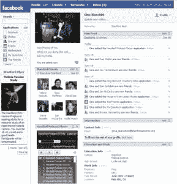
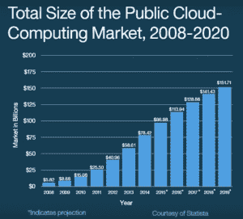
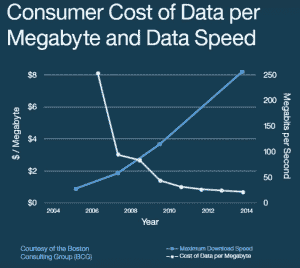
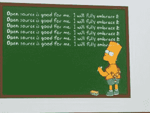

# 2007 年:我们彻底改造一切的一年

> 原文：<https://thenewstack.io/world-changed-2007/>

在今年 GitHub Universe 的主题演讲中，首席执行官[克里斯·万斯特拉斯](https://www.linkedin.com/in/chriswanstrath)提醒观众，第一个代码是在 2007 年提交给 GitHub 的，也就是 9 年前。我迷失在对这一家公司如何改变了科技面貌的思考中，并想知道自那以后还有什么改变。正如[比尔盖茨所说](http://www.goodreads.com/quotes/302999-most-people-overestimate-what-they-can-do-in-one-year)，“大多数人高估了自己一年能做的事，低估了自己十年能做的事。”那么，我们在 10 年里做了些什么呢？

脸书 2007 年的页面

回想一下 2006 年 12 月 31 日。你偷偷看了一眼你工作时的 MySpace 页面，发现你的另一个朋友现在在一个叫脸书的网站上。有传言说史蒂夫·乔布斯要发布一款手机！你和同事一起嘲笑他的傲慢。哪家科技公司会制造手机？刚刚成立两年的 YouTube 占用了你更多的时间，你热爱不受广告影响的视频。毫无疑问，这就是互联网的意义所在！你不知道下一年你的生活会有什么变化。

《纽约时报》财经专栏作家、畅销书作家托马斯·弗里德曼(Thomas Friedman)今年 10 月在 IBM 的《沃森世界》(World of Watson)的主题演讲中表示:“我们正处于这个星球上最大力量的大变革之中。”。他的新书《谢谢你的迟到:一个乐观主义者的指南一个乐观主义者在加速的时代茁壮成长的指南》第二章的标题是**2007 年到底发生了什么？**

 **事实证明，非常多。2007 年推出的技术清单令人震惊。iPhone 引发了全球狂热。脸书在 2006 年末走出高中和大学，在 2007 年走向世界。推特上线。出现了 GitHub、Hadoop、Android、AirBnB。YouTube 推出嵌入式内联广告， [Google Office 准备投入使用](https://gigaom.com/2007/12/23/google-2007/)，API 时代大约在 2007 年开始快速发展。

小额信贷成为一件严肃的事情:Kiva.org 于 2005 年成立，2007 年贷款额突破 500 万美元，并扩展到农业贷款。

Kiva.org 在 2007 年爆发，如今 1.85 亿美元的贷款已经发放给 485，000 名企业家，还款率为 95%。

公共云的扩展，诞生于 2007 年

随着始于 2006 年的亚马逊网络服务开始受到关注，公共云应运而生。API 市场是随着微服务的产生而产生的。IBM 启动了沃森项目，首次将人工智能从学术界引入商业和公共领域。

弗里德曼的研究指出了三种加速，这三种加速相互交织，创造了这些巨大的变化；[摩尔定律](https://thenewstack.io/farewell-moores-law/)、市场的数字化全球化和自然母亲。

摩尔定律的加速不仅影响了微芯片，而且在 2007 年，软件、网络、存储、传感都融合成了我们称之为“云”的东西。弗里德曼讨厌“云”这个词，它让人联想到柔软蓬松的图像，他认为，更确切地说，它是一颗技术超新星，是我们现在所做一切的中心。

数据成本的急剧下降有助于加速增长。

 *“我相信，2007 年将被视为自古滕贝格发明印刷机以来最伟大的技术转折点，”弗里德曼说，“因为 2008 年，我们完全错过了它。”

他解释说，就在物理技术突飞猛进的时候，科技泡沫破裂，房地产市场崩溃，经济陷入萧条。我们需要从这一不可思议的技术飞跃中获得最大收益的社会技术、监管技术和政治策略全都冻结了。这造成了完全的社会错位，弗里德曼认为我们正生活在这种错位中。毫无疑问，我们作为一个国家正在赶上这个勇敢的新世界的实际影响。

弗里德曼说:“你会看到一股能量释放到人类手中，这是我们从未见过的。”。

当然，基于 2007 年推出的公司的新技术每天都在涌现，新模式，新破坏，新 API，拥有所有五种感官的新认知机器，连接所有这些新部分的中间件的新部分。项目管理的新模式，简而言之，业务运作的新方式。

[在 GitHub Universe 使用开源技术进行项目管理](https://thenewstack.io/github-bloomberg-talk-using-innersource-build-open-source-project-development-behind-company-firewalls/)的一次会议后，[彭博](http://www.bloomberg.com/company/)的工程开发体验全球主管 [Panna Pavangadkar](https://twitter.com/pannasingh) 说:“这是一个多么美好的时代啊。”。她提到的事实是，微软现在是 GitHub 的主要贡献者，但这也适用于整个科技领域。

流程正在被发明、再发明和再想象。

“你所知道的关于软件开发的一切都是错误的，”IBM 研究员、软件专家 Grady Booch 在《沃森世界》的一次采访中说。你不能再简单地编写一个程序，他说，因为现在你的系统中有一些部分你必须教。你教你的系统的顺序会改变它的行为，所以你必须非常有意识地去教这个系统。这代表了我们需要考虑如何创建程序的根本转变。

“神经网络，直到你达到接近人脑的阈值，都不是不言自明的，”Booch 解释道。

你不能去问 AlphaGo“你为什么要走那一步？他说，它只是在动。但在医疗保健领域，沃森要求的参与度需要一定程度的信任。“如果沃森告诉你‘我认为你患有这种类型的黑色素瘤，你应该这样做’，我想和你谈谈，”布奇说。“华生，请带我去找导致你这样做的证据。华生，如果我给你这个测试，这可能会改变你的假设吗？”

但是我们目前不知道如何对神经网络进行配置管理。如果处于机器认知前沿的 Booch 不知道如何做到这一点，你可以打赌这是我们需要解决的一个难题。

正如布奇强调的那样，我们可能不知道会发生什么，但有一点我们可以肯定:这是一个充满活力、身处科技领域的美好时代，看着这场革命在 10 年后继续展开。

<svg xmlns:xlink="http://www.w3.org/1999/xlink" viewBox="0 0 68 31" version="1.1"><title>Group</title> <desc>Created with Sketch.</desc></svg>***