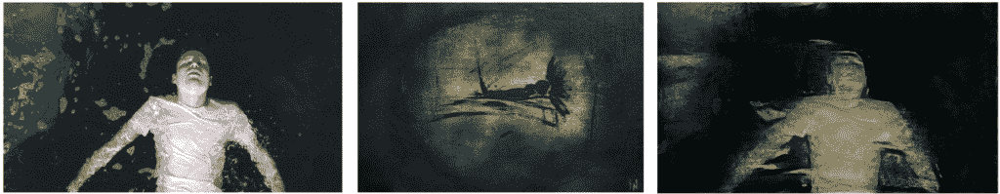
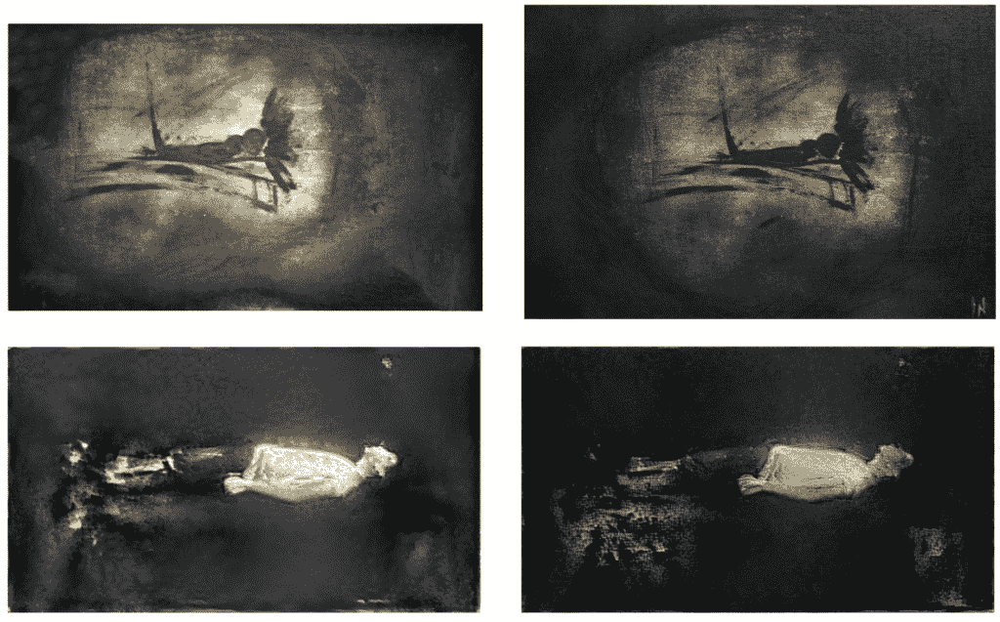
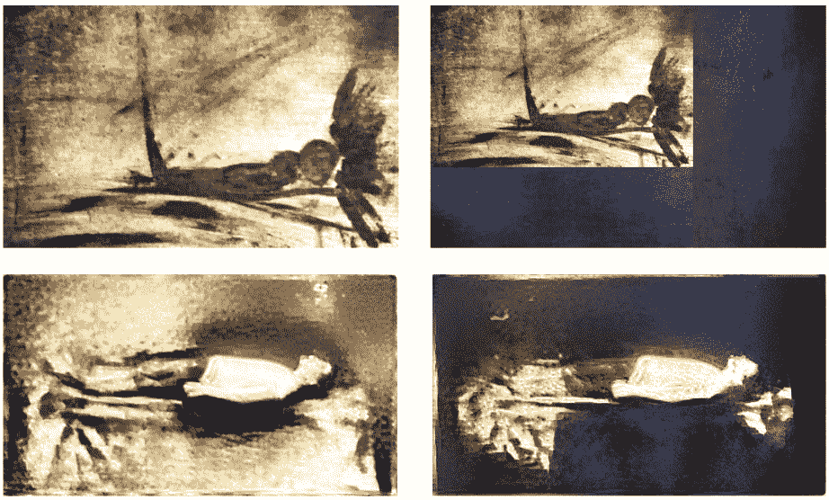
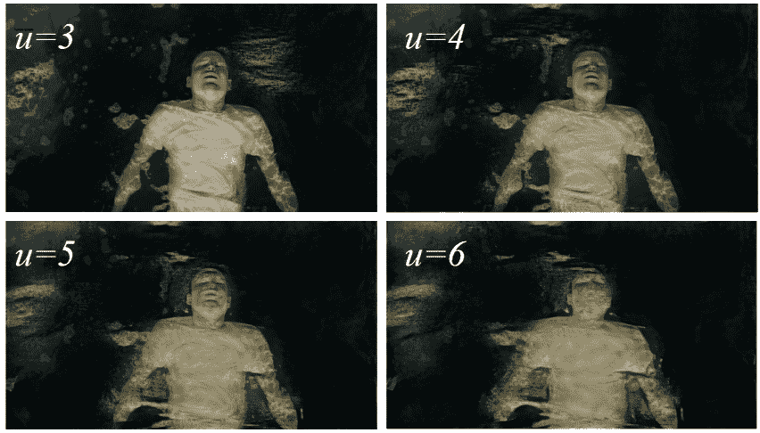

# 克里斯汀·斯图尔特:神经网络先驱？

> 原文：<https://thenewstack.io/world-movie-actresses-write-ai-research-papers/>

这位 26 岁的演员克里斯汀·斯图尔特在五部《暮光之城》*吸血鬼电影中扮演主角贝拉·斯旺。*名利场*将她列为[2010 年](https://geektyrant.com/news/2011/2/2/james-cameron-listed-as-top-earner-in-2010.html)收入最高的女演员。现在，她是一篇关于机器学习的学术论文的合著者。*

 *斯图尔特被列为论文的合著者，还有 Adobe 的研究工程师 Bhautik J. Joshi 和星光工作室的制片人 David Shapiro，在星光工作室，斯图尔特首次执导了一个名为"来游泳"的短片。CNET 将这部电影描述为“一种恍惚的冥想，融合了艺术视觉和当今最先进的计算技术之一。”

这就是机器学习的由来…

发布在 Arxiv 上的“[在*来游泳*](https://arxiv.org/pdf/1701.04928v1.pdf) 中用神经风格转移将印象主义带入生活”详细描述了电影制作人对人工智能试图复制绘画风格的结果进行微调的深思熟虑的方式，以实现特定的情感效果。

“神经风格转移”是该过程的技术名称，这是一种已经由各种神经网络执行的技巧，包括免费提供的 [Caffe](http://caffe.berkeleyvision.org/) 深度学习框架和用于机器学习的 [Tensorflow](https://www.tensorflow.org/) 库。对一种风格的机器评估被映射成另一幅图像的特定风格效果，在这种情况下，他们试图模仿的画是斯图尔特自己的。

该论文将由此产生的电影描述为“一个水下心碎男人的诗意印象派肖像”，并补充说，它也模拟了你第一次醒来时介于清醒和做梦之间的朦胧状态。"

在实施这个想法时，Stewart 立即面临一个挑战:“这项技术的新颖性在早期给人一种高质量结果的错觉，”他们的论文解释道。由于这是一种相对较新的视觉效果，“看到图像被重绘成绘画是足够引人注目的，几乎任何结果都似乎还过得去。”但该团队一直在仔细审查他们的结果:剔除新奇的因素，并弄清楚它是否真的有助于推动电影的故事发展。

论文总结了他们一路走来学到的东西。

为了获得这种特殊的外观，他们首先尝试用 [googLeNet](https://www.cs.unc.edu/~wliu/papers/GoogLeNet.pdf) 和 [vgg19](https://gist.github.com/baraldilorenzo/8d096f48a1be4a2d660d) 神经网络评估原始图像，他们的论文分享了他们的经验细节。他们使用 vgg16，即使“vgg19 的执行时间太长”，因为“googLeNet 没有给我们所寻求的美感。”为了缩小广泛的变量范围，他们首先通过紧密裁剪原始“风格”图像来建立“纹理转移”,以便他们可以专注于微调其他东西——并试图尽早确定适当的颜色。

他们的论文解释说:“虽然这种技术似乎可以按需提供印象主义，但在实践中操纵这种技术是困难的。”

这篇论文描述了“一组有意义的捷径”，这些捷径将映射微调为“一组减少但有意义的创意控制”，并分享了作者在整个过程中了解到的最佳路径——从原始风格图像的质量到迭代次数，甚至风格转换的*强度*。

这篇论文的一个重要观点是，在有足够的差异“进行有意义的探索”之前，转移到原作中的风格比例必须至少相差 10 的一个额外幂。它甚至分享了一个公式来表达它——ratio = 10 * * u——其中 u 变成了“一个有用的不真实度的量度……一个粗略的方法来映射风格转移图像看起来有多印象派。”

这听起来像是一个艰巨的计算过程。为了获得更强大的 GPU 硬件，渲染器转向亚马逊的[弹性云计算](https://aws.amazon.com/ec2/) (EC2)，优化图像，“最终每帧每实例使用的计算时间约为 40 分钟。”他们的论文分享了他们权威的、基于经验的结论——即“当试图为一个镜头找到一个特定的外观时，神经风格的转移远远不是自动的，需要许多创造性的迭代。”

看看他们最后想出了什么将会很有趣。在[的一次视频采访](http://variety.com/video/kristen-stewart-directorial-debut-come-swim/)中，演员[乔希·凯耶](https://www.imdb.com/name/nm1822292/)形容这部电影“很大程度上与心碎和随之而来的情感有关”。电影的一半是这种正在发生的超现实主义的内心折磨，然后你意识到这只是某人会感觉到的情绪的表现——就像，你知道，我们都曾经历过——当你刚刚失去某物或某人时。”

但这部电影似乎既是艺术成就，也是技术成就。The Verge [从 Twitter 上收集了一些它最喜欢的反应——包括佐治亚理工学院交互计算学院的一名副教授的一些反应，他在一条推特](http://www.theverge.com/tldr/2017/1/20/14334242/kristen-stewart-machine-learning-paper-ai)中惊叹[这篇论文的合著者“曾经被吸血鬼诱惑过”](https://twitter.com/mark_riedl/status/822178792529690624)

Keras 神经网络库的作者甚至提出，在今天的好莱坞，这是一种新的常态。

Digital Trends [似乎同意](http://www.digitaltrends.com/cool-tech/kristen-stewart-ai-project/)的观点，称好莱坞一位顶级女演员的研究论文“提醒人们人工智能技术对创作过程变得多么重要。”the Verge 对这一点进行了扩展，表明这只是我们人工智能辅助的未来的一丝曙光。

“事实是，这些曾经被认为是深奥和专业的机器学习工具已经变得越来越主流，”Verge 作家[詹姆斯·文森特](https://twitter.com/jjvincent)写道。他指出，甚至脸书现在也在[试验人工智能驱动的艺术过滤器](http://www.theverge.com/2016/11/8/13562288/facebook-ai-filter-prisma-mobile-app-caffe2go)，用于将著名画家的风格嫁接到你的脸书上传中，并认为 Stewart 的论文展示了一场“人工智能革命”是如何由一个使用公开可用工具的社区驱动的。

但也许还有另一个信息:为了让人工智能真正发挥作用，你需要领域专家，就像一位女演员转电影导演，他了解数字电影制作的要求。由于斯图尔特的技术背景似乎有限，这就更加令人印象深刻。根据一次采访，Stewart 只在公立学校[读完初中](https://web.archive.org/web/20100216152346/http://www.interviewmagazine.com/film/kristen-stewart-1/4/)，然后转到[一个独立的函授学校](http://web.archive.org/web/20120121042559/http://www.moviesonline.ca/movienews_11136.html)《每日电讯报》指出，这篇论文是通过康奈尔大学图书馆发表的，“但还没有经过同行评议。”

但是，如果一个 26 岁的演员能够运用机器学习的力量——结果不言自明吗？不管我们承认与否，这个世界可能已经在改变了。“看，即使这没有意义，社交媒体上的聪明人肯定会留下深刻印象，”[援引互动计算学院副教授的话说。](http://www.telegraph.co.uk/films/2017/01/20/kristen-stewart-has-co-written-scientific-paper-artificial-intelligence/)

《the Verge》的一位评论者似乎很高兴看到斯图尔特将她的曲目扩展到一篇题为“用神经风格转移将印象主义带入生活”的科学研究论文

"听起来比《暮光之城》更好的爱情故事."

来自[克里斯汀·斯图尔特](http://www.kristenstewart.com/)网站的专题图片。

<svg xmlns:xlink="http://www.w3.org/1999/xlink" viewBox="0 0 68 31" version="1.1"><title>Group</title> <desc>Created with Sketch.</desc></svg>*