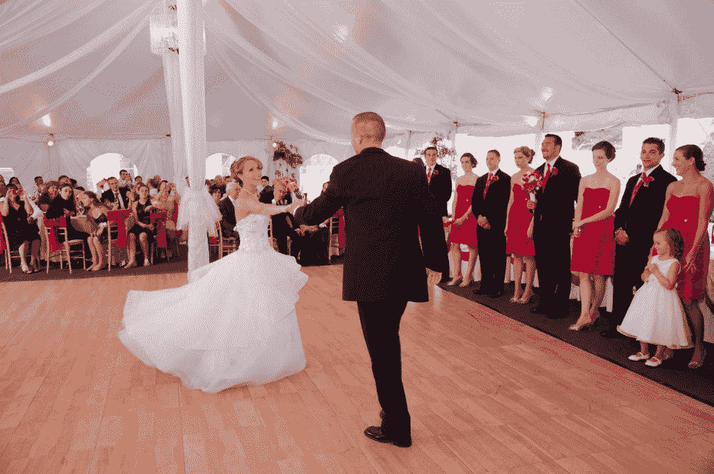
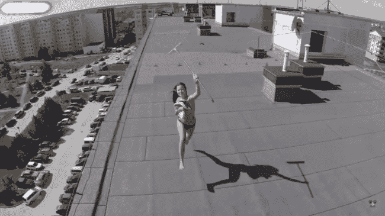

# 世界上最糟糕的婚礼和其他关于无人机的警示故事

> 原文：<https://thenewstack.io/worlds-worst-wedding-cautionary-tales-drones/>

如果你期待一架无人驾驶飞机作为圣诞礼物，请记住，科技可能会让你变得不听话。我们已经听说过很多无人机飞行员惹上麻烦，其中很多都是以无人机被[用猎枪](http://www.huffingtonpost.com/entry/mike-rowe-shotgun-drone_us_57ea3845e4b024a52d2a62b7)从天而降而告终。《纽约时报》甚至建议[检查你的保险](http://www.nytimes.com/2016/12/14/your-money/money-adviser-drones.html)以确保它涵盖“与无人机相关的索赔”如果你在猴子笼上空驾驶无人机，小心愤怒的猴子挥舞着棍子。

因此，就像未来圣诞节的幽灵一样，我们挥舞着锁链，发出可怕的警告。不要酒后驾驶无人机，不要鲁莽驾驶无人机，无论如何，不要在婚礼上驾驶无人机！

流行摄影杂志的标题是“新郎的无人机在婚礼上拍宾客的脸”。它描述了朋友和家人在这个欢乐的时刻遭受的不幸伤害，以及随之而来的一些诉讼。

文章的结论？“如果你打算尝试无人机拍摄，请确保在起飞前进行大量练习。”

又不是没人预见到无人机在婚礼上的危险性。回到 2014 年，YouTube 上出现了一段视频，展示了几乎相同的场景。

[https://www.youtube.com/embed/C-0MA6QNj6g?start=84&feature=oembed](https://www.youtube.com/embed/C-0MA6QNj6g?start=84&feature=oembed)

视频

但是有一个故事太出人意料了，媒体忍不住纠缠于所有讽刺的细节。“新罕布什尔州屋顶工巴里·比尔克利夫刚刚与他的梦中情人结婚，”[波士顿先驱报](https://www.bostonherald.com/2016/12/09/heslam-guests-suing-groom-over-drone-crash/)写道，“当他们计划了两年的美丽婚礼急转直下时。”这位 38 岁的新郎省吃俭用，预订了一座都铎式庄园的历史复制品，他告诉《波士顿先驱报》，“这真是太棒了”。

也就是说，直到无人机事故…

> “常识告诉我们，在我们昂贵的帐篷里飞行无人机不会有什么好结果，帐篷上覆盖着昂贵的织物，还挂着吊灯。”

比尔克利夫曾想用无人机拍摄的一些特殊镜头来纪念他 8 月 8 日的婚礼。为什么不呢？他已经在他的越野车上拍摄户外骑行了。8 月份的婚礼在一座 1915 年的都铎式庄园(由慈善修女会所有)的复制品中举行。从城堡的网站来看，神奇的一天可能是这样的:

【T2

新郎对那一天的回忆——与《先驱报》分享——是新娘一整天“都担心我做了什么蠢事”很公平:他已经建立了“愚蠢的滑稽动作”的名声。晚上早些时候，他在朋友的桌子上扔了几个肉丸，但据报纸报道，“他坚持在婚礼上表现得最好。”

“他说他仍在试图找出无人机失控时谁握着操纵杆。”

两次脑震荡和几处骨折后，有许多愤怒的派对常客和几起诉讼。《波士顿》杂志开玩笑说:“如果你打算在近期成为一对科技爱好者的婚礼嘉宾，考虑带上头盔。”。对于一些参加婚礼的客人来说，现在最大的问题是他们应该起诉谁。因为尽管无人驾驶飞机明显失控，但仍有一些关于谁在驾驶它的争论。

舞池里的 DJ 说*是新郎——尽管新郎的律师否认了这一点，并补充说对两名原告造成伤害是“令人遗憾的”。但是这个解释并不能满足所有人。*

两名愤怒的派对参与者甚至起诉了举行婚礼的酒店，称酒店工作人员*知道*这个古怪的新郎正计划放出他心爱的飞行摄像机无人机。但婚礼场地的一名管理人员坚持说，他们已经“绝对肯定地”明确告知新郎，由于我们熟悉法律和我们财产周围的区域，他不被允许在城堡里驾驶无人机。他们甚至告诉新郎停止放飞他的无人机——他照做了，但后来又开始放飞。他们现在告诉记者，他们将再次警告他，但“不幸的是，为时已晚。”

“常识告诉我们，在我们昂贵的帐篷里飞行无人机不会有什么好结果，帐篷上覆盖着昂贵的织物，还挂着吊灯。”

这对夫妇最终取消了他们在迪拜的蜜月，新郎形容这是一个“有点扫兴”的发展。但据《先驱报》报道，他认为自己不应该被起诉。比尔克利夫说，他站在人群中间，在妻子身后，靠近舞台，听他们的朋友演唱一首专为这对新婚夫妇创作的歌曲

几天后[《先驱报》跟进了](https://www.bostonherald.com/2016/12/10/wedding-crashing-drone-pilot-gives-groom-a-buzz/)的消息,“狂野事件促使真正的飞行员站出来。他非常抱歉，他说这是一个奇怪的意外，”新郎说。“‘没有任何恶意，这是一系列不幸的事件。’"

很快，护理人员赶到了——提前结束了婚宴。据新郎说，新娘“在那之后心情非常非常糟糕。”

特征图片:[十大无人机坠毁失败](https://www.youtube.com/watch?v=IXApfBIEfw8&index=1&list=RDIXApfBIEfw8)。

<svg xmlns:xlink="http://www.w3.org/1999/xlink" viewBox="0 0 68 31" version="1.1"><title>Group</title> <desc>Created with Sketch.</desc></svg>