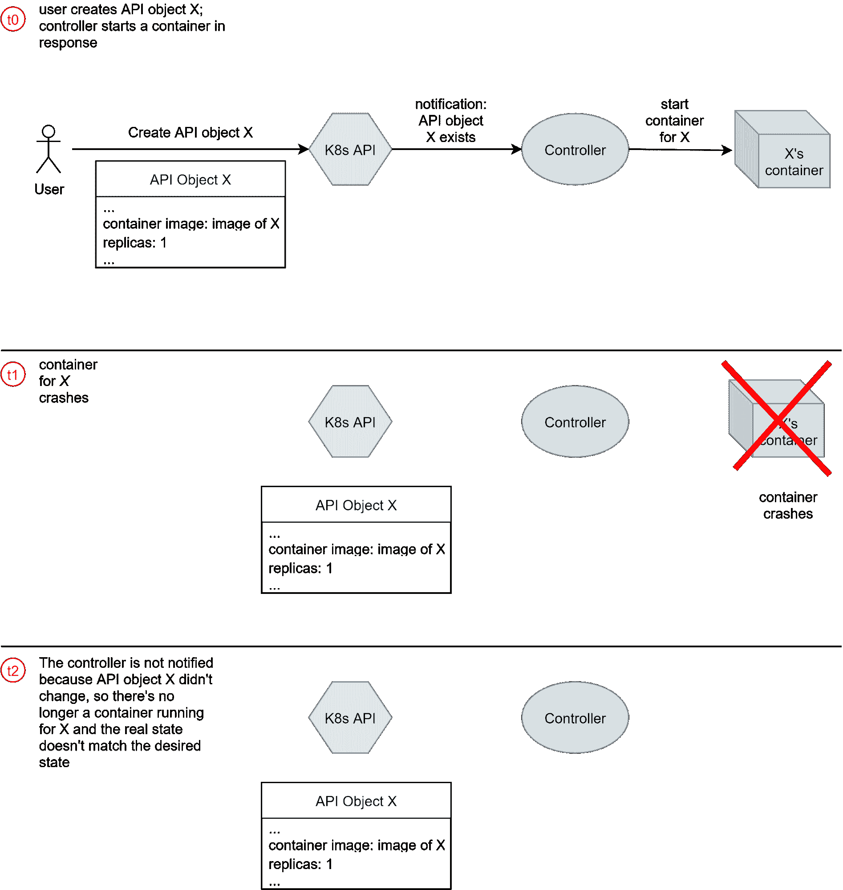
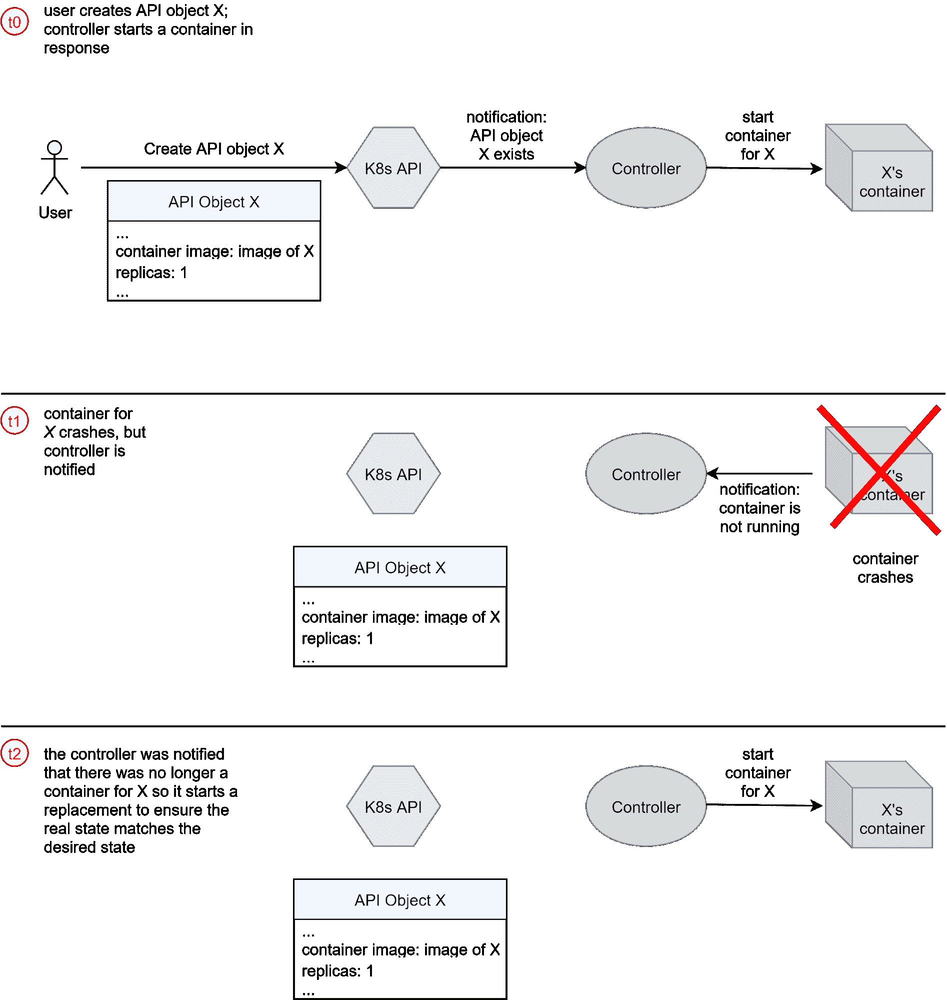
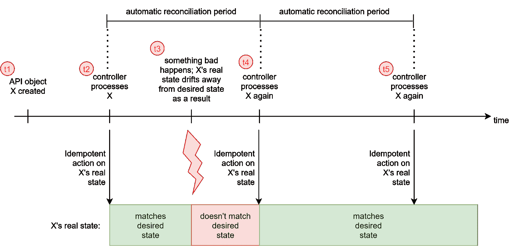
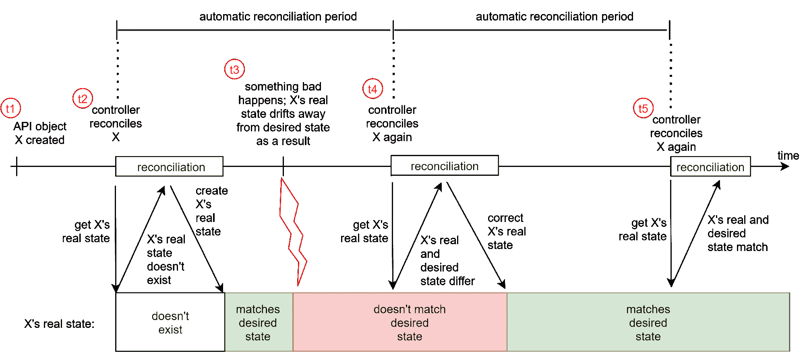
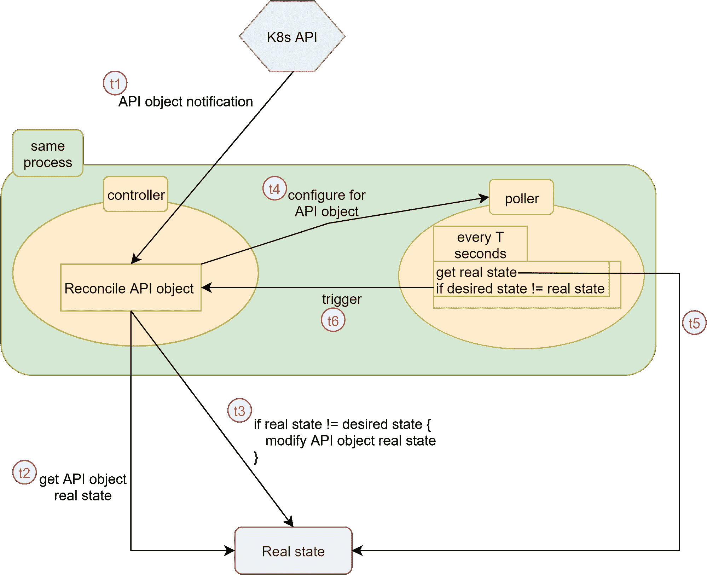
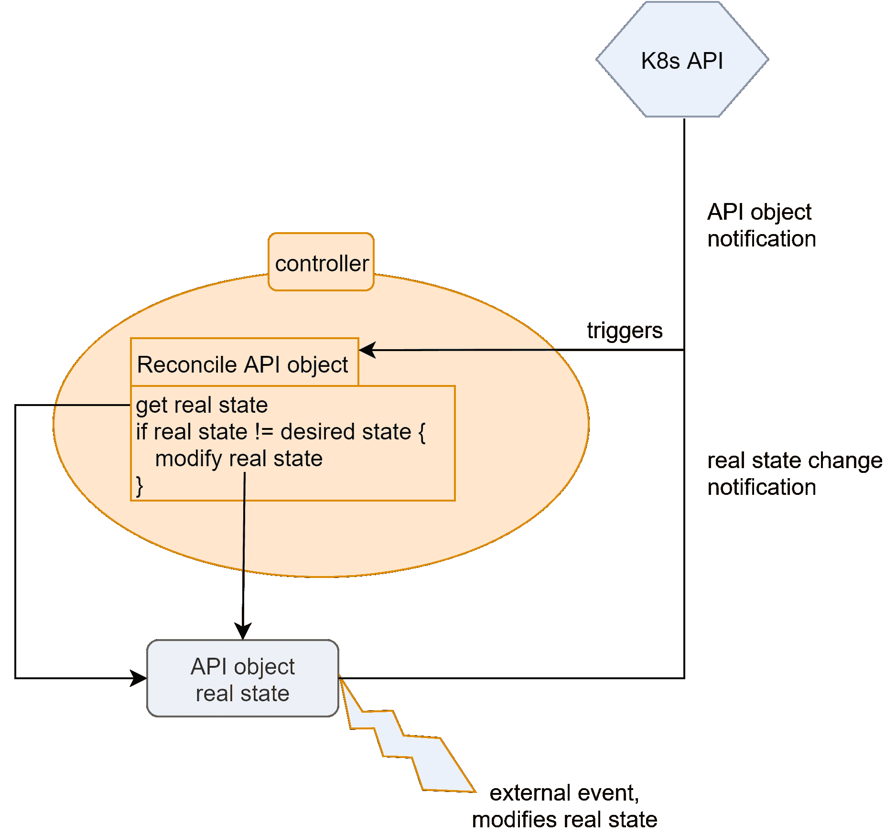

# 编写定制的 Kubernetes 控制器:小心状态漂移

> 原文：<https://thenewstack.io/writing-custom-kubernetes-controllers-beware-of-state-drift/>

[Matteo Olivi](https://www.linkedin.com/in/matteo-olivi-797b80129/)

[Matteo 于 2020 年获得博洛尼亚大学计算机工程理学硕士学位。自 2018 年以来，他一直在研究和研究云基础设施和平台，重点是 Kubernetes。2020 年，他加入了 anynines，在那里他致力于构建 Kubernetes——用于数据服务生命周期管理的原生自动化。](https://www.linkedin.com/in/matteo-olivi-797b80129/)

Kubernetes 已经在编排容器方面取得了成功，但它也因为它的工作方式而影响了云计算。

它的控制平面的设计模式基于一个声明式 API，让用户表达他们想要的状态，以及一组控制循环，也称为[控制器](https://kubernetes.io/docs/concepts/architecture/controller/)，驱动“真实世界”向用户想要的状态发展，被证明是足够通用的，可以用来管理不仅仅是容器。

这种情况的一个症状是由社区编写的自定义 Kubernetes 控制器和 API 的蔓延，以管理各种资源，如虚拟机、数据服务、软件定义的网络等。

然而，尽管编写一个玩具定制控制器相对容易，但是在编写一个生产级的控制器时却有许多挑战。

在 anynines，我们正在基于定制的 Kubernetes 控制器构建一个完整的控制平面，以完全自动化数据服务的生命周期管理。在此过程中，我们意识到了与生产级控制器相关的许多挑战。本文描述了一个我们很少讨论的挑战:“真实世界”可以自动偏离用户期望的状态，因此它必须由控制器来监控，就像 Kubernetes API 一样。

以下部分描述了该问题。然后，在总结结论之前，我们概述可能的解决方案。

## **问题**

Kubernetes 控制器的定义，不管是不是自定义的，人们通常给出的定义是:“监视某些(自定义)Kubernetes API 对象上的通知，并通过修改对象描述的资源来处理每个这样的对象，以使资源与该对象所需的状态相匹配的进程。”使 API 对象描述的资源与期望的状态相匹配的行为有时被称为协调。

控制器修改什么资源来协调 API 对象取决于 API 对象代表什么，因此对于每个控制器都是不同的。一些控制器通过创建、更新和/或删除其他相关的 API 对象来协调 API 对象。API 对象到低级 API 对象的这种转换可以在多个级别上进行，但在某一点上，它会停止于一个控制器，该控制器通过将副作用应用于 Kubernetes API 之外的东西来协调 API 对象。

例如，如果你创建了一个 [StatefulSet API 对象](https://kubernetes.io/docs/concepts/workloads/controllers/statefulset/)，它被转换成一些 [pod API 对象](https://kubernetes.io/docs/concepts/workloads/pods/)，然后为每个 pod 启动一个容器；容器是 Kubernetes API 之外的副作用。

根据本节开头的定义，控制器所做的所有工作都是由 API 对象上的通知驱动的:如果因为 API 对象群没有变化而没有接收到新的通知，那么控制器什么也不做。事实上，这就是控制器的数量。如果控制器只创建/更新/删除 API 对象，而不直接修改 Kubernetes API 之外的任何东西，这就没有问题。

如果控制器修改了 Kubernetes API 之外的一些资源，那么这样的设计可能是有缺陷的。原因是它忽略了这样一个事实，即那些资源的状态——“真实”状态——可能会自动偏离 API 对象中描述的期望状态。在这种情况下，控制器不会收到任何通知，因此它无法将资源的状态驱动回所需的状态，并且系统没有自我修复能力。

让我们看一个例子，如图 1 所示。想象一下，我们有一个负责直接管理容器化应用的控制器。(当然，您不希望编写这样的自定义控制器，因为已经有 Kubernetes 本身解决了这个问题，但是为了这个例子，请耐心等待)。如果创建了描述具有一个副本的新应用程序的 API 对象，控制器将产生运行该应用程序的容器。如果容器因为代码中的错误、错误的输入等而崩溃。控制器将永远不会收到关于 API 对象的通知。然而，它必须知道容器崩溃了，以便尽快产生一个替代品来自我修复！

图 1:支持 API 对象的真实状态可以自动偏离期望状态。

因此，对于一个在 Kubernetes API 之外直接修改资源的定制 Kubernetes 控制器来说，在 Kubernetes API 对象上订阅通知是不够的。它还必须监控支持这些 API 对象的资源，即使真实状态偏离了，也必须触发期望状态和真实状态之间的协调，如图 2 所示。还有一个例外，只处理 API 对象的控制器也会遇到同样的问题:当控制器修改 Kubernetes API 之外的资源时，不是直接修改，而是通过 [Kubernetes Jobs](https://kubernetes.io/docs/concepts/workloads/controllers/job/) 。

图 2:实际状态偏离期望状态，但控制器得到通知并做出反应。

如果您正在构建一个简单的定制控制器，您可能只需要将协调的 API 对象转换成相关的 Kubernetes 内置 API 对象，因此您不会遇到我们描述的问题。但是，如果您正在基于必须支持复杂用例的定制控制器构建一个完整的控制平面，您可能必须编写一个控制器来修改 Kubernetes API 之外的一些东西，然后我们描述的问题可能会出现。

不幸的是，没有通用的解决方案，因为它很大程度上取决于自定义 API 对象所描述的资源的性质。但是，在下一节中，我们将概述一些可以作为构建解决方案基础的想法。

## **解决方案的思路**

### **完全回避问题**

如果自定义控制器只能通过创建/更新/删除依赖的 Kubernetes API 对象来完成其任务，则采用这种方法；这样更简单，完全避免了这个问题。控制器仍然必须监控支持它实现的 API 对象的状态。虽然，因为该状态由其他 API 对象组成，控制器可以重用相同的 Kubernetes 机制来通知它实现的 API 对象，所以 Kubernetes 自动解决了这个问题。

### **定期幂等地重新协调 API 对象**

假设在 Kubernetes API 之外修改资源的动作是等幂的。在这种情况下，控制器可以定期重新协调每个 API 对象，即使没有收到新的通知——Kubernetes 对此有内置支持——并重新执行幂等操作。如果实际状态偏离期望状态，则在下一次协调时，实际状态是固定的。否则，什么都不会改变，因为应用的动作是等幂的，如图 3 所示。

图 3:通过周期性地对真实状态应用幂等操作，解决了真实状态和期望状态之间的不匹配。

这种方法会浪费资源，因为即使没有必要也要定期进行协调，而且还有调整协调周期的问题。

### **投票真实状态**

如果对支持 API 对象的资源的真实状态的检查已经是协调的一部分，就像它应该的那样，并且协调没有消耗太多的资源，则控制器可以周期性地重新协调每个 API 对象。标准的协调逻辑将轮询真实状态，并在必要时纠正它，如图 4 所示。

图 4:作为正常协调的一部分，通过定期轮询真实状态解决了真实状态和期望状态之间的不匹配。

否则，如果一个完整的协调占用了太多的资源，您可以编写代码，除了周期性地轮询每个 API 对象的真实状态，并在真实状态与期望状态不同时触发协调，如图 5 所示。这样的代码将在控制器进程内部运行，但是它将与完全协调 API 对象的主控制循环分开。

图 5:通过定期轮询专用逻辑中的真实状态并在检测到不匹配时触发协调，解决了真实状态和期望状态之间的不匹配。

这两种方法的问题是:

*   资源消耗(可能有许多不必要的协调/轮询)，
*   为对账/投票设定合理的期限，以及
*   控制器开发人员必须编写执行轮询的额外逻辑(对于第二种方法)。

### **观看实时状态通知**

如果支持 API 对象的真实状态具有对其变化的流通知的内置支持，在与控制器相同的二进制文件中，您可以包括侦听此类通知并在接收到一个此类通知时触发相关 API 对象的协调的逻辑。一个真实的例子是，每个 API 对象代表 PostgreSQL 数据库中的一个角色。因为 PostgreSQL 支持通知(例如，通过[触发器](https://www.postgresql.org/docs/14/sql-createtrigger.html)，控制器可以订阅关于角色创建/更新/删除的 PostgreSQL 通知，并在收到这样的通知时触发相关 API 对象的新协调。这相当于使控制器不仅由 Kubernetes API 通知驱动，还由“真实状态通知”驱动，如图 6 所示。

图 6:由 Kubernetes API 通知和真实状态通知驱动的协调。

不幸的是，有些情况下这是不可能的，因为真实状态不支持更改通知。

如果您遇到这种情况，您仍然可以通过轮询将通知从更改合成到真实状态，代价是编写、维护和操作一个额外的组件。您可以编写并部署一个“轮询器”,它会轮询实际状态，并在发现实际状态和期望状态之间存在差异时更新相关 API 对象的状态。这种状态更新将导致 API 对象的通知，该通知将被控制器接收，控制器将再次进行协调，修复真实状态。

## **结论**

我们描述了一个在编写定制 Kubernetes 控制器时经常被忽略的问题:支持 API 对象的真实状态可能会偏离期望的状态，即使在这种情况下也必须通知控制器来协调这两种状态。然后，我们草拟了一些想法，可以作为构建问题解决方案的起点。我们希望任何参与编写定制控制器的人都能从我们描述的问题意识和如何克服它的想法中受益。

<svg xmlns:xlink="http://www.w3.org/1999/xlink" viewBox="0 0 68 31" version="1.1"><title>Group</title> <desc>Created with Sketch.</desc></svg>