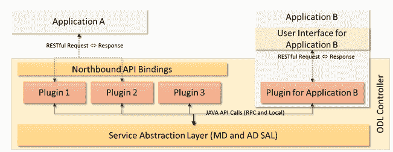
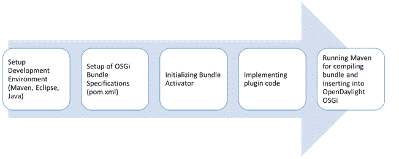
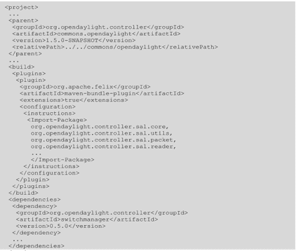
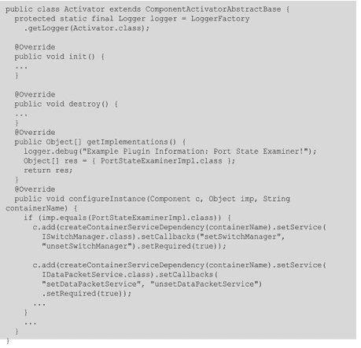

# 编写 OpenDaylight 应用程序

> 原文：<https://thenewstack.io/writing-opendaylight-applications/>

新的堆栈已经有了一个关于软件定义的网络的连续系列。今天的文章是正在进行的系列文章的一部分。在第一部分，我们

[defined SDN](https://thenewstack.io/defining-software-defined-networking-part-1/)

并详细介绍了不同的 SDN 控制器和框架。在我们系列的第二部分，我们写到

[Trema, a framework for developing OpenFlow controllers](https://thenewstack.io/sdn-series-part-ii-trema-a-framework-for-developing-openflow-controllers-in-ruby-and-c/)

第三部分探讨了

[NOX](https://thenewstack.io/sdn-series-part-iii-nox-the-original-openflow-controller/)

，最初的 OpenFlow 控制器。在第四部分，我们写了刘，一个

[open source SDN Controller supported by NTT Labs](https://thenewstack.io/sdn-series-part-iv-ryu-a-rich-featured-open-source-sdn-controller-supported-by-ntt-labs/)

。在第五部分，我们看了

[FloodLight](https://thenewstack.io/sdn-series-part-v-floodlight/)

，一个下载量超过 15000 次的 OpenFlow 控制器。

[OpenDaylight](https://thenewstack.io/sdn-series-part-vi-opendaylight/)

，一个拥有广泛行业支持的 SDN 控制器，是第六部分的主题。在第八部分，新书库创始人亚历克斯·威廉姆斯写道

[SDN, Docker and the Real Changes Ahead](https://thenewstack.io/sdn-docker-real-changes-ahead/)

.

OpenDaylight 平台的应用程序可以使用两种广泛的方法来开发:

*   使用一个或多个插件公开的 RESTful APIs 编写应用程序。这样，应用程序是 OpenDaylight 生态系统的一部分，但不一定是框架的原生部分。
*   编写一个“本地”OpenDaylight 应用程序，该应用程序使用 OpenDaylight 框架公开的 [OSGi](https://en.wikipedia.org/wiki/OSGi) 接口(Java APIs)。这些接口是框架中存在的各种其他插件的衍生物。

【T2

***图 1–将应用程序可视化为 OpenDaylight 平台一部分的两种基本方式***

使用 RESTful 方式，应用程序可以不知道与 OpenDaylight 框架相关的复杂性，并且完全独立于语言——例如，使用 Python 发出 RESTful 请求和处理响应。然而，使用 OSGi 接口，应用程序可以利用更多的功能，并具有更高的性能。使用特定的哲学本质上是在易用性和周转时间与灵活性和性能之间做出决定。

上面定义的任何一种方法都允许将应用程序视为北向应用程序，即包含使用 OpenDaylight 作为平台提供的功能的业务逻辑的应用程序。

因为 RESTful 开发方式更倾向于 web 应用程序的开发，所以在下面的章节中，我们在深入研究 OSGi 方法之前，只简单地接触一下。

## 使用 RESTful API 编写应用程序

RESTful APIs 可以由集成到 OpenDaylight 平台的任何插件提供，作为其北向接口的一部分。具体到提供各种核心网络服务的 OpenDaylight 控制器插件，下面是一些公开的 RESTful APIs:

1.  拓扑:包含 RESTful APIs 来访问由边、节点及其属性表示的网络图。预定义的 XML 模式定义了这个 API 的数据元素。
2.  Host Tracker: RESTful API，基于拓扑服务标识的节点，为网络上的主机提取或设置信息。定义这个 API 的数据元素的 XML 模式包括像网络地址和 VLAN 信息这样的信息。
3.  Flow Programmer:为配置网元上的流而公开的 API，由南向端各自的协议插件控制。这个 API 的 XML 模式包括配置流及其匹配条件和动作的信息。
4.  静态路由 API:用于在网络结构上创建 IP L3 静态路由条目的简单 API。
5.  统计数据:提供流条目和节点元素统计数据的 API。
6.  子网:用于将网络节点和连接到它们的主机配置到预定义的 IP 子网中的 API。
7.  交换机管理器:集中于将底层网络中的各种节点公开为交换机配置文件，列出它们的端口和属性的 API。
8.  用户管理器:用于配置 OpenDaylight 平台的认证用户及其角色的 API。

尽管几乎所有的 API 都为数据交互提供了 RESTful XML 模式，但是有些 API 也支持 JSON 结构。使用模块开发的 MDSAL 方法，可以创建 YANG 模型，该模型可以自动生成模块的 RESTful 绑定。

使用上面列出的各种 API，以及 OpenDaylight 文档中提供的其他 API，可以在 OpenDaylight 平台上创建北向应用程序。

这些应用程序虽然使用更通用的 HTTP 接口连接，但仍然是 OpenDaylight 平台的完全合格的成员。由于这些不一定与控制器本身在同一个空间，因此安全性变得很重要。因此，为了提供一个安全的环境来访问敏感的网络信息，比如网络拓扑，OpenDaylight 提供了一个基本的框架来认证使用 RESTful 机制发送的请求。

### 示例应用:CableGuy

我正在分享一个只使用 REST-API 为 ODL 开发的简单应用程序(虽然没有经过很好的测试)。该应用程序执行以下操作:

1.  中的预期拓扑。点文件格式作为输入。
2.  使用 rest-API 从 ODL 获取拓扑信息
3.  比较两种拓扑和显示以及缺失/丢失的“电缆连接”。

本应用程序中使用的从 ODL 获取信息的 REST 请求可以如下列出:

1.  拓扑请求:" http://"+odl _ IP+":"+odl _ port _ num+"/controller/nb/v2/topology/default "
2.  连接到 ODL 的交换机:" http://"+odl _ IP+":"+odl _ port _ num+"/controller/nb/v2/switch manager/default/nodes "

1.  端口列表:" http://"+odl _ IP+":"+odl _ port _ num+"/controller/nb/v2/switch manager/default/node/OF/"

申请可以在这里找到:https://github.com/cosanti/TheCableGuy

## 使用 OSGi 接口编写应用程序

在我们讨论使用 OSGi 接口开发 ODL 应用程序之前，让我先介绍几个先决概念。读者可以在提供的参考资料中在线获得这些概念的细节。

### OSGi 和 OSGi 捆绑包

开放服务网关接口(OSGi)构成了 OpenDaylight 平台的后端。OSGi 框架本质上提供了一个将应用程序模块化成更小的*包的环境。正如 Wiki 所说，“每个包都是一个紧密耦合的、可动态加载的类、jar 和配置文件的集合，它们显式地声明了它们的外部依赖关系(如果有的话)”[1]。用户可以自由使用任何 OSGi 容器，比如 Apache Felix 或 Equinox。我们可以在网上找到各种解释创建这些包的过程的资源，包括 javaworld.com。*

 *### Maven、maven 捆绑插件和 POM

OpenDaylight 使用 [Maven](http://maven.apache.org/guides/introduction/introduction-to-the-pom.html) 进行构建自动化和依赖管理。Maven 的主要目标是让开发人员了解开发过程的完整状态，它可用于构建和管理任何基于 Java 的项目。Maven-bundle-plugin 提供了一个支持创建 OSGi 包的 Maven 插件。Maven 允许项目使用它的项目对象模型(POM)和一组公共插件来构建。项目对象模型或 POM 是 Maven 中的基本工作单元。它是一个 XML 文件，包含关于项目的信息(资源——源代码目录、外部依赖项等)以及 Maven 用来构建项目的配置细节。POM 文件被命名为 pom.xml，通常位于项目的根目录中。如果一个项目被划分为多个子项目，则通常父项目有一个 POM 文件，每个子项目有一个 POM 文件。这种结构既允许在一个步骤中构建完整的项目，也允许单独构建子项目[3]。

### 卡拉夫

Apache Karaf 是一个基于 OSGi 的运行时，它提供了一个轻量级的容器，可以在其中部署各种组件和应用程序[4]。它是一个非常灵活和可扩展的容器，允许从一个非常轻量级的容器扩展到一个功能丰富的企业服务。

### 杨

建模语言和 YANG 工具用于为模型驱动插件生成各种兼容的接口。模型是在 YANG 中定义的，当使用 YANG 编译器编译时，会产生适用于插件的各种 API(如 RPC、RESTful)的定义。使用生成的模板，开发人员可以编写逻辑。

### ODL 现有项目的模块/包和接口

Opendaylight 包含模块/包的列表，这些模块/包导出了一组接口。与其他控制器平台类似，ODL 模块也提供了监听异步事件、解析传入数据包、发送 openflow 消息等功能。该平台提供了 Java 接口，应用程序使用这些接口来监听和处理事件、基于事件做出决策等。

使用 OSGi 接口编写应用程序，本质上是 OpenDaylight 平台中的一个插件，需要开发者关注两种广泛的方法——模型驱动或应用驱动。如前一篇文章中所解释的，模型驱动方法集中于通过使用基于 YANG 的内部和外部 API 模型来开发 OpenDaylight 插件。然而，应用驱动的方法集中于开发独立的服务消费者，消费由基本的或特定领域的服务插件产生的服务。

按照 OSGi 的说法，bundle 相当于集成到 OpenDaylight 框架中的插件。bundle 是 Java 代码、POM 文件和层次结构的集合，定义了可以在需要时插入框架的插件。使用 OSGi 接口的 OpenDaylight 应用程序实际上是一个北向插件，作为一个包开发并嵌入到框架中。每个插件本质上都定义了它提供和消费的服务列表。对于消费的服务列表，所有必要的依赖结构都由 OSGi 使用 pom.xml 文件中的定义来解析。对于所有提供的服务，OSGi 都做了注释，以便在将来其他模块请求这些服务时提供必要的绑定。

例如，期望从南向网络层接收分组的插件将向 OSGi 传达它想要使用由控制器提供的用于接收分组(IListenDataPacket)和解析分组以提取信息(IDataPacketService)的服务。这些是 Java 接口，插件在继承控制器类层次结构后必须实现这些接口，以便 SAL 将数据包的接收作为回调绑定到接口实现。

下面是作为控制器 API 的一部分，通过不同的捆绑包或插件公开的服务列表示例。详细的列表可以在这里找到[2]。

***表 1–open daylight 控制器*** 提供的示例服务

北向插件通常被视为 SAL 的消费者，因为它消费南向协议插件提供的服务。每个北向模块还提供一个 RESTful API，允许外部应用程序使用它的服务。自定义 RESTful API 的实现完全依赖于应用程序模块的用例。下面我们描述这两个过程；(a)用 ADSAL 编写应用程序插件模块(b)详细地为插件编写北向 API。

## 用 ADSAL 编写应用插件模块

下图显示了在 OpenDaylight 中开发 ADSAL 兼容插件的一系列高级步骤。下一节将进一步演练这些步骤，以便更深入地理解这一过程。

***图 2–在 ADSAL*** 中创建插件的步骤

## 开发环境的设置

OpenDaylight 的开发环境主要包括 Java 编译器和 Maven 构建工具。IDE 不是强制性的，但是推荐使用它来简化构建插件和将插件集成到框架中的过程。OpenDaylight [5]的 Wiki 中提供了一个基于 Eclipse 的环境设置。除了设置之外，还建议习惯 GIT 管理插件代码的方式，并为各种其他插件获取最新的存储库。这在 OpenDaylight 的 wiki 页面[6]中也有很好的解释。例如，在使用控制器提供的服务开发任何使用 OSGi 接口的插件之前，建议从控制器的 GIT 存储库中获取控制器的代码，以减少使用陈旧接口的机会。

## OSGi 捆绑规范的设置

一旦建立了开发环境，创建插件的下一步就是定义一个包含插件代码的包及其规范。捆绑规范将定义插件需要哪些服务，从而请求 OSGi 加载提供这些服务的插件。

OpenDaylight framework 使用 Maven 工具来解析包之间的依赖关系。这是通过使用名为 pom.xml 的 pom 或项目对象模型文件来完成的。要将条目添加到 POM 文件中，可能需要了解其他包及其服务的命名约定。这可以在 OSGi 接口文档中找到，该文档可以通过各种主流包的自动生成的 Javadocs 获得。

下图(图 3)显示了一个 pom.xml 文件的片段，其中包含一个 xml 模式。这个模式包含了关于整个项目的细节，包括在构建时要导入的各种包以及跨框架的依赖关系。关于 POM XML 模式的更多细节可以在 Maven Apache 门户上找到。

***图 3–显示 pom.xml 文件*** 的片段

创建 POM 文件时要记住的一些要点是:

*   POM 是一个层次模型:在定义了父插件的层次结构中创建一个包，用于插件的更广泛的规范。对于 OpenDaylight，放置在“<framework root="">/controller/open daylight/commons/open daylight/”目录中的控制器的 pom.xml 文件是所有愿意与控制器集成的 bundles 的父级。Maven 构建系统将从父节点使用某些规则，包括解析依赖包名称。</framework>
*   导入和导出包:使用<import-package>标签，导入该包操作所需的其他包。类似地，这个包可以使用<export-package>标签暴露自己，以便被其他包导入。</export-package></import-package>
*   解决依赖关系:除了导入要使用的包之外，还需要从一个包中传递 maven 系统关于各种子系统的信息，这些子系统将被这个包使用。例如，应用程序可能打算使用交换机管理器来提取有关交换机及其端口的信息。交换机管理子系统是控制器包的一部分，用于访问其公开的服务；maven 是通过 pom.xml 文件的依赖标签来传递的。

## 正在初始化捆绑激活器

除了 pom.xml 文件，另一个用于设置环境的重要文件是 Activator.java 文件。这个文件充当了框架和正在开发的插件之间的桥梁模板。

 ***图 4–显示 Activator.java 文件*** 的片段

Activator 文件定义了各种入口点，控件通过这些入口点从框架中输入插件代码。它本质上是一个扩展 SAL 服务的 componentiactivatoratchabstract base 类的类。通过覆盖 getImplementations()函数，插件将对 SAL 可见，并且它将接收针对订阅的服务的回调。

但是，在注册回调之前，代码需要通过覆盖 configureInstance()方法来配置回调挂钩。例如，为了使用接收、解析和发送数据包的数据包服务，插件将通过使用 createContainerServiceDependency()→setService()方法注册回调函数。

此外，激活器文件充当控制流进入插件的入口点；当包被加载并且 OSGi 引擎满足了所有的依赖关系时，init()方法被调用——这包括加载任何最初没有加载的模块。start()方法在 init()被调用之后被调用，并且插件已经确认已经初始化了所有必要的信息，例如数据结构。类似地，当必须移除 bundle 时，会调用 stop()和 destroy()方法。

## 实现插件代码

一旦环境设置完成，包激活就绪，剩下的唯一工作就是实现插件的业务逻辑。这将包括使用通过调用它们的方法或扩展它们的接口而导入的其他包的服务。

## 使用 Maven 完成构建并将包插入 OSGi

一旦代码完成，maven 就可以用于编译构建，并将包插入 OSGi 平台。一旦这个包被插入，它将开始接收来自平台的各种服务的回调。例如，如果已经创建了数据包分析器，那么当 SAL 从南向插件接收到数据包时，它将开始接收数据包。此后，插件将负责解析数据包，并使用控制器提供的流服务可选地设置适当的流条目。

### 示例 AD-SAL 应用程序:PortStateExaminer。

与 REST-only 应用程序类似，我也分享一个使用 AD-SAL 方法开发的示例应用程序的参考。这个应用程序 PortStateExaminer，顾名思义，仅仅提供了由 ODL 控制器管理的所有交换机上的所有活动端口的列表。

该应用程序包括一个 PortStateExaminer 服务插件，它使用 ISwitchManager 服务实现，并实现 IInventoryListener 回调和 IPortStateExaminerService API。ISwitchManager 用于获取由 switchId 标识的交换机的活动端口列表，而 IInventoryListener 回调用于在 PortStateExaminer 插件中接收交换机和端口通知。

IPortStateExaminerService API 的实现是为了从其他插件中使用 PortStateExaminer 服务。PortStateExaminer 服务用于存储所有活动端口的列表，该列表由从 SAL 接收的节点通知填充。它还存储相应端口号的活动端口名称列表。IPortStateExaminerService 公开了两个 API (a) public HashMap getSwitch()，用于获取所有活动交换机的列表(b)public HashMap get port(String switch id)，用于获取一个交换机的所有端口。PSESwitch 和 PSEPort 变量分别用于保存交换机和端口的信息。

申请可以在这里找到:https://github.com/cosanti/PortStateExaminer

斯里达尔于 2007 年获得新加坡国立大学的计算机科学博士学位，于 2000 年获得印度苏拉特卡尔 KREC 大学的计算机科学硕士学位，并于 1997 年 8 月获得印度班加洛尔大学 Tumkur 分校的仪器仪表和电子工程学士学位。他曾担任印度 SRM 研究院的研究主管，意大利都灵理工大学微软创新中心的博士后研究员，以及新加坡信息通信研究院(I2R)的研究员。他从事过各种开发和部署项目，涉及 ZigBee、WiFi 和 WiMax。斯里达尔目前在 NEC 技术印度有限公司担任集团技术专家。斯里达尔的研究兴趣主要在下一代有线和无线网络领域，如 OpenFlow、软件定义网络、基于认知网络的软件定义无线电系统、Hotspot 2.0 和物联网。

<svg xmlns:xlink="http://www.w3.org/1999/xlink" viewBox="0 0 68 31" version="1.1"><title>Group</title> <desc>Created with Sketch.</desc></svg>*