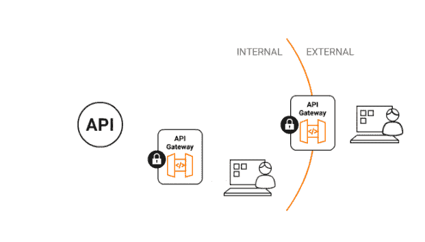
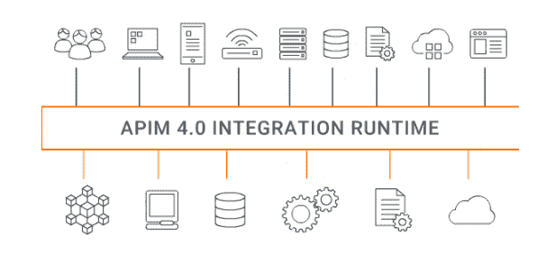

# WSO2 的平台拓宽了 API 管理的范围

> 原文：<https://thenewstack.io/wso2s-platform-widens-scope-of-api-management/>

随着 [WSO2 API Manager 4.0](https://wso2.com/api-management/?utm_source=pressrelease&utm_medium=pr&utm_campaign=apim_release_may21) 的发布，API 解决方案提供商 [WSO2](https://wso2.com/?utm_content=inline-mention) 向其 API 管理平台添加了许多新功能，以更好地支持依赖 API 作为管道来管理数据、微服务、合规性和其他关键任务的组织。

WSO2 首席技术官[埃里克·纽卡默](https://www.linkedin.com/in/enewcomer/)经常被认为在组织的数字化转型和向云原生模式的转变中发挥着不可或缺的作用，他告诉记者，新的堆栈 API 越来越依赖于“快速创新和进入新市场”

API Manager 4.0 版本的一个关键特性是通过 [AsyncAPI](https://www.asyncapi.com/) 规范支持事件驱动架构(EDA)，这是一种用于事件驱动 API 的开放标准 API 格式，新来者称这是该领域任何供应商的“第一个上市产品”。

“组织拥有现有的服务，但他们需要一种快速的机制来将这些服务集成到有用的、可消费的数字产品中，”新人说。“同时，他们必须创造新的服务和产品，以在当今的商业环境中保持竞争力。”

通过结合 WSO2 的 API 管理器和企业集成器(该版本的一个标志)，组织可以依赖 API 管理器 4.0 来“更容易地集成不同的数字服务，创建[更好的]API，并以无缝的方式向它们提供服务质量，”新人说。

他还强调，有了 WSO2 对 AsynchAPI 规范的支持，现在客户可以更加自动化地控制发布和管理请求-响应和事件驱动的 API，新人说这对于响应业务状态变化非常重要。状态变化的例子包括接收新订单或接收商品缺货的警告。

在集成 AsyncAPI 之前，“客户通常手工编写他们自己的 EDA APIs，或者使用一种专有的机制，”新人说。“AsyncAPI 规范代表了 API 行业向前迈出的重要一步，因为它提供了定义事件驱动 API 的标准方式，”新人说。

该版本还包括新人所描述的“轻量级集成功能”，用于将 API 连接到广泛的应用程序和数据源。他说，将数据转移到基于云的数据存储的流接口就是 API Manager 4.0 现在可以提供的一个例子。

还有一个新的 API 修订功能 WSO2，允许开发人员在不中断操作或部署的情况下更新和测试 API——新来者称之为“我非常感兴趣的东西”

“除了以前对版本控制的支持，API 修订版允许开发人员在不改变版本号的情况下尝试 API 的新修订版——当然，假设这是一个足够小的变化——如果修订版由于某种原因没有成功，则恢复到原始 API，”新人说。“我真的很想知道这将如何用来帮助开发人员管理他们不断收到的所有 API 更改请求。”

API Manager 4.0 提供的其他新功能包括:

*   通过支持流式 API、异步 WebSocket APIs、服务器发送事件(SSE)消息协议和 webhooks，改进了流式集成和事件驱动架构(EDA)实施。
*   一个服务目录，使开发人员能够发现和访问服务，并通过“单击”创建他们需要的托管 API
*   基于云的分析，允许用户监控他们的 API 和应用程序如何被客户使用。

根据分析公司 Forrester 的一份[报告，像 WSO2 这样的 API 提供商——以及 Software AG、Google、IBM 和 ax way——是“领头羊”组织越来越依赖 API 策略，通过在云原生环境上运行的微服务架构来推进其业务战略。报告作者 Randy Heffner 与 Christopher Mines、Abigail Livingston 和 Kara Hartig 写道，API 供应商“支持广泛的技术和商业创新的能力将决定哪些供应商领先”。](https://reprints2.forrester.com/#/assets/2/1501/RES159081/report)

“提供正确的门户战略、丰富而灵活的 API 用户参与、超越 REST APIs 并包含微服务和构建基于 API 的商业生态系统的强大方法的 API 发布的供应商，将自己定位为成功地为客户提供持续数字化转型的强大基础，将自己定位为成功地为客户提供持续数字化转型的强大基础，”该报告称。

<svg xmlns:xlink="http://www.w3.org/1999/xlink" viewBox="0 0 68 31" version="1.1"><title>Group</title> <desc>Created with Sketch.</desc></svg>