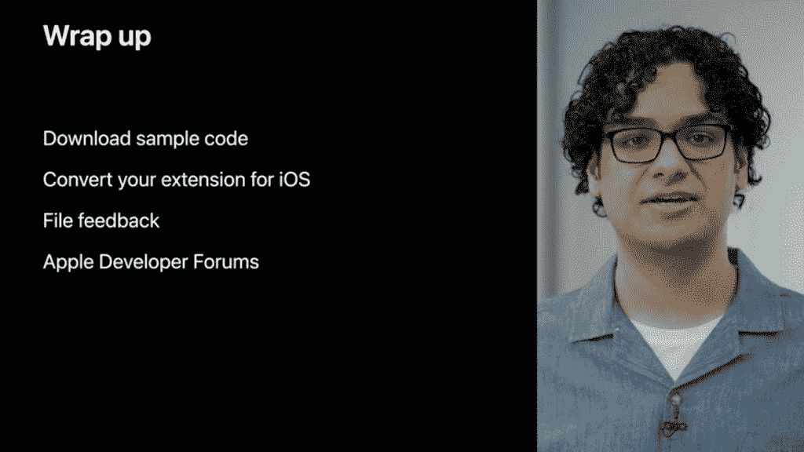

# WWDC21: iOS 平台升级了，但是 Web 呢？

> 原文：<https://thenewstack.io/wwdc21-ios-platform-upgraded-but-what-about-the-web/>

这是开发者大会的季节。我最近写了关于谷歌 I/O(T1)和 T2 微软 Build(T3)的文章，这是两家大型科技公司以开发者为中心的事件。现在是时候探索今年的[苹果全球开发者大会](https://developer.apple.com/wwdc21/) (WWDC)了，它是本月早些时候作为虚拟活动举办的。我特别感兴趣的是看看苹果能为网络开发者提供什么。

 [理查德·麦克马努斯

Richard 是 New Stack 的高级编辑，每周撰写一篇关于 web 和应用程序开发趋势的专栏文章。此前，他在 2003 年创立了读写网，并将其打造为全球最具影响力的科技新闻和分析网站之一。](https://twitter.com/ricmac) 

人们永远不知道苹果的网络计划会带来什么。虽然该公司是如今主导 HTML 和其他网络标准的 WHATWG 集团的成员(其他创始成员是谷歌、Mozilla 和微软)，但苹果对其设备上允许的网络功能的保护是出了名的。例如，谷歌的 Chromium 浏览器引擎在 iOS 上是不允许的——相反，它必须提供一个基于苹果浏览器引擎 WebKit 的 Chrome 版本。这抑制了近年来的一些网络创新，特别是进步网络应用。

不出所料，[主题演讲](https://www.youtube.com/watch?v=0TD96VTf0Xs)的大部分内容都是关于最新的苹果小工具和 iOS 上的用户功能(比如 iPad 上新的“多任务”功能)。虽然对开发者来说，提前通知——并尽早获得——苹果的新功能总是很重要的，但对网络开发者来说，这通常没什么好兴奋的。但在主题演讲的最后，有一个部分聚焦于苹果的 Mac 优化网络浏览器 Safari，这将把开发者从沉睡中唤醒。

苹果软件工程高级副总裁克雷格·费德里吉说:“我们的用户在浏览器上做的事情比以往任何时候都多——工作、学习、购物和娱乐。”。这是一个令人惊讶的消息，因为主题演讲的大部分内容都是关于 iOS 技术的。无论如何，Federighi 继续宣布，苹果已经“重新想象”了 Safari 的浏览体验，采用了新的方式来组织标签，改变了工具栏的工作方式，并在所有苹果设备之间“即时同步”。

但是，这些 Safari 公告是面向用户的，而不是开发者。而且也不只是普通用户:“Mac 用户，”费德里吉提醒我们。

## iOS 版 Safari Web 扩展

然后，Federighi 介绍了开发者可能最感兴趣的主题:iOS 版 Safari web extensions。“我们正在给 iPhone 和 iPad 带来网络扩展，”他说，并补充说它们“可以与现有的 Safari 网络扩展共享代码。”这些扩展可以共享代码的很大一部分原因是它们是用开放的 web 技术——JavaScript、HTML 和 CSS——制作的。

到目前为止，这听起来很像谷歌的 PWAs。但一个关键的区别是，就分发(对开发者)和安装(对用户)而言，Safari web 扩展是一种 iOS 应用。

“理解这一点很重要，对于 Safari 来说，网络扩展是应用的一部分，”Safari 团队的工程师[大卫·奎萨达](https://www.linkedin.com/in/davidpquesada/)在[一个单独的 WWDC 演讲](https://developer.apple.com/videos/play/wwdc2021/10104/)中解释道。“所以当你想安装一个网络扩展时，你可以安装它的应用程序。和其他类型的 iOS 应用一样，带有 Safari Web 扩展的应用也可以在 App Store 上找到。”

苹果公司的大卫·奎萨达解释 iOS 版的 Safari 网络扩展。

这意味着 web 扩展被包装在一个本机 macOS 或 iOS 应用程序中，在 Xcode(苹果的集成开发环境)中设计。对于用户来说，这意味着他们从 App Store 安装应用程序，就像他们安装普通的 iOS 应用程序一样。而对于 PWAs，用户将它们安装在浏览器中。后一种方法意味着开发者可以避免与应用商店打交道的成本和麻烦，例如通过审批程序。

## WebKit 更新

至于 WebKit 本身，驱动 Safari 的浏览器引擎，整个 WWDC 宣布了大量的更新——在这篇 WebKit 博客文章中做了很好的总结。WWDC 的一次会议探讨了对 WKWebView 的升级，被描述为“用于显示 iOS 和大部分 macOS 上所有网络内容的视图”正如苹果 WebKit 团队的工程师 [Megan Gardner](https://www.linkedin.com/in/megan-gardner-ba55626/) 所解释的那样，`WKWebView`是专门为交互式网络内容而设计的(如果用户不需要与内容进行交互，还有一种更简单的机制`SFSafariViewController`)。

在这次会议中，让我印象深刻的是使用 API 来操作 web 内容，**而**不必使用 JavaScript。等等，没有 JavaScript？！这听起来像是对当今网络的亵渎。

“我们喜欢 T2 的 JavaScript，”Gardner 坚持说，然后开始解释为什么苹果开发者应该避免使用 JavaScript。

“这是网络语言！但是注入 JavaScript 比较复杂。您需要通过注入跨越的 native 和 web 之间的接口可能很难导航，而且很麻烦。在处理来自多个 web 源的内容时，它也很容易产生意想不到的副作用或难以管理。如果可以的话，最好避免这种头痛。”

抛开开发人员的头痛不谈，这里的关键问题是苹果有意限制 JavaScript 在它的一些产品中的使用。加德纳指出，例如，Apple Pay 有一些“高价值功能”，如果你选择注入 JavaScript，你就无法在你的网络视图中访问这些功能。

为了在这种情况下绕过 JavaScript，苹果引入了几个新的`WKWebView`API——比如访问网站的主题颜色、禁用文本交互和控制媒体播放。

苹果公司的梅根加德纳总结 WKWebView 更新。

我应该在这里注意到[另一个 WWDC 会议](https://developer.apple.com/videos/play/wwdc2021/10030)涵盖了 WebKit 和 Safari 中的一些 JavaScript 增强，以及它如何适应更新的开放 web 技术，如 WebAssembly。所以苹果*难道*还爱 JavaScript？

## 其他 WWDC 开发商新闻

现在回到 WWDC 主题演讲。在“开发者技术”部分，苹果全球开发者关系副总裁苏珊·普雷斯科特宣布了一系列新的 API。其中包括一个名为 [Object Capture](https://developer.apple.com/news/?id=48xhsgu2) 的 3D 渲染 API，它“使用摄影测量学在几分钟内将一系列 2D 图像转化为照片级的 3D 对象”，这看起来不可思议。

普雷斯科特还谈到了苹果在 2014 年开发并发布的开源编程语言 Swift 的改进。更新包括改进对并发和异步代码的支持。Prescott 指出“对象捕获和我们今天讨论的所有 API 都是建立在 Swift 编程语言之上的。”

同样值得注意的是一款名为 [Xcode Cloud](https://developer.apple.com/xcode-cloud/) 的新开发者产品，这是一款面向苹果开发者的持续集成和交付(CI/CD)服务。

## 结论:不错的更新，但没有什么突破性的

我们预计，如今每个 WWDC 都将主要关注新的 macOS 和 iOS 功能——2021 年的虚拟版也不例外。今年 WWDC 上的 web 开发公告很有趣，但并不具有开创性。iOS 版 Safari web extensions 是一个很好的扩展，但它们缺乏 Google PWAs 的真正网络可移植性。还有一些有用的 WebKit 和 Safari 升级，将会受到苹果开发者的欢迎(在一篇名为“[网络开发者工具包](https://developer.apple.com/news/?id=kffgj3af)”的苹果博客文章中进行了总结)。

然而，在网络平台增强活动期间，我没有看到任何公告——换句话说，将有利于非苹果平台的事情。[在 Google I/O](https://thenewstack.io/google-talks-web-platform-os-integration-webgpu-and-more/) ，我们通过新的 API，如文件系统访问 API，增加了与操作系统的网络集成。[在微软的 Build](https://thenewstack.io/microsofts-collaborative-apps-the-web-is-the-engine/) 中，在整合网络和办公软件方面有所创新(利用 Fluid Framework 和其他“协作应用”技术)。在 WWDC21 上，对 web 开发者来说没有什么同等重要的事情。

但是我有什么资格抱怨呢？只要苹果开发者拥有 iOS，并有能力在必要时将网络集成到其原生应用中(没有 JavaScript 问题)，那么苹果开发者生态系统就会很高兴。

<svg xmlns:xlink="http://www.w3.org/1999/xlink" viewBox="0 0 68 31" version="1.1"><title>Group</title> <desc>Created with Sketch.</desc></svg>