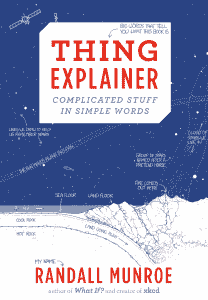

# XKCD 漫画家解释了所有的事情

> 原文：<https://thenewstack.io/xkcd-cartoonist-explains-all-the-things/>

[XKCD](http://xkcd.com/) 漫画家兰道尔·门罗周二在[发布了一本新书](http://blog.xkcd.com/2015/05/13/new-book-thing-explainer/)，书名为《[事情解释者:简单文字中复杂的东西](https://www.amazon.com/gp/product/0544668251/ref=as_li_qf_sp_asin_il_tl?ie=UTF8&camp=1789&creative=9325&creativeASIN=0544668251&linkCode=as2&tag=thekcs-20&linkId=S4XRZJJKSMHOWEQU) *，*，这是一个很棒的开始。到周二晚上，它已经成为亚马逊第六大畅销书。但更令人印象深刻的是，它甚至在发布之前就在几个子类别中排名第一。

上周末，由于精装版和 Kindle 版的预购，亚马逊的“科学和数学”版块将该书列为畅销书排行榜的第一名和第二名。这本书还在另外三个子类别中占据了第一和第三的位置——琐事、物理和科学仪器。

事实上，在其首次亮相的几个小时内，兰德尔的书实际上占据了亚马逊“科学和科学家幽默”部分的所有四个榜首位置这本新书占据了第一和第四的位置，而兰德尔的前一本书在第二和第三位——对于威尔·惠顿阅读的 CD 版本来说也是第 14 位。

那么有什么大惊小怪的？《说事人》*的幽默完全来自科技。兰德尔仅用了 1000 个最常用的单词，就对从数据中心到国际空间站的一切进行了一些幽默而简单的描述。九月，他也让他的粉丝们玩这个概念，发布了一个在线工具[来检查文本并突出显示任何不常用的单词。](http://blog.xkcd.com/2015/09/22/a-thing-explainer-word-checker/)*

 *现在这本书的发行日期终于到了，兰德尔一直在探索一些更古怪的新宣传形式。上周《时代》杂志进行了一次采访，采访中每个问题都用一幅漫画来回答。兰德尔还作为“纽约客”元素博客的客座博主，用 1000 个最常用的单词解释了爱因斯坦的广义相对论。(“从前有一个医生，有一头凉爽的白发。他很出名，因为他提出了一些重要的想法……”)

周一，同一个“纽约客”博客甚至将兰德尔的一张图表改编成了一个在线科学测验。在亚马逊上，兰德尔的书现在甚至有一个来自比尔·盖茨的宣传广告(他称之为“好奇者的精彩指南”))

是的，就连比尔·盖茨也是他的粉丝，这是他十月份在自己的博客“盖茨笔记”上透露的，[分享了一幅漫画](http://www.gatesnotes.com/Health/XKCD-Marks-the-Spot)，这是 Randall 为纪念抗击脊髓灰质炎而画的。

特征图像来自兰道尔·门罗的《T4》第五集。

<svg xmlns:xlink="http://www.w3.org/1999/xlink" viewBox="0 0 68 31" version="1.1"><title>Group</title> <desc>Created with Sketch.</desc></svg>*