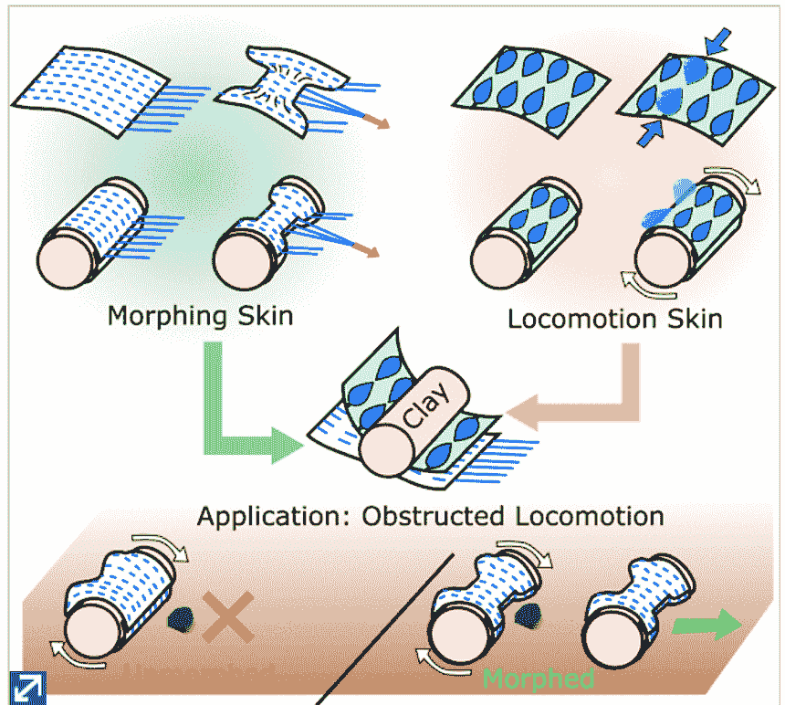
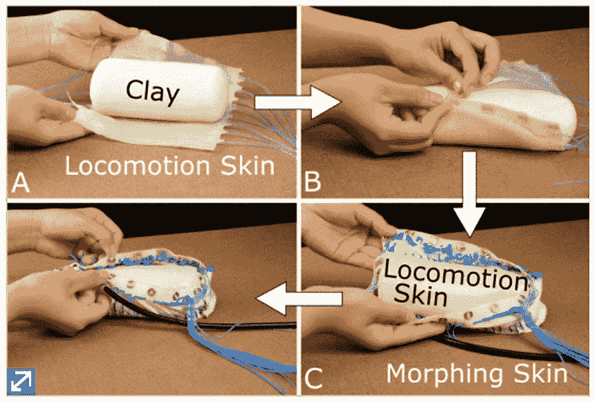
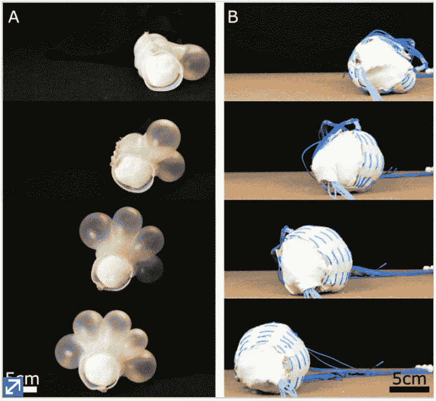
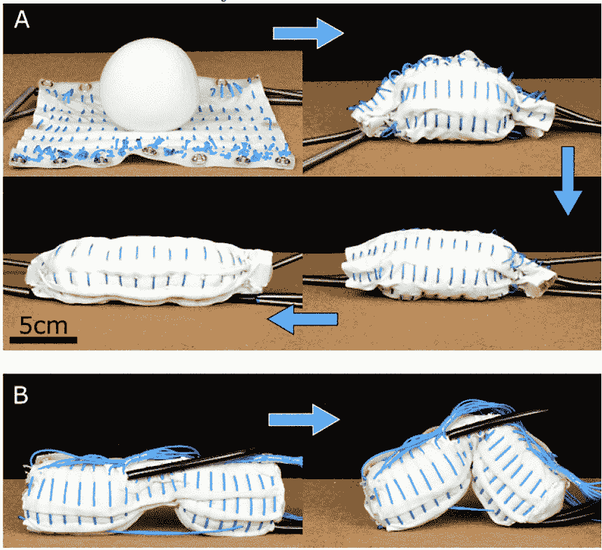

# 耶鲁大学的粘土机器人可以变形为任何形状

> 原文：<https://thenewstack.io/yales-clay-based-robot-can-morph-into-any-shape/>

虽然我们许多人仍然对全金属部件制成的机器人抱有刻板印象，但一些新的实验创新正在缓慢但肯定地改变我们对这些机器的长期看法。到目前为止，我们已经见证了带有熔化“变形”关节的[机器人](/multifunctional-robot-shapeshifts-by-melting-its-own-joints/)，用[微流体电路](/spider-like-microfluidic-soft-robot-is-built-for-precision-surgery/)或[自愈材料](/scientists-developing-self-healing-soft-robot-that-can-feel-pain/)建造的软机器人，以及半植物半机器人的[共生机器人-植物混合体](/flora-robotica-let-robots-tend-gardens/)。耶鲁大学的研究人员最近展示了一个由粘土制成的变形概念机器人，这让事情变得更加怪异。观察它是如何工作的:

https://youtu.be/GVza4ojQAKs

## 艺术灵感机器人

正如研究人员在他们的论文中指出的那样，他们的粘土机器人受到雕塑艺术的启发，在雕塑艺术中，一种可延展的材料被手工塑造成任何想要的形状。研究人员已经测试了泡沫等材料、结构原理和用于建造变形机器人的[张拉整体性](https://en.wikipedia.org/wiki/Tensegrity)，他们最终决定将粘土作为一种可能的节能材料进行研究，因为它不需要额外的力来保持其形状，一旦成型。研究人员当时需要的是一种机器人雕刻家——穿着机器人皮肤的雕刻家，可以将粘土“雕刻”成任何需要的形状。

目前，这是一个非常简单的变形机器人，但它能够执行越过障碍的主要任务。为了完成这一壮举，该团队首先着手寻找最具延展性的材料，作为他们的“粘土”。在测试了各种油基、水基和沙基粘土后，该小组选定了一种来自克雷奥拉的水基材料，称为模型魔术，它需要最少的能量来变形，并指出:“模型魔术是最容易使用的，因为后勤原因(不粘在织物上，并表现出轻微的回弹效应)。”

现在，该团队必须找出如何建造一个不仅能塑造粘土内部结构，还能移动它的皮肤。因此，他们决定将他们的皮肤构造成两层:一层“变形皮肤”,可以机械地将粘土压成几乎任何形状；和一个能推动它四处移动的“运动皮肤”。这两个是一层一层的，然后用粘土包裹固定。

粘土材料首先被包裹在“运动皮肤”中，然后是“变形皮肤”。

左:气动驱动的“运动皮肤”在行动。右图:电缆驱动的“变形皮肤”将粘土材料挤压成不同的形状，而底层的“运动皮肤”推动它前进。

运动皮肤是第一层，也是下面的一层，由两排制作在硅弹性体薄膜中的气囊组成，当气囊充气时，可以起到致动器的作用。当程序设定为一个接一个地充气时，它会产生一种滚动运动，逐渐向前或向后移动大块粘土。

在运动皮肤的顶部是变形皮肤，它是由捆绑成一排排硬管的电缆制成的，缝在有弹性的织物上。该团队还尝试改变缝合的密度。当机器人需要改变形状时，变形皮肤的电缆通过缠绕电机拉动。这种组合电缆束的设计——套在坚硬的管道中——类似于[自行车制动系统](https://en.wikipedia.org/wiki/Bowden_cable)的功能。当这些电缆收缩时，它们产生塑造粘土所需的力，同时织物防止粘土从电缆网络中渗出。

此外，该团队解释说，“为了最大限度地扩大可获得的形状范围，变形皮肤被用作最外层。这种安排还有其他好处:它防止电缆和粘土之间的相互作用，防止粘土变干，运动皮肤促进电缆之间的均匀变形，变形皮肤防止运动皮肤的气囊过度膨胀。”正如人们所看到的，机器人的设计确实允许它成功地转变自己，以便在岩石上机动。该团队现在正在努力开发一种球形机器人，它可以将自己展平，然后使用尺蠖般的运动爬上山坡。

诚然，这个原型对于一个机器人来说看起来相当初级，但人们可以想象，一旦一个无线供电的(也许是[心灵感应的](https://thenewstack.io/self-correcting-robot-thats-telepathically-controlled-human-brain/))机器人出现，无缝变形会有多么迷人的可能性？)这种受控版本终于开发出来了——可能是用一种[自愈材料](https://thenewstack.io/scientists-developing-self-healing-soft-robot-that-can-feel-pain/)制成的。正如该团队所指出的，这种自变形机器人在搜索和救援任务中非常有价值，在这些任务中，它可以变形以挤进奇怪的角落和缝隙，或者在资源稀缺的情况下，同样的材料需要无限适应和按需变形，以适应当前的需求。随着更广泛的机器人设计出现，我们可以期待看到更多非传统的方案，如这种由可延展材料制成的多功能机器人。

图片:耶鲁大学

<svg xmlns:xlink="http://www.w3.org/1999/xlink" viewBox="0 0 68 31" version="1.1"><title>Group</title> <desc>Created with Sketch.</desc></svg>