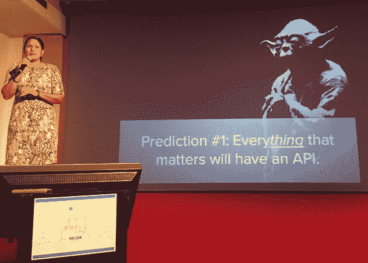

# 未来一年:作为经济游戏规则改变者的 API

> 原文：<https://thenewstack.io/year-ahead-api-game-changer/>

在本周的 New Stack，在名为“未来一年”的新系列中，我们将研究一些技术和技术问题，我们预测这些技术和技术问题在 2016 年对我们的读者很重要。首先，API…

2015 年是 API 经济增长的决定性一年。最近在德克萨斯州奥斯汀举行的 API 战略和实践大会展示了不断扩大的企业和民间参与者群体正在朝着 API play 的方向转变，越来越多的利益相关者正在 API 生态系统中提供服务。

上周，全球 [APIdays](https://medium.com/@APIdays) 活动——每年在巴黎举行，由 [FABERnovel](http://fabernovel.com) 和 [OAuth.io](http://oauth.io) 组织——提供了一个总结今年一些关键主题和展望 2016 年前景的机会。

从围绕使用 API 实现自动化的关键对话以及 API 在实现新业务经济增长中的作用来看，很明显**API 经济必须跨越不断扩大的市场格局，满足新进入者和更高级用户的需求。**

在光谱的一端，企业正在第一次品尝 kool-aid，并学习 API 如何成为他们数字化转型的关键推动者。另一方面，商业和企业正在利用 API 来自动化整个流程和 IT 系统，构建新产品并重新定位其业务模型。

与此同时，在技术层面上，APIdays 展示了这个领域发展的速度有多快。就在上个月的 API Strategy and Practice 上，很明显，成熟的最强标志是广泛采用 API 定义格式来支持业务和技术协作，以及自动化和扩展 API 生命周期。

在 APIdays，API 定义格式几乎是既定的，取而代之的是以事件通知为中心向前推进的技术信封(在 API 策略和实践中激起的技术会议轨道之一，但在 APIdays 之前，它现在已经膨胀为一波新的实践)。

## 自动化和机器学习

随着成熟市场的扩大，涵盖了从新手到老手的各个层次的业务参与者，自动化 API 的使用也在扩大。

自动化可能始于简单的集成(如通过 If-This-Then-That， [IFTTT](https://ifttt.com/) 提供的“配方”)，或 Slackbot 的出现(如新的 [Ottspott Slackbot](http://ottspott.co/) 在团队协作工具中实现类似 Twilio 的电信功能)。来自数字转型咨询公司 FABERnovel(会议的组织者之一)的 Cyril Vart 表示，API 支持的自动化的增长是显而易见的，在 API 聚合服务 IFTTT 的 3850 万美元的融资中，以及他们目前每天通过该服务发生的约 3000-3500 万个 API 触发器的使用率中。

除了简单的 API 集成，集成即服务工具也在以类似于爆炸式的[容器基础设施自动化堆栈](https://thenewstack.io/exploding-infrastructure-automation-stack-ecosystem/)的方式发展。在 APIdays 会议举行的同时，Built.io Flow 宣布与 Cisco Spark 建立[合作关系，在一个平台内提供 IFTTT 和 Ottspott 分别提供的相同类型的工作流。与此同时，API-wrapper 服务 Blockspring](https://thenewstack.io/cisco-spark-adds-third-party-connectivity-built-io-flow/) [宣布与 Bubble](https://blog.bubble.is/software-meet-data-bdc5d1ce0847#.bjesk4jwl) 合作，支持创建集成 API 数据的应用，而用户无需了解任何代码。

然而，CA Technologies 的 Peter Matthews 和 IBM 的 Andy Thurai 在主题演讲中提到了 API 自动化的下一个前沿。两者都指向了旨在为 API 提供自动化服务发现元素的技术。当你看到 Built.io Flow 是如何运作的，或者甚至是 Slack 是如何集成工具的，你就可以看到 API 可发现性是如何被自动化到平台的生态系统中的。

这就是 API 定义格式可以成为关键推动者的地方，就像它们被用于自动化生命周期开发一样。如果有足够多的关于 API 的元数据，像 Slack 或 Built.io Flow 这样的平台可以识别将要进行的过程，然后扫描它们的内部集成目录，以查看哪些 API 最适合完成手头的任务。

彼得·马修斯

Matthews 和 Thurai 提出的是自动发现系统，该系统可以识别任务需求，然后根据功能，可能还会根据安全性、性能、成本和可靠性来评估使用哪种 API。

马修斯描述了他与 [ModaClouds](http://www.modaclouds.eu/) 的工作，这是一个研究项目，“建立了一个 IDE，允许你编写应用程序，让你使用决策支持系统，该系统从需求分析中获取输入，并根据功能或非功能需求推荐服务，”他说。

Matthews 描述道，ModaClouds“现在是一整套开源软件:方法和工具集，允许您使用已经评估过成本、性能和风险的服务快速创建应用程序，甚至是一个用于监控 SLA 的监控工具”。

“现在，我们在安全矩阵(通过性能可用性和安全漏洞风险进行评估)中的服务检测和监控服务方面，而不是 IDE 方法方面，进一步发展了这一概念。”

Thurai 指出 IBM 的 Harmony 项目——他以类似于 API Changelog [的 Bruno Pedro 在之前的 APIdays](http://www.slideshare.net/bpedro/how-to-automate-api-discovery) 中规划 API 自动化的方式描述了该项目——作为基于计算成本或可靠性等参数在实时工作流程中间切换 API 的概念证明。

安迪·图雷

但是在这里，关于 API 自动化的讨论——就像[人工智能和机器学习经常做的](https://thenewstack.io/what-machine-learning-can-and-cant-do/)——以可能性而不是现实告终。如果你想进一步了解 IBM 的 API Harmony 的细节，你会发现这只是一个尚未实现的概念验证。你可以注册测试版，但是论坛是空的:还没有产品。

对于 ModaClouds 也是如此，Matthews 从他的演讲开始就很快澄清了这一点:“这是它的研究结束，我们甚至不知道我们是否能做到这一点。”

鉴于容器系统中用于服务发现的示例[以及 API 生命周期生态系统的增长，像 Harmony 和 ModaClouds 这样的项目将成为 2016 年创建的下一波 API 工具。](https://thenewstack.io/microservices-seconds-node-js-docker-nosql/)

炒作和现实之间的这种不匹配是技术讨论中的一种常见模式，但也许特别是在 API 经济正在经历的那种增长阶段:随着市场扩大到包括新的采用者和现在在使用方面相当先进的老手，可能性的地平线和当前的交付能力之间出现了脱节。这几乎就像是 API 经济试图找到一种方法来跨越幻灭的低谷。

在机器学习和自动化领域，最明显的是在当前的技术实力和我们认为自己所处位置的预期之间建立一些桥梁。IBM Watson 的 Ashley Hathaway 在她的演讲中明确了这一点，Bootstrapping Machine Learning 的作者 Louis Dorard 和 T2 Foule Factory 的首席执行官 Daniel Benoilid 也是如此。

这三者都分享了许多机器学习和人工智能项目背后经常被遗忘的真理，无论是 Foule Factory 的机械土耳其式服务，脸书的 M 还是 IBM 的沃森:自动化和预测一半是计算机算法，一半是人类的事实检查和确认。至少目前，人类是机器学习自动化的最后一英里。机器学习和预测工具仍然需要大量复杂的人类输入来完成任务。

## 作为经济游戏改变者的 API

虽然自动化可能是会议的公共主题，但许多发言者不断提到的一个关键概念是，API 在多大程度上是企业数字化转型的中心，以及 API 在为企业创造经济影响方面有多重要。

**来自 Gartner 的 Kristin Moyer 将 API 视为关键的价值单元，它将使许多企业转变其业务模式，并实现一个鼓励最终用户构建自己价值的平台。**

克里斯汀·莫耶

Built.io 的首席执行官 Neha Sampat 概述了她对来年的几个预测，她说，今年，当与企业谈论与 API 的集成时，“灯泡熄灭了:我从未见过这样的事情”。Sampat 亲眼目睹了 [451 Research 指出的](https://451research.com/report-long?icid=3595)将是 2016 年的一个关键市场转变。像 Built.io 这样的集成服务提供商将需要满足 API 和云的早期采用者，他们现在正在寻找“不同种类的外部服务”(再次暗示了在 API 经济中对自动化服务发现的需求)。

内哈·桑帕特

演讲者一再回到新兴市场领导者在多大程度上使用 API 来获得其战略和业务优势的主题:

*   CA Technologies 的 Matthews 说，八年后，标准普尔 500 强企业中的四分之三将是我们甚至还没有听说过的公司。Matthews 说，其中许多将会出现，因为他们今天正在使用 API，他指出，研究表明，已经赢得数字化转型议程的公司使用 API 的可能性是其他公司的 2.8 倍。
*   Vart 展示了下一波科技“独角兽”如何通过使用插入 GAFA(谷歌、苹果、脸书和亚马逊)基础设施的 API 来加速增长。例如，优步之所以能够快速增长，是因为他们的应用可以在 iTunes 和 Google Play 商店中获得，使用脸书允许即时用户注册，并通过亚马逊的 S3 存储和全球网络服务基础设施进行管理。
*   Moyer 指出，研究表明，使用 API 作为业务渠道的企业净收入增长了 30%，而那些在内部更普遍地使用 API 并与第三方开发人员合作的企业上市时间(和成本)减少了 90%。

在这些机会中，3scale 的首席执行官 Steven Willmott 提出了一个模型，在该模型中，API 用于利用更大的机会公平。Willmott 没有让企业看到一个狭隘的 API 调用货币化机会，而是挑战企业如何使用 API 来创建一种新形式的平台业务，使每个人都成为创造者。

史蒂文·威尔莫特

虽然威尔莫特更实际地谈到了设计可以促进共同创造议程的货币化模式，但闭幕主题演讲的哲学家伯纳德·斯蒂格勒(Bernard Stiegler)强调了利用 API 作为连接公民的手段的重要性，而不是带领我们进一步进入当前脸书的商品化社会，在这种社会中，用户本身是完全基于消费的自动化、无灵魂的未来的产物。

伯纳德·斯蒂格勒

## 事件通知:我们到了吗？

就在一个月前，在 API 策略和实践大会上，[明显推动讨论的一个关键主题是 API 定义格式](https://thenewstack.io/importance-apis-container-age/)。这仍然是一个关键的技术使能因素，因为它将 API 引入了整个产品生命周期，可以帮助企业更好地了解他们的 API 程序的价值，将企业的 API 战略重新定义为产品，并以类似于我们在容器生态系统中看到的[的方式将他们的 API 链接到一系列工具(包括通过自动化)。](https://thenewstack.io/containers-disrupting-devops-infographic/)

但随着这一点被接受，讨论已经开始了。也许下一个技术需求的最清晰的路标是关于事件通知的讨论。澳大利亚数字咨询公司 Sixtree 的首席技术官兼澳大利亚 APIdays 的联合组织者 Saul Caganoff 在主题演讲中强调，API 生态系统必须解决如何在不需要持续不断的呼叫响应播放的情况下共享更新和实时信息的问题。数据更新了吗？没有。数据更新了吗？没有。数据…

索尔·卡加诺夫

Caganoff 指出了 API 架构师目前使用的三种主要技术:

*   **联合:**这涉及到一些延迟和轮询。RSS 是这种类型的事件通知的主要例子。API 调用可以请求更新信息，可能每十分钟一次。
*   **Webhooks:** 这个新兴的标准，特别是由 [Zapier 的 Resthooks 模型](https://zapier.com/developer/documentation/v2/rest-hooks/)提出的，对于最终用户来说更难处理，因为他们需要建立一个 API 端点，但是它减少了一些延迟和轮询问题。这个想法是建立在建立一个端点或 URL 的基础上的，任何更新的细节都可以在更新发生时发送到这个端点或 URL。
*   **新一代通知服务:**这是 Caganoff 认为 API 经济发展的方向，包括 IronMQ、Streamdata.io、Push Technology 的 re part 和 Pubnub 在内的参与者都提供了新一波的通知技术，实现了更实时的数据通知和处理。

Streamdata.io 的首席执行官 Eric Horesnyi 解释了事件通知和流处理是如何在技术上实现的。Horesnyi 表示，当今的行业最佳实践是拥有一个由[反应式](http://www.reactivemanifesto.org/) + HTTP/2 +服务器发送的事件通知组成的 UX-API 端到端事件驱动流架构。 [JSON 补丁](http://jsonpatch.com/)操作的实现是为了让增量更新更靠近服务器，在发送调用时最小化带宽，并且只对已经更新的数据部分提供更新。

Caganoff 说，当今企业的独特商业价值取决于他们如何以创建端到端业务流程的方式集成和运营基础设施、商品、功能和工业服务。目前，当企业通过 API 将内部和外部资产缝合在一起时，他们使用速率限制等技术来管理 API 可以询问“数据已经更新了吗？”的次数随着越来越多的企业要求实时访问数据流，速率限制无法扩展，需要一种新型的事件通知服务，如 Horesnyi 描述的那些服务。

在容器时代，就技术讨论而言，API 一直处于次要地位。但它们是使容器技术成为可能的引擎中的一个重要组成部分:鼓励微服务的可组合性和创造无穷无尽的价值链。随着云技术创造了所有业务都将数字化的更大期望，API 将成为使这种转变成为可能的核心。随着市场在 2015 年的成熟，无论是新人还是有一定专业知识的人，现在都有更广泛的服务和可能性。如何实现自动化、服务发现和事件通知将是 2016 年上半年行业的决定性工作。

思科、Docker 和 IBM 是新堆栈的赞助商。

马克·博伊德帮助组织了巴黎养蜂日，并为养蜂日团队撰稿。

Benjamin Boccas 的专题图片“APIdays Paris”，经 APIdays Flickr 收藏库许可使用。

<svg xmlns:xlink="http://www.w3.org/1999/xlink" viewBox="0 0 68 31" version="1.1"><title>Group</title> <desc>Created with Sketch.</desc></svg>